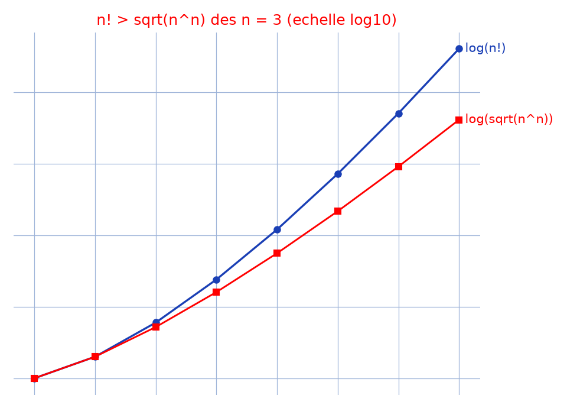

# Inégalités factorielles — transcription fidèle

> 🧾 **Photo originale :** `inegalites-factorielles.jpg` (4624×3472, portrait — redressée de 90° pour lecture, deux colonnes).
> 🔍 **Statut :** lisible (~85 %), transcrit mot à mot, incertitudes signalées.
> 📐 **Contenu :** à gauche $n! > \sqrt{n^n}$ (cas pair / impair) ; à droite $(n^2)!$ et $O[(n!)^n]$ ? (question posée).
> 🖼️ **Restauration :** copie de lecture `/tmp/t-c/inegalites-factorielles_r.jpg` — transcription fidèle, rien d'inventé.

## Page 1 — transcription

### Colonne gauche : relation $n!$ et $\sqrt{n^n}$, $n \in \mathbb{N}^*$

\* Pour $n \in \{1, 2\}$, $n! = \sqrt{n^n}$

\* Pour $n = 2k'$, $k' \geq 2$ [lecture incertaine — $k'$ vs $k$]

$n! = n(n-1)\ldots \times 2 \times 1$

$= \prod_{k=0}^{\frac{n}{2}-1} (n-k) \times (k+1)$

or $(n-k)(k+1) - n = (n-1)k - k$ [lecture incertaine — membre central] $= k(n-k-1)$

$= 0$ si $k = 0$ ; $> 0$ sinon

ainsi $n! > \prod_{k=0}^{\frac{n}{2}-1} n = n^{\frac{n}{2}-1+1}$ [lecture incertaine — exposant] $= \sqrt{n^n}$

\* Pour $n = 2k'+1$, $k' \geq 1$ [lecture incertaine — $k'$ vs $k$]

$n! = n(n-1)\ldots \times 2 \times 1$

$= \left(\prod_{k=0}^{\frac{n-3}{2}} (n-k) \times (k+1)\right) \times \left(\frac{n+1}{2}\right)$

on a de même $(n-k)(k+1) - n = 0$ si $k = 0$, $> 0$ sinon

d'où $n! > \left(\frac{n+1}{2}\right) \times \prod_{k=0}^{\frac{n-3}{2}} n$

$\left(\frac{(\sqrt{n}-1)^2}{2} + \sqrt{n}\right) \times n^{\frac{n-1}{2}}$ [lecture incertaine — décomposition de $(n+1)/2$]

$n! > \sqrt{n} \times n^{\frac{n-1}{2}} = \sqrt{n^n}$

Donc $\forall n \geq 3$ [lecture incertaine — quantificateur], $n! > \sqrt{n^n}$

### Colonne droite : $(n^2)! \equiv O[(n!)^n]$ ?

• $n \geq 1$ [lecture incertaine]

$(n^2)!$ a $n \times n$ termes dans le produit

$(n^2)! = \underbrace{(n^2 \times \ldots \times (n^2-n+n))}_{n \text{ termes}} \times \underbrace{((n^2-n) \times \ldots \times (n^2-2n+n))}_{n \text{ termes}} \times \ldots \times \underbrace{((n^2-(n-1)n) \times \ldots \times (n^2-n \times n+n))}_{n \text{ termes}}$ [lecture incertaine — derniers facteurs]

$\underbrace{\hspace{6cm}}_{n \text{ reproduit}}$ [lecture incertaine — mention sous l'accolade]

$(n^2)! = \prod_{k=0}^{n-1} (n^2-kn) \times \ldots \times (n^2-(k+1)n+1)$ [lecture incertaine]

$= \prod_{k=0}^{n-1} A^n_{n^2-kn}$

$= \prod_{k=0}^{n-1} n!\, C^n_{n^2-kn}$

D'où $(n^2)! = n!^n \times \prod_{k=0}^{n-1} C^n_{n^2-kn}$

• $n = 0$, $(0^2)! = (0!)^0$ [lecture incertaine]

Donc $(n^2)! \equiv O[(n!)^n]$ [notation de l'auteur conservée ; le « ? » du titre indique une question ouverte]

## Figures

Pas de schéma sur la page (calculs) : illustration du fond — $\log_{10}(n!)$ vs $\log_{10}(\sqrt{n^n})$, $n = 1..8$.

Reproduction (script `reproduce_inegalites-factorielles_1.py`, exécuté avec `uv run`) : courbe bleue $\log(n!)$, courbe rouge $\log(\sqrt{n^n})$, quadrillage bleu `#9db3d8`. PNG relu et conforme.

## Vocabulaire / notions

- **Appariement des facteurs** : $(n-k)(k+1) \geq n$ avec égalité seulement en $k = 0$ — cœur des deux cas (pair/impair).
- **$\sqrt{n^n} = n^{n/2}$** : l'inégalité prouvée est $n! > n^{n/2}$ pour $n \geq 3$.
- **Arrangements / combinaisons** : $A^n_m = n!\,C^n_m$ pour découper $(n^2)!$ en $n$ blocs de $n$ termes.
- **$O[\cdot]$** : notation d'ordre de grandeur de l'auteur, avec point d'interrogation (résultat à instruire, fond non réécrit).
