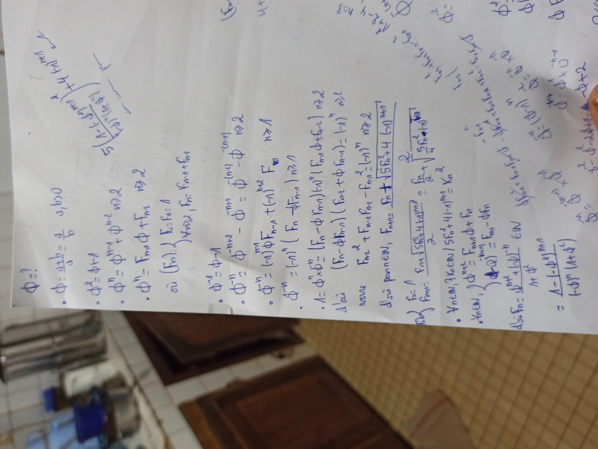
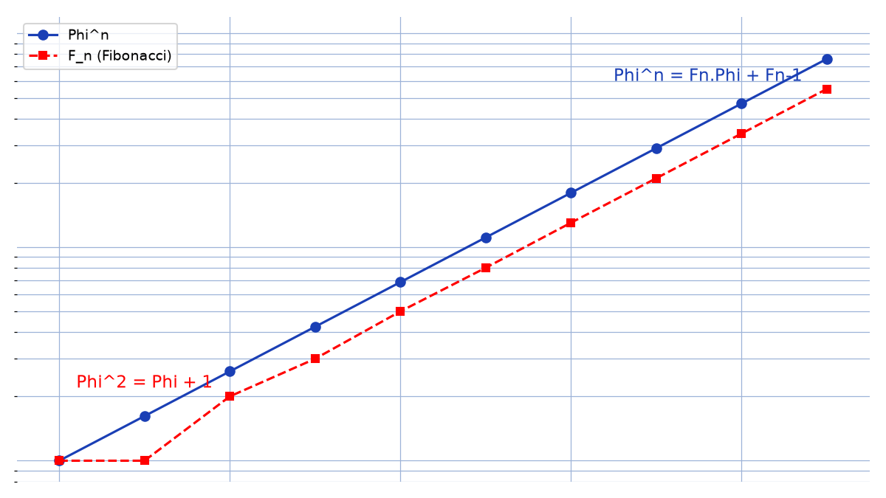

# Nombre or — transcription fidèle

> Source : `nombre-or.jpg` (1 page, stylo bleu, page pivotée).
> Lisibilité ~65 % ; symboles ambigus marqués [lecture incertaine].

## Page 1 — transcription fidèle

$\Phi = ?$

- $\Phi := a/b$ [lecture incertaine — début de définition, $a/b > 0$ ?]
- $\Phi^2 = \Phi + 1$
- $\Phi^n = \Phi^{n-1} + \Phi^{n-2}$ [lecture incertaine], $n \ge 2$
- $\Phi^n = F_{n+1} \Phi + F_{n-1}$ [lecture incertaine — « $\Phi^n = F_n \Phi + F_{n-1}$, $n \ge 2$ »]
- où $(F_n)$ : $F_0 = F_1 = 1$ [lecture incertaine], $F_{n+2}$, $F_n = F_{n+1} + F_n$ [*sic* — suite de Fibonacci]
- $\Phi^{-1} = \Phi - 1$
- $\Phi^{-n} = \Phi^{-n+2} - \Phi^{-n+1}$ [lecture incertaine — relations inverses en $\Phi$], $n \in \mathbb{N}$
- $\Phi^{-n} = (-1)^n$ [lecture incertaine] $(F_n - \Phi F_{n-1})$ [lecture incertaine], $n \ge 1$
- $\Lambda = \Phi^n \times \bar{\Phi}^n$ [lecture incertaine] $= (F_n - \Phi F_{n-1})^n (F_{n+1} + \bar{F}_{n-1})$ [lecture incertaine], $n \ge 2$
- d'où $(F_{n-1} \Phi_{n-1})$ [lecture incertaine] $(F_{n+2} + \Phi F_{n+1})$ [lecture incertaine], $n$ [lecture incertaine]
- avec $F_{n+2}$ [lecture incertaine] $= F_{n+1}^2 - (-1)^n$ [lecture incertaine], $n \in \mathbb{N}$ [reconstruction — identité de Cassini évoquée]
- d'où pour $n \in \mathbb{N}$, $F_{n+2} F_n \pm \sqrt{15 F_n^2 + 4}$ [lecture incertaine] $(K_n)$ [lecture incertaine] $n \ge 2$
- $\Phi = \Lambda$ [lecture incertaine] $F_{n+1} \sqrt{5 F_n^2 + 4 (-1)^n}$ [lecture incertaine] $/ 2$ [lecture incertaine]
- $A_{n \in \mathbb{N}}, 3 \le n \in \mathbb{N}$ [lecture incertaine] $/ 5 F_n^2 + 4 (-1)^{n+1} = K_n$
- $X_{n \in \mathbb{N}}$, $X_{n+1} = F_{n+1} \Phi + F_n$
- $X_{n \in \mathbb{N}}$, [lecture incertaine] $(\Phi^n)$ [lecture incertaine] $= F_{n+1} - F_n \Phi_n$ [lecture incertaine]
- Ainsi $F_n = \Phi^{n+1} + (1 - \Phi)^n$ [lecture incertaine] $\in \mathbb{N}$
- $1 + \Phi$ [lecture incertaine]
- $\frac{1 - (-\Phi^{-2})^{n+1}}{(-\Phi)(1 + \Phi^2)}$ [lecture incertaine]
- $= \frac{\Phi^2 - \text{[illisible]} + \text{[illisible]} - \Phi^{-2n}}{\Phi^2 - \Phi^{-2}}$ [reconstruction — motif : formule sommatoire en $\Phi$, bas de page très pâle]
- $5 (\sqrt{-1} \Phi \frac{1+\Phi}{2})$ [lecture incertaine — marge haute, en travers]

## Figures

Pas de schéma sur le manuscrit. Croissance comparée $\Phi^n$ vs $F_n$ (échelle log) :

*Script : `~/KpihX-Labs/Explore/lab/scripts/reproduce_nombre-or_1.py` — description précise : abscisse $n = 0..9$, ordonnée log, courbe bleue $\Phi^n$, carrés rouges pointillés $F_n$, légende « $\Phi^n = F_n \cdot \Phi + F_{n-1}$ », annotation « $\Phi^2 = \Phi + 1$ ».*

## Vocabulaire / notions

- Nombre d'or $\Phi$, équation $\Phi^2 = \Phi + 1$, puissances $\Phi^n$, inverses $\Phi^{-n}$.
- Suite de Fibonacci $(F_n)$, relation $\Phi^n = F_n \Phi + F_{n-1}$.
- Identités associées ($K_n$, Cassini, formes closes) [lecture incertaine].
