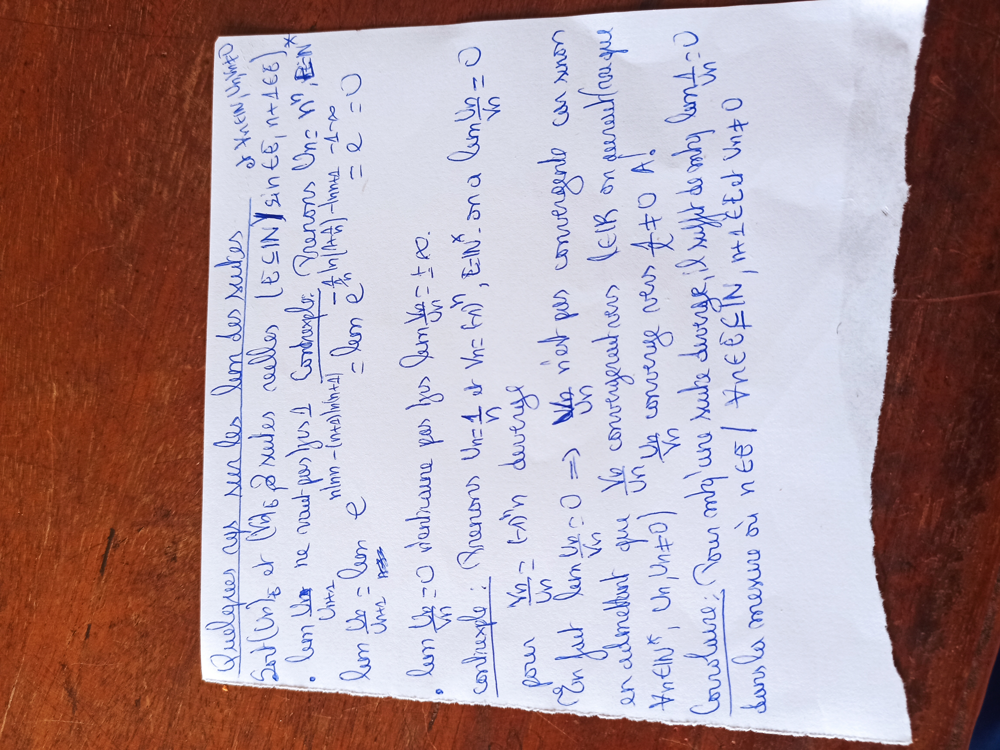
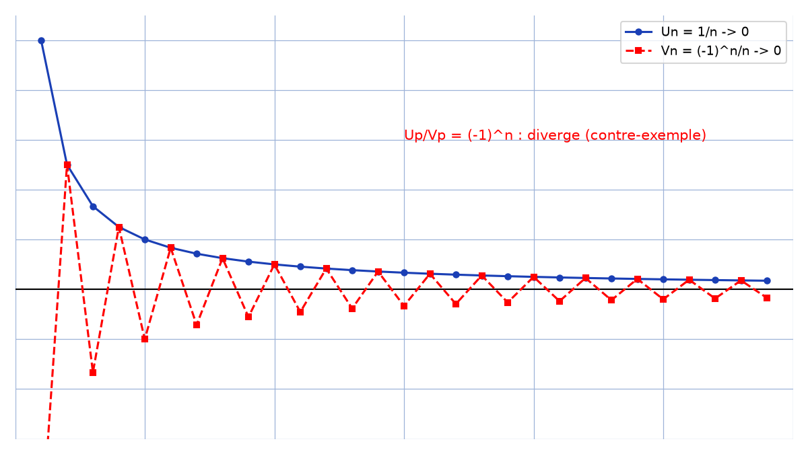

# Remarques suites — transcription fidèle

> Source : `remarques-suites.jpg` (1 page, stylo bleu, feuillet déchiré, page pivotée).
> Lisibilité ~80 % ; titre « Quelques caps sur les ... des suites » + « 2e rem. limite ».

## Page 1 — transcription fidèle

Quelques caps sur les [lim — lecture incertaine] des suites [titre souligné]

$2^e$ rem, limite [en marge]

Soit $(U_n)_{n \ge}$ et $(V_n)_{n \ge}$ 2 suites réelles ($E \subseteq \mathbb{N}$ [?] $\sin E$, $n + 1 \in E$) *

- $\lim \frac{U_n}{V_n}$ ne veut pas [dire — lecture incertaine] $1$ ! Prenons $(U_n = 1/n$ [?], $n \in \mathbb{N}^*$ [?]

Contrexemple : $\frac{...}{...}$ [lecture incertaine] $= \lim \frac{U_n}{U_{n+1}} = \lim 6^{...}$ [lecture incertaine] $= e = 0$ [lecture incertaine]

$\lim \frac{U_n}{V_n}$ [?] $= 0$ n'entraine pas $\lim \frac{V_n}{U_n} = +\infty$.

Contrexemple : Prenons $U_n = \frac{1}{n}$ et $V_n = \frac{(-1)^n}{n}$, $E = \mathbb{N}^*$, on a $\lim \frac{U_n}{V_n} = 0$

pour $\frac{U_n}{V_n} = (-1)^n$ diverge

En fait $\lim \frac{U_n}{V_n} = 0 \Rightarrow \frac{V_n}{U_n}$ n'est pas convergente car sinon

en admettant que $\frac{V_n}{U_n}$ convergeait vers $l \in \mathbb{R}$ on déduit lorsque

Autre [*] : $U_n V_n \ne 0$ [?], $U_n$ converge vers $1 \ne 0$ $A$ [?].

Conclusion : Pour impliquer une suite diverge, il suffit de conclure [?] [lecture incertaine]

sans mesure où $n \in E$ ! $A n \in E \cap \mathbb{N}$, $n + 1 \in E$ et $V_n \ne 0$

## Figures

Pas de schéma sur le manuscrit. Contre-exemple $U_n = 1/n$, $V_n = (-1)^n/n$ :

*Script : `~/KpihX-Labs/Explore/lab/scripts/reproduce_remarques-suites_1.py` — description précise : courbe bleue $U_n = 1/n \to 0$, courbe rouge pointillée $V_n = (-1)^n/n \to 0$, droite $0$ noire, légende « $U_n/V_n = (-1)^n$ : diverge (contre-exemple) ».*

## Vocabulaire / notions

- Suites réelles $(U_n)$, $(V_n)$, limite, convergence vers $0$ / divergence.
- Quotient $U_n/V_n$, contre-exemple $1/n$ vs $(-1)^n/n$, $U_n V_n \ne 0$.
