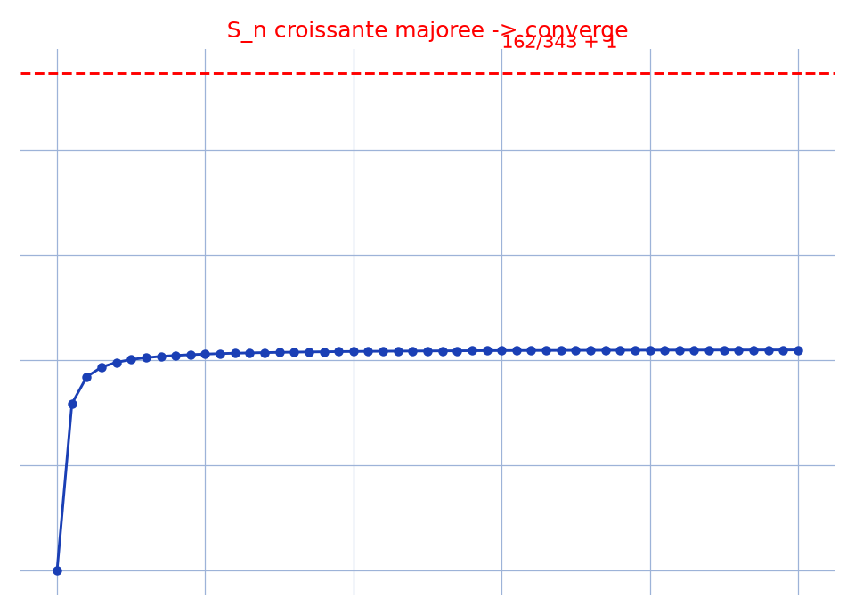

# Nature d'une série — transcription fidèle

> 🧾 **Photo originale :** `serie-convergence.jpg` (4624×3472, portrait — redressée de 90° pour lecture).
> 🔍 **Statut :** lisible (~85 %), transcrit mot à mot, incertitudes signalées.
> 📐 **Contenu :** $U_n = (2n+1)^4/(7n^2+1)^3$, $S_n$ croissante majorée donc convergente.
> 🖼️ **Restauration :** copie de lecture `/tmp/t-c/limite-serie_r.jpg` — transcription fidèle, rien d'inventé.

## Page 1 — transcription

Nature des séries de terme général $U_n$

Si $U_n = \frac{(2n+1)^4}{(7n^2+1)^3} \quad n \geq 0$ \hfill [en haut à droite] $2x_0-1$ [lecture incertaine — scribouillis]

$S_n = \sum_{k=0}^n \frac{(2k+1)^4}{(7k^2+1)^3} \quad \forall\,k \in \mathbb{N}^*,\ \frac{(2k+1)^4}{(7k^2+1)^3} \leq \frac{(2k+k)^4}{(7k^2)^3}$

$\leq \frac{81}{343} \times \frac{1}{k^2}$ \hfill [raturé — $\leq \frac{81}{343} \times \frac{1}{k(k-1)}$ biffé]

ainsi $S_n \leq 1 + \sum_{k=1}^n \frac{81}{343} \times \frac{1}{k^2} \quad n \geq 2$

$\leq \frac{81}{343}\left(\frac{81}{343}\right.$ [raturé — biffé] $+ \sum_{k=2}^n \frac{1}{k^2}\Big) + 1$

$\leq \frac{81}{343}\left(1 + \sum_{k=2}^n \frac{1}{k(k-1)}\right) + 1$

$\leq \frac{81}{343}\left(1 + \sum_{k=2}^n \left(\frac{1}{k-1} - \frac{1}{k}\right)\right) + 1$

$\leq \frac{81}{343}\left(1 + 1 - \frac{1}{2} + \frac{1}{2} - \frac{1}{3} + \ldots + \frac{1}{n-2} - \frac{1}{n-1} + \frac{1}{n-1} - \frac{1}{n}\right.$ [lecture incertaine — maillons]

$\leq \frac{81}{343}\left(2 - \frac{1}{n}\right) + 1 \leq \frac{81}{343} \times 2 + 1$

[raturé — ligne biffée] or $S_{n+1} - S_n = \frac{(2(n+1)+1)^4}{(7(n+1)^2+1)^3}$ [lecture incertaine — dénominateur]

ainsi $S_n$ est croissante et majorée par $\frac{162}{343} + 1$

donc $S_n$ converge

(entouré en bas) $1$ [numéro de page]

## Figures

Pas de schéma sur la page (calcul) : illustration du fond — sommes partielles $S_n$ sous le majorant $162/343 + 1$.

Reproduction (script `reproduce_serie-convergence_1.py`, exécuté avec `uv run`) : courbe bleue ($S_n$), droite rouge (majorant), quadrillage bleu `#9db3d8`. PNG relu et conforme.

## Vocabulaire / notions

- **Comparaison à une série de Riemann** : $(2k+1)^4 \leq (3k)^4 = 81k^4$ et $(7k^2+1)^3 \geq 343k^6$, d'où $U_k \leq \frac{81}{343k^2}$.
- **Télescopage** : $1/(k(k-1)) = 1/(k-1) - 1/k$ pour sommer explicitement le majorant.
- **Croissante majorée** : le terme général positif donne la croissance, le majorant uniforme la convergence.
