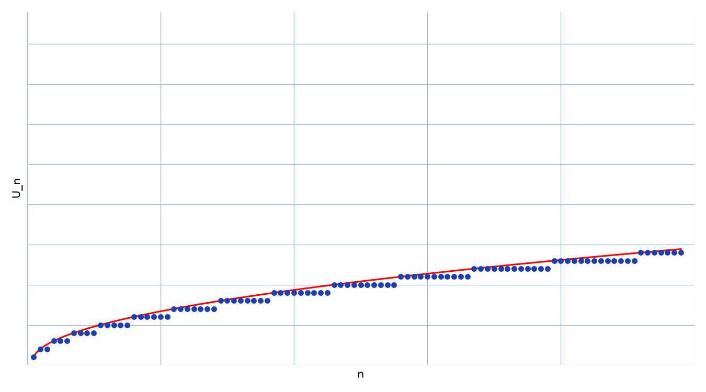

# Suite croissante — transcription fidèle

🧾 Source : [suite-croissante.pdf](suite-croissante.pdf) — 3 pages : p. 1–2 manuscrites (encre noire), p. 3 capture d'écran GeoGebra.
🔍 Contenu : expression explicite de la suite en escalier $1, 2, 2, 3, 3, 3, \dots$ (p. 1), son équivalent (p. 2, haut), un calcul de probabilité de commutation dans un groupe fini (p. 2, bas — exercice distinct), un graphique $U_n$ + équivalent (p. 3).
📄 Note : restauration Datas1 du 2026-09-07 — transcription à l'identique, sans correction ni ajout ; les erreurs du manuscrit sont signalées par [*sic*], les doutes de lecture par [lecture incertaine — …], les passages biffés par [raturé].

## Page 1

Expression explicite de $(U_n)_{\mathbb{N}}$ : $U_1 = 1$, $U_2 = U_3 = 2$, $U_4 = U_5 = U_6 = 3$, …

On prend 1 fois 1, 2 fois 2, 3 fois 3, ….

. Soit $m \in \mathbb{N}^*$. Trouvons l'ensemble des $n \in \mathbb{N}^*$ / $U_n = m$.

Soit $\varphi(m)$ le plus petit d'entre eux. Car on a $m$ telles valeurs de $n$ alors cet ensemble est $\{\varphi(m), \dots, \varphi(m) + m - 1\}$.

— Trouvons $\varphi(m)$.

D'après ce qui précède, $\varphi(m+1) = \varphi(m) + m$

Car $\varphi(1) = 1$, on montre par récurrence que $\varphi(m) = \dfrac{(m-1)m}{2} + 1$

Ainsi $\forall n \in [\![\varphi(m)\,;\, \varphi(m) + m - 1]\!]$, $U_n = m$

. Soit $n \in \mathbb{N}^*$. Cherchons $m \in \mathbb{N}^*$ / $U_n = m$

Car $(\varphi(m))_{m \in N^*}$ est une suite strict croissante d'entiers, [*sic* — strictement]

$\exists m \in \mathbb{N}^*$ / $n \in [\![\varphi(m)\,;\, \varphi(m+1)[\![ $ et d'après ce qui précède $U_n = m$. $m$ est alors le plus grand entier de $\mathbb{N}^*$ /

$\varphi(m) \le n \iff \dfrac{(m-1)m}{2} + 1 \le n \iff m^2 - m + 2(1-n) \le 0$ $\iff m \in \left[1\,;\, \dfrac{1 + \sqrt{1 + 8(n-1)}}{2}\right]$

ainsi $m = E\left(\dfrac{1 + \sqrt{8n-7}}{2}\right)$

Donc $\forall n \in \mathbb{N}^*$, $\boxed{U_n = E\left(\dfrac{1 + \sqrt{8n-7}}{2}\right)}$ (résultat encadré ; $E$ = partie entière)

## Page 2

\* Équivalent de $(U_n)_{N*}$

Soit $n \in \mathbb{N}^*$. D'après ce qui précède,

$U_n = E\left(\dfrac{1 + \sqrt{8n-7}}{2}\right) \Rightarrow \dfrac{1 + \sqrt{8n-7}}{2} \le U_n < \dfrac{1 + \sqrt{8n-7}}{2} + 1$ [*sic* — encadrement de la partie entière]

$\Rightarrow 1 \le \dfrac{2U_n}{1 + \sqrt{8n-7}} < 1 + \dfrac{2}{1 + \sqrt{8n-7}}$

$\Rightarrow \lim_{n \to +\infty} \dfrac{2U_n}{1 + \sqrt{8n-7}} = 1$ [raturé — « $1 +$ » repris par surcharge au dénominateur]

Donc $\boxed{U_n \underset{+\infty}{\sim} \dfrac{1 + \sqrt{8n-7}}{2}}$ (résultat encadré et souligné)

---

(On change d'exercice : probabilité de commutation dans un groupe fini.)

On fait $p = \dfrac{|C|}{n^{\cdots}}$ où $K$ = ens des couples $(x,y)$ de $G$ qui commutent. [lecture incertaine — $C$ ou $K$ ; exposant du dénominateur]

— Si $x \in Z(G)$ alors il suffit de prendre $y$ dans $G$ pour que $(x,y) \in G$ [*sic* — sans doute $\in K$], soit $zn$ possibilités où $z = |Z(G)|$

— Sinon, $y$ doit nécessairement être pris dans $C_x$ (centraliseur de $x$) et car $C_x$ est un sous groupe strict de $G$ et que $|C_x|$ divise $|G|$ d'après Lagrange alors $|C_x| \le n/2$, d'où on a [raturé — mot biffé] au plus $(n-z) \times \frac{n}{2}$ possibilités

Donc $p \le \frac{1}{n^2} nz + (n-z)\frac{n}{2} = \frac{n}{2} + \frac{z}{2}$ [lecture incertaine — parenthésage ; numérateurs finaux repris par surcharge ; *sic* — homogénéité]

## Page 3 (figure)

Capture GeoGebra : nuage de points bleus en escalier ($U_n$, $n$ de $\approx 2$ à $\approx 98$, paliers de longueur croissante $1, 2, 3, \dots$), courbe verte superposée (l'équivalent $(1 + \sqrt{8n-7})/2$) ; axe des abscisses $\approx 0$–$98$, axe des ordonnées $\approx 0$–$44$ avec quadrillage fin et lignes fortes tous les $10$.

Reproduction (courbe verte d'origine rendue rouge, convention « stylo » du lot ; script `reproduce_suite_croissante_1.py`, PNG relu et conforme : escalier, courbe, axes, quadrillage) : voir ci-dessus.

## Figures

- Fig. 1 (p. 3) : capture d'écran GeoGebra — nuage de points bleus en escalier ($U_n$, paliers $1, 2, 3, \dots$), courbe verte de l'équivalent $(1+\sqrt{8n-7})/2$ ; axes $\approx 0$–$98$ / $0$–$44$, quadrillage — vérifiée sur source le 2026-09-07 (rendu `/tmp/qas/`), confirmée sans relecture ce passage (limite 16 p). Embed en `## Page 3 (figure)` ci-dessus.
- Reproduction : `~/KpihX-Labs/Explore/lab/scripts/reproduce_suite_croissante_1.py` → `assets/suite-croissante.png` (vérifié `uv run`, style stylo : grille `#9db3d8`, `tick_params` sans étiquettes, jamais `axis("off")`).

## Vocabulaire

- $\varphi(m) = (m-1)m/2 + 1$ : premier rang du palier $m$ ; $U_n = m$ sur $[\![\varphi(m), \varphi(m)+m-1]\!]$.
- équivalent $(1+\sqrt{8n-7})/2$ : courbe superposée (p. 2 haut, p. 3) ; paliers de longueur croissante.
- $Z(G), C_x$, Lagrange : exercice distinct de probabilité de commutation (p. 2 bas, documenté en en-tête).
