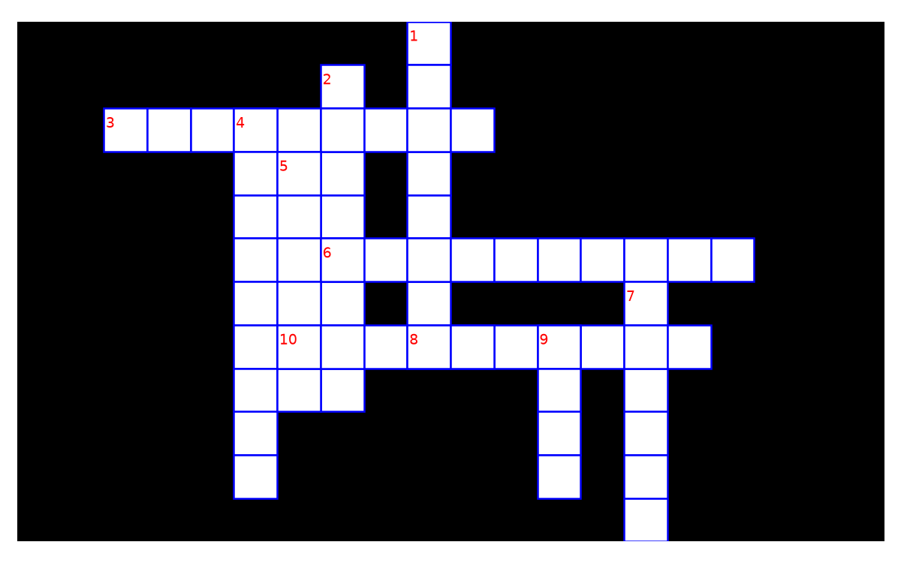
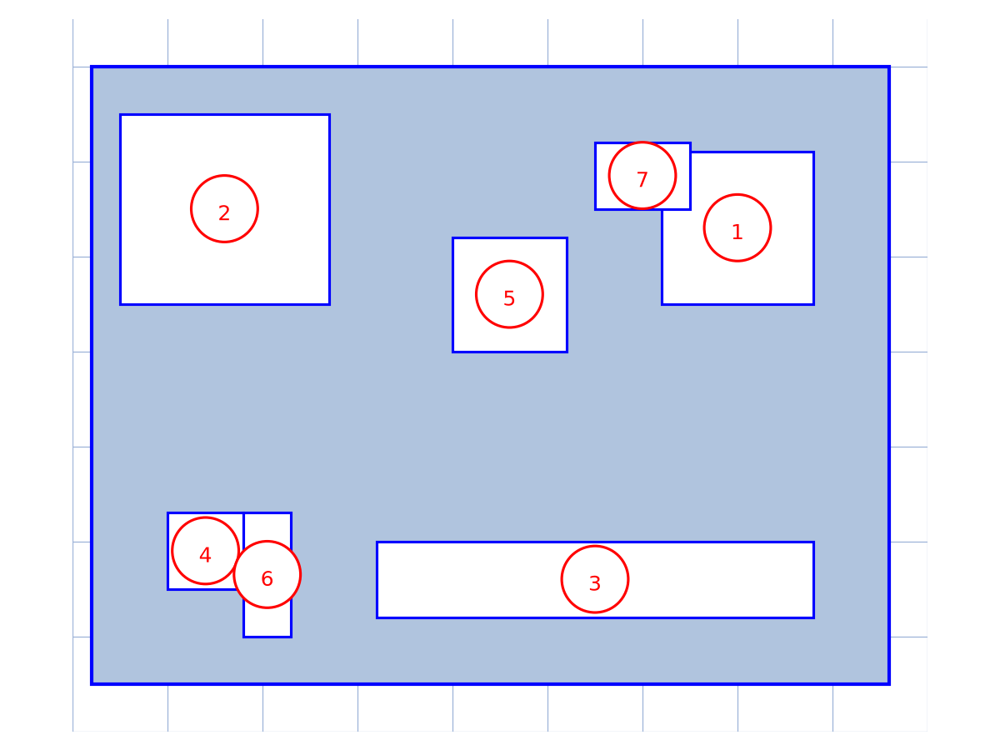

# Évaluation informatique 2nde C — transcription fidèle

🧾 Source : [premiers-essais-01.pdf](premiers-essais-01.pdf) — document restauré Datas1, 2026-09-07.
🔍 Transcription : fidèle, page à page, sans correction ni ajout ; les doutes sont balisés.
📄 Contenu : 3 pages (imprimé) — épreuve d'informatique, évaluation de la 3ème séquence, classe de 2nde C ; page 3 blanche.

## Page 1

Cours de répétition conges de NOËL — groupe NANA BAMEN

| EVALUATION DE LA 3ème SEQUENCE | CLASSE : 2nde C | SESSION : Novembre 2018 |
| EPREUVE D'INFORMATIQUE | Coef : 3 | DUREE : 1H |

NOMS : ____________________________________________________________ classe de 2nde ____

**1ère PARTIE : EVALUATION DES RESSOURCES (10pts)**

**EXERCICE 1 : Mots croisés (5,5pts)**

Complétez les mots croisés à m'aide du mot Correspondant à chaque définition ci-dessous : (0,5 x 10 = 5pts)

1. Composante physique d'un ordinateur
2. Petit programme capable de créer un dysfonctionnement dans l'ordinateur
3. Une des causes matérielles de dysfonctionnement capable de s'introduire dans l'unité centrale
4. Une mesure préventive de la partie matérielle contre les coupures de courant
5. Composante logicielle d'un ordinateur
6. Un exemple de système d'exploitation répandu dans les ordinateurs
7. Périphérique qui permet d'écouter de la musique
8. **Périphérique d'entrée de l'ordinateur**
9. La plus petite unité de mesure e, informatique [lecture incertaine — « e, » : coquille pour « en » ?]
10. Mémoire vive encore appelé mémoire centrale de l'ordinateur.

Donner le rôle de mot N°8 : ________________________________________________________ (0,5pt)
________________________________________________________________________________

**EXERCICE 2 : Compréhension du cours (4,5pt)**

1) Définir les termes : (1pt)
Pagination dans un texteur .........................................................................................................
................................................................................................................................................
................................................................................................................................................

2) En quoi consiste l'optimisation d'un ordinateur ? (1pt)
................................................................................................................................................
................................................................................................................................................
................................................................................................................................................

3) Donner deux(02) avantages du partitionnement d'un disque et citer un utilitaire permettant d'effectuer cette opération. (0,5x3=1,5pt)
................................................................................................................................................
................................................................................................................................................
................................................................................................................................................

Page 1 sur 2

*Figure page 1 : grille de mots croisés (cases noires / cases blanches, 10 mots numérotés). Reproduction schématique simplifiée — les emplacements exacts case à case ne sont pas garantis ; voir `~/KpihX-Labs/Explore/lab/scripts/reproduce_premiers_essais_01_1.py` (PNG relu).*

## Page 2

4) Après plusieurs mois d'utilisation intensif de votre ordinateur (stockage et suppression des fichiers) vous constaté un ralentissement dans l'accès des fichiers sur le disque. Sachant que votre antivirus est à jour, quel peut être la cause de ce dysfonctionnement ? Et comment le résoudre ? (0,5x2=1pt)
................................................................................................................................................
................................................................................................................................................

**2ème PARTIE : EVALUATION DES COMPETENCES (10pts)**

Vous êtes employé dans une entreprise, l'image ci-dessous représente la carte mère d'un ordinateur de bureau et un ensemble d'informations qui le concernent après assemblage. Pour l'assembler l'entreprise met à votre disposition les composants suivants : Carte son, barrette mémoire, processeur, carte graphique AGP.

Figure 1 : [schéma d'une carte mère avec 7 emplacements numérotés de 1 à 7]

Tableau 1 :
a. Intel® Quad Core 2,4Ghz J1900
b. Mémoire 4Go
c. Stockage 250 Go SSD
d. Intel HD Graphics
e. 1 port USB 3.0
f. 4 ports USB 2.0
g. VGA
h. 1 sortie HDMI
i. Ethernet
j. Windows 8.1 64bits

1) Quel est le nom du composant de la **figure 1**................................................................ (0,5pt)
2) Quels emplacements numérotés dans la **figure 1** peut-on connecter les composants ci-dessus ? Nommer ces emplacement (donner le numéro, le nom de l'emplacement puis le composant). (1x4=4pts)
................................................................................................................................................
................................................................................................................................................
................................................................................................................................................
3) Après assemblage, vous désirez alimenter en énergie électrique la **figure 1** pour faire fonctionner ses composants. Comment appelle-t-on le composant qui permet d'effectuer cette tâche ? Et sur quel port (le numéro) va-t-il être connecté ? (0,5x2=1pt)
................................................................................................................................................
4) Avant l'assemblage, le client avait du mal à faire un choix entre un disque dur SSD et HDD. Après avoir défini SSD Donner un avantage et un inconvénient de ce type de stockage (1pt+0,5x2=2pts)
................................................................................................................................................
................................................................................................................................................
................................................................................................................................................
5) Qu'entendez-vous par **Intel® Quad Core 2,4Ghz** ? (1,5pt)
................................................................................................................................................
................................................................................................................................................
................................................................................................................................................

Page 2 sur 2

*Figure page 2 (Figure 1) : carte mère, 7 emplacements numérotés (1 : socket processeur, 2 : slots d'extension, 3 : slots mémoire, 4 : chipset, 5 : ventilateur, 6 : port, 7 : connecteur d'alimentation). Reproduction schématique simplifiée — positions relatives non contractuelles ; voir `~/KpihX-Labs/Explore/lab/scripts/reproduce_premiers_essais_01_2.py` (PNG relu).*

## Page 3

[page blanche — aucun contenu]

---

## Figures

- **Page 1 — grille de mots croisés** : `assets/mots-croises.png` — reproduction schématique simplifiée (10 mots, cases noires/blanches) ; script `~/KpihX-Labs/Explore/lab/scripts/reproduce_premiers_essais_01_1.py` (vérifié `uv run`, grille `#9db3d8`, `tick_params` sans étiquettes).
- **Page 2 — carte mère, Figure 1** : `assets/carte-mere.png` — schéma simplifié (7 emplacements numérotés) ; Tableau 1 transcrit dans `## Page 2` ; script `~/KpihX-Labs/Explore/lab/scripts/reproduce_premiers_essais_01_2.py` (vérifié `uv run`, grille `#9db3d8`, `tick_params` sans étiquettes).

## Vocabulaire

- **Évaluation des ressources / des compétences** : 1ère partie (10 pts) / 2ème partie (10 pts).
- **Mots croisés** : 10 définitions (hardware, virus, onduleur, software, OS, périphériques, bit, RAM).
- **Carte mère** : Figure 1 (7 emplacements) + Tableau 1 (Intel Quad Core, 4 Go, SSD 250 Go, USB, VGA, HDMI, Ethernet, Windows 8.1).
- **SSD vs HDD** : question 4 (avantage + inconvénient demandés).
