# Quatrième Bloc-Notes — transcription fidèle (215 pages, 20/06/2020 → …)

> **Source :** `quatrieme-bloc-notes.pdf` (215 pages) · **Transcription :** mot-à-mot, bleu/rouge, orthographe et notations d'origine · **Statut :** restructuré — 215 sections `## Page 1…215` dans l'ordre (renumérotées depuis `## p.X`, p.103–104 dédoublée, p.205–215 découpées logiquement sur marqueurs de suite) · `## Figures` + `## Vocabulaire` ajoutés en fin · Contenu texte inchangé · 0 image lue.

Source : `quatrieme-bloc-notes.pdf` (215 pages, 142 Mo). Carnet quadrillé, stylo bleu + rouge.
Méthode : mot-à-mot, orthographe/notations d'origine conservées, figures rebuildées, erreurs signalées `[Correction]`.
FORME (à appliquer à la passe finale) : titres soulignés rendus en rouge au rendu md ; figures reproduites via `lab/scripts` dans `assets/` et embed dans le md.

---

## Page 1 (20/06/2020)

En haut à droite : 20/06/2020 (souligné).

* <u>a/0 = ?</u>

Soit a ∈ IR

On a : a/0 = a × 1/0

a/0 = a × ∞

ainsi • si a = 0, 0/0 = 0×∞ qui est une FI [« FI » rouge, souligné]

• si a ∈ IR*, a/0 = ∞ qui est indéfini [« indéfini » rouge]

* <u>a⁰ = ? & a⁻ⁿ = ?</u>

Soient (a,n) ∈ IR² [lecture : la 2e lettre ressemble à « b », le contexte (aⁿ) impose « n »]

• On a : aⁿ = aⁿ⁻¹ × a

aⁿ⁻¹ = aⁿ/a d'où a ≠ 0 [« a ≠ 0 » rouge]

Pour n = 1, a¹⁻¹ = a¹/a = 1

Donc ∀ a ∈ IR*, a⁰ = 1 [rouge]

## Page 2

• De même a⁰ = 1 avec a ≠ 0

⇔ aⁿ⁻ⁿ = 1

⇔ aⁿ × a⁻ⁿ = 1

⇔ a⁻ⁿ = 1/aⁿ

Alors ∀ a ∈ IR* et n ∈ IR, a⁻ⁿ = 1/aⁿ [rouge]

* <u>0! = ?</u>

Soit n ∈ IN*

On a : n! = n(n−1)!

⇔ (n−1)! = n!/n

Pour n = 1, (1−1)! = 1!/1

Donc 0! = 1

* <u>A_cercle = ?</u>

Soit un polygone régulier à n côtés de longueur a dont le cercle circonscrit a [suite p.3]

## Page 3 (suite A_cercle)

pour centre O et pour rayon r

Figure : même hexagone inscrit (crayon, ici tout au crayon gris) annoté r, h, α. [À reproduire en passe FORME : réutiliser `lab/scripts/reproduce_hexagone_cercle.py` → `assets/hexagone-cercle.png`.]

En marge droite (bleu) : n ∈ IN*∖{1 ; 2}, a ∈ IR₊*, r ∈ IR₊*, α = 2π/n

Soit Ap, l'aire du polygone et Ac, l'aire du cercle

On a : Ap = h×r×n/2 où h = r sinα = r sin(2π/n)

ainsi Ap = r²n/2 sin(2π/n)

Posons N = 2π/n (⇔ n = 2π/N)

on obtient A = r²/2 × 2π/N × sin(N)

A = r²π × sinN/N

or lorsque n → +∞, N → 0 et Ap → Ac

## Page 4 (chute A_cercle + équations)

• d'où Ac = lim_{N→0} r²π × sin(N)/N or lim_{N→0} sinN/N = 1

⇔ Ac = r²π

Alors l'aire d'un cercle de rayon r est Ac = r²π [« Ac = r²π » rouge]

A * x = ? [rouge, souligné]

• x√x = (√x)ˣ avec x ∈ IR₊* [« avec x ∈ IR₊* » rouge]

⇔ (√x)³ = (√x)ˣ

⇔ x = 3 ou x = 1

S_IR = {1 ; 3}

• x^√x = (√x)ˣ avec x ∈ IR₊*

⇔ (√x)^{2√x} = (√x)ˣ

⇔ √x = 1 ou 2√x = x

⇔ x = 1 ou x = 0 ou x = 4

S_IR = {0 ; 1 ; 4} ⇔ S_IR = {1 ; 4} car x ∈ IR₊* [suite p.5]

## Page 5 (système, variante avec x+y > 1)

• { √x |1 + 1/(x+y)| = 2 avec (x,y) ∈ IR₊*² ∖ {(x,y) ≠ |0 ; 0|} [tel quel] et x+y ≠ 0 et x+y > 1 ; √y |1 − 1/(x+y)| = 3 }

Posons Z = 1/(x+y) avec Z ∈ ]0 ; 1[

⇔ x+y = 1/Z

ainsi √x × √y = 6/(1 − Z²)

⇔ xy = 36/(1 − Z²)²

or x+y = (√x)² + (√y)²

⇔ 1/Z = (2/(1+Z))² + (3/(1−Z))²

⇔ Z⁴ − 13Z³ − 12Z² − 13Z + 1 = 0

⇔ Z⁴ − 14Z³ + Z³ + Z² − 14Z² + Z² + Z − 14Z + 1 = 0

⇔ Z²(Z² − 14Z + 1) + Z(Z² − 14Z + 1) + (Z² − 14Z + 1) = 0

⇔ (Z² − 14Z + 1)(Z² + Z + 1) = 0

⇔ Z = 7 − 4√3 ou Z = 7 + 4√3

## Page 6 (chute système + (-1)^+∞)

⇔ Z = 7 − 4√3 car Z ∈ ]0 ; 1[

d'où x+y = 1/Z = 1/(7 − 4√3) = 7 + 4√3

et xy = 36/[1 − (7 − 4√3)²]² = 36/(18624 − 10752√3)

d'où le système { x+y = 7 + 4√3 ; xy = 36/(18624 − 10752√3) }

S_IR = {(7 + 4√3)/4 ; (21 + 12√3)/4}

* <u>(-1)^{+∞} = ?</u>

On a : (-1)^{+∞} = (-1)(-1)…

= (-1) × (-1)(-1)…

⇔ (-1)^{+∞} = −[(−1)^{+∞}]

⇔ (-1)^{+∞} = 0

d'où +∞ n'est ni pair, ni impair et ne saurait donc être un entier relatif

[Paradoxe : (-1)^{+∞} n'existe pas (la suite (-1)ⁿ diverge) — on ne peut pas la manipuler comme un nombre.]

## Page 7 (25/06/2020) — paradoxes moitié & double

En haut à droite : 25/06/2020 (souligné).

* <u>Paradoxe de moitié</u>

(-1) > (-2), pourtant (-1) = 1/2(-2) ?

On démontre ainsi que ∀ x ∈ IR₋*, 1/2 x > x

[Le « paradoxe » : multiplier une inégalité par 1/2 < 1 inverse l'ordre sur les négatifs — ici (-1) = 1/2×(-2) est vrai et compatible avec (-1) > (-2) : aucune contradiction, l'étonnement vient de ce que « moitié » évoque « plus petit », faux pour les négatifs.]

* <u>Paradoxe du double</u>

Soit A = 1+2+4+8+…

⇔ 2A = 2+4+8+16+…

⇔ 2A+1 = 1+2+4+8+…

⇔ 2A+1 = A

⇔ A = −1

d'où 1+2+4+8+… = −1 ?

Erreur : Elle relève du fait que les méthodes de résolution des équations dans IR ne sont pas valables dans IR∪{−∞,+∞} [« Erreur » rouge, souligné]

Par exemple ∞+1 = ∞ ⇎ 0 = 1 car ∞−∞ est une FI [« FI » rouge]

## Page 8 — * L'énigme de la moyenne [ex p.8 — titre souligné rouge]

Au cours d'une même année scolaire de 6 séquences, un élève de PC a progressé séquence après séquence et se rend compte que toutes ses moyennes séquentielles ont une forme commune. En effet voici son constat :

- Elles sont toutes sous la forme xy,zt où les chiffres avant et après la virgule sont rangés inversement avec [rogné à droite] c-à-d si x…y alors zt ou si x>y alors z<t [lecture incertaine, bord rogné]

- Le 1er chiffre de chaque moyenne est… [rogné] en effet il n'a jamais échoué

- La somme des 02 derniers chiffres de chaque moyenne est un multiple de y et leur produit vaut y² retranché de 1

NB : x, y, z, t sont tous distincts

• Cet élève a eu pour grande mention [suite p.9 — énoncé à compléter avec la fin]

## Page 9 (chute énigme + I grandeur fondamentale ?)

« Très Bien ». Quelles sont ses moyennes ?

Solution : S_IN = {(1, λ, λ+1, λ−1)}, λ ∈ ? [lecture : « S_IN = {(1,λ,λ+1,λ−1)}, λ ∈ … » puis] 2, 3, 4, 5, 6, 7 ?

d'où 1e → 12,31 ; 2e → 13,42 ; 3e → 14,53 ; 4e → 15,64 ; 5e → 16,75 ; 6e → 17,86

* <u>I = grandeur fondamentale ?</u>

- En électricité

E = UIt ⇔ U = E/(I·t) [le manuscrit écrit « U = E/J·t » — J pour I]

d'où V = J/(A·s) or A = C·s⁻¹

ainsi V = J/C (1)

- En électromagnétisme

em = −ΔΦ/Δt d'où V = Wb/s or Wb = m²·T

⇔ V = m²·T/s or T = A/m = C/(s·m)

## Page 10 (analyse dimensionnelle — où est l'erreur ?)

ainsi V = m·C·s⁻² (2)

(1) et (2) donnent I/C = m·C·s⁻² ⇔ C² = J·s²·m⁻¹ or J = Kg·m²·s⁻² [rogné à droite]

alors C² = Kg·m or C = A·s

⇔ A²·s² = Kg·m

donc A = Kg^{1/2}·m^{1/2}·s⁻¹ (où est l'erreur ?) [rouge]

* <u>V = ?</u>

V = J/C or J = Kg·m²·s⁻² et C = A·s

d'où V = Kg^{1/2}·m^{3/2}·s⁻²

* <u>Ω = ?</u>

Ω = V/A or V = Kg^{1/2}·m^{3/2}·s⁻² et A = Kg^{1/2}·m^{1/2}·s⁻¹

ainsi Ω = m·s⁻¹

* <u>C = ?</u>

D'après ce qui précède C = Kg^{1/2}·m^{1/2}

* W = ? [rouge — suite p.11]

## Page 11 (fin W + factorisations)

- 1ère M : P = E·t⁻¹ d'où W = J/s or J = Kg·m²·s⁻², ainsi W = Kg·m²·s⁻³

- 2e M : P = UI d'où W = V/A or V = Kg^{1/2}·m^{3/2}·s⁻² et A = Kg^{1/2}·m^{1/2}·s⁻¹, donc W = Kg·m²·s⁻³

* <u>a⁴+b⁴ = ?</u>

a⁴+b⁴ = (a²)²+(b²)²+2a²b²−2a²b²

d'où a⁴+b⁴ = (a−√2ab−b)(a+√2ab+b) [tel quel — factorisation incorrecte en l'état : le produit donne a²−2ab−b²… pas a⁴+b⁴ ; l'intention (complétion de carré) est lisible mais le résultat est faux]

* <u>aⁿ−bⁿ = ?</u>

(a−b)(a^{n−1}+a^{n−2}b+…+ab^{n−2}+b^{n−1}) = S

⇔ S = aⁿ+a^{n−1}b+…+a²b^{n−2}+ab^{n−1}−a^{n−1}b−a^{n−2}b²−…−ab^{n−1}−bⁿ [termes raturés dans le manuscrit]

Donc aⁿ−bⁿ = (a−b)Σ_{i=0}^{n−1} a^{n−1−i}b^i, n ∈ IN*

## Page 12 — * aⁿ = a+a+…+a ? puis Σ x^i

* <u>aⁿ = a+a+…+a ?</u> [accolade avec « ? »]

On a : aⁿ = a^{n−1} × a

d'où aⁿ = a+a+…+a (a^{n−1} fois, accolade rouge)

[L'idée : un produit = une somme répétée — ici a^{n−1}×a vu comme « a ajouté a^{n−1} fois ».]

* <u>Σ_{i≥0} x^i = 0, S = ? ou n ∈ IN</u>

- pour n = 2k+1, k ∈ IN : f(x) = Σ_{i=0}^{(n−1)/2} (x^{2i} + x^{2i+1})

• si x < −1, x^{2i+1} < 0 et |x^{2i+1}| > x^{2i} ⇔ x^{2i}+x^{2i+1} < 0, ainsi f(x) < 0 donc S = ∅

• si x = −1, x^{2i} = 1 et x^{2i+1} = −1, ainsi f(x) = 0 donc S = {1, −1} [tel quel]

• si x > −1, or f(x) = Σ_{i≥0} (… ) [suite p.13]

## Page 13 (fin Σ x^i, cas n pair)

ainsi d'après ce qui précède f(x) > 0, donc S₃ = ∅

Par conséquent S = {1−1} [tel quel — rature, sens : le seul zéro serait 1−1 = 0 ?]

- pour n = 2k, k ∈ IN

• si x > −1, f(x) = Σ_{i=0}^{n/2−1} (x^{2i}+x^{2i+1}) + xⁿ = (x+1)Σ_{i=0}^{n/2−1} x^{2i} + xⁿ ; or pour x > −1, x+1 > 0, Σ x^{2i} > 0 et xⁿ > 0, ainsi f(x) > 0 donc S₁ = ∅

• si x = −1, f(−1) = Σ_{i=0}^{n/2−1} ((−1)^{2i}+(−1)^{2i+1}) + (−1)ⁿ = Σ(1−1)+1 ; f(−1) = 1 > 0 d'où S₂ = ∅

• si x < −1, f(x) = Σ_{i=0}^{n/2−1} (x^{2i}+x^{2i+1}) + xⁿ = 1 + Σ_{i=1}^{n/2} (x^{2i−1}+x^{2i}) = 1 + ((1+x)/x)Σ_{i=1}^{n/2} x^{2i} [suite p.14]

## Page 14 (chute Σ + optique 07/05/2020)

or x < −1 ainsi (1+x)/x > 0 et Σ_{i=1}^{n/2} x^{2i} > 0, d'où f(x) > 0 donc S₃ = ∅

Par conséquent S = ∅

En conclusion

• pour n = 2k, k ∈ IN, S = ∅

• pour n = 2k+1, k ∈ IN, S = {1} [tel quel]

07/05/2020 [date antérieure — carnet non chronologique]

* <u>f'⁻¹ = −a⁻¹ + a'⁻¹ ? & −γ = …</u>

Figure (crayon) : lentille mince convergente (flèche verticale en O), axe optique horizontal, objet AB vertical en A (F entre A et O), image A'B' renversée, rayon AB→O→B' et rayon parallèle→F'→B'. [À reproduire en passe FORME : `lab/scripts/reproduce_lentille_conjugaison.py` → `assets/lentille-conjugaison.png`.]

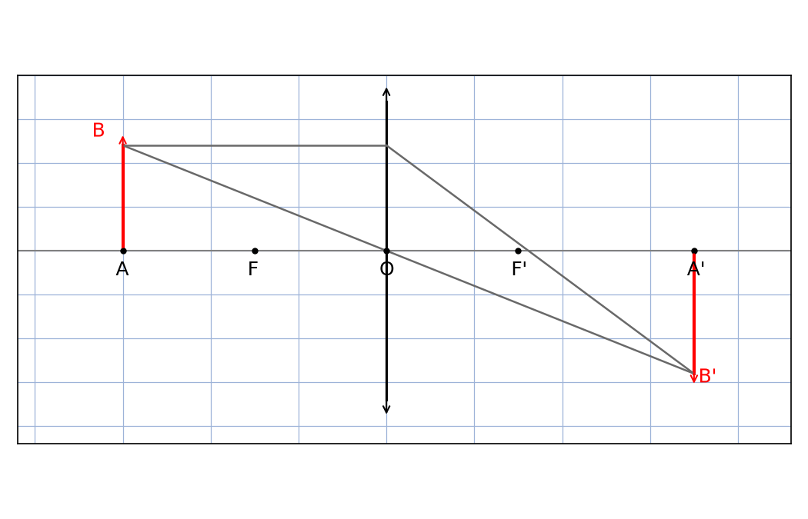

f' = OF' = FO [tel quel] ; a = OA, a' = OA', γ = FA [?] , γ' = F'A' [lecture incertaine]

AB/A'B' = OA/OA' = F'O/F'A' ⇔ OA/OA' = F'O/(OA' − OF')

⇔ aa' − af' = −a'f' [tel quel, f' = OF']

⇔ f'⁻¹ = −a⁻¹ + a'⁻¹ [rouge — relation de conjugaison de Descartes avec convention de signes du manuscrit]

## Page 15 (chute miroir + * Suite d'or)

AB/A'B' = OA/OA' = F'O/F'A' [lecture incertaine : le manuscrit porte des notations P', Q' mêlées] ⇔ (OP'+PP')/(OP'+P'P') = P'Q/P'Q' [tel quel]

⇔ −f'm' + mm' = −f'² − f'm'

⇔ −f'² = mm' [rouge — forme de Newton]

27/07/2020

* Suite d'or [rouge, souligné]

I/ Soit la suite (On)n∈IN, définie par O₀ = x et On+1 = √(1+On), x ∈ IR [rouge]

• Donner la condition d'existence de cette suite en fonction de On puis x

• Étudier le signe de On+1 − On puis en déduire l'évolution de la suite en fonction de x

• Démontrer que ∀ x ∈ IR, (On) converge vers une valeur réelle φ que l'on précisera

• En déduire une résolution dans IR de l'équation x = √(1+√(1+√(1+√(1+x)))), de même [suite p.16]

## Page 16 (suite d'or II/)

que de l'équation x = √(1+√(1+…√(1+x)))

II/ Soit la suite (O'n)n∈IN, définie par O'₀ = x et O'n+1 = 1 + 1/O'n, x ∈ IR [rouge]

• Donner la condition d'existence de (O'n) en fonction de x (on exprimera l'ensemble des valeurs de x ne vérifiant pas la dite condition sous forme d'une suite (Mn)n∈IN (Mn ≠ 0) dont on étudiera l'existence, le signe, l'évolution, la convergence avant d'exprimer (xn) de façon explicite et enfin déterminer le vrai domaine d'existence de (O'n) explicitement)

• Étudier l'évolution de (O'n)

• (O'n) converge-t-elle ? Si oui, déter[miner — suite p.17]

## Page 17 (chute II/ + bilan + hypercubes)

miner la valeur de convergence que l'on notera φ', sinon conclure sur la limite de (O'n) à l'infini (+)

• En déduire une résolution des équations x = ((x⁻¹+1)⁻¹+1)⁻¹ et x = (…((x⁻¹+1)⁻¹+…+1)⁻¹ [tel quel]

III/ Conclusion-bilan [rouge]

• Comparer les solutions des 04 équations données à résoudre avec φ' et φ

• Déduire que φ est la solution positive de l'équation x² − x − 1 = 0 et la seule solution de l'équation φ = (a+b)/a = a/b où (a,b) ∈ IR+*² et a > b

23/08/2020

* Hypercubes [rouge, souligné]

le nombre de composantes d'un hypercube de dimension n (où la composante est de dimension m) est donné par : [suite p.18]

## Page 18 (formule hypercubes)

K⁰₀ = 1, Kᵐ₀ = 0 (m ≠ 0), K⁰ₙ = 2, K¹ₙ = 1 [rouge, tel quel]

Kᵐₙ = 2Kᵐₙ₋₁ + Kᵐ⁻¹ₙ₋₁, avec (n,m) ∈ IN² [rouge]

ou plus explicitement Kᵐₙ = 2ⁿ⁻ᵐ × Cᵐₙ [rouge]

• ainsi dans un hypercube de dimension 4 : K⁰₄ : Sommets = 16 ; K¹₄ : Arêtes = 32 ; K²₄ : Faces = 24 ; K³₄ : Cellules = 8 ; K⁴₄ : hypercube = 1 [rouge]

• de la définition par récurrence découlent les démonstrations Cᵐₙ₋₁ + Cᵐ⁻¹ₙ₋₁ = Cᵐₙ ; (−q)! = ∞ [tel quel], Aᵐₙ = 0 (m > n), Cᵐₙ = 0 (m > n) où (q,m,n) ∈ IR+*³ [rouge]

• On définit aussi la mesure d'une composante de dimension m d'un hypercube de dimension n par et d'arête a par : [suite p.19]

## Page 19 (mesure + * 20 de moyenne ?)

M⁰ₙ = 0 ; Mᵐₙ = Kᵐₙ × aᵐ = 2ⁿ⁻ᵐ × aᵐ × Cᵐₙ (m ≠ 0) [rouge]

24/08/2020

* 20 de moyenne ? [rouge, souligné]

Soit x ∈ ]0,+∞[, la performance d'un élève et f la fonction qui à x associe la moyenne f(x) ∈ ]0,20[ du dit élève. Intuitivement f(x) croît avec x. De même lorsque x → +∞, f(x) → 20K où K est un coefficient d'incertitude variant entre 0 et 1 (0 < K < 1). On peut conclure que dans des Conditions Normales de Transparence (pas de fraude) et de Précision (correction parfaite), (CNTP), ce coefficient tend vers 1. Ainsi l'une des simples fonctions vérifiant [suite p.20]

## Page 20 (chute moyenne + * Cordes du cercle 1)

les postulats est f(x) = 20K(x/(m+x)) [rouge] avec m > 0 et 0 < f(x) < 20K [rouge]

En conclusion la valeur maximale théorique de la moyenne d'un élève vaut : lim_{x→+∞} f(x) = 20 avec K → 1 [rouge : « 20 » et « K → 1 »]

et la valeur maximale réelle avec les erreurs du quotidien (K ≃ 0,99) vaut : lim_{x→+∞} f(x) = 19,8 [rouge : « 19,8 »]

02/09/2020

* Cordes du cercle 1 [rouge, souligné]

Figure (crayon) : cercle, diamètre horizontal BD [tel quel : B à gauche, D à droite], point A en haut relié à D, point C en bas, segment vertical AC coupant BD en E avec angle droit marqué, points F, M, y annotés. [À reproduire en passe FORME : `lab/scripts/reproduce_cordes_cercle1.py` → `assets/cordes-cercle1.png`.]

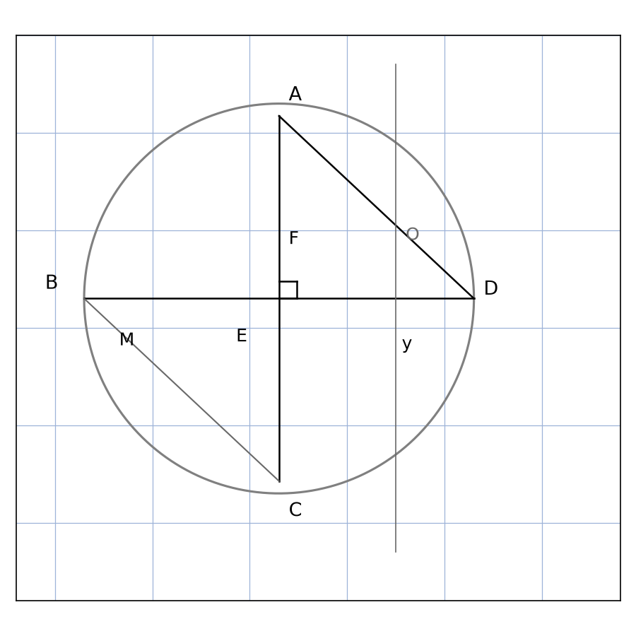

## Page 21 (cordes : angles inscrits + 4r²)

xy = zt [rouge — lecture : le manuscrit porte « xy = zt » (produit en croix de x/t = z/y) ; « 3t » possible à la lecture]

ADB̂ et ACB̂ interceptent le même arc AB, par conséquent mes ADB̂ = mes ACB̂ [rouge : « mes ADB̂ = mes ACB̂ »]

CBD̂ et CAD̂ interceptent le même arc CD, par conséquent mes CBD̂ = mes CAD̂ [rouge : « mes CBD̂ = mes CAD̂ »]

Ainsi ABD et BCE sont semblables

⇔ x/t = z/y ⇔ xy = zt [tel quel]

4r² = x² + y² + z² + t² [rouge]

AO² = AF² + FO² = r²

⇔ (z+t/2)² + (y−xy/2)² = r² [tel quel]

⇔ 4r² = x² + y² + z² + t² [rouge]

* Triangles et quadrilatères convexes [rouge, souligné]

D'après les propriétés des angles alternes-internes découlant du 5e axiome d'Euclide dans une géométrie euclidienne, [suite p.22]

## Page 22 (triangles, quadrilatères, polygone convexe)

la somme des angles d'un parallélogramme vaut 2π [rouge : « 2π »]

Tout triangle étant la moitié d'un parallélogramme ou encore la réunion d'un triangle et de son symétrique par rapport au milieu d'un de ses côtés donnant un parallélogramme, la somme des mesures des angles dans un triangle vaut π [rouge : « π »]

De façon générale, tout quadrilatère pouvant être découpé en 2 triangles, la somme des mesures des angles y est de 2π [rouge : « 2π »]

* Polygone convexe [rouge, souligné]

Tout polygone pouvant être découpé en n−2 triangles d'intersection nulle où n est le nombre de côtés du polygone, la somme des mesures des angles y est de (n−2)×π [rouge]

## Page 23 (angles au centre et inscrit, cas 1–2)

03/09/2020

* Angles au centre et inscrit [rouge, souligné]

Angle inscrit aigu : [rouge]

Cas 1 : [bleu, souligné]

Figure (crayon) : cercle de centre O, diamètre M₂–M₀, point M₁ sur le cercle, angle α en M₂, angle θ au centre O. [À reproduire en passe FORME avec le cas 2 (`lab/scripts/reproduce_angles_inscrits.py` → `assets/angles-inscrits.png`).]

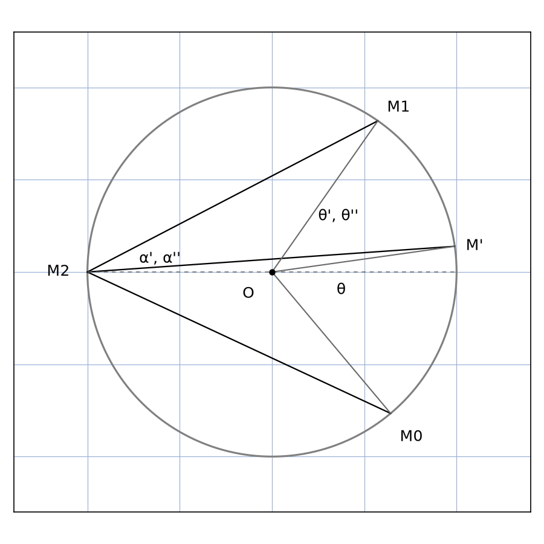

OM₁M₂ et OM₀M₁ sont isocèles en O [« en O » rouge]

2α + (π−θ) = π ⇔ θ = 2α [rouge : « θ = 2α »]

Cas 2 : [bleu, souligné]

Figure (crayon) : cercle, sommet M₂ avec rayons vers M₁, M' et M₀ ; angles α', α'', θ', θ'' annotés. [Voir script cas 1–2–3 ci-dessus.]

## Page 24 (cas 3 + angle inscrit obtus)

Exploitant les résultats du cas 1 on obtient θ' = 2α' et θ'' = 2α'' [tel quel]

ainsi θ = 2α [rouge]

Cas 3 : [bleu, souligné]

Figure (crayon) : cercle, points M₂, M₁, M', M₀, angles α', α'' au bord et θ', θ'' au centre. [Voir script cas 1–2–3 ci-dessus.]

Exploitant les résultats du cas 1 on obtient θ' = 2α' et θ'' = 2α'' [tel quel]

d'où θ' − θ'' = 2(α' − α'')

ainsi θ = 2α [rouge]

Angle inscrit obtu[s] [rouge — suite p.25]

## Page 25 (angle inscrit obtus + conséquence 1)

Figure (crayon) : cercle de centre O, points M₁, M₂, M₀ avec angles β', β'' au bord et θ', θ'' au centre. [Voir script cas 1–2–3 p.23.]

OM₀M₁ et OM₁M₂ sont isocèles en O [tel quel]

θ' = π − 2β' et θ'' = π − 2β'' [tel quel]

ainsi θ + 2β = 2π [rouge]

Conséquence 1 : quadrilatère convexe [rouge, souligné]

Figure (crayon) : quadrilatère M₃–M₂–M₁–M₀ inscrit dans un cercle de centre O, diagonales tracées. [À reproduire en passe FORME : `lab/scripts/reproduce_quadrilatere_convexe.py` → `assets/quadrilatere-convexe.png`.]

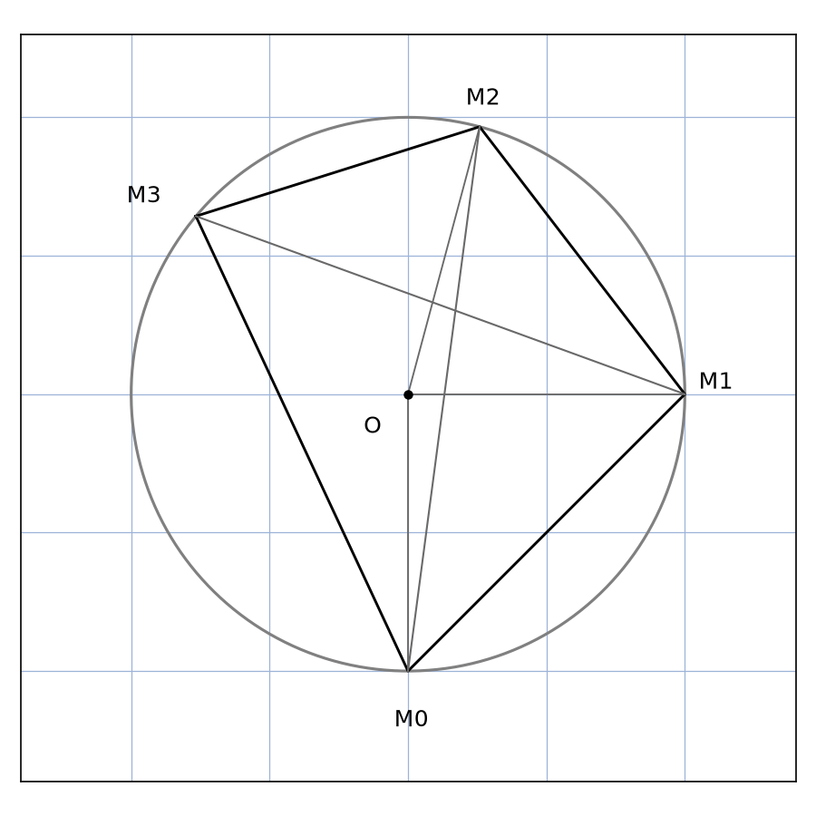

D'après ce qui précède on a [suite p.26]

## Page 26 (conséquence 1 : angles opposés + conséquence 2)

[même 2] M₁M̂₀M₃ et M₁ÔM₃ + 2M₃M̂₂M₁ = 2π [tel quel]

d'où M₁M̂₀M₃ + M₃M̂₂M₁ = π [rouge]

D'un raisonnement analogue on obtient M₂M̂₁M₀ + M₀M̂₃M₂ = π [rouge]

Ainsi dans un quadrilatère convexe inscrit dans un cercle donné, la somme des mesures des angles opposés vaut π [rouge : « π »]

Conséquence 2 : quadrilatère croisé [rouge, souligné]

Figure (crayon) : quadrilatère croisé M₃–M₂–M₁–M₀ dans un cercle de centre O. [Voir script quadrilatère ci-dessus.]

D'après les propriétés 1 et 2, M₂ÔM₂ [tel quel : M₁ÔM₂] = 2M₁M̂₀M₂ = 2M₁M̂₃M₂

d'où M₁M̂₀M₂ = M₁M̂₃M₂ [rouge]

## Page 27 (2 conséquences + * Cordes du cercle 2)

Similairement on démontre que M₃M̂₂M₀ = M₃M̂₁M₀ [rouge : « M₃M̂₁M₀ »]

2 conséquences sont à tirer :

- Deux angles inscrits interceptant le même arc de cercle ont la même mesure

- Dans un quadrilatère croisé, les 02 triangles disjoints qui le composent sont semblables [rouge : « semblables »]

* Cordes du cercle 2 [rouge, souligné]

le centre d'un cercle donné, étant équidistant de tout point du cercle, appartient à la médiatrice de toute corde du cercle [rouge : « la médiatrice de toute corde du cercle »]

Rapport entre 02 cordes de cercles [bleu]

Figure (crayon) : cercle de centre O, cordes avec points M₃, M', M₂, M₁, M₀, angles α, α', α'', θ. α ≠ 0 [bleu, en marge]. [À reproduire en passe FORME : `lab/scripts/reproduce_cordes_cercle2.py` → `assets/cordes-cercle2.png`.]

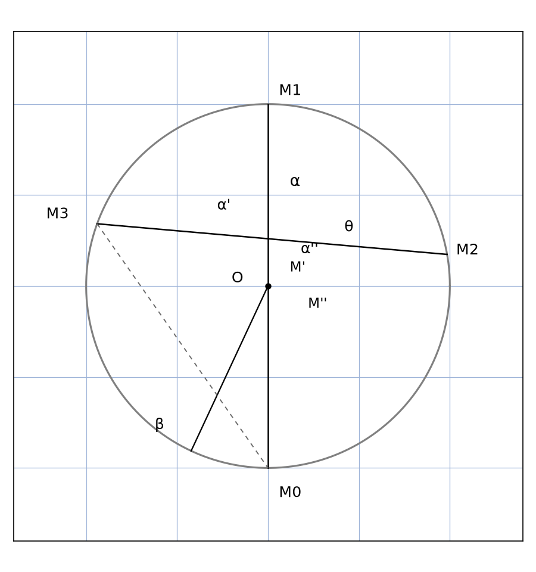

## Page 28 (Al-Kashi + équation du rayon)

M₀M₂M₁M₃ étant un quadrilatère croisé [tel quel], les triangles M₀M₂M' et M₁M₃M' sont semblables [tel quel]

ainsi x/z = t/y [tel quel] ⇔ xy = zt [rouge]

D'après le théorème d'Al-Kashi dans le triangle M₀M''O [tel quel] : OM₀² = OM''² + M''M₀² − 2·OM''·M''M₀×cos(α) [tel quel]

[rature]

appelons m₁⁻ = (x−y)/2, m₁⁺ = (x+y)/2 [tel quel]

m₂⁺ = (z+t)/2, T = tan(α − π/2) [tel quel]

le rayon du cercle est l'une des solutions de l'équation [bleu]

R² = (m₁⁻ + √(R²−m₁⁺²)×T)² + (m₂⁺ − √(R²−m₂⁺²)×T)² − 2×(m₁⁻ + √(R²−m₁⁺²)×T)(m₂⁺ − √(R²−m₂⁺²)×T)cos α [rouge — longue équation, fidèle au manuscrit]

## Page 29 (centre & rayon + * x+y=?)

Pour α = π/2 on obtient 4R² = x² + y² + z² + t² [rouge]

Centre & Rayon [rouge, souligné]

En considérant le triangle M¹₁ [tel quel : M₁ ?] où i ∈ {1,2,3} et en posant Xij = (xi−xj), Yij = (yi−yj), Lij = xi²+yi² − xj²−yj² où j ∈ {1,2,3}, j ≠ i, on obtient O [rouge : « O »] :

O = ( (Lij·Yi'j' − Li'j'·Yij) / 2(Xij·Yi'j' − Xi'j'·Yij) , (Li'j'·Xi'j' [tel quel] − Lij·Xi'j') / 2(Xij·Yi'j' − Xi'j'·Yij) ) [rouge — formule entière, gammas du manuscrit]

où i',j' ∈ {1,2,3} et i'+j' ≠ i+j et j' ≠ i' [tel quel]

Ainsi on obtient R = √((x₀−x₁)² + (y₀−y₁)²) [rouge]

06/09/2020

* x + y = ? [rouge, souligné]

(x + √(1+x²))(y + √(1+y²)) = 1

Posons y + √(1+y²) = Y

On obtient (x + √(1+x²))Y = 1 [suite p.30]

## Page 30 (chute x+y + * x=?)

⇔ Y = √(1+x²) − x

⇔ 1 + x² = Y² + x² + 2xY

⇔ x = (1 − Y²)/2Y

= (1 − y² − 1 − y² − 2y√(1+y²)) / 2(y + √(1+y²)) [tel quel]

= −y [tel quel]

d'où x + y = 0 [rouge]

* x = ? [rouge, souligné]

(x² − 7x + 1)^{x²−13x+42} = 1

1er Cas : x² − 7x + 1 ≠ 0 et x² − 13x + 42 ≥ 0 [rouge : « 1er Cas »]

⇔ x ≥ 6 ou x ≥ 7 [rouge : « x ≥ 6 ou x ≥ 7 » — tel quel, voir Correction : x²−13x+42 ≥ 0 donne x ≤ 6 ou x ≥ 7]

2e Cas : x² − 7x + 1 = 1 [rouge : « 2e Cas »]

⇔ x = 2 ou x = 5 [rouge : « x = 2 ou x = 5 » — tel quel, voir Correction : x²−7x = 0 donne x = 0 ou x = 7]

3e Cas : x² − 7x + 1 = −1 et x² − 13x + 42 est pair [rouge : « 3e Cas »]

⇔ x = 3 ou x = 4 [rouge : « x = 3 ou x = 4 »]

Donc S = {2, 3, 4, 5, 6, 7} [rouge — [Correction] : solutions exactes recalculées : cas 1 (base ≠ 0, ±1, exposant ≥ 0) : x ≤ 6 ou x ≥ 7 sauf racines de x²−7x+1 = 0 ; cas 2 (base = 1) : x = 0 ou x = 7 ; cas 3 (base = −1, exposant pair) : x = 3 (exposant 3, impair ✗), x = 4 (exposant 6, pair ✓) ; cas base = 0 exclu (exposant 42 > 0 donnerait 0 ≠ 1). Le manuscrit simplifie abusivement.]

## Page 31 (Cardan x=1 + * Carré magique)

x = ∛(8+3√21) + ∛(8−3√21) [tel quel, haut de page]

x³ = 16 + 3(8+3√21)^{2/3}(8−3√21)^{1/3} + 3(8+3√21)^{1/3}(8−3√21)^{2/3} [tel quel]

= 16 + 3∛((8+3√21)(8−3√21)) × x [tel quel]

x³ = 16 − 15x [tel quel]

Donc x = 1 [rouge]

24/09/2020

* Carré magique [rouge, souligné]

Soit le carré [Γⁿ] subdivisé en n² carrés égaux et complémentaires et numérotés de 1 à n² où n ∈ IN*, 1 ≤ 1 ≤ n [rouge : « 1 à n² », « n ∈ IN* » — tel quel]

Mathématiquement ([Γⁿ]) : (x, y) [rouge] où x, y ∈ {1, 2, …, n}

Intuitivement Γx,y = x₀ + n(y−1) [rouge — lecture : « x₀ » ou « x6 » ?]

En choisissant n cases distinctes deux à deux n'appartenant ni à la même [suite p.32]

## Page 32 (constante magique)

colonne, ni à la même ligne ; on peut déduire que 02 cases quelconques ne pourront avoir ni la même abscisse, ni la même ordonnée

En effectuant la somme des valeurs de ces cases, on obtient : S = x₁ + n(y₁−1) + x₂ + n(y₂−1) + … + xₙ + n(yₙ−1) = (x₁+x₂+…+xₙ) + n(y₁+y₂+…+yₙ) − n² [tel quel]

Or les abscisses et ordonnées étant toutes différentes pour toute paire d'abscisses ou d'ordonnées choisies, ainsi S = n(n+1)/2 + n×(n(n+1)/2 − n) [tel quel]

S = n(n²+1)/2 [rouge]

Concrètement pour tout carré [Γⁿ], on aura n! de choix possibles respectant [suite p.33]

## Page 33 (n! choix + * (a,b,c)=?)

la description précédemment énoncée et dont la somme de n'importe laquelle de ces combinaisons donnera toujours n(n²+1)/2 [rouge : « n(n²+1)/2 »]

* (a, b, c) = ? [rouge, souligné]

Chercher le unique couple d'entiers relatifs (a, b, c) tel que (3√6−4√3−5√2+7)/(√6−√3+2−√2) = a + b√c = tan α [tel quel]

(3√6−4√3−5√2+7)/(√6−√2+2−√3) = A [tel quel]

A = ((3√6−4√3−5√2+7)/(√6−√2+2−√3)) × (2−√3)/(2−√3) [tel quel]

= ((3√6−4√3−5√2+7)×(2−√3))/(3√6−4√3−5√2+7) [tel quel]

A = 2 − √3 [rouge]

ainsi (a, b, c) = (2, −1, 3) et α = π/12 [rouge]

* SEND + MORE = MONEY [rouge — cryptarithme : chaque lettre = un chiffre unique, M ≠ 0 ; suite p.34]

## Page 34 (SEND+MORE=MONEY)

SEND + MORE = MONEY [rouge]

• M = 1 car S+M < 18 [rouge : « M = 1 »]

• O = 0 car M = 1 ainsi S+M ≤ 10 ou S+M ≤ 11 [tel quel]

• S = 8 ou S = 9 [rouge]

• E = 9 ; E+1 = N [tel quel]

• N = 0 ; R = 8 [tel quel]

(absurde) ; D+E > 9 [tel quel]

• Y = 2 ; D = 7 ; E = 5 ; N = 6 [rouge — valeurs finales]

Donc 9567 + 1085 = 10652 [rouge — solution classique : 9567+1085=10652 ✓]

## Page 35 (* Longueur d'un ressort)

* Longueur d'un ressort [rouge, souligné]

Figure (crayon) : en haut un cylindre (C) (2 spires en pointillés + silhouette), en bas un prisme (T) à base polygonale (zigzag) ; longueur l annotée. [À reproduire en passe FORME : `lab/scripts/reproduce_ressort_spire.py` → `assets/ressort-spire.png`.]

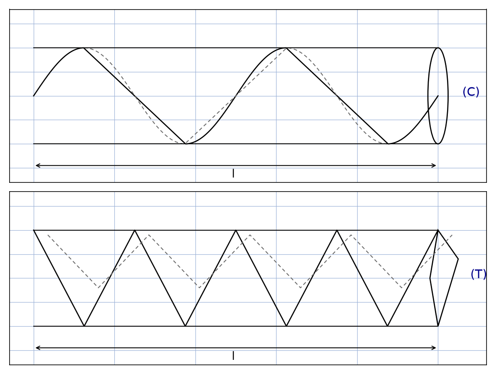

(C) est un cylindre et (T) est un prisme dont la base à n côtés [tel quel]

En considérant une spire sur (T) de longueur l et en appelant D sa longueur on a : D = n × √(c² + (l/n)²) où c est le côté du polygone régulier à la base de (T) [tel quel]

or c² = 2r² − 2r²cos(2π/n) [tel quel]

⇔ D = n√(2r²(1−cos(2π/n)) + l²/n²) [tel quel]

= √(2r²n²(1−cos(2π/n)) + l²) [tel quel]

## Page 36 (limite S + bobine)

Posons N = 2π/n ⇔ n = 2π/N [tel quel]

On obtient D = √(2r²×4π²/N²×(1−cos N) + l²) [tel quel]

or lorsque n → ∞, N → 0 et (T) → (C)

ainsi la longueur S de la spire de longueur l de (C) est définie par S = lim_{N→0} D = lim_{N→0} √(2r²×4π²×((1−cos N)/N²) + l²) = √(2r²×4π²×1/2 + l²) [tel quel]

ainsi S = √((2πr)² + l²) [rouge]

Donc pour une bobine comportant m spires, la longueur totale vaut T = m×√((2πr)² + (l/m)²) = √((2πrm)² + l²) [rouge — fin coupée, suite p.37]

## Page 37 (x = ? Cardan bis + sommes)

[Chute T : = √((2πrm)² + l²) — fin de la formule rouge.]

x = ? [rouge, en marge]

x = 10√(10³√(10⁴√(10…))) [tel quel — radicaux emboîtés, (2,3,4,…) → puissances de 10]

(Un) : Un = 10^{1+1/2+1/4+…} [tel quel]

soit x = lim_{n→+∞} Un [tel quel]

posons (Vn) : Vn = (n+2)/2ⁿ [tel quel]

(Sn) : Sn = V₀+V₁+…+Vn = 2/2⁰ + 3/2 + 4/2² + … + (n+2)/2ⁿ [tel quel]

= 1/2ⁿ(2×2ⁿ + 3×2ⁿ⁻¹ + … + (n+2)×2⁰) [tel quel]

= 1/2ⁿ[2(1−2ⁿ⁺¹)/(1−2) + (1−2ⁿ)/(1−2) + … (1−2)/(1−2)] [tel quel]

= 1/2ⁿ[(1+2ⁿ⁺¹) + 2(1−2ⁿ⁺¹)/(1−2) − 1 − 1/(1−2)] [tel quel]

ainsi Sn = 1/2ⁿ(3×2ⁿ⁺¹ − n − 4) [rouge]

x = lim_{n→+∞} Un = 10^{lim_{n→+∞} Sn} [tel quel — suite p.38]

## Page 38 (x = 10⁶ + * Binôme de Newton ?)

alors x = 10^{lim 3×2 − lim (n+4)/2ⁿ} [tel quel]

donc x = 10⁶ [rouge]

20/09/2020 [tel quel : « 20/09/2020 »]

* Binôme de Newton ? [rouge, souligné]

Ce théorème affirme que ∀ (a,b) ∈ IR² et n ∈ IN, (a+b)ⁿ = Σ_{i=0}^{n} Cⁱₙaⁿ⁻ⁱbⁱ [rouge : la formule]

• Pour n = 0, (a+b)⁰ = 1 et Σ_{i=0}^{0} Cⁱ₀a⁰⁻ⁱbⁱ = C⁰₀b⁰ = 1 [tel quel]

d'où (a+b)⁰ = Σ_{i=0}^{0} Cⁱ₀a⁰⁻ⁱbⁱ [rouge]

avec a et b tous non tous normaux [tel quel — rature]

• Supposons que (a+b)ⁿ = Σ_{i=0}^{n} Cⁱₙaⁿ⁻ⁱbⁱ [tel quel]

ainsi (a+b)ⁿ⁺¹ = (a+b)ⁿ×(a+b) = Σ_{i=0}^{n} Cⁱₙaⁿ⁻ⁱbⁱ×b + Σ_{i=0}^{n} Cⁱₙaⁿ⁻ⁱbⁱ×a [tel quel]

= C⁰ₙaⁿ⁺¹b⁰ + Σ_{i=0}^{n−1} Cⁱₙaⁿ⁻ⁱbⁱ⁺¹ + Σ_{i=0}^{n−1} Cⁱₙaⁿ⁻ⁱbⁱ⁺¹ [tel quel] + Cⁿₙa⁰bⁿ⁺¹ [suite p.39]

## Page 39 (chute binôme + * Démonstration par récurrence ?)

= C⁰ₙ₊₁aⁿ⁺¹b⁰ + Σ_{i=0}^{n} aⁿ⁻ⁱbⁱ⁺¹(Cⁱₙ + Cⁱ⁺¹ₙ) [tel quel]

+ Cⁿ⁺¹ₙ₊₁a⁰bⁿ⁺¹ [tel quel]

= C⁰ₙ₊₁aⁿ⁺¹b⁰ + Σ_{i=0}^{n} Cⁱ⁺¹ₙ₊₁aⁿ⁻ⁱbⁱ⁺¹ + Cⁿ⁺¹ₙ₊₁a⁰bⁿ⁺¹ [tel quel]

= C⁰ₙ₊₁aⁿ⁺¹b⁰ + Σ_{i=1}^{n} Cⁱₙ₊₁aⁿ⁺¹⁻ⁱbⁱ + Cⁿ⁺¹ₙ₊₁a⁰bⁿ⁺¹ [tel quel]

(a+b)ⁿ⁺¹ = Σ_{i=0}^{n+1} Cⁱₙ₊₁aⁿ⁺¹⁻ⁱbⁱ [rouge]

donc d'après le principe de la démonstration par récurrence l'assertion « (a+b)ⁿ = Σ_{i=0}^{n} Cⁱₙaⁿ⁻ⁱbⁱ vraie ∀ n ∈ IN » [rouge — citation du manuscrit]

Démonstration par récurrence ? [rouge, souligné]

Soit (P) une assertion définie sur les entiers n ≥ n₀ où n₀ ∈ IN. Montrons que [si] (P) est vraie pour n₀ et que si (P) est vraie pour [suite p.40]

## Page 40 (récurrence : ensemble Q)

n ≥ n₀ alors (P) est aussi vraie pour n+1, donc (P) est vraie pour tout les entiers naturels ≥ n₀ [tel quel]

Soit Q l'ens des valeurs n ≥ n₀ pour lesquelles (P) est fausse

• Q étant minoré par n₀, il admet un minimum qu'on notera q

• q ∈ Q ⇔ q ≥ n₀

• Si q ≥ n₀ or (P) étant vraie pour n₀, elle le serait aussi pour q impliquant que q ∉ Q, ainsi q ≠ n₀ d'où q > n₀

• q > n₀ ⇔ q−1 > n₀−1 ⇔ q−1 ≥ n₀

• or q étant le minimum de Q, q−1 ∉ Q et comme q−1 ≥ n₀, (P) est vraie pour q−1

• (P) est vraie pour q−1 ⇔ (P) est vraie pour (q−1)+1 ⇔ (P) est vraie pour q ⇔ q ∉ Q [rouge : « ⇔ q ∉ Q »]

## Page 41 (absurde + * Théorème fondamental de l'arithmétique)

Absurde ! [rouge] Par conséquent Q ≠ ∅ [rouge : « Q ≠ ∅ »] et donc (P) est vraie pour n₀, si (P) est vraie pour n alors (P) est vraie pour n+1 [tel quel], donc (P) est vraie ∀ n ≥ n₀ [rouge]

13/12/2020 [tel quel : « 13/12/2020 »]

* Théorème fondamental de l'arithmétique [rouge, souligné]

Existence [rouge]

Soit n ∈ IN*, 1 ≤ 1 ≤ n [tel quel : probablement « n ≥ 1 »], P(n) : n peut s'écrire comme un produit de facteurs 1ers [tel quel]

- pour n = 2, 2 = 2¹ d'où P(2) est vraie

- Supposons que P est vraie jusqu'au rang n et montrons que P(n+1) est vraie

- Si n+1 est premier alors P(n+1) est vraie

- Sinon, il admet un plus petit diviseur p | n+1 = p×d où d ∈ IN* [tel quel]

p ≥ 2 ⇒ n+1 ≥ 2d ⇒ d ≤ n ⇒ P(d) est vraie [tel quel]

d'après l'hypothèse de récurrence [suite p.42]

## Page 42 (existence : produit)

Ainsi, ∃ p₁, …, pₘ étant des nbres premiers, α₁, …, αₘ ∈ IN* | d = Π_{k=1}^{m} pₖ^{αₖ} [tel quel]

Alors n+1 = p × Π_{k=1}^{m} pₖ^{αₖ} [tel quel]

Donc P(n+1) est vraie

Par conséquent ∀ n ∈ IN*, n ≥ 1, n peut s'écrire comme produit de facteurs 1ers [rouge]

Unicité [rouge, souligné] : la décomposition de n est unique [tel quel]

- pour n = 2, 2 = 2¹ donc P(2) est vraie

- Supposons que P soit vraie jusqu'au rang n et montrons que P(n+1) est vraie

Ona : ∃ {p₁, …, pₘ} des nbres 1ers et α₁, …, αₘ ∈ IN* | n+1 = Π_{k=1}^{m} pₖ^{αₖ} = Π_{k=1}^{m'} qₖ [tel quel : qₖ …] où Q = P [tel quel]

Supposons que n+1 admette une autre écriture en produit de facteurs 1ers Π_{k=1}^{m'} [tel quel — suite p.43]

## Page 43 (unicité : contradiction)

n+1 = Π_{k=1}^{m} Qₖ = Π_{k=1}^{m'} Q'ₖ [tel quel]

Π_{k=2}^{m} Qₖ = Δ/Q₁, Π_{k=0}^{m'} Q'ₖ ∈ IN [tel quel]

Q₁ | Π_{k=0}^{m'} Q'ₖ ⇒ (Π_{k=0}^{m'} Q'ₖ) × Δ/Q₁ peut s'écrire comme produit de facteurs 1ers car (n+1)/Q₁ est inférieur ou égal à n et est entier [tel quel]

ainsi (n+1)/Q₁ admet 2 écritures en produit de facteurs 1ers ce qui est absurde car (n+1)/Q₁ ≤ n [tel quel]

Alors n+1 n'a qu'une seule écriture en produit de facteurs premiers

Donc P(n+1) est vraie

U : ∀ n ∈ IN*, n ≥ 1, n peut s'écrire de façon unique comme produit de facteurs 1ers [rouge — « U » = unicité]

## Page 44 (* Diviseurs d'un nombre)

* Diviseurs d'un nombre [rouge, souligné]

Soit n ∈ IN*, 1 ≤ 1 ≤ n [tel quel], n = Π_{k=1}^{m} pₖ^{αₖ} est son écriture en produit de facteurs premiers et d, un diviseur de n, d'écriture en produit de facteurs 1ers d = Π_{k=1}^{m} qₖ^{βₖ} | diviseur positif [tel quel]

∀ qₖ^{βₖ} ∈ {q₁^{β₁}, 1 ≤ k ≤ m}, il existe un pₖ ∈ {pₖ^{αₖ}, 1 ≤ k ≤ m} | qₖ^{βₖ} | pₖ^{αₖ} ainsi notre qₖ et pₖ sont 1ers [tel quel]

• Alors qₖ^{βₖ} | pₖ^{αₖ} ⇒ qₖ = pₖ et βₖ ≤ αₖ [tel quel]

• Donc d est un diviseur de n ssi d = Π_{k=1}^{m} pₖ^{βₖ} où 0 ≤ βₖ ≤ αₖ [rouge : « 0 ≤ βₖ ≤ αₖ »] positif [rouge]

• Soit Eₖ = {pₖⁱ, 0 ≤ i ≤ αₖ}, 1 ≤ k ≤ m, l'ensemble des diviseurs de n est [tel quel] D = {Π_{k=1}^{m} dₖ, dₖ ∈ Eₖ} [rouge]

• le nbre de diviseurs positifs de n est alors [suite p.45]

## Page 45 (nombre de diviseurs + a∧b)

N = Π_{k=1}^{m} Card Eₖ = Π_{k=1}^{m} (αₖ+1) [rouge]

les diviseurs positifs de n sont encore les termes du développement de la somme S = Π_{k=1}^{m} Σ_{i=0}^{αₖ} pₖⁱ [rouge]

* a∧b = 1 ⇔ aⁿ∧bᵐ = 1 [rouge, souligné]

Soient a, b, n, m ∈ IN, P(n) : "a∧b = 1 diff[érent ?]" [tel quel]

⇔ aⁿ∧bᵐ = 1 [tel quel]

• pour n = 1, P(1) est vraie par définition [tel quel]

• Supposons que P(n) est vraie et montrons que P(n+1) est vraie

Ona : aⁿ∧b = 1 et a∧b = 1 [tel quel] } ⇔ a×aⁿ∧b = 1 ⇔ aⁿ⁺¹∧b = 1 [tel quel]

D'où P(n+1) est vraie

ainsi a∧b = 1 ⇔ aⁿ∧b = 1 [tel quel]

De même aⁿ∧b = 1 ⇔ (aⁿ)∧(b)ᵐ = 1 [tel quel]

⇔ aⁿ∧bᵐ = 1 [rouge — suite p.46]

## Page 46 (a∧b = δ + exp complexe)

* a∧b = δ ⇔ aⁿ∧bⁿ = δⁿ [rouge, souligné]

Ona : δ|a et δ|b ⇔ a = δa' et b = δb', a',b' ∈ IN [tel quel]

a∧b = δ ⇔ a'∧b' = 1 ⇔ a'ⁿ∧b'ⁿ = 1 ⇔ δⁿ(a'ⁿ∧b'ⁿ) = δⁿ ⇔ (δa')ⁿ∧(δb')ⁿ = δⁿ ⇔ aⁿ∧bⁿ = δⁿ [rouge : « aⁿ∧bⁿ = δⁿ »]

* continuons : e^{ix} [rouge, souligné]

Soit f(x) = e^{Kx}, x ∈ IR, K ∈ C [tel quel]

f(0) = 1 et f'(x) = [(e^{x})^{K}]' = Ke^{x}e^{x(K−1)} = Kf(x) [tel quel]

Soit toute autre fonction g telle que g(0) = 1 et g'(x) = Kg(x) [tel quel]

Ona : (f(x)/g(x))' = (f'(x)g(x) − g'(x)f(x))/g(x)² = (Kf(x)g(x) − Kg(x)f(x))/g(x)² = 0 [tel quel — suite p.47]

## Page 47 (e^{ix} = cos x + i sin x)

ainsi la fonction f/g est constante : ∃ α ∈ IR | f(x)/g(x) = α ⇔ f(0)/g(0) = α ⇔ α = 1 [tel quel]

Alors g = f

Ainsi toute fonction g telle que g(0) = 1 et g'(x) = Kg(x) est égale à f [tel quel]

Pour K = i, ona : f(x) = e^{ix}, f(0) = 1 et f'(x) = if(x) [tel quel]

soit h(x) = cos x + i sin x [tel quel]

ona : h(0) = 1 et h'(x) = −sin x + i cos x = i(cos x + i sin x) [tel quel]

h'(x) = ih(x) [tel quel]

D'après ce qui précède, on déduit que h(x) = f(x), donc e^{ix} = cos x + i sin x [rouge : « e^{ix} = cos x + i sin x »]

20/12/2020

## Page 48 (* Irrationnalité de √2 + accélération rotation)

* Irrationnalité de √2 [rouge, souligné]

Supposons que √2 est rationnel, c-à-d √2 = a/b où a/b est irréductible avec a ∈ Z, b ∈ IN* [tel quel]

Ona : a² = 2b² ⇔ a² est pair [tel quel]

or si a est impair alors a² est impair, ainsi par contraposition a² est pair ⇔ a est pair ⇒ a = 2K, K ∈ Z [tel quel]

De même a² = 2b² ⇔ b² est pair car b² = 2K² ⇔ b est pair ⇒ b = 2K', K' ∈ IN* [tel quel]

or la fraction a/b est simplifiable par 2 : Absurde ! [rouge : « Absurde ! »] Donc √2 est irrationnel [rouge : « √2 est irrationnel »]

21/12/2020

* Accélération en mvt de rotation [rouge, souligné]

## Page 49 (accélération rotation)

Figure (crayon) : cercle, axe M horizontal, point avec angle θ, ω, v annotés. [À reproduire en passe FORME : `lab/scripts/reproduce_acceleration_rotation.py` → `assets/acceleration-rotation.png`.]

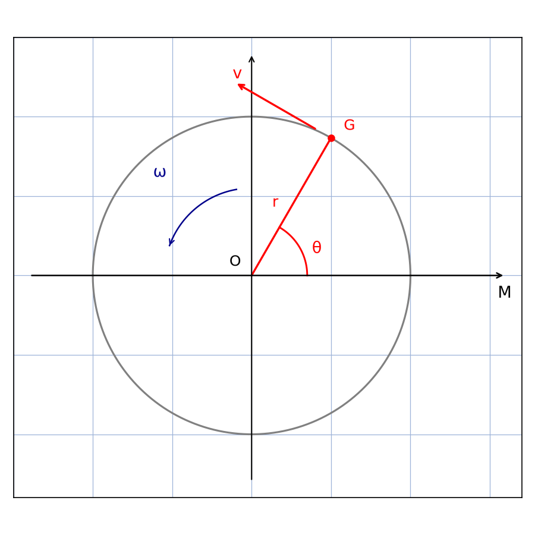

x = r cos θ où θ = (1/2)θ̈t² + θ̇₀t + θ₀ ; y = r sin θ ; θ̇ = θ̈t + θ̇₀ [tel quel]

Vx = rθ̇·sin θ [tel quel — signe : manuscrit]

Vy = r·θ̇·cos θ [tel quel]

ax = −r(θ̈ sin θ + θ̇² cos θ) ; ay = r(θ̈ cos θ − θ̇² sin θ) [tel quel]

a⃗ = θ̈(−r sin θ i⃗ + r cos θ j⃗) − θ̇²(r cos θ i⃗ + r sin θ j⃗) [tel quel]

= (θ̈/θ̇)V⃗ − θ̇²OC⃗ [tel quel]

d'où aₜt⃗ + aₙn⃗ = (θ̈·V·t⃗)/θ̇ + θ̇²·r·n⃗ [tel quel — suite p.50]

## Page 50 (at, an + * Problème 1)

c-à-d at = θ̈·V/θ̇, an = θ̇²·r [tel quel] Donc at = V̇ = dV/dt, an = V²/r [rouge]

23/12/2020

* Problème 1 [rouge, souligné]

"Soient 2 droites sécantes (Δ₁) et (Δ₂), A un point du plan avec A ∉ (Δ₁) et A ∉ (Δ₂). Construire le carré ABCD ayant un sommet B ∈ (Δ₁) et C ∈ (Δ₂)" [rouge : tout l'énoncé entre guillemets]

• Étude d'un cas particulier [rouge]

Figure (crayon) : carré ABCD avec diagonale AC, droites (Δ₁), (Δ₂), point A, angle π/4. [À reproduire en passe FORME : `lab/scripts/reproduce_probleme1_carre.py` → `assets/probleme1-carre.png`.]

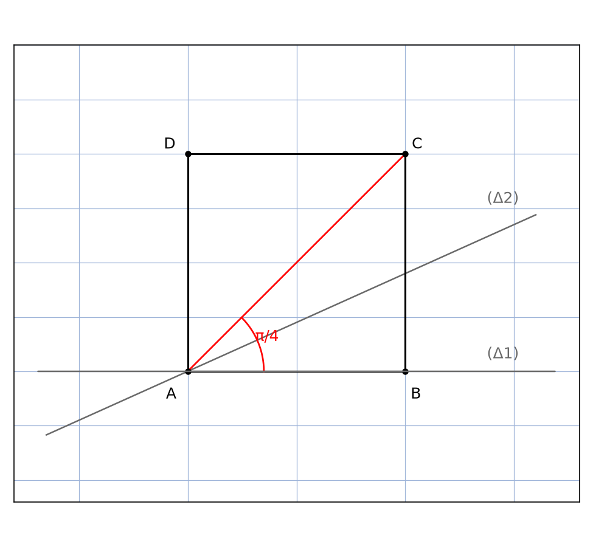

Ona : AC/AB = √2, Mes(AB⃗,AC⃗) = π/4 [tel quel]

ainsi C = S(B) où S = S(A,√2,π/4) [tel quel]

or B ∈ (Δ₁) ainsi C ∈ S(Δ₁) = S((Δ₁)) donc C = (Δ₂) ∩ (Δ₁)' [tel quel — suite p.51]

## Page 51 (programme construction + * Problème 2)

Programme de construction [rouge]

(Δ₁), (Δ₂) et A étant donnés, construire S(Δ₁) = S((Δ₁)) où S = S(A,√2,π/4) ; C = (Δ₂) ∩ (Δ₁)' ; B et D sont les points de rencontre de la méd[AC] et du cercle de diamètre [AC] tels que ABCD soit un carré [tel quel]

* Problème 2 [rouge, souligné]

"Soient (Δ₁), (Δ₂), A ∈ (P) | A ∉ (Δ₁) et A ∉ (Δ₂). Construire un cercle passant par A et tangent à (Δ₁) et (Δ₂)" [bleu — énoncé]

• Étude d'un cas particulier [rouge]

Figure (crayon) : deux droites sécantes (Δ₁), (Δ₂), cercles tangents O₁, O', O'', point A. [À reproduire en passe FORME : `lab/scripts/reproduce_probleme2_cercle.py` → `assets/probleme2-cercle.png`.]

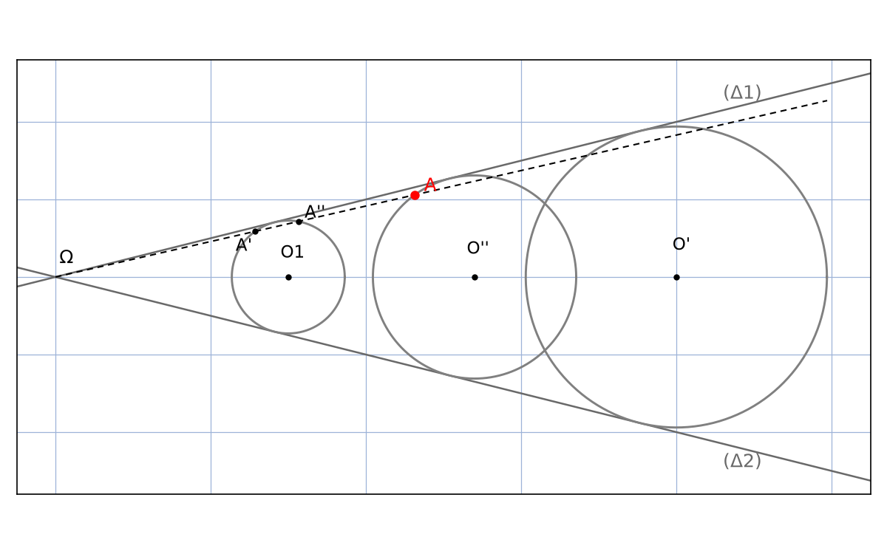

Un tel cercle existe, ainsi son centre appartient [suite p.52]

## Page 52 (homothéties + programme)

à la bissectrice de l'angle rentrant entre (Δ₁) et (Δ₂) [tel quel]

Soit le cercle (C) : C(O), tangent à (Δ₁) et (Δ₂) [tel quel]

Soient {A',A''} = (ΩA) ∩ (C) [tel quel]

Ω, A' et A sont alignés ⇔ A = h(Ω,K) où K = ΩA/ΩA' [tel quel]

ainsi h(C) est le cercle passant par A et tangent à (Δ₁) et (Δ₂) [tel quel]

Ω, A'' et A sont alignés ⇔ A = h'(Ω,K') où K' = ΩA/ΩA'' [tel quel]

ainsi h'(C) est le cercle passant par A et tangent à (Δ₁) et (Δ₂) [tel quel]

Les cercles cherchés sont h(C) et h'(C) [tel quel]

• Programme de construction [rouge]

- (Δ₁), (Δ₂) et A étant donnés, on construit la bissectrice de l'angle rentrant entre (Δ₁) et (Δ₂) [tel quel]

- On choisit un point arbitraire O de [suite p.53]

## Page 53 (fin programme + * Théorème de Ptolémée)

cette bissectrice et on construit le cercle de centre O et tangent à (Δ₁) et (Δ₂) à travers les projetés orthogonaux de O sur (Δ₁) et (Δ₂) [tel quel]

On construit {A',A''} = (ΩA) ∩ (C) où Ω = (Δ₁) ∩ (Δ₂) et (C) est le cercle précédent [tel quel]

le cercle cherché est (C') = h(C) ou (C'') = h'(C) où h = h(Ω,ΩA/ΩA') et h' = h(Ω,ΩA/ΩA'') [rouge]

* Théorème de Ptolémée [rouge, souligné]

Soit un quadrilatère convexe direct ABCD [tel quel]

Soit S la similitude qui transforme D en C [tel quel]

Posons E = S(A) [tel quel]

Figure (crayon) : quadrilatère ABCD avec diagonales, point E sur diagonale. [À reproduire en passe FORME : `lab/scripts/reproduce_ptolemee.py` → `assets/ptolemee.png`.]

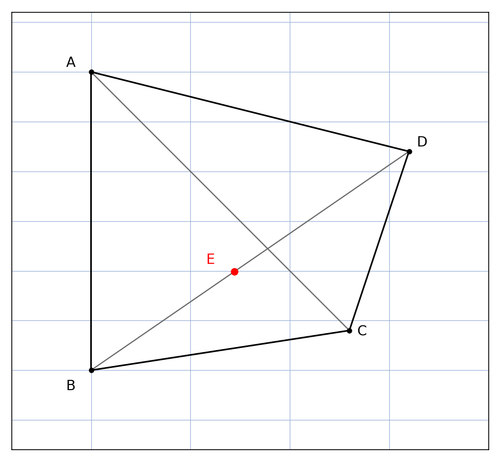

## Page 54 (Ptolémée : similitudes)

• Montrons que BDA et BCE sont semblables

Ona : S(B) = D, S(D) = C, S(A) = E [tel quel] } ⇔ BDA et BEC sont semblables [rouge : « BDA et BEC sont semblables »]

• Montrons que BAE et BDC sont semblables

Ona : BDA et BEC sont semblables, c-à-d BA/BE = BD/BC ⇔ BA/BD = BE/BC [tel quel]

• De plus Mes(BA⃗,BE⃗) = Mes(BD⃗,BC⃗) [tel quel]

ainsi BAE et BDC sont semblables [rouge : « BAE et BDC sont semblables »]

• Montrons que AB×DC + AD×BC ≥ AC×BD [tel quel]

Ona : AB×DC + AD×BC = ED×BA + AE×BC [tel quel]

or BAE et BDA sont semblables ainsi AD/EC = ED/DC [tel quel]

or BAE et BDC sont semblables ⇔ CD/AE = BD/BA [tel quel — suite p.55]

## Page 55 (fin Ptolémée : inégalité + inscriptible + * Problème)

alors AB×DC + AD×BC = AE×BD + EC×BD [tel quel]

= BD (AE+EC) [tel quel]

D'après l'inégalité triangulaire AE+EC ≥ AC [tel quel]

Donc AB×DC + AD×BC ≥ AC×BD [rouge]

Déduisons que ABDC est inscriptible ssi AB×DC + AD×BC = AC×BD (E) [tel quel]

Or (E) ⇔ AE+EC = AC [tel quel]

⇔ Mes(EA⃗,EC⃗) = π [tel quel]

⇔ Mes(EA⃗,EB⃗) + Mes(EB⃗,EC⃗) = π [tel quel]

⇔ Mes(CA⃗,CB⃗) + Mes(AB⃗,AD⃗) = π [tel quel]

car BDA et BCE sont semblables de même que BAE et BDC [tel quel]

⇒ ABDC est inscriptible [rouge]

* Problème - Démonstration [rouge, souligné]

"Démontrer que pour 9 nombres choisis aléa-toirement, on pourra toujours trouver 3" [bleu — début d'énoncé, bas de page, suite p.56]

## Page 56 (9 nombres → 3 somme multiple de 3 + * Démonstration 2)

parmi tels que leur somme soit multiple de 3. [tel quel — fin d'énoncé]

Soient E, l'ens formé de ces 9 nombres, Ek, la partition de E dont les éléments ont pour reste k dans la DE par 3 ; k∈{0,1,2} [tel quel]

• Si card Ek ∈ {3,4,5}, k∈{0,1,2}, alors il suffira de prendre 3 éléments quelconques dans Ek [tel quel]

• Si card E₀, E₁, E₂ ∈ {1,2} et que Σ_{K=0}² card EK = 5 [tel quel — lecture incertaine : « 5 » lu, attendu « 9 » vu « 9 nombres » ; à revérifier sur p-056.png]

alors EK ≠ ∅, il suffira de prendre 1 élément dans chaque partition EK [tel quel]

* Démonstration 2 [rouge, souligné]

"Trois urnes contiennent des billes. Chaque urne est suffisamment grande pour contenir la totalité des billes. La seule opération possible est de doubler le nbre de billes" [bleu — début, suite p.57]

## Page 57 (3 urnes : mise en équation)

contenues dans une urne en prélevant billes dans une autre. [tel quel — suite]

Démontrer que quel que soit la configuration initiale, il est possible d'obtenir une configuration où l'une des urnes est vide [tel quel]

Soient x, y, z le nbre de billes dans les différentes urnes [tel quel]

Une opération consiste à : x, y ⇒ (2x, y-x) elle est alors une multiplication par 2 mod x+y, car la somme est invariante. [tel quel]

En effet x ≡ -y [x+y] ⇒ 2x ≡ -2y [x+y] ⇒ -2y ≡ -y + x [x+y] [tel quel]

[1] [tel quel]

• Si x, y et z sont impairs, on effectue une opération entre 2 quelconques, on obtient 2 nbres pairs et un nombre impair. on recommence en [1] [tel quel]

Si [2 nbres] sont impairs, on effectue l'opé- [tel quel — suite p.58]

## Page 58 (3 urnes : cas pairs + [2])

on avec ceux là, on obtient 3 nbres [im]pairs et on recommence en [1] [tel quel — début coupé]

Si les trois sont pairs c-à-d x=2k, y=2k', z=2k'', en effectuant n fois l'opération entre éléments quelconques, x deviendra αx+βy+γz, y ⇒ α'x+β'y+γ'z, z ⇒ α''x+β''y+γ''z. On voit en gros qu'on peut factoriser toutes ces expressions par [coupé] comme quoi le résultat obtenu avec x, y et z après n opérations est juste le double du résultat obtenu avec leurs moitiés. [tel quel]

En gros, si les trois sont tous pairs, on les divise par 2 (on ne change rien) et on recommence en [1] [tel quel]

[2] [tel quel]

- Si un seul est impair, supposons x=2k, y=2k', z=2k''+1, alors on effectue l'opération avec x et y de la façon qui suit : [tel quel — suite p.59]

## Page 59 (3 urnes : montée 2-adique)

x+y est pair et peut se mettre sous la forme x+y = 2ᵈ×a où a est impair. on fait alors d fois l'opération. x devient 2ᵈi et y → 2ᵈj où i+j est impair car a=i+j. [tel quel + rouge : « (on peut mt par rec » — parenthèse coupée]

Supposons j est pair. Si j=0, c'est terminé ; le couple (x,y,z) devient alors (2ᵈ×i, (2^β×l)×2ᵈ, z) où j=2^β×l, l étant impair [tel quel]

Soit 2ʳ ≡ 1 [y+z], y+z étant impair r existe bel et bien. En effectuant r-β fois l'opération sur y et z on obtient (2ᵈxi, 2ᵈxl, z'), z' étant impair. [tel quel]

on recommence alors en [2] [tel quel]

i et l étant impairs, la valeur de d croît à chaque cycle et la valeur de a devient alors de plus en plus petite jusqu'à atteindre 1 car la somme est invariante. A ce stade en [tel quel — suite p.60]

## Page 60 (fin urnes + * Nombre de chiffres (n))

effectuant [2], on tombe à i=1 et j=0. le cycle s'arrête donc. En d'autres termes l'une des urnes se vide suivant l'opération. [tel quel]

10/01/2021 [bleu, souligné]

* Nombre de chiffres (n) d'un nombre p [rouge, souligné]

• Ona : 10ⁿ⁻¹ ≤ p < 10ⁿ ⇔ n-1 ≤ log p < n ⇔ n-1 = E(log p) ⇔ n = 1+E(log p) [tel quel, dernière équivalence rouge]

• Application : Détermination du nombre de chiffres (n) du plus grand nombre 1ᵉʳ connu à ce jour | p = 2⁸²⁵⁸⁹⁹³³ -1 découvert le 7 déc 2018 par Patrick Laroche dans le cadre du programme (GIMPS) [tel quel, « p = 2 » rouge]

or Ona : 1+ E[log(p+1)] = 1+ E(82589933 log 2) = 24862048 [tel quel]

or p+1 ≠ 10^K (K∈IN*) [tel quel — suite p.61]

## Page 61 (24862048 chiffres + * Primitives de + * f⁽ᵏ⁾)

ainsi n = 24862048 Donc p a 24862048 chiffres [bleu + rouge : « 24862048 chiffres »] 13/01/2020 [bleu — lu « M3 10/01/2020 », à revérifier sur p-061.png]

* Primitives de [rouge, souligné]

- f(x) = (ax+b) eˣ, F(x) = (ax+b-a) eˣ + C, C∈R [tel quel]

- f(x) = (a cos x + b sin x) eˣ, F(x) = (α cos x + β sin x) eˣ + C, C∈R où α = (a+b)/2 et β = (a-b)/2 [tel quel, 2e ligne rouge]

14/01/2020 [bleu, souligné]

* f⁽ᵏ⁾ où f(x) = α (x-a)ⁿ 0≤k≤n [rouge, souligné]

Soit P(k) : "∀ K∈IN | 0≤K≤n, f⁽ᴷ⁾(x) = α Aₙᴷ (x-a)ⁿ⁻ᴷ" [tel quel]

- pour n=0, f⁽⁰⁾(x) = α Aₙ⁰ (x-a)ⁿ⁻⁰ = α (x-a)ⁿ = f(x) donc P(0) est vraie [tel quel]

- hérédité Ona : f⁽ᴷ⁾(x) = α Aₙᴷ (x-a)ⁿ⁻ᴷ ⇔ [f⁽ᴷ⁾]' = α Aₙᴷ×(n-K) (x-a)ⁿ⁻ᴷ⁻¹ = α× n!/(n-K-1)! (x-a)ⁿ⁻ᴷ⁻¹ ⇔ f⁽ᴷ⁺¹⁾ = α Aₙᴷ⁺¹ (x-a)ⁿ⁻⁽ᴷ⁺¹⁾ [tel quel, fin rouge — suite p.62]

## Page 62 (fin hérédité + C1 + * Série de Taylor)

Donc P(K+1) est vraie [tel quel]

C1. Soit f : f(x) = α (x-a)ⁿ, α∈R, n∈IN*, a∈R, x∈R, ∀ p∈IN | 0≤p≤n, f⁽ᵖ⁾(x) = α Aₙᵖ [tel quel + rouge « C1 » et fin « f⁽ᵖ⁾(x) = α Aₙᵖ » coupée à droite]

* Série de Taylor [rouge, souligné]

Soit f une fonction de domaine Df Posons f(x) = Σ_{K=0}ⁿ Cₖ(x-a)ᴷ où n∈IN∪{+∞}, a∈R | |x-a| < r, r étant une précision et recherchons s'il existe les réels Cₖ ₀≤ₖ≤ₙ [tel quel]

Ona : f⁽ⁱ⁾(x) = Σ_{K=i}ⁿ Cₖ Aₖⁱ (x-a)ᴷ⁻ⁱ [tel quel]

f⁽ⁱ⁾(x) = Cᵢ×Aᵢⁱ + Σ_{K=i+1}ⁿ Cₖ Aₖⁱ (x-a)ᴷ⁻ⁱ [tel quel]

ainsi f⁽ⁱ⁾(a) = Cᵢ×i! avec 0≤i≤n d'où Cᵢ = f⁽ⁱ⁾(a)/i! ∈ R [tel quel, « Cᵢ = » rouge]

Donc f(x) = Σ_{K=0}ⁿ f⁽ᴷ⁾(a)/K! (x-a)ᴷ En posant x [bleu — coupé à droite, suite p.63]

on obtient f(a+h) = Σ_{K=0}ⁿ f⁽ᴷ⁾(a)/K!×hᴷ [rouge — suite p.63]

## Page 63 (Taylor : reste + Applications eˣ)

si f est dérivable un nbre fini de fois alors n∈IN, le cas échéant n → +∞ [rouge : « si f est dérivable un nbre fini de fois » + « n∈IN »]

Pour m∈IN, on peut encore écrire f(a+h) = Σ_{K=0}ᵐ f⁽ᴷ⁾(a)/K! hᴷ + hφ(h) où le polynome Σ_{K=0}ᵐ f⁽ᴷ⁾(a)/K! hᴷ = Σ_{K=0}ᵐ f⁽ᴷ⁾(a)/K! (x-a)ᴷ [bleu + rouge : « f(a+h) = … + hφ(h) » et « Σ … »]

est une bonne approximation de f avec une précision r=h, avec φ(h) = Σ_{K=m+1}ⁿ h^{K-1}/K! f⁽ᴷ⁾(a) [bleu + rouge : « est une bonne approximation de f avec une » + « précision r=h »]

Ainsi pour r=h→0, lim_{h→0} hφ(h) = 0, ce qui justifie une approximation meilleure polynomiale [rouge : « Ainsi pour r=h→0 » + « lim hφ(h) = 0 » + bleu : reste]

- Applications [rouge, souligné]

• eˣ = Σ_{K=0}∞ eᵃ/K! (x-a)ᴷ, pour a=0 eˣ = Σ_{K=0}∞ xᴷ/K! = 1 + x + x²/2! + x³/3! + … [bleu + rouge, « [raturé] » avant Σ]

## Page 64 (Taylor : e, ln x, log_b)

et en particulier e = 1 + 1 + 1/2! + 1/3! + … = Σ_{K=0}∞ 1/K! [bleu + rouge]

• ln x = Σ_{K=0}∞ ln⁽ᴷ⁾(a)/K!×(x-a)ᴷ = ln a + 1/a (x-a) - 1/a² (x-a)² + … [bleu]

pour a=1, ln x = (x-1) - (x-1)²/2 + 2(x-1)³/6 - 6(x-1)⁴/24 = Σ_{K=0}∞ (x-1)ᴷ (-1)^{K+1}×(K-1)!/K! [rouge]

ln x = Σ_{K=1}∞ (-1)^{K+1}/K (x-1)ᴷ ou encore ln x = (x-1) - (x-1)²/2 + (x-1)³/3 - (x-1)⁴/4 + … [rouge + bleu : « ou encore »]

et en particulier 1 = ln e = Σ_{K=1}∞ (-1)^{K+1}/K (e-1)ᴷ [bleu + rouge]

• log_b(x) = ln x / ln b [bleu]

log_b(x) = Σ_{K≥1} (b-1)^{K+1}/K (x-1)ᴷ × [Σ_{K≥0} …] [rouge — bas de page coupé, suite p.65]

## Page 65 (Taylor : cos x, sin x, eⁱˣ)

• cos x = Σ_{K=0}∞ cos⁽ᴷ⁾(a)/K!×(x-a)ᴷ pour a=0 cos x = Σ_{K=0}∞ (-1)^K x^{2K}/(2K)! [bleu]

cos x = Σ_{K=0}∞ (-1)^K x^{2K}/(2K)! = 1 - x²/2 + x⁴/24 - … [rouge]

• sin x = Σ_{K=0}∞ sin⁽ᴷ⁾(a)/K! (x-a)ᴷ pour a=0 [bleu]

sin x = Σ_{K=0}∞ (-1)^K x^{2K+1}/(2K+1)! = x - x³/6 + x⁵/120 - … [rouge]

* cos x + i sin x = eⁱˣ (2ᵉ démonstration) [rouge, souligné]

D'après ce qui précède, cos x + i sin x = 1 + ix - x²/2 - ix³/6 + x⁴/24 + ix⁵/120 - … = 1 + (ix)¹ + (ix)²/2! + (ix)³/3! + (ix)⁴/4! + (ix)⁵/5! + … [bleu]

cos x + i sin x = eⁱˣ [rouge]

* Corollaire : ([raturé] 1/K!)^{x} = Σ_{K≥0} xᴷ/K! = eˣ [rouge — « Σ » raturé à gauche, à revérifier sur p-065.png]

## Page 66 (lim ln x / x + encadrement √x)

16/01/2020 [bleu, souligné]

* lim_{x→+∞} ln x / x = ? [rouge]

Soit x∈[1,+∞[ et f(x) = ln x - x + [raturé] + 1 [tel quel — « +[raturé] » après « -x »]

Ona : f'(x) = 1/x - 1 < 0 ∀ x∈[1,+∞[ [tel quel]

ainsi f(x) ∈ ]lim_{+∞} f(x) ; f(1)] [tel quel]

d'où ln x - x + 1 < f(1) [tel quel]

ie ln x - x + 1 < 0 [tel quel]

ie ln x < x [tel quel]

ie ln√x < √x car ∀ x∈[1,+∞[, √x∈[1,+∞[ [tel quel]

ie 1/2 ln x < √x [tel quel]

ie 1/2×ln x / x < 1/√x or ∀ x∈[1,+∞[ ln x / x ≥ 0 [tel quel]

ainsi 0 ≤ ln x / x < 2/√x [tel quel]

Comme lim_{x→+∞} 0 = lim_{x→+∞} 2/√x = 0 [tel quel — suite p.67]

## Page 67 (fin lim + * Exercice Polytech 2014)

Donc lim_{x→+∞} ln x / x = 0 [rouge — début coupé]

17/01/2020 [bleu, souligné]

* Exercice Polytech 2014 [rouge, souligné]

1) Démontrer que ∀ x∈R₊*, 1/(x+1) < ln((x+1)/x) < 1/x [bleu]

Soit x∈R₊*, f : [x ; x+1] → R (x étant un réel fixé) y ⟶ f(y) = ln y [tel quel]

∀ y∈[x ; x+1], y > 0 ainsi f est dérivable sur [x ; x+1] [tel quel]

ainsi ∀ y∈[x ; x+1], f'(y) = 1/y [tel quel]

or x < y < x+1 ⇔ 1/(x+1) < f'(y) < 1/x [tel quel]

en appliquant l'Inégalité des Accroissements finis sur [x ; x+1], on obtient : 1/(x+1) [x+1-x] < ln(x+1) - ln x < 1/x [x+1-x] [tel quel]

Donc 1/(x+1) < ln((x+1)/x) < 1/x ∀ x∈R₊* [rouge : encadrement final]

## Page 68 (encadrement e : ((x+1)/x)ˣ < e < …ˣ⁺¹)

* Déduisons que ∀ x∈R₊*, ((x+1)/x)ˣ < e < ((x+1)/x)ˣ⁺¹ [rouge — fin coupée à droite]

D'après ce qui précède, ∀ x∈R₊*, 1/(x+1) < ln((x+1)/x) < 1/x [tel quel]

ie e^{1/(x+1)} < (x+1)/x < e^{1/x} [tel quel]

ie (x+1)/x < e^{1/x} et e^{1/(x+1)} < (x+1)/x [tel quel]

ie ((x+1)/x)ˣ < e et e < ((x+1)/x)ˣ⁺¹ [tel quel]

(car ∀ a,b,x∈R₊*, a < b ⇔ ln a < ln b ⇔ x ln a < x ln b [tel quel] ⇔ e^{x ln a} < e^{x ln b} ⇔ aˣ < bˣ) [tel quel]

Donc ∀ x∈R₊*, ((x+1)/x)ˣ < e < ((x+1)/x)ˣ⁺¹ [rouge]

2) Démontrons que ∀ n∈IN* [raturé] ((n+1)/n)ⁿ < eⁿ < ((n+1)/n)ⁿ⁺¹ [bleu — « ∀n∈IN* » + raturé après, à revérifier sur p-068.png, suite p.69]

## Page 69 (récurrence P(n) : ((n+1)/n)ⁿ < eⁿ < …)

Soit P(n) : "∀ n∈IN*, ((n+1)/n)ⁿ < eⁿ < ((n+1)/n)ⁿ⁺¹" [tel quel — début coupé]

- pour n=1, d'après 1) ((1+1)/1)¹ < e < ((1+1)/1)¹⁺¹ ⇔ 2 < e < 4 ⇔ ((1+1)/1)¹ < e¹ < ((1+1)/1)¹⁺¹ [tel quel]

Donc P(1) est vraie [tel quel]

- Supposons que ∀ n∈IN*, P(n) est vraie et montrons que P(n+1) l'est aussi. D'après l'hypothèse de récurrence, ((n+1)/n)ⁿ < eⁿ < ((n+1)/n)ⁿ⁺¹ [telquel — « telquel » collé manuscrit]

De plus ∀ n∈IN*, n+1 ∈ R₊*, d'après 1), on a ((n+2)/(n+1))ⁿ⁺¹ < e < ((n+2)/(n+1))ⁿ⁺² (2) [tel quel]

(2)×(1) ⇔ ((n+2)/n!/(n+1)) < eⁿ⁺¹ < ((n+2)/n!(n+1)) [tel quel — « n! » lu, écriture serrée à revérifier sur p-069.png]

⇔ ((n+2)/(n+1)!)ⁿ⁺¹ < eⁿ⁺¹ < ((n+2)/(n+1)!)ⁿ⁺² [tel quel — même réserve]

Donc P(n+1) est vraie Donc ∀ n∈IN*, ((n+1)/n)ⁿ < eⁿ < ((n+1)/n)ⁿ⁺¹ [rouge : conclusion finale]

## Page 70 (* Primitives utiles (Intégration))

30/01/2020 [bleu, souligné]

* Primitives utiles (Intégration) primitivisation [rouge, souligné : titre + « primitivisation » à droite]

- ∫uv' = [uv] - ∫u'v [rouge]

- ∫_{a}ᵇ f(φ(t)) φ'(t) dt = ∫_{φ(a)}^{φ(b)} f(x) dx ∀ C∈K, ∀ x∈R' [rouge — « ∀ C∈K, ∀ x∈R' » à droite, lecture incertaine]

- ∫xⁿ dx = xⁿ⁺¹/(n+1) + C n ≠ -1 [rouge]

- ∫1/x dx = ln|x| + C x ≠ 0 [rouge]

- ∫1/(1+x²) dx = ∫1/(1+tan²u) × 1/cos²u du où x = tan u ie dx/du = 1/cos²u [rouge + bleu : calcul]

= ∫du [bleu]

= u [bleu]

et ∫1/(1+x²) dx = arctan x + C [rouge]

- ∫ln x dx = ∫x' ln x dx ∀ x∈R₊* [rouge]

= [x ln x] - ∫x×1/x dx [bleu]

∫ln x dx = x ln x - x + C [rouge]

- De façon générale, une primitive n-ième de ln est xⁿ/n! (ln x - Σ_{K=1}ⁿ 1/K) ∀ n∈IN* [bleu + rouge]

## Page 71 (preuve primitive n-ième de ln)

En effet soit P(n) la proposition précédente - pour n=1, x¹/1! (ln x - Σ_{K=1}¹ 1/K) = x ln x - x [tel quel — « pour n=1 » bleu, formule rouge]

Donc P(1) est vraie [rouge]

- Supposons que ∀ n∈IN* P(n) est vraie et mtq P(n+1) est vraie [bleu]

Ona : ∫xⁿ/n! (ln x - Σ_{K=1}ⁿ 1/K) = I [bleu]

I = 1/n! (∫(xⁿ/(n+1))' ln x dx - Σ_{K=1}ⁿ 1/K ∫xⁿ dx) [bleu]

= 1/n! (xⁿ⁺¹/(n+1) ln x - ∫1/(n+1) xⁿ dx - Σ_{K=1}ⁿ 1/K × xⁿ⁺¹/(n+1)) [bleu]

= 1/(n+1)! (xⁿ⁺¹ ln x - xⁿ⁺¹/(n+1) - xⁿ⁺¹ Σ_{K=1}ⁿ 1/K) [bleu]

= xⁿ⁺¹/(n+1)! (ln x - 1/(n+1) - Σ_{K=1}ⁿ 1/K) [bleu]

Donc ∫xⁿ/n! (ln x - Σ_{K=1}ⁿ 1/K) = xⁿ⁺¹/(n+1)! (ln x - Σ_{K=1}ⁿ⁺¹ 1/K) [rouge]

Donc P(n+1) est vraie [bleu]

## Page 72 (∫eᵃˣ, ∫aˣ, ∫tan, ∫sinh…)

- ∫e^{ax} dx = 1/a e^{ax} + C ∀ x∈R [rouge]

- ∫f'(x) e^{f(x)} dx = e^{f(x)} + C [rouge]

- ∫aˣ dx = ∫e^{x ln a} dx a > 0 [rouge]

= 1/ln a ∫ln a e^{x ln a} dx [bleu]

∫aˣ dx = aˣ/ln a + C [rouge]

- ∫1/√(1-x²) dx = arcsin x + C } par changement de variable [rouge]

- ∫-1/√(1-x²) dx = arccos x + C } [rouge]

- ∫tan x dx = ∫[raturé]/√(1-…) du où u=tan x ⇒ [coupé] ainsi du=dx/1+tan²x du=dx/1+u² [bleu — « [raturé] » + fin coupée à droite]

= 1/2 ln|u²+1| + C [bleu]

= 1/2 ln|1+tan²x| + C [bleu]

= 1/2 ln|cos⁻²x| + C [bleu]

∫tan x dx = -ln|cos x| + C [rouge]

∫sin h(x) dx = cosh x + C [rouge]

∫cosh(x) dx = sinh(x) + C [rouge — suite p.73]

## Page 73 (fonctions hypo/circulaires + ∫tanh…)

NB : cosh(x) = (eˣ+e⁻ˣ)/2 sinh(x) = (eˣ-e⁻ˣ)/2 [rouge]

cosh²x - sinh²x = 1 ↓ fonctions hyperboliques [rouge]

cos x = (eⁱˣ+e⁻ⁱˣ)/2 sin x = (eⁱˣ-e⁻ⁱˣ)/2i [rouge]

cos²x + sin²x = 1 ↓ fonctions circulaires [rouge]

- ∫tanh(x) dx = ∫u/(1-u²) du où tanh(x)=u [rouge + bleu]

= -1/2 ln|1-u²| + C [bleu]

= -1/2 ln|cosh⁻²(x)| + C [bleu]

∫tanh(x) dx = ln|cosh(x)| + C car ∀ x∈R cosh(x) = (eˣ+e⁻ˣ)/2 > 0 [rouge + bleu]

- ∫arcsin x dx = [arcsin x×x] - ∫x×1/√(1-x²) dx [rouge + bleu]

= arcsin x×x + 1/2×∫-2x/√(1-x²) dx [bleu]

∫arcsin x dx = x arcsin x + √(1-x²) + C [rouge]

- ∫arccos x dx = x cos⁻¹x - √(1-x²) + C [rouge]

- ∫arctan x dx = x tan⁻¹x - 1/2 ln|1+x²| + C [rouge — suite p.74]

## Page 74 (fin ∫argh + * Quelques dérivées usuelles)

- ∫arsinh(x) dx = x sin⁻¹h(x) - √(x²+1) + C [rouge]

- ∫arcosh(x) dx = x cos⁻¹h(x) - √(x²-1) + C [rouge]

- ∫arctan⁻¹h(x) dx = x tan⁻¹(x) + 1/2 ln|1-x²| + C [rouge]

* Quelques dérivées usuelles [rouge, souligné]

- (fʳ)' = r f' fʳ⁻¹ ∀ r∈R [rouge]

- (f∘g)' = g'×f'∘g [rouge]

- (f/g)' = (f'g-g'f)/g² [rouge]

- (fg)' = f'g + g'f [rouge]

- (f⁻¹)'(x) = 1/f'∘f⁻¹(x) [rouge]

- (tan⁻¹)'(x) = 1/(1+x²) [rouge]

- (sin⁻¹)'(x) = 1/√(1-x²) [rouge]

- (cos⁻¹)'(x) = -1/√(1-x²) [rouge — suite p.75]

## Page 75 (fin dérivées argh + ∫f(a+b-x) trick)

- (sinh⁻¹)'(x) = 1/√(x²+1) - (tanh⁻¹)'(x) = 1/(1-x²) [rouge — haut coupé]

- (th⁻¹)'(x) = 1/√(x²-1) [rouge]

NB : argch(x) = ln|x+√(x²-1)| [rouge]

• argch(x) = ln|x+√(x²-1)| [rouge]

• argth(x) = 1/2 ln|(1+x)/(1-x)| [rouge]

• ∫_{a}ᵇ f(x)/(f(a+b-x)+f(x)) dx = (b-a)/2 [rouge]

En effet, A = ∫_{a}ᵇ f(x)/(f(a+b-x)+f(x)) dx = ∫_{b}ᵃ f(-x+a+b)/(f(x)+f(a+b-x)) × (-dx) où x = a+b → x [bleu — « où x = … » raturé]

= ∫_{a}ᵇ f(a+b-x)/(f(x)+f(a+b-x)) dx [bleu]

= ∫_{a}ᵇ f(a+b-x)/(f(x)+f(a+b-x)) dx = B [bleu]

ainsi A+B = ∫_{a}ᵇ dx = b-a or A = B [bleu]

d'où A = (b-a)/2 [bleu]

Donc ∫_{a}ᵇ f(x)/(f(a+b-x)+f(x)) dx = (b-a)/2 [rouge]

## Page 76 (* Quelques limites : (xⁿ-1)/(x-1), (x+1)^ln x…)

Quelques limites [rouge, souligné]

* lim_{x→1} (xⁿ-1)/(x-1) = lim_{x→1} (x-1)/((x-1)(xⁿ⁻¹+xⁿ⁻²+…+x¹+x⁰)) n∈IN* [bleu]

= lim_{x→1} 1/(xⁿ⁻¹+xⁿ⁻²+…+x⁰) [bleu]

= lim_{x→1} 1/(1×n) [bleu]

lim_{x→1} (xⁿ-1)/(xⁿ-1) = 1/n [rouge — « dénominateur » lu xⁿ-1, tel quel manuscrit]

* lim_{x→0⁺} (x+1)^{ln x} = lim_{x→0⁺} e^{ln x ln(x+1)} [bleu + rouge : titre]

= lim_{x→0⁺} e^{x ln x × ln(x+1)/x} [bleu]

= e^{0×1} [bleu]

lim_{x→0⁺} (x+1)^{ln x} = 1 [rouge]

* lim_{x→+∞} (x+1)ˣ/(xˣ+1) = lim_{x→+∞} e^{x ln(x+1)}/e^{x ln x +1} [bleu + rouge]

= lim_{x→+∞} (e^{x ln(x+1)}/e^{x ln(x+1)})⁻¹ [bleu — suite p.77]

## Page 77 (fin lim (x+1)ˣ/(xˣ+1) = e + ∫e²ˣ/(e²ˣ+1))

lim_{x→+∞} (x+1)ˣ/(xˣ+1) = lim_{x→+∞} (e^{x(ln x - ln(x+1))} + 1/e^{x ln(x+1)})⁻¹ [bleu — haut coupé]

= lim_{x→+∞} (e^{x ln(x/(x+1))} + 1/e^{x ln(x+1)})⁻¹ [bleu]

= [lim_{x→+∞} e^{-x ln(1+1/x)} + lim_{x→+∞} 1/e^{x ln(x+1)}]⁻¹ [bleu]

= [lim_{X→0⁺} e^{-ln(1+X)/X} + 0]⁻¹ où X = 1/x [bleu]

= (e⁻¹)⁻¹ [bleu]

lim_{x→+∞} (x+1)ˣ/(xˣ+1) = e [rouge]

31/01/2020 [bleu, souligné]

* ∫e^{2x}/(e^{2x}+1) dx = ∫(u-1)/u × 1/(2u-2) du où u = e^{2x}+1 d'où du/dx = 2e^{2x} = 2u-2 ie dx = du/2(u-1) [bleu + rouge : titre]

= ∫1/2u du [bleu]

= 1/2 ln|u| [rouge]

= 1/2 ln(e^{2x}+1) [rouge]

## Page 78 (* (E) : 2∛(2x+1) = x³+1 → x=y)

* (E) : 2∛(2x+1) = x³+1 Posons y = ∛(2x+1) d'où 2y = x³+1 ainsi x = (y³-1)/2 [bleu + rouge : « * (E) »]

ainsi { y = (x³-1)/2 ; x = (y³-1)/2 } [bleu]

Soit f : R → R x ↦ f(x) = (x³-1)/2 [bleu]

Ona : f(x) = y et f(y) = x [bleu]

De plus ∀ x∈R, f'(x) = 3x²/2 ≥ 0 Donc f est strict croissante sur R [bleu]

- Montrons que x = y [bleu]

• supposons que x < y ⇒ f(x) < f(y) ⇒ y < x (Absurde) [bleu + rouge : « (Absurde) »]

• supposons que x > y ⇒ f(x) > f(y) ⇒ y > x (Absurde) [bleu + rouge]

Ainsi le seul cas restant est x = y et on a bien [rouge : fin coupée, suite p.79]

## Page 79 (fin (E) : Sₓ = {1,(1±√5)/2} + * Primitives cos/sin)

alors (E) ⇔ x = (x³-1)/2 ⇔ x³-2x-1 = 0 ⇔ Sₓ = { 1 ; (1+√5)/2 ; (1-√5)/2 } [bleu + rouge : solution]

07/02/2021 [bleu, souligné]

* Primitives [rouge, souligné]

Soient f(x) = cos x/(cos x+sin x), g(x) = sin x/(cos x+sin x), F et G, 2 de leurs primitives respectives sur I = R\{-π/4+kπ, k∈Z}, ∀ x∈I, [bleu]

Ona : F(x) + G(x) = ∫dx = x [bleu]

de plus F(x) - G(x) = ∫(sin x+cos x)'/(sin x+cos x) dx = ln|cos x+sin x| [bleu]

D'où F(x) = 1/2 (x + ln|cos x+sin x|) + C, C∈R et G(x) = 1/2 (x - ln|cos x+sin x|) + c', c'∈R [rouge]

## Page 80 (* Règle réduite de l'Hôpital)

* Règle réduite de l'Hôpital [rouge, souligné]

Soient f et g, 2 fonctions continues et dérivables sur un intervalle I, a∈I [bleu — fin « [f(a)=g(a)=0 ?] » coupée à droite]

Supposons que lim_{x→a} f'(x)/g'(x) = l et montrons que lim_{x→a} f(x)/g(x) = l où l∈R [bleu + rouge]

Ona : l = lim_{x→a} f'(x)/g'(x) [bleu]

= f'(a)/g'(a) [bleu]

= lim_{x→a} (f(x)-f(a))/(x-a) / lim_{x→a} (g(x)-g(a))/(x-a) [bleu]

= lim_{x→a} (f(x)-0)/(g(x)-0) [bleu]

Donc l = lim_{x→a} f(x)/g(x) [rouge]

De façon générale, sous les mêmes hypothèses en ces en amont si lim_{x→a} f⁽ⁿ⁾(x)/g⁽ⁿ⁾(x) = l alors lim_{x→a} f(x)/g(x) = l [bleu + rouge — bas coupé, suite p.81]

## Page 81 (Application : lim (x cos 2x - sin x)/x³ = -11/6)

- Application : Calcul de lim_{x→0} (x cos 2x - sin x)/x³ [bleu + rouge]

Soit f(x) = x cos 2x - sin x et g(x) = x³ ∀ x∈R f et g sont continues et dérivables sur R ; de plus 0∈R et f(0) = g(0) = 0 [bleu]

Ona : ∀ x∈R, f'(x) = cos 2x - 2x sin 2x - cos x [bleu]

∀ x∈R, f''(x) = -4 sin 2x - 4x cos 2x + sin x [bleu]

De même ∀ x∈R, g'(x) = 3x² [bleu]

∀ x∈R, g''(x) = 6x [bleu]

Ainsi lim_{x→0} f''(x)/g''(x) = lim_{x→0} (-4 sin 2x)/3x×2x + (-4x cos 2x)/6 + sin x/6x [bleu]

= -4/3 - 4/6 + 1/6 [bleu]

d'où lim_{x→0} f''(x)/g''(x) = -11/6 ∈ R [rouge]

Donc lim_{x→0} (x cos 2x - sin x)/x³ = -11/6 [rouge]

## Page 82 (* lim √[x]{x eˣ} sin(π/x) + Rq + * Démonstration…)

* lim_{x→+∞} √[x]{x eˣ} sin(π/x) = ? [rouge]

Ona : lim_{x→+∞} √[x]{x eˣ} sin(π/x) = lim_{x→+∞} e^{1/2 ln(π/x)×ln x eˣ} [bleu — « 1/2 » lu, à revérifier sur p-082.png]

= lim_{x→0⁺} e^{1/2 (ln y)/y × y ln(π/y) e^{π/y}} [bleu — raturé « X→0⁺ »]

= lim_{y→0⁺} e^{1/2 (ln y)/y × y(ln π - ln y + π/y)} [bleu]

= lim_{y→0⁺} e^{1/2×(ln y)/y×(y ln π - y ln y + π)} [bleu]

= e^{1/2×1×(0-0+π)} = e^{π/2} [bleu]

lim_{x→+∞} √[x]{x eˣ} sin(π/x) = e^{π/2} [rouge — « sin(π/x) » absent du membre de gauche manuscrit, tel quel]

Rq : la fonction x ↦ √[x]{eˣ x} sin(π/x) n'a pas de limite en 0 à droite [rouge]

* Démonstration de la propriété fondamentale du logarithme népérien avec l'Intégrale 10/02/2020 [rouge, souligné + date bleue]

∀ a,b∈R₊*, ona : [bleu — suite p.83]

## Page 83 (ln(ab) = ln a + ln b + * Changement de variable)

∫_{a}^{ab} dt/t = ∫_{a}^{ab} b/u × du/b où u = bt ⇒ du = b dt [bleu — haut coupé]

= ∫_{b}^{ab} du/u [bleu]

∫_{1}^{a} dt/t = ∫_{b}^{ab} dt/t [rouge]

ainsi [ln t]_{1}^{a} = [ln t]_{b}^{ab} [bleu]

Donc ∀ a,b∈R₊*, ln ab = ln a + ln b [rouge]

* Changement de variable en Intégration [rouge, souligné]

Soit f, une fonction définie sur un intervalle I et admettant une primitive F sur I et φ, une fonction définie sur un intervalle I'. Ona : ∀ a,b∈I', si φ(a), φ(b)∈I Alors ∫_{a}ᵇ f(φ(x)) φ'(x) dx = [F(φ(x))]_{a}ᵇ = F(φ(b)) - F(φ(a)) = [F(x)]_{φ(a)}^{φ(b)} [bleu]

Donc ∫_{a}ᵇ f(φ(x)) φ'(x) dx = ∫_{φ(a)}^{φ(b)} f(t) dt [rouge]

## Page 84 (* Telescoping sum : Sₙ → 1/2)

* Telescoping sum [rouge, souligné]

Soit Sₙ = 1/(5√4+4√5) + 1/(6√5+5√6) + … + 1/((n-1)√(n-2)+(n-2)√(n-1)) + 1/(n√(n-1)+(n-1)√n) n∈N et n ≥ 5 [bleu]

∀ t∈{5,6,…,n}, 1/(t√(t-1)+(t-1)√t) = (t√(t-1)-(t-1)√t)/(t(t-1)(t-(t-1))) [bleu]

= √(t-1)/(t-1) - √t/t [bleu]

ainsi Sₙ = √4/4 - √5/5 + √5/5 - √6/6 + … + √(n-1)/(n-1) - √n/n + √n/n - √(n+1)/(n+1) [bleu — dernier terme « √(n+1)/(n+1) » lu, à revérifier sur p-084.png]

[raturé : 3 lignes de calcul biffées] [tel quel]

Donc ∀ n∈N\(n?,5), Sₙ = 1/2 - √(n+1)/(n+1) = 1/2 - 1/√(n+1) [rouge]

Par conséquent lim_{n→+∞} Sₙ = lim_{n→+∞} 1/2 - 1/√(n+1) = 1/2 [rouge — suite p.85]

## Page 85 (* Uₙ : ∫₀¹ xⁿ√(1-x) dx → closed form)

* Uₙ? = ∫₀¹ xⁿ √(1-x) dx n∈IN 12/02/2020 [rouge + bleu — « Uₙ? » + borne floue, à revérifier sur p-085.png]

∀ n∈IN*, U₀ = 2/3 et Uₙ₊₁ = (2n+2)/(2n+5) Uₙ [bleu]

Ona : Uₙ = 2/3 × 4/5 × 4/7? × 6/9 × … × 2n/(2n+3) [bleu — « 4/5 » lu, rature, à revérifier]

= 2×(2×4×6×…×2n)²×(2n+2) / 2×3×4×5×…×(2n+1)×(2n+2)×(2n+3) [bleu]

= 4(n+1)×2n×(1×2×3×…×n)² / (2n+3)! [bleu — « 2n× » lu, à revérifier]

Donc [raturé : Uₙ=…] Uₙ = 2^{2n+2} (n+1) n!² / (2n+3)! [rouge]

Donc ∀ n∈IN*, Uₙ = 2₀∏_{K=1}ⁿ 2K/(2K+3) = 2^{n+2} (n+1) n!² / (2n+3)! = 2^{2n+2} (n+1)! n! / (2n+3)! = 2^{2n+2} / C_{2n+1}^{n+1} (n+1)(2n+3) [rouge — 4 lignes de réécritures]

or Uₙ = ∫₀¹ xⁿ √(1-x) dx [bleu]

Donc ∫₀¹ xⁿ √(1-x) dx = (2n+1)/C_{2n+1}^{n+1} (n+1)(2n+3) [rouge — exposant « 2n+1 » lu, à revérifier sur p-085.png, suite p.86]

## Page 86 (* lien entre ∫f(x)dx et ∫f⁻¹(x)dx)

* lien entre ∫f(x)dx et ∫f⁻¹(x)dx [rouge, souligné]

Soit f une fonction bijective d'un intervalle I vers J et f⁻¹ sa bijection réciproque Ona : ∫f⁻¹(x) dx = ∫u f'(u) du où x = f(u) [bleu + rouge : titre]

= [u f(u)] - ∫f(u) du d'où dx = f'(u) du [bleu]

= x f⁻¹(x) - ∫f(u) du + C [bleu]

Donc ∫f⁻¹(x) dx + ∫f(x) dx = x f⁻¹(x) + C, C∈R [rouge]

ou encore ∫f(x) dx = ∫u (f⁻¹)'(u) du où x = f⁻¹(u) [bleu]

= [u f⁻¹(u)] - ∫f⁻¹(u) du ie u = f(x) [bleu]

= x f(x) - ∫f⁻¹(u) du + C ie du/dx = f'(f⁻¹(u)) [bleu — « ie du/dx » + « ou même dx/du = f⁻¹(u) » à droite]

Donc ∫f(x) dx + ∫f⁻¹(x) dx = x f(x) + C', C'∈R [rouge]

Plus spécifiquement ou même dx/du = f⁻¹(u) [bleu]

∫_{a}ᵇ f(x) dx = ∫_{f(a)}^{f(b)} u (f⁻¹)'(u) du [bleu]

= [u f⁻¹(u)]_{f(a)}^{f(b)} - ∫_{f(a)}^{f(b)} f⁻¹(u) du [bleu]

Donc ∫_{a}ᵇ f(x) dx + ∫_{f(a)}^{f(b)} f⁻¹(x) dx = b f(b) - a f(a) [rouge — suite p.87]

## Page 87 (NB bornes + * ∫√(x²+3) dx via réciproque)

NB : Pour f et f⁻¹ les bornes de l'intégrale indéfini ne sont pas les mêmes. Ce n'est donc que la dernière formule qui est utilisable parce que puissemment ! [bleu + rouge : « utilisables puissemment ! »]

* ∫√(x²+3) dx = ? [rouge]

Soit f(x) = 1-x+√(x²+3) ∀ x∈R f est bijective (on démontre) de R vers ]1,+∞[ et sa bijection réciproque (on démontre) est x ⟼ (3-(y-1)²)/2(y-1) = f⁻¹(x) [bleu — « ]1,+∞[ » lu, à revérifier sur p-087.png]

Ona : ∫(3-(y-1)²)/2(y-1) dx = 1/2 ∫(3/(y-1) - (x-1)) dx [bleu — mélange y/x tel quel manuscrit]

= 1/2 (3 ln|x-1| - (1/2 x² - x)) + C, C∈R ∀ x∈]1,+∞[ [bleu]

ainsi ∀ x∈R, ∫f(x) dx = -1/2 (3 ln|f(x)-1| - (1/2 (f(x))² - f(x))) + x f(x) + c', c'∈R [bleu — suite p.88]

## Page 88 (fin ∫√(x²+3) + * Démonstration ∫₀¹ xᵖ(1-x)ᑫ)

ainsi ∫√(x²+3) dx = ∫(f(x) + (x-1)) dx [bleu — haut]

= x f(x) - 1/2 (3 ln|f(x)-1| - 1/2 (f(x))² + f(x)) + 1/2 x² - x [bleu]

Après tout calcul fait, ∫√(x²+3) dx = -3/2 ln|√(x²+3)-x| + x√(x²+3)/2 + C, C∈R [rouge]

13/02/2020 [bleu, souligné]

* Démonstration ∫₀¹ xᵖ(1-x)ᑫ dx ≥ ∫₀¹ xᑫ(1-x)ᵖ dx [rouge, souligné — « ≥ » lu, à revérifier sur p-088.png]

∀ p,q∈IN, ∫₀¹ xᵖ(1-x)ᑫ dx = ∫_{1}⁰ (1-u)ᵖ uᑫ (-du) u=1-x [bleu]

Donc ∫₀¹ xᵖ(1-x)ᑫ dx = ∫₀¹ xᑫ(1-x)ᵖ dx (E) [rouge]

Conséquence : (E|⇔) ∫₀¹ xᵖ Σ_{K=0}ᑫ (-1)^K Cᑫᴷ xᴷ dx = ∫₀¹ xᑫ Σ_{K=0}ᵖ (-1)^K Cₚᴷ xᴷ dx [bleu + rouge — suite p.89]

## Page 89 (identité binomiale + * Primitives ∫dt/sin t)

(E|⇔) ∫₀¹ Σ_{K=0}ᑫ (-1)^K Cᑫᴷ x^{K+p} dx = ∫₀¹ Σ_{K=0}ᵖ (-1)^K Cₚᴷ x^{K+q} dx [bleu — haut]

(E|⇔) Σ_{K=0}ᑫ (-1)^K Cᑫᴷ/(K+p+1) = Σ_{K=0}ᵖ (-1)^K Cₚᴷ/(K+q+1) ∀ p,q∈IN [rouge]

Donc ∀ p,q∈IN, [raturé : 1/(p+1) - …] Cᑫ⁰/(p+1) - Cᑫ¹/(p+2) + … + (-1)ᑫ Cᑫᑫ/(p+q) = Cₚ⁰/(q+1) - Cₚ¹/(q+2) + … + (-1)ᵖ Cₚᵖ/(p+q) [rouge — « (-1)^p C_p^p/(p+q) » tel quel, dénominateur à revérifier]

* Primitives [rouge, souligné]

∫dt/sin t = ∫1/(2 sin t/2 cos t/2) dt [bleu]

= ∫1/(2 tan t/2 cos²t/2) dt [bleu]

= 1/2 ∫(1/cos²t/2)/tan t/2 dt [bleu]

∫dt/sin t = ln|tan t/2| + C, C∈R [rouge — suite p.90]

## Page 90 (∫dt/√(1+t²) + * Arccos x + Arcsin x = π/2)

• ∫dt/√(1+t²) dt = ∫(t+√(1+t²))/√(1+t²) × 1/(t+√(1+t²)) dt [rouge + bleu]

= ∫((t/√(1+t²))+1)/(t+√(1+t²)) dt [bleu]

∫dt/√(1+t²) dt = ln|t+√(1+t²)| + C, C∈R 15/02/2020 [rouge + bleu]

* Arccos x + Arcsin x = π/2, x∈[-1,1] [rouge, souligné]

Soit f(x) = Arccos x + Arcsin x ∀ x∈[-1,1] [raturé : « est constante »] où Arccos est la bijection réciproque de cos sur le [0,π] vers [-1,1] et Arcsin est la bijection réciproque de sin de [-π/2,π/2] vers [-1,1] [bleu]

Or sur [0,π] cos'(x) s'annule en 0 et π n'est pas dérivable en cos(0)=1 et cos(π)=-1 [bleu — « n'est pas dérivable en … » tel quel]

Or sur [-π/2,π/2], sin'(x) s'annule en π/2 et -π/2 ⇒ f n'est pas dérivable en sin(π/2)=1 et sin(-π/2)=-1 [bleu]

Par suite f est dérivable sur ]-1,1[ [bleu — suite p.91]

## Page 91 (fin Arccos+Arcsin + inégalité a²+b²+c² + (E) cubique)

ainsi ∀ x∈]-1,1[, f'(x) = 1/(-x/1|Arccos x) + 1/(cos|Arcsin x|) [bleu — écriture serrée, à revérifier sur p-091.png]

= -1/√(1-x²) + 1/√(1-x²) [bleu]

f'(x) = 0 [bleu]

Donc f est constante sur ]-1,1[ ainsi ∀ x∈]-1,1[, f(x) = f(0) = π/2 De même f(-1) = f(1) = π/2 [bleu]

Donc ∀ x∈[-1,1], Arccos x + Arcsin x = π/2 [rouge]

* ∀ a,b,c∈R ; a²+b²+c²-ab-ac-bc ≥ 0 [rouge]

Soient a,b,c∈R, ∀ i,j∈R (i-j)² ≥ 0 ⇔ i²+j² ≥ 2ij [bleu]

Ona : a²+b² ≥ 2ab ; a²+c² ≥ 2ac ; b²+c² ≥ 2bc } ⇒ 2a²+2b²+2c² ≥ 2ab+2ac+2bc Donc a²+b²+c²-ab-ac-bc ≥ 0 [bleu + rouge : conclusion]

*(E) x³-3x-1 = 0 x = ? [rouge]

• En utilisant le théorème des valeurs intermédiaires on dq (E) admet trois solutions réelles [bleu — suite p.92]

## Page 92 (racines x₁,x₂,x₃ + trigo x=2cos α + comptage x+y+z=n)

x₁, x₂ et x₃ [bleu — haut]

- Par identification et sachant que (E) ⇔ (x-x₁)(x-x₂)(x-x₃) = 0, on dq x₁x₂x₃ + x₁x₂²x₃ + x₁x₂x₃² = 0 et x₁²+x₂²+x₁x₂ = 3 [bleu — « x₁²+x₂²+x₁x₂=3 » tel quel, à revérifier]

- En posant x = 2cos α α∈R On trouve (E) ⇔ 2cos α(4cos²α-3) = 1 ⇔ cos 3α = 1 [bleu]

⇔ α∈{-5π/9, 5π/9, 7π/9, -7π/9, -π/9, 5π/9} [rouge — liste lue, doublon « 5π/9 », à revérifier sur p-092.png]

Donc S = { 2cos 5π/9, 2cos 7π/9, 2cos 70?/9 } [rouge — 3e terme illisible]

* Nbre de solution(s) de (E1) : x+y+z = n où n est un entier donné et x,y,z∈N Ona : x peut prendre les valeurs i∈N [bleu + rouge : titre]

Pour chaque valeur i, les différentes valeurs possibles qui pourront être prises par y est n-i+1 et par suite z ne pourra prendre que l... [bleu — suite p.93]

## Page 93 (N=(n+1)(n+2)/2 + * Uₙ=√(2+…) = 2cos(π/2ⁿ⁺¹))

...valeur, l'unique valeur n-x-y On a en tout N = (n-0+1)+(n-1+1)+…+(n-n+1) couples solutions soit un total de N = (n+1)(n+2)/2 différents couples solutions [bleu + rouge : formule]

* Soit (Uₙ)ₙ∈N* : Uₙ = √(2+√(2+√(2+…+√2))), montrons que ∀ n∈N*, Uₙ = 2cos(π/2^{n+1}) [bleu + rouge]

On peut encore écrire (Uₙ) : { U₁ = √2 ; Uₙ₊₁ = √(2+Uₙ) } [bleu]

Soit P(n) : "∀ n∈N*, Uₙ = 2cos(π/2^{n+1})" [bleu]

- pour n=1, 2cos(π/2^{1+1}) = √2 = U₁ donc P(1) est vraie [bleu + rouge]

- hérédité Ona : [bleu — suite p.94]

## Page 94 (fin hérédité Uₙ + Cl + * |(a-b)/(1-āb)|<1)

Uₙ₊₁ = √(2+2cos(π/2^{n+1})) [bleu — haut]

= √(2|1+cos(π/2^{n+1})|) [bleu]

= √(2×2×cos² π/2^{n+2}) [bleu]

= 2|cos π/2^{n+2}| or ∀ n∈N*, 0 < π/2^{n+2} < π/2 ainsi cos π/2^{n+2} > 0 [bleu]

d'où Uₙ₊₁ = 2cos π/2^{n+1} [rouge — « n+1 » lu, attendu « n+2 », à revérifier sur p-094.png]

Donc P(n+1) est vraie [bleu]

Cl : ∀ n∈N*, Uₙ = 2cos(π/2^{n+1}) [rouge]

* Soient a,b∈C | |a|<1 |b|<1. Mtq |(a-b)/(1-āb)| < 1 [rouge]

or Posons a = re^{iα} et b = r'e^{iβ} où r,r'∈[0,1[ Ona : |a-b|² = (r cos α - r' cos β)² + (r sin α - r' sin β)² [bleu]

|a-b|² = r²+r'² - 2rr' cos(β-α) [bleu]

or a = re^{iα} ⇒ ā = re^{-iα} [bleu — suite p.95]

## Page 95 (fin |(a-b)/(1-āb)|<1 + * Infinité de Nbres premiers (Euclide))

|1-āb| = |1-rr'e^{i(β-α)}| [bleu — haut]

= (1-rr'cos(β-α))² + (rr'sin(β-α))² [bleu]

|1-āb|² = 1+r²r'²-2rr'cos(β-α) [bleu]

Ainsi |1-āb|²-|a-b|² = 1+r²r'²-r²-r'² = (1-r²)(1-r'²) [bleu]

or { r<1 ; r'<1 } ⇒ { r²<1 ; r'²<1 } ⇒ (1-r²)(1-r'²) > 0 [bleu]

Donc |1-āb|²-|a-b|² > 0 ⇔ |a-b|/|1-āb| < 1 [rouge]

* Infinité de Nbres premiers (Euclide) [rouge, souligné]

Supposons qu'il existe un nbre fini de nbres premiers p₁, p₂, …, pₖ (k∈IN*) [bleu]

Soit le Nbre N = 1 + p₁×p₂×…×pₖ = 1 + ∏_{i=1}ᵏ pᵢ [bleu]

or N > pₖ ainsi par définition N n'est pas 1er. ∃ pⱼ tel que pⱼ|N avec pⱼ∈{p₁,p₂,…,pₖ} [bleu]

ainsi { pⱼ|N ; pⱼ|∏_{i=1}ᵏ pᵢ } ⇒ pⱼ|(N-∏_{i=1}ᵏ pᵢ) ⇒ pⱼ|1 (Absurde ! 1 n'est pas un nbre premier) ⇒ pⱼ = 1 [bleu + rouge — suite p.96]

## Page 96 (fin Euclide + * lim (E(a1)+…+E(na))/n² = a/2)

Par conséquent il existe donc une infinité de nbres premiers [bleu + rouge]

* lim_{n→+∞} (E(a1)+E(a2a)+…+E(na))/n² = a/2 ∀ a∈R n∈IN* [rouge]

Soit m = E(na) ⇔ m ≤ na < m+1 [bleu]

∀ i∈{1,2,…,n}, m-ai ≤ a(n-i) < m+1-ai [bleu]

d'où m-ai = E(a(n-i)) [bleu]

d'où E(a(n-i)) ≤ a(n-i) < E(a(n-i))+1 [bleu]

d'où a(n-i)-1 < E(a(n-i)) ≤ a(n-i) [bleu]

Posons Sₙ = E(a1)+…+E(na) [bleu]

et ona : Sₙ = E[a(n-n)]+…+E[a(n-1)]+E(an) [bleu]

or a(n-i)-1 < E(a(n-i)) ≤ a(n-i) [bleu]

ainsi Σ_{i=0}^{n-1} a(n-i)-1 < Σ_{i=0}^{n-1} E(a(n-i)) ≤ Σ_{i=0}^{n-1} a(n-i) [bleu]

c-à-d Σ_{i=0}^{n-1} an-1-ai < Sₙ ≤ Σ_{i=0}^{n-1} an-ai [bleu]

c-à-d (an-1)n - a n(n-1)/2 < Sₙ ≤ an² - a n(n-1)/2 [bleu — « a n(n-1)/2 » lu, à revérifier sur p-096.png, suite p.97]

## Page 97 (fin lim E()/n² + * (Uₙ),(Vₙ),(Wₙ) → a ?)

(an²-2n-an)/2n² < Sₙ/n² ≤ (an²+an)/2n² [rouge — haut]

lim_{n→+∞} (an²-2n-an)/2n² = lim_{n→+∞} (an²+an)/2n² = a/2 [bleu]

donc lim_{n→+∞} (E(a1)+E(a2)+…+E(na))/n² = a/2 [rouge]

* lim_{n→+∞} (Uₙ+Vₙ+Wₙ) = 3a et lim_{n→+∞} (Uₙ²+Vₙ²+Wₙ²) = 3a² (2) ⇒ (Uₙ),(Vₙ),(Wₙ) convergent vers a ? [rouge]

Posons l,l',l''∈R∪{+∞,-∞} les limites respectives de (Uₙ),(Vₙ) et (Wₙ) [bleu]

(1) ⇔ (l+l'+l'')² - 2ll' - 2l'l'' - 2l''l = 3a² [bleu]

⇔ ll'+l'l''+l''l = 3a² [bleu — « =3a² » lu, à revérifier]

(l-l')² = -2l'l+l²+l'² [bleu]

(l'-l'')² = -2l'l''+l'²+l''² [bleu]

(l''-l)² = -2l''l+l''²+l² [bleu]

(l-l')²+(l'-l'')²+(l''-l)² = 2(l²+l'²+l''²)-2(ll'+l'l''+l''l) = 2×3a²-2×3a² [bleu]

= 2×3a²-2×3a² [bleu — suite p.98]

## Page 98 (fin convergence triple + * lim Σ 1/√(n²+k²))

ainsi (l-l')²+(l'-l'')²+(l''-l)² = 0 c-à-d l-l' = 0, l'-l'' = 0, l''-l = 0 Donc l = l' = l'' [rouge + bleu]

Après remplacement on peut alors conclure que (Uₙ),(Vₙ) et (Wₙ) convergent toutes vers une limite finie a. [bleu + rouge]

* lim_{n→+∞} Σ_{K=1}ⁿ 1/√(n²+K²) [rouge]

Posons Sₙ = Σ_{K=1}ⁿ 1/√(n²+K²) [bleu — « Sₙ = … » raturé puis réécrit]

= (1-0)/n Σ_{K=1}ⁿ 1/√(1+(K/n)²) [bleu]

= ((1-0)/n Σ_{K=1}^{n-1} f(K/n)) + 1/(n√2), où f(x) = 1/√(1+x²) ∀ x∈R [bleu]

ainsi lim_{n→+∞} Sₙ = ∫₀¹ f(x) dx + 0 [bleu]

= ∫₀¹ 1/√(1+x²) dx [bleu — suite p.99]

## Page 99 (∫₀^{π/4} du/cos u → ln(1+√2) + * Compléments sur (Uₙ))

lim_{n→+∞} Sₙ = ∫₀^{π/4} du/cos u où x = tan u [bleu — haut]

= 1/2 ∫₀^{π/4} (cos u/(1-sin u) + cos u/(1+sin u)) du [bleu]

= 1/2 [-ln|1-sin u| + ln|1+sin u|]₀^{π/4} [bleu]

= 1/2 ln(3+2√2) [bleu]

Donc lim_{n→+∞} Σ_{K=1}ⁿ 1/√(n²+K²) = ln|1+√2| [rouge]

* Compléments sur (Uₙ) : Uₙ = Σ_{K=1}ⁿ 1/√(n²+K²) ∀ n∈IN [rouge]

∀ K∈[1,n] où K∈IN, 1≤K≤n ⇒ n²+n ≤ K²+n²? ≤ 2n² [bleu — « n²+n ≤ … » tel quel, à revérifier]

⇒ 1/√(2n²) ≤ 1/√(n²+K²) ≤ 1/√(n²+1) [bleu]

⇒ n/√(2n²) ≤ Σ_{K=1}ⁿ 1/√(n²+K²) ≤ n/√(n²+1) [bleu]

or lim_{n→+∞} n/√(2n²) = √2/2 et lim_{n→+∞} n/√(n²+1) = 1 [bleu]

on pouvait dès le départ prédire que lim_{n→+∞} Uₙ ∈ [√2/2,1] et donner ainsi un encadrement de ln|1+√2| avec une précision de 1-√2/2 ≃ 0,293 [bleu + rouge — suite p.100]

## Page 100 (majoration Uₙ par ∫f + décroissance + bornée)

• De plus en reprenant f(x) = 1/√(1+x²) x∈R₊*, ∀ x∈R₊*, f'(x) = -x/√(1+x²)³ < 0 d'où f est strictement décroissante sur R₊* [bleu]

ainsi ∀ n∈IN*, ∫₀¹ f(x) dx [raturé : ≱] Uₙ [bleu — comparateur raturé]

c-à-d Uₙ [raturé] ln(1+√2) [rouge — comparateur raturé]

et alors (Uₙ) est majorée par sa limite, (Uₙ) est donc décroissante (strictement) [bleu + rouge]

• Par suite Uₙ > ln(1+√2) et Uₙ [raturé] U₅ c-à-d Uₙ [raturé] √2/2 [bleu + rouge — comparateurs raturés]

alors ∀ n∈IN*, ln(1+√2) [raturé] Uₙ [raturé] √2/2 (Uₙ) est donc bornée [rouge + bleu]

## Page 101 (Conclusion encadrement + * ln(1+h) ≃ h ?)

Conclusion : ∀ n∈IN* Uₙ = Σ_{K=1}ⁿ 1/√(n²+K²) ln(1+√2) [raturé] Uₙ [raturé] √2/2 ⇒ (Uₙ) est bornée (Uₙ) est décroissante (strictement) lim_{n→+∞} Uₙ = lim_{n→+∞} Σ 1/√(n²+K²) = ln(1+√2) [rouge — comparateurs raturés]

√2/2 ≤ Uₙ ≤ 1 ainsi un encadrement de ln|1+√2| est √2/2 ≤ ln|1+√2| ≤ 1 avec une précision de 1-√2/2 ≃ 0,293 [bleu + rouge]

On peut ainsi affirmer sans doute que (2+√2)/4 est une valeur approchée de ln(1+√2) avec une précision de (2-√2)/4 [bleu + rouge]

* ln(1+h) ≃ h ? 18/02/2020 [rouge, souligné + date bleue]

Soit f une fonction définie sur un intervalle I, soit x₀∈I. Supposons f dérivable sur I [bleu — suite p.102]

## Page 102 (f(x₀+h) ≃ f(x₀)+hf'(x₀) → ln(1+h)≃h + valeur approchée ln n)

ainsi lim_{h→0} (f(x₀+h)-f(x₀))/h = f'(x₀) où h∈R [bleu — haut]

Pour de très faibles valeurs de h (h→0) on obtient (f(x₀+h)-f(x₀))/h ≃ f'(x₀) [bleu]

d'où f(x₀+h) ≃ f(x₀)+hf'(x₀) [rouge]

Application : la fonction ln étant définie et dérivable sur ]0,+∞[, ∀ h très petit tel que 1+h > 0, Ona : ln(1+h) ≃ ln 1 + h×1/1 d'où ln(1+h) ≃ h [bleu + rouge]

* Valeur approchée de ln n n∈IN* [rouge — « n∈IN* » raturé/« K≥n » à droite]

D'après ce qui précède, ln n = ln((n-1)(1+1/(n-1))) ≃ 1/(n-1) + ln(n-1) [bleu]

≃ 1/(n-1) + ln(n-2) [bleu — suite p.103, double page ?]

## Page 103 (ln n ≃ Σ 1/K + ln 2, Δ, Rq — double scan identique) [ex p.103-104 — scan 1/2 ; voir Page 104]

ln n ≃ 1/(n-1) + 1/(n-2) + … + 1/2 + ln 2 [bleu]

ainsi en admettant que ln 2 ≃ 0,693 on obtient ∀ n∈IN*\{1,2}, ln n ≃ ln 2 + Σ_{K=2}^{n-1} 1/K c-à-d ln n ≃ 0,693 + Σ_{K=2}^{n-1} 1/K [bleu + rouge]

Plus n est grand plus l'incertitude croît donc, elle croît très faiblement. En effet pour n=3, Δ ≃ 0,095 et pour n=100, Δ ≃ 0,265. [bleu + rouge]

Une autre approximation de ln n en admettant ne pas connaître ln 2 (∀ n∈IN*) serait ln n ≃ Σ_{K=1}^{n-1} 1/K avec une incertitude plus grande [bleu + rouge]

* Rq : D'après ce qui précède ∀ n∈IN* ln((n-1)/n) = ln|1-1/n| ≃ -1/n [bleu + rouge — suite p.105, p.103 == p.104 double scan]

## Page 104 — [double scan : p.103 == p.104, contenu transcrit sous Page 103]

*Contenu identique à la Page 103 (double scan identique — une seule transcription).*

## Page 105 (suite Rq ln((n-1)/n) + * Étude de (Uₙ) Σ K⁻ⁿ)

ainsi ln n - ln(n-1) ≃ 1/n et ln((n-1)/n) ≃ -1/n [bleu + rouge — haut, suite Rq p.103-104]

Ici l'approximation est d'autant plus précise que n est grand [bleu + rouge]

Par exemple ln 99/100 ≃ -1/100 à 5,034×10⁻⁵ près [bleu + rouge]

ln 1000 - ln 999 ≃ 1/1000 à 5,003×10⁻⁷ près [rouge]

* Étude de (Uₙ), Uₙ = Σ_{K=1}ⁿ K⁻ⁿ ∀ n∈IN* [rouge]

• Ona : U_{n+1} - Uₙ = (n+1)⁻¹ [tel quel] > 0 d'où (Uₙ) est strict croissante [bleu + rouge]

• Ainsi Uₙ ≥ U₁ cad Uₙ ≥ 1 donc (Uₙ) est minorée par 1 [bleu + rouge]

• De plus lim_{n→+∞} Uₙ = lim_{n→+∞} 1/n Σ_{K=1}ⁿ (K/n)⁻ⁿ [bleu — exposant tel quel]

= ∫₀¹ 1/x dx [bleu]

= ln 1 - lim_{x→0⁺} ln x [bleu — suite p.106]

## Page 106 (fin divergence (Uₙ) + * mvt circulaire)

d'où lim_{n→+∞} Uₙ = +∞. Par conséquent (Uₙ) est divergente et aussi, elle n'est pas majorée [bleu + rouge]

21/02/2020 [bleu — date]

* mvt circulaire [rouge, souligné]

Figure (crayon) : cercle, point M, vecteurs vitesse V, accélération a, base (t, n), angle θ.

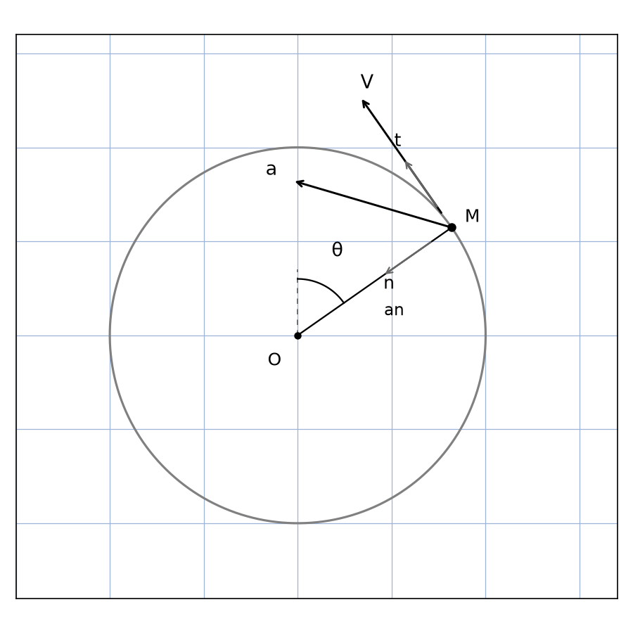

• V = dS/dt or S = θr d'où V = rθ̇ cad V⃗ = rθ̇ t⃗ [rouge + bleu]

• a⃗ = dV⃗/dt = d[rθ̇ t⃗]/dt [rouge + bleu]

= rθ̈ t⃗ + rθ̇ dt⃗/dt or dt⃗/dt = dt⃗/dθ × dθ/dt [bleu]

= rθ̈ t⃗ + rθ̇² d t⃗/dθ [bleu]

a⃗ = rθ̈ t⃗ + V²/r n⃗ avec { anc = V²/r = rθ̇² ; at = rθ̈ = dV/dt } [rouge + bleu — accolade]

## Page 107 (Pendule pesant + * Ieff ?)

* Pendule pesant [rouge, souligné]

Figure (crayon, en haut) : pendule, angles θ, tensions T, poids P.

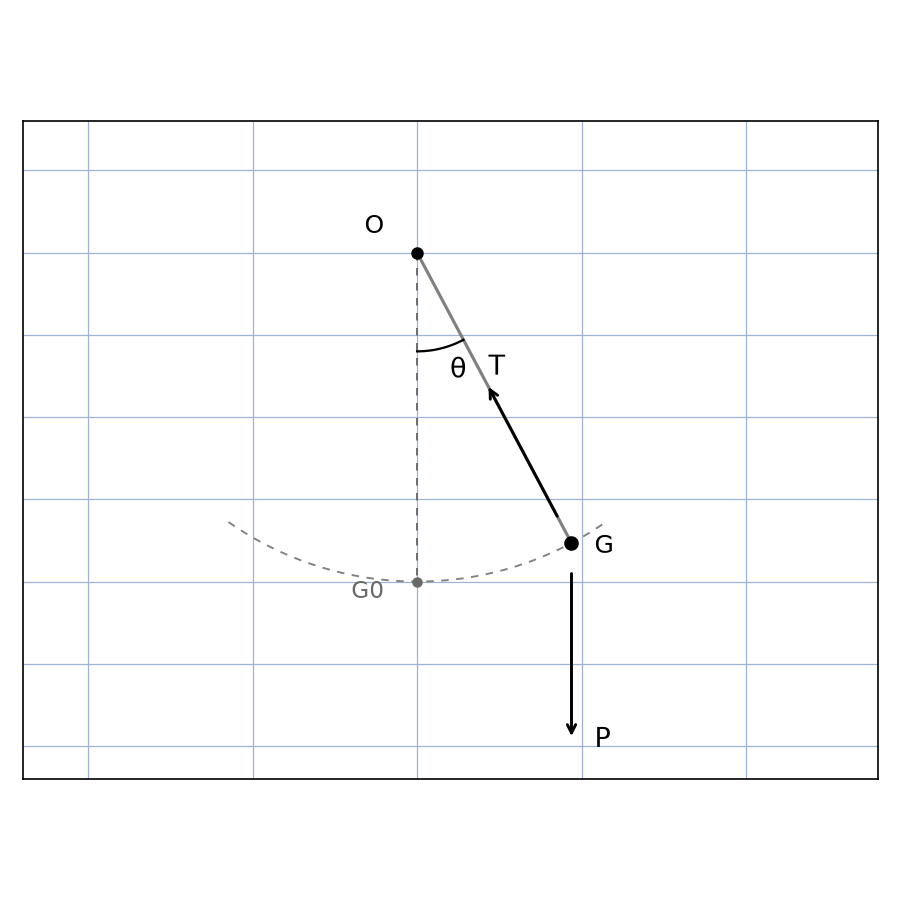

TCI : P⃗ + T⃗ = m a⃗ [bleu, souligné]

cad { -mg cosθ + T = m an ; -mg sinθ = m at } [bleu]

cad { V²/r = an = T/m - g cosθ ; lθ̈ = at = -g sinθ } d'où α = T/(ml) [bleu — « α = T/ml » tel quel en marge]

* Ieff = ? [rouge, souligné]

Soit un circuit électrique parcouru par un courant alternatif de période T. Soit une durée T de son fonctionnement. Ieff est telle que Ej = (Ieff)²×T×R = ∫₀ᵀ R(Im sin(ωt+φ))² dt [bleu — suite p.108]

## Page 108 (fin Ieff = Im/√2 + * suite arithmético-géométrique 22/02/2020)

Ieff² = 1/T ∫₀ᵀ [Im sin(ωt+φ)]² dt [bleu — haut]

= 1/T ∫₀ᵀ [Im sin(ωt+φ)]² dt car il [bleu — « car il » tel quel]

= Im²/(2T) ∫₀ᵀ [1 + cos(2ωt+2φ)/1] dt [bleu — fraction tel quel] périodique de période T

= Im²/(2T) × ∫₀ᵀ dt/T [tel quel] + 0 car t ↦ 1/2 cos(2ωt+2φ) [bleu] est périodique de période T/2

= Im²/(2T) × T [bleu]

Donc Ieff = Im/√2 [rouge]

22/02/2020 [bleu — date]

* ∀n∈IN, U₀∈IR, U_{n+1} = 2Uₙ+3 ; Uₙ = ?(n) [rouge, souligné]

Soit n∈IN*, [bleu]

Ona : U_{n+1} = 2Uₙ+3 ⇒ U_{n+1}/2^{n+1} = Uₙ/2ⁿ + 3/2^{n+1} [bleu]

∀K∈IN | 0≤K≤n-1, [bleu]

U_{K+1}/2^{K+1} = U_K/2^K + 3/2^{K+1} ⇒ Σ_{K=0}^{n-1} U_{K+1}/2^{K+1} = Σ_{K=0}^{n-1} U_K/2^K + Σ_{K=0}^{n-1} 3/2^{K+1} [bleu]

⇒ Σ_{K=0}^{n-1} U_{K+1}/2^{K+1} + Uₙ/2ⁿ = U₀/2⁰ + Σ_{K=1}^{n-1} U_K/2^K + [bleu — suite p.109]

## Page 109 (fin Uₙ = 2ⁿ(U₀+3)-3 + cas général U_{n+1} = aUₙ+b)

U_{K+1}/2^{K+1} = U_K/2^K + 3/2^{K+1} ⇒ Σ_{K=1}^{n-1} U_K/2^K + Uₙ/2ⁿ = U₀/2 + Σ_{K=1}^{n-1} U_K/2^K + 3 Σ_{K=1}^{n-1} 1/2^{K+1} + 3/2 [tel quel — haut, bleu]

⇒ Uₙ/2ⁿ = U₀ + 3 - 3/2ⁿ [bleu]

⇒ Uₙ = 2ⁿ(U₀+3) - 3 ∀n∈IN [rouge]

De façon générale pour toute suite (Uₙ) : ∀K∈IN (K∈IN) et ∀n∈IN, U_{n+1} = aUₙ+b (a,b)∈IR*×IR, a≠1 [rouge] on a : [flèche → avec n≥K] avec n≥K [rouge]

Soit i∈IN / K≤i≤n-1 avec n∈IN* n≥K+1 [bleu]

Ona : U_{i+1} = aU_i+b ⇒ U_{i+1}/a^{i+1} = U_i/a^i + b/a^{i+1} [bleu]

⇒ Σ_{i=K}^{n-1} U_{i+1}/a^{i+1} = Σ_{i=K}^{n-1} U_i/a^i + b Σ_{i=K}^{n-1} 1/a^{i+1} [bleu]

⇒ Σ_{i=K}^{n-1} U_{i+1}/a^{i+1} + Uₙ/aⁿ = U_K/a^K + Σ_{i=K+1}^{n-1} U_i/a^i + b Σ_{i=K}^{n-1} 1/a^{i+1} [bleu]

⇒ Uₙ/aⁿ = U_K/a^K + b×1/a^{K+1}× (1-(1/a)^{n-K})/(1-1/a) [bleu]

⇒ Uₙ/aⁿ = U_K/a^K + b(a-1)/a^K - b(a-1)/aⁿ [bleu — tel quel]

⇒ Uₙ = a^{n-K}[U_K + b/(a-1)] - b/(a-1) [rouge — suite p.110]

## Page 110 (Calculs 28/02/2021 + limite √(1+m)-√(1-m) / ln(1+m)-ln(1-m) = 1/2)

* Calculs [rouge, souligné] 28/02/2021 [bleu — date en haut à droite]

√2×√2 [raturé] e^{i ln √2 √2} [raturé] √2×1/√2 ln2 [raturé] = 2 [bleu + rouge — ligne très raturée]

i = e^{i ln i} = e^{i ln e^{iπ/2}} = e^{-π/2} [bleu + rouge — « = e^{-π/2} » en rouge]

On admet que ∀a,b∈C | Re(a), Re(b), Im(a), Im(b) [bleu — inachevé] m* et K∈Z, a = e^{b} ln d [tel quel] et ln e^{a+2Kπ} = a [bleu — tel quel]

lim_{m→0} [√(1+m)-√(1-m)]/[ln(1+m)-ln(1-m)] = lim_{m→0} 2m/[ln(1+m)-ln(1-m)] × 1/[√(1+m)+√(1-m)] [bleu]

= lim_{m→0} 2/[ (ln(1+m)-ln(1-m))/m ] × 1/[√(1+m)+√(1-m)] [bleu]

[terme raturé] = 2/[lim_{m→0} ln(1+m)/m + lim_{y→0} ln(1-y)/y] × lim_{m→0} 1/[√(1+m)+√(1-m)] où y = -m [bleu]

= 2/(1+1) × 1/2 [bleu]

lim_{m→0} [√(1+m)-√(1-m)]/[ln(1+m)-ln(1-m)] = 1/2 [rouge]

## Page 111 (lim (m/(m+1))ᵐ = e⁻¹ + U_{n+1} = ln(1+e^{Uₙ}) → Uₙ = ln(n+e^{U₀}) + lim cos)

• lim_{m→+∞} (m/(m+1))ᵐ = lim_{m→+∞} e^{m ln(m/(m+1))} [bleu]

= lim_{m→+∞} e^{-m ln(1+1/m)} [bleu]

= lim_{y→0⁺} e^{-ln(1+y)/y} où y = 1/m [bleu]

lim_{m→+∞} (m/(m+1))ᵐ = e⁻¹ [rouge]

• Exprimons en fonction de n le terme général de (Uₙ) : U₀∈IR et ∀n∈IN, U_{n+1} = ln(1+e^{Uₙ}) [bleu + rouge]

Posons Vₙ = e^{Uₙ} ∀n∈IN [bleu]

Ona : V_{n+1} = 1 + e^{Uₙ} = 1 + Vₙ [bleu]

ainsi ∀n∈IN, Vₙ = V₀ + n [bleu]

cad Uₙ = ln(V₀+n) [bleu]

Donc ∀n∈IN, U�ₙ = ln(n+e^{U₀}) [rouge]

• lim_{m→0} (cos 2m - 1)/(m²+2m²) [tel quel] = lim_{m→0} -1 sin²m/[m(m+2)] [bleu]

= lim_{m→0} -2/(m+2) × (sin m/m)² [bleu]

lim_{m→0} (cos 2m - 1)/(m²+2m²) = -1 [rouge]

## Page 112 (lim [ln(1+m)-m]/m² = -1/2 + (E) y' + y/(1+m²) = 0)

lim_{m→0} [ln(1+m)-m]/m² = ? [bleu — haut]

Posons f(m) = ln(1+m)-m et g(m) = m² ∀m∈]-1,+∞[ [bleu]

f et g sont dérivables sur ]-1,+∞[ et donc au voisinage de 0 [bleu]

lim ∀m∈]-1,+∞[, lim_{m→0} f(m)/g(m) = lim_{m→0} [f(m)-f(0)]/(m-0) × (m-0)/[g(m)-g(0)] [bleu]

cad lim_{m→0} [1/(1+m)-1]/(2m) = lim_{m→0} f'(m)/g'(m) [bleu]

cad lim_{m→0} -1/[2(1+m)] = lim_{m→0} [ln(1+m)-m]/m² [bleu]

Donc lim_{m→0} [ln(1+m)-m]/m² = -1/2 [rouge + bleu]

(E) : y' + 1/(1+m²) y = 0 (e) ∀m∈IR e^{arctan m} (y' + 1/(1+m²) y) = 0 [bleu]

⇔ ∀m∈IR e^{arctan m} y' + e^{arctan m}/(1+m²) y = 0 [bleu]

⇔ ∀m∈IR (y e^{arctan m})' = 0 [bleu]

⇔ ∀m∈IR y = K e^{-arctan m}, K∈IR [rouge — suite p.113]

## Page 113 ((E') + 06/03/2021 + * Remarques fonction définie par intégrale + Df = ?)

• (E') : y' + 2m/(1+m²) y = 1 et ∀m∈IR (1+m²)y' + 2m y = (1+m²) [bleu — haut]

⇔ ∀m∈IR [(1+m²)y]' = [m + 1/3 m³]' [bleu]

⇔ ∀m∈IR y = m/(1+m²) + 1/3 m³/(1+m²) + C/(1+m²), C∈IR [rouge]

06/03/2021 [bleu — date]

* Remarques sur une fonction définie par intégrale [rouge, souligné]

Soit la fonction F(x) = ∫_{u(x)}^{v(x)} f(t) dt où u, v, f sont des fonctions d'ensembles de définition respectifs Du, Dv et Df [bleu]

* Df = ? [rouge, souligné]

x∈Df ⇔ { x∈Du∩Dv ; [u(x), v(x)] ou [v(x), u(x)] ⊂ Df } [bleu]

Donc Df = Du∩Dv∩{ x∈Du∩Dv | [u(x), v(x)] ou [v(x), u(x)] ⊂ Df } [rouge — première forme]

Donc Df = { x∈Du∩Dv | [u(x), v(x)] ou [v(x), u(x)] ⊂ Df } [rouge — seconde forme, suite p.114]

## Page 114 (Ex F(x) = ∫ 1/(1+t) dt, piège prolongement, F(-3/4) = -∞+∞ FI)

Ex : Soit F(x) = ∫_{m}^{…} 1/(1+t) dt [bleu — borne haute coupée]

À première vue ça serait erroné d'écrire F(x) = ln|1+2x|-ln|1+x| et donc affirmer que Df = IR\{-1,-1/2} car l'expression obtenue par simplification est un prolongement de F [bleu + rouge pour « Df = IR\{-1,-1/2} »]

Pour mieux comprendre en prenant x = -3/4 on serait tenté de dire que F y est définie et donc F(-3/4) = ln|1-3/2|-ln|1-3/4| = ln 2 [bleu]

L'affaire est d'autant plus subtile qu'en réalité on aurait plutôt F(x) = ∫_{-3/4}^{-1} 1/(1+t) dt + ∫_{-1}^{-3/2} 1/(1+t) dt car x ↦ 1/(1+x) n'est pas définie en -1 [bleu]

= lim_{a→-1} ∫_{-3/4}^{a} 1/(1+t) dt + ∫_{a}^{-3/2} dt/(1+t) [bleu]

= lim_{a→-1} ln|1+a|-ln|1-3/4|+ln|1-3/2|-ln|1+a| [bleu]

= -∞ + ln 2 + ∞ [bleu]

F(-3/4) = -∞ + ∞ → FI [rouge — suite p.115]

## Page 115 (fin Df Ex + * Df' = ?)

Ainsi en se fixant à la propriété précédente, x∈Df ⇔ { x∈IR ; [x,2x] ou [2x,x] ⊂ IR\{-1} } [bleu — haut, tel quel]

- pour x∈IR₊, il faut que [x,2x] ⊂ IR\{-1}, toujours vrai [bleu]

- pour x∈IR₋, il faut que -1 ∉ [x,2x] [bleu]

or 1∈[x,2x] [tel quel] ⇔ x∈[-1,-1/2] [bleu]

c ainsi -1 ∉ [x,2x] ⇔ x∈IR₋\[-1,-1/2] [bleu — tel quel]

Donc il serait plus logique d'écrire Df = IR\{-1,-1/2} et on comprend alors pourquoi F n'est pas définie en -3/4 [rouge + bleu]

* Df' = ? [rouge, souligné]

x∈Df' ⇔ { x∈Df ; x∈Du'∩Dv' et [u(x),v(x)] ∈ Df } [bleu]

Donc Df' = { x∈Du'∩Dv' | [u(x),v(x)] ou [v(x),u(x)] et u(x),v(x)∈Df } [rouge — bas coupé, suite p.116]

## Page 116 (* Remarque primitive H + * I = ∫₀^π x sin x/(1+cos x) dx)

* Remarque : En considérant H, une primitive de f sur Df en supposant que f y est continue, l'écriture F(x) = H(v(x))-H(u(x)) n'a de sens que sur Df même si elle prendrait des valeurs pour des x∉Df. En fait elle peut parfois correspondre à un prolongement par continuité de la fonction F sur un ensemble plus vaste que Df à l'exemple de celui défini par E = { x∈Du∩Dv | u(x),v(x)∈Df } qui contient bien Df [bleu + rouge]

07/03/2021 [bleu — date]

* I = ? [rouge, souligné]

I = ∫₀^π x sin x/(1+cos x) dx [bleu]

= ∫₀^π (π-t) sin t/(1+cos t) dt où x = π-t [bleu]

I = ∫₀^π π sin t/(1+cos t) dt - I [bleu — suite p.117]

## Page 117 (fin I = π²/4 + * intégrale tan + * cos¹⁰⁰+sin¹⁰⁰ Meth1 début)

cad J = π/2 ∫₀^π sin x/(1+cos²) [tel quel] (dx/sin x) où u = cos t [bleu — haut, tel quel]

= π/2 [tan⁻¹ u]₀^π [tel quel] [bleu]

Donc I = ∫₀^π x sin x/(1+cos x) dx = π²/4 [rouge]

* ∀t∈C(h) ∫dt+ln|t|, cos t/(1+tan(t/2)) [tel quel] [rouge — ligne pâle]

10/03/2021 [bleu — date]

* cos¹⁰⁰ x + sin¹⁰⁰ x = Δ / etc ! [rouge, souligné — « Δ/etc » tel quel]

- Meth1 : [rouge, souligné]

Ona : ∀x∈IR, {|cos x|≤1 ; -1≤sin x≤1} ⇒ { cos x ≤ 1 ; sin x ≤ 1 } [bleu]

⇒ { cos⁹⁸ x ≤ 1 ; sin⁹⁸ x ≤ 1 } [bleu]

⇒ { cos¹⁰⁰ x ≤ cos² x ; cos¹⁰⁰ x ≤ sin² x [tel quel, 2e ligne « cos » pour « sin »] } [bleu]

Si ne serait-ce qu'une seule de ces inégalités était stricte, [bleu — suite p.118]

## Page 118 (fin Meth1 S = {kπ/2} + Meth2 début)

alors on aurait cos¹⁰⁰ x + sin¹⁰⁰ x < cos² x + sin² x [bleu — haut]

cad cos¹⁰⁰ x + sin¹⁰⁰ x < 1 et donc pas de solution [bleu]

ainsi le seul cas envisageable est { cos¹⁰⁰ x = cos² x ; sin¹⁰⁰ x = sin² x } [bleu]

cad { cos² x = 0 ou cos⁹⁸ x = 1 ; sin² x = 0 ou sin⁹⁸ x = 1 } [bleu]

cad { cos x = 0 ou cos x = 1 ou -1 ; sin x = 0 ou sin x = 1 ou -1 } [bleu]

Donc S = { kπ/2, k∈Z } [rouge]

- Meth2 : [rouge, souligné]

Ona : ∀x∈IR, cos² x + sin² x = 1 [bleu]

cad cos x + sin x + Σ_{i=1}^{49} C₅₀ⁱ (cos x)^{100-2i} (sin x)^{2i} = 1 [bleu — tel quel]

ainsi si x est solution de (E) on a cos¹⁰⁰ x + sin¹⁰⁰ x = 1 [bleu]

on obtient alors Σ_{i=1}^{49} C₅₀ⁱ x tan x × (cos x)^{100} = 0 [bleu — tel quel, suite p.119]

## Page 119 (fin Meth2 S + * I = ∫ e^{-x²} Intégrale Gaussienne début)

cad cos¹⁰⁰ x = 0 ou Σ_{i=1}^{49} C₅₀ⁱ (tan x)^{2i} = 0 [bleu — haut]

cad cos x = 0 ou C₅₀ⁱ (tan x)^{2i} = 0 ∀i∈[1,49] car les termes sont tous positifs [bleu]

cad cos x = 0 ou tan x = 0 [bleu]

Donc S = { kπ/2, k∈Z } [rouge + bleu]

* I = ∫_{-∞}^{+∞} e^{-x²} dx = ? (Intégrale Gaussienne) [rouge, souligné]

Ona : I² = ∫_{-∞}^{+∞} e^{-x²} dx × ∫_{-∞}^{+∞} e^{-y²} dy [bleu]

= ∫_{-∞}^{+∞}∫_{-∞}^{+∞} e^{-(x²+y²)} dxdy [bleu]

Posons r² = x²+y², x = r cosθ, y = r sinθ [bleu — « y = r sinθ » pâle]

Montrons que dxdy = rdrdθ [bleu]

- Meth1 : [rouge, souligné] schema axes (x, y), rectangle dx×dy + Jacobien dA/dx [rouge] (suite p.120).

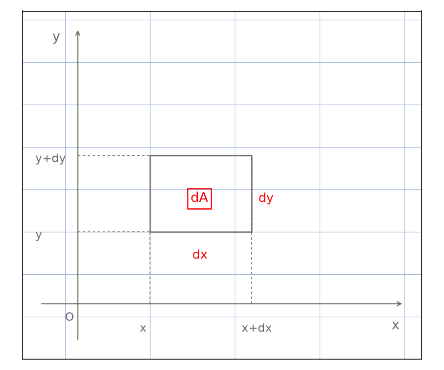

## Page 120 (Meth1 fin dxdy = rdrdθ, Meth2 début)

Schema haut : dA/dr, rdθ — Jacobien polaire.

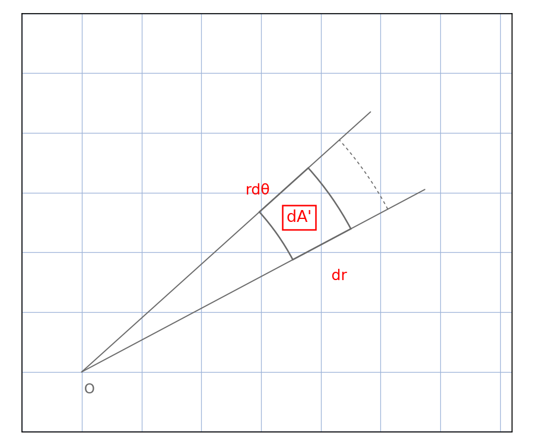

Le changement de variable devant conserver les propriétés initiales, ona dA = dA' [bleu + rouge]

Ona dA' = dθ/(2π) × π(r+dr)² - dθ/(2π) × πr² [bleu — tel quel]

= dθ/2 (dr² + 2rdr) [bleu]

dr étant infiniment petit dr² l'est encore plus et est donc négligeable devant dθ et rdr. Autrement dit dA' correspond à l'aire d'un rectangle de côtés dr et rdθ à l'échelle infinitésimale et donc dA' = rdrdθ [bleu + rouge]

Par conséquent dxdy = rdrdθ [rouge + bleu]

- Meth2 [rouge, souligné — suite p.121]

## Page 121 (Meth2 fin dxdy = rdrdθ + I² = π)

Ona : x = r cosθ, y = r sinθ [bleu — haut]

pour une variable quelconque t, dx/dt = dr/dt cosθ - r sinθ dθ/dt ⇒ dx = dr cosθ - r sinθ dθ [bleu]

dy/dt = dr/dt sinθ + r cosθ dθ/dt ⇒ dy = dr sinθ + r cosθ dθ [bleu]

Par extrapolation dx⃗ = dr⃗ cosθ - r⃗ sinθ dθ [bleu — vecteurs]

dy⃗ = dr⃗ sinθ + r⃗ cosθ dθ [bleu]

or dx⃗∧dy⃗ = dr⃗∧dr⃗ cos²θ dθ - r⃗ dr⃗ sinθ cosθ dθ [tel quel, raturé] = cosθ sinθ dx⃗∧r⃗ + sin²θ dθ dx⃗∧r⃗ [bleu — tel quel, raturé]

dx⃗∧dy⃗ = r dr⃗∧dθ⃗ [bleu]

d'où |dx⃗∧dy⃗| = |r dr⃗∧dθ⃗| [bleu — raturé]

d'où dx×dy×cos 90 = dθ×dr×r×cos 90 [bleu — tel quel]

Donc dxdy = rdrdθ [rouge + bleu — raturé « extrême… »]

Alors I² = ∫₀^{2π}∫₀^{+∞} e^{-r²} rdrdθ [bleu]

= ∫₀^{2π} -1/2 [e^{-r²}]₀^{+∞} dθ [bleu — suite p.122]

## Page 122 (fin I = √π + autre approche géométrique cylindres creux)

I² = +1/2 ∫₀^{2π} dθ [bleu — haut]

= 1/2 [θ]₀^{2π} [bleu]

I² = π [bleu]

Donc ∫_{-∞}^{+∞} e^{-x²} dx = √π [rouge]

Ps Une autre approche géométrique consisterait à construire dans l'espace la représentation de la fonction (x,y) ↦ e^{-(x²+y²)} x,y∈IR. ainsi I² correspond alors au volume délimité par cette surface et le plan z = 0. Or en découpant ce volume en petits cylindres creux d'épaisseur dr, de rayon r et de hauteur e^{-r²} où r² = x²+y², on obtient alors I² = ∫₀^{+∞} 2πr e^{-r²} dr car ces cylindres d'épaisseur infinitésimale petite sont assimilables comme suit : [bleu + rouge — suite p.123]

## Page 123 (fin cylindres + * Aₙ = ? long chemin 14/03/2021)

Schemas : cylindre creux rayon r hauteur e^{-r²}, déroulé 2πr.

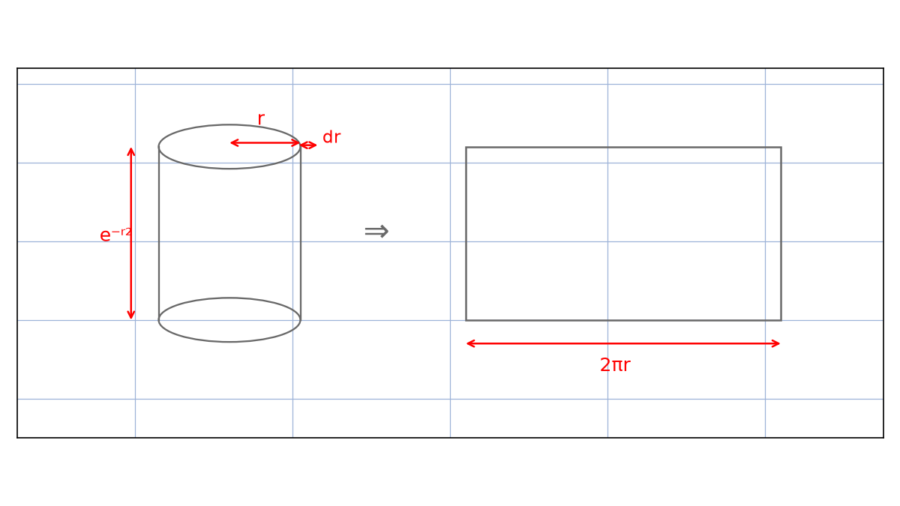

ainsi, I² = -π [e^{-r²}]₀^{+∞} = π [bleu]

Donc ∫_{-∞}^{+∞} e^{-x²} dx = √π [rouge + bleu]

* Aₙ = ? (long chemin) [rouge, souligné] 14/03/2021 [bleu — date]

Schema triangle ABC, point intérieur, sous-aires A₁ A₂ A₃ A₄, longueurs m y x' t z b' d c.

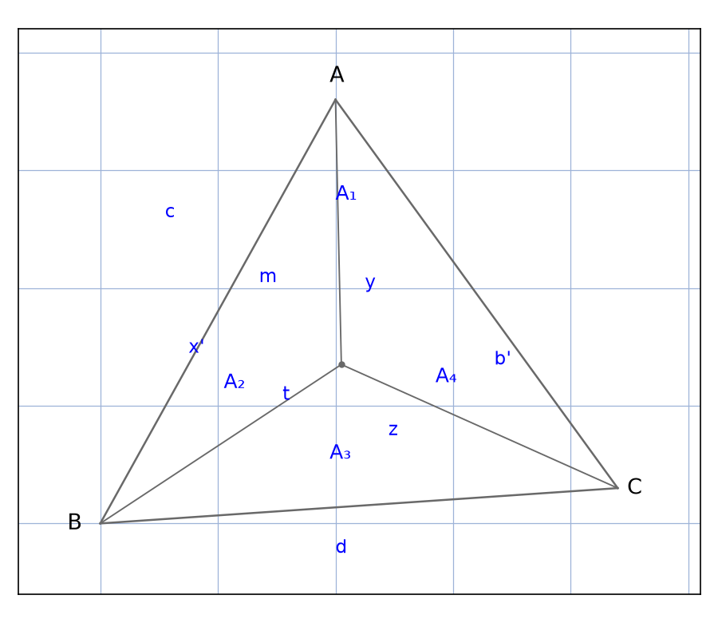

Ona : A₁ = A_T - A₂ - A₃ - A₄ [bleu]

De plus A_T = 1/2 a c sin B̂ or c/sin Ĉ = y/sin(B̂+Ĉ) [bleu]

d'où A_T = 1/2 a² sin Ĉ sin B̂ / (sin B̂ cos Ĉ + sin Ĉ cos B̂) [bleu — suite p.124]

## Page 124 (A₃+A₄, A₂+A₃, cos, sin d)

A₃+A₄ = 1/2 b' d sin Ĉ ⇔ sin Ĉ = 2(A₃+A₄)/(d b') [bleu — haut]

A₂+A₃ = 1/2 c' d sin B̂ ⇔ sin B̂ = 2(A₂+A₃)/(d c') [bleu]

cos B̂ = [d²+c'²-(m+z)²]/(2 d c') cos Ĉ = [d²+b'²-(y+t)²]/(2 d b') [bleu]

max A_T = 2(A₃+A₄)(A₂+A₃)d² / [(A₂+A₃)(d²+b'²-(y+t)²) + (A₃+A₄)(d²+c'²-(m+z)²)] [bleu — tel quel]

• sin d = 2A₂/(x t) = 2A₄/(y z) = 2A₃/(t z) (1) [bleu]

cad y t = A₄/A₃ × t² et x z = A₂/A₃ × z² [bleu]

• cos d = (x²+t²-c'²)/(2 x t) = (y²+z²-b'²)/(2 y z) = (d²-t²-z²)/(2 t z) (2) [bleu]

(1)/(2) ⇒ A₂/(x²+t²-c'²) = A₄/(y²+z²-b'²) = A₃/(d²-t²-z²) [bleu]

⇒ [raturé b'² y² …] A₂/(x²+t²-c'²) [bleu — raturé]

⇒ b'² - y² = -A₄/A₃ (d²+t²-z²) + z² [bleu]

et c'² - x² = -A₂/A₃ (d²-t²-z²) + t² [bleu — suite p.125]

## Page 125 (fin A_T = A₃(A₂+A₃)(A₃+A₄)/(A₃²-A₂A₄) + A₁)

ainsi A_T = 2d²(A₃+A₂)(A₃+A₄) / [(A₂+A₃)(d² - A₄/A₃(d²-t²-z²) + z² - t² - 2t A₄/A₃) … + (A₃+A₄)(d² - A₂/A₃(d²-t²-z²) + t² - 2z A₂/A₃)] [bleu — très raturé, tel quel]

= 2d²(A₂+A₃)(A₃+A₄) / [(A₂+A₃)(d²+z² - A₄/A₃(d²+t²-z²)) + … (A₃+A₄)(d²+t²-z² - A₂/A₃(d²+t²-z²))] [bleu — tel quel]

= 2d²(A₂+A₃)(A₃+A₄) / [d²((A₂+A₃)(A₃-A₄)/A₃ + (A₃+A₄)(A₃-A₂)/A₃) + … z²-t²|(A₂+A₃)(A₃+A₄)/A₃ - (A₃+A₄)(A₃+A₂)/A₃] [bleu — tel quel]

= 2d²A₃(A₂+A₃)(A₃+A₄) / [d²(2A₃²-2A₂A₄)] [bleu]

D'où A_T = A₃(A₃+A₂)(A₃+A₄)/(A₃²-A₂A₄) [rouge]

On peut même déduire que cette construction réalisable ssi (A₂,A₃,A₄)≠(0,0,0) et A₃² > A₂A₄ [bleu + rouge]

Dans de telles conditions, A₁ = A₂A₄(2A₃+A₂+A₄)/(A₃²-A₂A₄) [rouge — suite p.126]

## Page 126 (Application A₂=2009, A₃=2010 + * Démonstration π < 22/7 16/03/2021)

Application Pour A₂ = 2009, A A₂ = A₃-1, A₄ = A₃+1, A₃∈IR₊*, les conditions en amont sont vérifiées, ainsi A_T = A₃(4A₃²-1) et A₁ = 4(2A₃-1)(A₃²-1) [bleu — « A A₂ » tel quel]

Dans le cas où A₃ = 2010 on p.q A_T = 2010(4×2010²-1) ≃ 3,248×10¹⁰ u.a [rouge + bleu]

A₁ = 2×[raturé 2×2010×…] [rouge — raturé]

A₁ = 4×20101(2010²-1) ≃ 3,24823952×100 u.a [rouge — tel quel]

* Démonstration π < 22/7 [rouge, souligné] 16/03/2021 [bleu — date]

Soit I = ∫₀¹ x⁴(1-x)⁴/(1+x²) dx [bleu]

= ∫₀¹ (x⁸-4x⁷+6x⁶-4x⁵+x⁴)/(1+x²) dx [bleu]

= ∫₀¹ x⁶-4x⁵+5x⁴-4x²+4 - 4/(x²+1) dx [bleu]

= [1/7 x⁷ - 2/3 x⁶ + x⁵ - 4/3 x³ + 4x - 4tan⁻¹x]₀¹ [bleu]

I = 22/7 - π [rouge — suite p.127]

## Page 127 (fin π < 22/7 + * K Cₙᵏ = n Cₙ₋₁ᵏ⁻¹ 23/03/2021)

or ∀x∈]0,1[, x⁴(1-x)⁴/(1+x²) ≥ 0 ⇒ I ≥ 0 [bleu — haut]

Donc π ≤ 22/7 [rouge]

* ∫tanⁿ x = Iₙ [rouge, souligné — grand calcul raturé en X]

Ona ∀n∈IN* [raturé] Iₙ = ∫tanⁿ … [bleu — entièrement raturé, illisible]

23/03/2021 [bleu — date]

* K Cₙᵏ = n Cₙ₋₁ᵏ⁻¹ avec K≥1 K∈IN [rouge, souligné]

Ona : K Cₙᵏ = K×n×(n-1)! / [K!×(n-1-(K-1))!] [bleu]

= n×(n-1)! / [(K-1)!×(n-1-(K-1))!] [bleu]

K Cₙᵏ = n Cₙ₋₁ᵏ⁻¹ [rouge]

Application : Soit S₅₀₀ = 1/2⁵⁰⁰ Σ_{K=0}^{500} K C₅₀₀ᵏ [rouge + bleu — suite p.128]

## Page 128 (fin S₅₀₀ = 250 + * Relation aire-longueur + * Suite début)

Ona S₅₀₀ = 1/2⁵⁰⁰ Σ_{K=1}^{500} 500 C₄₉₉^{K-1} [bleu — haut]

= 500/2⁵⁰⁰ × Σ_{K=0}^{499} C₄₉₉ᵏ [bleu]

= 500/2⁵⁰⁰ × 2⁴⁹⁹ [bleu]

S₅₀₀ = 250 [rouge]

* Relation aire-longueur [rouge, souligné]

Figure (crayon) : triangle BB'C avec point A', hauteurs h₁ h₂ angle α. [À reproduire en passe FORME : `lab/scripts/reproduce_triangle_hauteurs.py` → `assets/triangle-hauteurs.png`.]

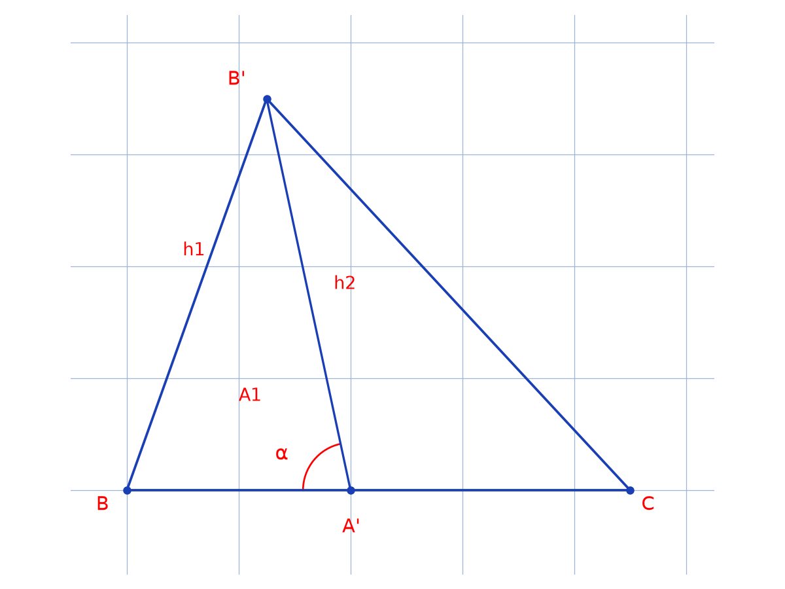

Ona : A₁ = A'B×B'A' sin α / 2 [bleu]

A₂ = A'C×A'A sin(π-α)/2 [bleu]

Donc A₁/A₂ = AB/A'C [rouge]

* Suite [rouge, souligné]

A = Σ_{i=2}ⁿ (i²+1)/(i²-1) [bleu]

= Σ_{i=2}ⁿ (1 + 2/(i²-1)) [bleu]

= n-1 + 2 Σ_{i=2}ⁿ 1/(i²-1) [bleu — suite p.129]

## Page 129 (fin A = 1/2+n-1/n-1/(n+1) + système Z⁴ Cas 1 début)

A = n-1 + Σ_{i=2}ⁿ 1/(i-1) + 1/(i+1) [bleu — haut, tel quel]

= n-1 + 1-1/3 + 1/2-1/4 + 1/3-1/5 + … + 1/(n-3)-1/(n-1) + 1/(n-2)-1/n + 1/(n-1)-1/(n+1) [bleu]

= n + 1/2 - 1/n - 1/(n+1) [bleu]

Donc Σ_{i=2}ⁿ (i²+1)/(i²-1) = 1/2 + n - 1/n - 1/(n+1) [rouge]

* { xz - 2yt = 3 (1) ; xt + yz = 1 (2) } dans Z⁴ [rouge + bleu]

⇒ { x²z² + 4y²t² - 4xyzt = 3 [tel quel] ; 2x²t² + 2y²z² + 4xyzt = 1 [tel quel] } [bleu]

x²(z²+2t²) + 2y²t² + 2t²t [tel quel] [bleu]

cad (z²+2t²)(x²+2y²) = 11 [bleu]

• Cas 1 : (5) { z²+2t² = 1 ; x²+2y² = 11 } ⇒ { z = 1 t = 0 ; x² = 1 y = 3 ou -3 } [bleu — tel quel, raturé, suite p.130]

## Page 130 (Cas 1 fin + Cas 2 + S_Z⁴ + * I = ∫ dx/√(x-√x) 25/03/2021)

(5) ⇒ { (z = 1 ou z = -1) et t = 0 ; (x = 3 ou x = -3) et (y = 1 ou y = -1) } [bleu — haut]

or t = 0 ainsi (1) ⇒ xz = 3 | ainsi x, y, z sont de même signe [bleu]

(2) ⇒ yz = 1 | [bleu]

on déduit alors que (x,y,z,t) ∈ {(3,1,1,0),(-3,-1,-1,0)} [bleu]

Cas 2 (5) : { z²+2t² = 11 ; x²+2y² = 1 } ⇒ { z² = 9 et t² = 1 ; x² = 1 y = 0 } [bleu]

or y = 0 ainsi (1) ⇒ xz = 3 | ainsi x, y, z, t sont de même signe [bleu]

(2) ⇒ xt = 1 | [bleu]

on déduit alors que (x,y,z,t) ∈ {(1,0,3,1),(-1,0,-3,-1)} [bleu]

Donc S_Z⁴ = {(3,1,1,0),(-3,-1,-1,0),(1,0,3,1),(-1,0,-3,-1)} [rouge]

25/03/2021 [bleu — date]

* I = ? [rouge, souligné]

I = ∫ dx/√(x-√x) = [bleu]

= ∫ (|2t-1|+1)/√(t²-t) dt où t = √x ⇒ dt/dx = 1/(2t) [bleu]

= ∫ (|2t-1|/√(t²-t) + 1/√(t²-t²-t)) dt [bleu — tel quel, suite p.131]

## Page 131 (fin I = 2√(x-√x) - ln|2√x-1-2√(x-√x)| + * Notion continued)

or J = ∫ 1/√(t²-1/2 t - 1/4) dt [bleu — haut]

= ∫ 1/√((t-1/2)²-1/4) × (t-1/2+√((t-1/2)²-1/4))/(1-1/2+√((t-1/2)²-1/4)) [bleu — tel quel]

= ∫ (1 + (1-1/2)/√((t-1/2)²-1/4))/(1-1/2+√((t-1/2)²-1/4)) dt [bleu]

Ainsi J = 2√(t²-t) + ln|1+t-1/2+√(t²-t)| [bleu]

= 2√(x-√x) + ln|√x-1/2+√(x-√x)| [bleu]

= 2√(x-√x) + ln|1/4 / (√x-1/2-√(x-√x))| [bleu]

I = 2√(x-√x) - ln|4√x-2-4√(x-√x)| [rouge]

[raturé 2√(x-√x)] [bleu — raturé]

I = 2√(x-√x) - ln|2√x-1-2√(x-√x)| [rouge]

* Notion continue ? [rouge, souligné — « continue ? » tel quel]

J = ∫ 1/√(x²-a²) dx = ∫ 1/√(x²-a²) × (x+√(x²-a²))/(x+√(x²-a²)) dx [bleu]

= ∫ (1 + 2x/(2√(x²-a²)))/(x+√(x²-a²)) dx [bleu — suite p.132]

## Page 132 (fin J = ln|x+√(x²-a²)| + * x²+x+1 ≡ 0 [49] [6] 22/04/2021)

Donc I = ∫ 1/√(x²-a²) dx = ln|x+√(x²-a²)| ∀x,a∈IR [rouge — haut]

22/04/2021 [bleu — date]

* x²+x+1 ≡ 0 [49] [6] x∈Z [rouge, souligné]

[5] ⇒ x²+x+1 ≡ 0 [7] [bleu]

⇒ x²+x-6 ≡ 0 [7] [bleu]

⇒ (x+3)(x-2) ≡ 0 [6] [tel quel] [bleu]

⇒ x ≡ -3 [7] ou x ≡ 2 [7] [bleu]

⇒ x ≡ 4 [7] ou x ≡ 2 [7] [bleu]

Réciproquement [bleu]

• x ≡ 4 [7] ⇒ x = 7K+4 K∈Z [bleu]

⇒ (7K+4)²+(7K+4)+1 ≡ 0 [49] [bleu]

⇒ 49K²+63K+21 ≡ 0 [49] [bleu]

⇒ 0+14K+28 ≡ 0 [49] [bleu]

⇒ [raturé 14K ≡ 28 [49]] [bleu — raturé]

⇒ 14(K-2) ≡ 0 [49] [bleu]

⇒ K ≡ 2 [7] d'où K = 2+7K', K'∈Z [bleu — suite p.133]

## Page 133 (fin S₄₉ + * Cₙᵖ = 1984 début)

d'où x = 49K'+18 K'∈Z [rouge — haut]

• x ≡ 2 [7] ⇒ x = 7K''+2, K''∈Z [bleu]

⇒ (7K''+2)²+7K''+2+1 ≡ 0 [49] [bleu]

⇒ 49K''²+35K''+7 ≡ 0 [49] [bleu]

⇒ 0+7(5K''+1) ≡ 0 [49] [bleu]

⇒ 5K'' ≡ 6 [7] [bleu]

⇒ 15K'' ≡ 18 [7] ≡ 4 [7] [bleu]

⇒ K'' = 4+7K''', K'''∈Z [bleu]

ainsi x = 49K'''+30 K'''∈Z [rouge]

Donc S₄₉ = {49K+r, K∈Z, r∈{18,30}} [rouge]

* Cₙᵖ = 1984 p,n∈IN* / p≤n [rouge, souligné]

Si Cₙᵖ est solution alors Cₙ^{n-p} = Cₙᵖ est aussi solution. On pourra donc se limiter au cas où p≤n/2 [bleu]

[pour p = n/2 n est / pair [raturé] n²+1 > 0 ⇒ n+1 > n/2+1 [bleu — raturé, suite p.134]

## Page 134 (Cₙᵖ = 1984 suite majorations)

Ona : n! = p!(n-p)! × 2⁶×3×1 [?] [rouge + bleu — haut, « [E] »]

or 31 est 1er ainsi n ≥ 31 [rouge + bleu]

- pour p = n/2, n est pair d'où n ≥ 32 [bleu]

or 3n²/4 + 2n+1 > 1 ⇒ (n+2)(n+1)/((n/2+1))² > 1 [bleu — tel quel]

⇒ (n+2)!/((n+2)/2)!² > n!/(n/2)!² [bleu]

⇒ C_{n+2}^{(n+2)/2} > Cₙ^{n/2} [bleu]

or C₃₂¹⁶ = 601080390 > 1984 ainsi n < 32 d'où [contradiction] [bleu + rouge]

- pour p ≤ (n-1)/2 ⇒ n-p ≥ p+1 [bleu]

⇒ (n-p)/(p+1) × p!/(p!(n-p)!) ≥ p!/(p!(n-p)!) [bleu — tel quel]

⇒ Cₙ^{p+1} ≥ Cₙᵖ [rouge]

De plus, p ≥ 1 ⇒ (n+1)/(n+1-p) > 1 [bleu]

⇒ (n+1)!/((n+1-p)!p!) > n!/((n-p)!p!) [bleu]

⇒ C_{n+1}ᵖ > Cₙᵖ [rouge — suite p.135]

## Page 135 (fin Cₙᵖ = 1984 → S = {(1984,1),(1984,1983)} + * Étude chaînette 12/05/2021 début)

or C₉¹ = 4495 > 1984 ainsi p ≤ 2 [bleu — haut]

- pour p = 2, (E) ⇔ n(n-1)(n-2)! = 2(n-2)!×2⁶×31 [bleu — tel quel]

⇔ n(n-1) = 2²×31 [bleu]

⇔ n ≃ 63,49 ou n ≃ -62,49 [rouge — « [Abandon] »]

- pour p = 1, (E) ⇔ n(n-1)! = (n-1)!×2⁶×31 [bleu — tel quel]

⇔ n = 1984 [rouge]

Donc S_{IN*²} = {(1984,1),(1984,1983)} [rouge]

* Étude d'une chaînette [rouge, souligné] 12/05/2021 [bleu — date]

Soient 2 montants de longueur H fixés perpendiculairement à la surface terrestre, supposés plans en ce lieu et distants d'une distance D. on laisse pendre une corde parfaite et homogène entre ces 2 montants en fixant ses extrémités chacune des extrémités supérieures des 2 montants. Notons h, la distance entre le sol et le point le plus bas de la corde. soit de [bleu — inachevé, suite p.136]

## Page 136 (chaînette repère + découpage + notations M T)

repère orthonormé (O,i⃗,j⃗) où O est le pt le plus bas de la corde et i⃗ est défini comme vecteur unitaire normal aux droites supports des 2 montants, représente ce suit : [bleu — haut]

Figure (crayon) : chaînette (C), hauteur H, sol. [À reproduire en passe FORME : `lab/scripts/reproduce_chainette_sol.py` → `assets/chainette-sol.png`.]

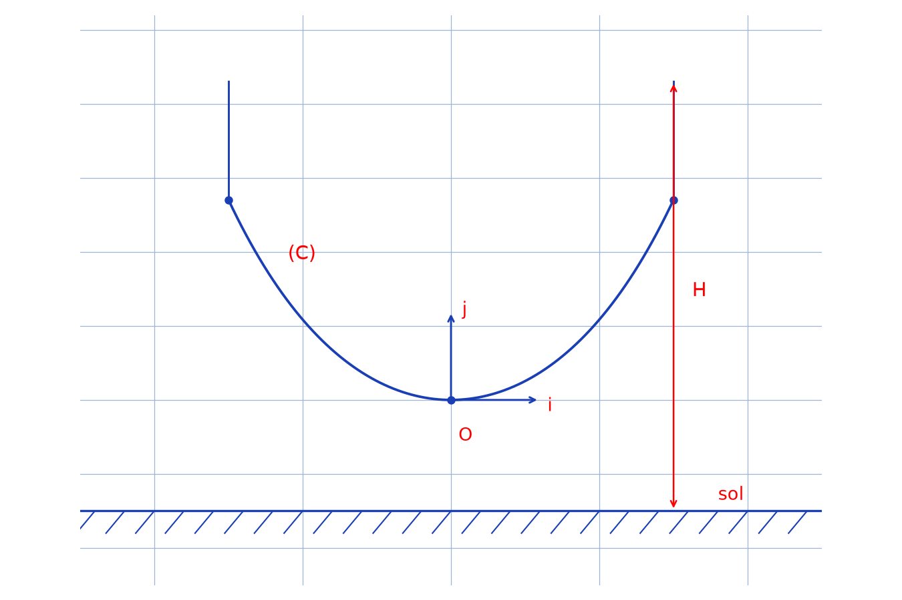

On découpe le plan d'étude en une infinité de rectangles verticaux de longueur infinie et de largeur dx→0 à partir de O dans le sens de i⃗ et de -i⃗. On suppose un morceau de corde quelconque compris dans l'un de ces rectangles [bleu]

Figure (crayon, bas) : morceau T(x+dx), P(x), angle α, dx. [À reproduire en passe FORME : `lab/scripts/reproduce_chainette_equilibre.py` → `assets/chainette-equilibre.png`.]

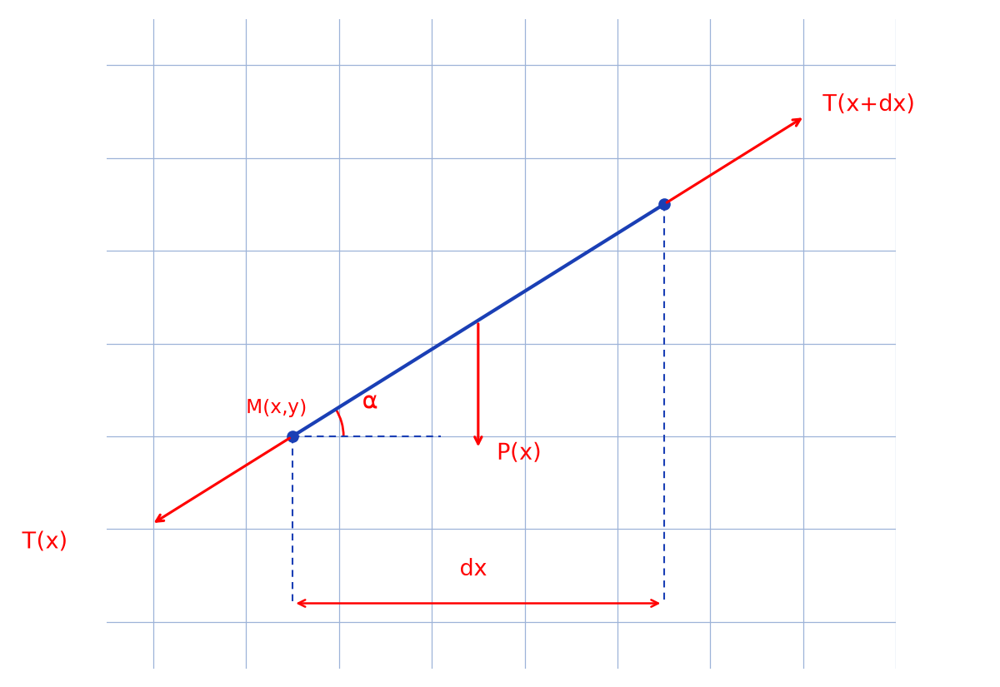

On note les pts M(x,y) de (C) où -D/2 ≤ x ≤ D/2 et 0≤y≤H-h [bleu]

On notera T⃗(x) la force de tension dirigée vers le haut s'exerçant en M [bleu — suite p.137]

## Page 137 (chaînette équilibre P+T(x)+T(x+dx)=0 → T'y = λg√(1+y'²))

Pour tout M(x,y) ∈ (C) on définit les forces P⃗(x), -T⃗(x) et T⃗(x+dx) [bleu — haut, « le pro… » coupé] comme indiqué sur le schéma qui maintient la portion de corde succédant ce pt en équilibre [bleu]

- ainsi P⃗(x) + T⃗(x) + T⃗(x+dx)⃗ = 0⃗ [bleu]

cad { -T(x)ₓ + T(x+dx)ₓ = 0 (1) ; -P(x) + T(x+dx)_y + T(x)_y [tel quel] = 0 (2) } [bleu]

or P(x) = λ dl g où λ est la masse linéique de la corde [bleu]

or dl² = dx²+dy² ⇒ dl/dx = √(1+y'²(x)) [bleu]

(1) ⇒ T(x)_{x} = T(x+dx)_{x} [bleu]

(2) ⇒ [T(x+dx)_y - T(x)_y]/dx = λg dl/dx = λg√(1+y'²(x)) [bleu]

⇒ T'(x)_y = λg√(1+y'²(x)) (3) [bleu]

or T(x)_y/T(x)_x = y'(x) T(x+dx)_y/T(x+dx)_x = y'(x+dx) = T(x+dx)_y/T(x+dx)_x [bleu — tel quel]

d'où 1/T(x)_x [T(x+dx)_y - T(x)_y] = y'(x+dx)-y'(x) [bleu — suite p.138]

## Page 138 (fin chaînette y = 1/a(cosh(ax)-1), (E) a(H-h) = cosh(Da/2)-1)

cad 1/T(x)_x T'(x)_y = y''(x) [bleu — haut]

(3) ⇒ T(x)_x y''(x) = λg√(1+y'²(x)) [bleu]

or ∀x∈[-D/2,D/2], T(x)_x = T(x+dx)_x ainsi T(x)_x est constant. posons alors a = λg/T(x)_x ∈IR₊* [bleu]

(3) ⇒ y''(x)/√(1+y'²(x)) = a [bleu]

⇒ [raturé ln|y'+…|] [bleu — raturé]

⇒ ln|y'(x)+√(1+y'²(x))| = ax+b b∈IR [bleu]

[raturé] or y'(0) = 0 d'où b = 0 [bleu — raturé]

(3) ⇒ y(x) = sinh(ax) où sinh : x ↦ (eˣ-e⁻ˣ)/2 [bleu]

⇒ y(x) = 1/a cosh(ax)+c c∈IR avec cosh : x ↦ (eˣ+e⁻ˣ)/2 [bleu]

or y(0) = 0 d'où 1/a×1+c = 0 [bleu]

Donc ∀x∈[-D/2,D/2], y(x) = 1/a(cosh(ax)-1) a∈IR₊* [rouge]

or y(D/2) = H-h Ainsi a est la solution strict positive de (E) : a(H-h) = cosh(Da/2)-1 [bleu + rouge — suite p.139]

## Page 139 (longueur chaînette L = 2/a sinh(Da/2))

Pour une valeur a trouvée, la longueur d'une telle chaînette est L = ∫_{-D/2}^{D/2} dl D/2 et -D/2 étant les bornes en x [bleu — haut]

= ∫_{-D/2}^{D/2} √(1+y'²(x)) dx [bleu]

= ∫_{-D/2}^{D/2} √(1+sinh²(ax)) dx [bleu]

= ∫_{-D/2}^{D/2} cosh(ax) dx car cosh²x-sinh²x = 1 ∀x∈IR et cosh(x) > 0 [bleu]

= 1/a [sinh(ax)]_{-D/2}^{D/2} [bleu]

L = 1/a (sinh(Da/2)-sinh(-Da/2)) = 1/a (e^{Da/2}-e^{-Da/2}) [rouge — « 1/a(…) »]

or si on connaît la longueur L de la corde il est alors encore possible de trouver a en effet L = 2/a sinh(Da/2). a est alors la solution ∈IR₊* de (E') : L = 2/a sinh(Da/2) [bleu + rouge — suite p.140]

## Page 140 (fin chaînette a = 8(H-h)/(L²-[2(H-h)]²) + * Substitutions 26/05/2021)

mieux encore, cosh(Da/2)² - sinh(Da/2)² = 1 [bleu — haut]

cad (a(H-h)+1)² - (La/2)² = 1 [bleu]

cad a = 8(H-h) / (L²-[2(H-h)]²) [rouge]

26/05/2021 [bleu — date]

* Substitutions utiles et remarques [rouge, souligné]

- xy = (x+y)²/4 - (x-y)²/4 [rouge — « x,y = … » tel quel]

- Pour trouver les valeurs exactes de cos π/n, sin π/n, tan π/n n∈IN*, (avec n≠2 pour tan π/n), on peut [bleu + rouge]

- sachant que cos π/n + i sin π/n = e^{iπ/n}, résoudre l'équation (E) : zⁿ = 1 où e^{iπ/n} est l'une des solutions et l'éqn (E') : Σ_{k=0}^{2n} zᵏ = 1. Comme (E)⇔(E') ∀z≠1 on devra alors identifier la solution complexe de (E') correspondant à e^{iπ/n} et identifier [bleu + rouge — suite p.141]

## Page 141 (fin cos π/n + * (Σ z_i)ᵐ = ? 30/05/2021 début multinôme)

fer ainsi cos π/n et sin π/n [bleu — haut]

- développer l'expression (cos π/n + i sin π/n)ⁿ = cos π + i sin π [bleu]

= Σ_{i=0}ⁿ Cₙⁱ (cos π/n)^{n-i} (i sin π/n)^{i} et procéder par identification. On obtiendra ainsi 2 éqns d'inconnues cos π/n et sin π/n [bleu + rouge]

* (Σ_{i=1}ⁿ z_i)ᵐ = ? [rouge, souligné] 30/05/2021 [bleu — date]

Soient z_{i,1≤i≤n} ∈ C, n,m∈IN* et M_{nm} = (Σ_{i=1}ⁿ z_i)ᵐ, le multinôme à développer efficacement et à réduire [bleu]

• Ona : M_{nm} = (z₁+z₂+…+zₙ)×…×(z₁+…+zₙ) (m fois) [bleu]

ainsi dans un développement de M_{nm} sans réduction, M_{nm} est la somme de (nᵐ) [tel quel] termes de la forme Π_{i=1}ⁿ z_i^{d_i} où d_i∈[0,…] Σ_{i=1}ⁿ d_i [rouge — coupé, suite p.142]

## Page 142 (M_{nm} = Σ Π z_i^{d_i}, occurrences)

cad M_{nm} = Σ Π_{i=1}ⁿ z_i^{d_i} où d_i∈[0,…] Σ_{i=1}ⁿ d_i = m [rouge — haut]

• Pour réduire cette expression où les termes Π_{i=1}ⁿ z_i^{d_i} peuvent apparaître plusieurs fois (Ex : M₂₂ = (z₁+z₂)² = z₁²z₂⁰ + z₁¹z₂¹ + z₁¹z₂¹ + z₁⁰z₂²) [bleu]

on peut s'intéresser à compter leur occurrence. En effet développer M_{nm} et le réduire revient à trouver toutes les possibilités d'avoir chaque terme (Π_{i=1}ⁿ z_i^{d_i}), (en prenant chaque complexe z_i dans une des m parenthèses) du produit M_{nm} (on prend un complexe par parenthèse). Ainsi le coef de chaque terme Π_{i=1}ⁿ z_i^{d_i} correspond au nbre de façons qu'on a de prélever d₁ z₁ dans les m parenthèses puis d₂ z₂ dans les (m-d₁) parenthèses restantes et ainsi de suite (chaque possibilité constituant une occurrence de Π_{i=1}ⁿ z_i^{d_i} dans le [bleu — suite p.143]

## Page 143 (coef C_m^{d₁}…, formule M_{nm}, (m+1)^{n-1} termes)

développement de M_{nm}). Ainsi en posant C le coef de Π_{i=1}ⁿ z_i^{d_i} dans le développement réduit de M_{nm}, ona : C = C_m^{d₁}×C_{m-d₁}^{d₂}×…×C_{…} [bleu — haut]

cad C = (Π_{j=2}ⁿ C_{m-Σ_{k=1}^{j-1} d_k}^{d_j}) × C_m^{d₁} [rouge]

Donc M_{nm} = (Σ_{i=1}ⁿ z_i)ᵐ = Σ_{d₁+…+dₙ=m} (Π_{j=2}ⁿ C_{β_j}^{d_j})×C_m^{dₙ} × Π_{k=1}ⁿ z_k^{d_k} [rouge — tel quel]

où dₙ = m-Σ_{i=1}^{n-1} d_i et β_j = m-Σ_{k=1}^{j-1} d_k [rouge]

M ou encore M_{nm} = Σ_{d₁+…+dₙ=0}^{1,…,m} C_m^{dₙ}(Π_{j=2}^{n-1} C_{β_j}^{d_j})(Π_{k=1}ⁿ z_k^{d_k}) [rouge — variante]

• a ∀i∈[1,n], j∈[1,1], d_i [tel quel] de 0 à m ainsi l'expression développée et réduite de M_{nm} a (m+1)^{n-1} terme(s) au plus [bleu + rouge]

• Aussi le nbre de termes (sans réduction) correspondant à la somme des coefs [bleu — suite p.144]

## Page 144 (formule nᵐ, exemple 3², binôme Newton)

des termes après réduction, on déduit la formule nᵐ = Σ_{d₁+…+dₙ=0}^{1,…,m} C_m^{dₙ}(Π_{j=2}ⁿ C_{β_j}^{d_j}) [bleu — haut]

On a le même résultat en posant z_i = 1 ∀i∈[1,n] dans l'expression de M_{nm} [bleu]

Cad nᵐ = Σ_{d_i,1≤i≤n,1≤m}^{m,(m+1) fois} C_m^{dₙ}(Π_{j=2}^{n-1} C_{m-Σ_{k=1}^{j-1} d_k}^{d_j}) [rouge — tel quel]

Par exemple, 3² = Σ_{d₁=0,d₂=0}^{2,2} C₂^{d₁}×C_{2-d₁}^{d₂} [bleu]

cad 3² = [raturé C₂⁰×C₂⁰+…] [bleu — raturé]

3² = C₂⁰×C₂₋₀⁰+C₂⁰×C₂₋₀¹+C₂⁰×C₂₋₀²+C₂¹×C₂₋₁⁰+C₂¹×C₂₋₁¹+C₂²×C₂₋₂⁰ [rouge — tel quel]

On notera comme curiosité que dans la formule générale, on éliminera les cas Cₙᵏ où K>n (de même dans les formules établies plus haut) [bleu]

• Aussi pour m = 2, on retrouve le fameux binôme de Newton ; en effet [bleu + rouge — suite p.145]

## Page 145 (M₂ₘ binôme, NB Π/Σ/C, (m+1)²⁻¹, Application M₃₄)

• M₂ₘ = (z₁+z₂)ᵐ = Σ_{d₁=0}ᵐ C_m^{d₁} Π_{k=1}² z_k^{d_k} où d₂ = m-d₁ [bleu — haut]

Donc M₂ₘ = Σ_{d₁=0}ᵐ C_m^{d₁} z₁^{d₁} z₂^{m-d₁} [rouge]

NB : Dans toutes les formules lorsqu'on a (sur Π_{a}^{b} avec b<a ou même Σ_{a}^{b} avec b<a ou encore C_b^a avec a>b, on éliminera juste les termes concernés. En effet la formule se veut généralisante [bleu + rouge]

• Toujours pour n = 2, ona : (m+1)²⁻¹ = m+1 et on comprend pourquoi le développement réduit du binôme de Newton a exactement m+1 termes au plus [bleu + rouge]

Application : Développons et réduisons M₃₄ = (z₁+z₂+z₃)⁴. on voit d'office qu'on aura 3⁴ = 2... termes en développement [bleu + rouge — « 3⁴ = … » raturé, suite p.146]

## Page 146 (C_{m+n-1}ᵐ termes, boules/enfants, C_{m+1}ᵐ = m+1)

Rg : on démontre aisément (cf CIAM probabilités) que le développement réduit de M_{nm} a exactement C_{m+n-1}ᵐ = C_{m+n-1}^{n-1} termes car la recherche de l'ens des termes différents revient à trouver le nbre de façons qu'on a de partager n boules identiques à m enfants (un enfant peut ne rien avoir ou avoir plus d'une boule) [bleu + rouge]

Ce raisonnement logique nous permet aussi de montrer que C_{m+n-1}ᵐ ≤ (m+1)^{n-1} (ce qu'on peut aussi démontrer par récurrence en fixant m comme entier connu, faisant varier n) [bleu + rouge]

Ainsi pour n = 2, C_{m+1}ᵐ = m+1 et on comprend ce pourquoi le développement réduit du binôme de Newton a exactement (m+1) termes [bleu + rouge — suite p.147]

## Page 147 (Application M₃₄ 15 termes, développement complet)

En revenant à l'application comme M₃₄ = (z₁+z₂+z₃)⁴ ainsi son développement réduit aura C_{4+3-1}⁴ = 15 termes. Ainsi M₃₄ = Σ_{d₁=0,d₂=0}^{4,4,4} C₄^{d₁}(Π_{j=2}² C_{β_j}^{d_j})(Π_{k=1}³ z_k^{d_k}) [bleu + rouge — haut]

= Σ_{d₁=0,d₂=0}^{4,4} C₄^{d₁} C_{4-d₁}^{d₂} z₁^{d₁}×z₂^{d₂}×z₃^{4-d₁-d₂} [bleu]

= [raturé z₃⁴+…] [bleu — raturé]

= C₄⁰C₄⁰ z₁⁰z₂⁰z₃⁴ + C₄⁰C₄¹ z₁⁰z₂¹z₃³ + C₄⁰C₄² z₁⁰z₂²z₃² + C₄⁰C₄³ z₁⁰z₂³z₃¹ + C₄⁰C₄⁴ z₁⁰z₂⁴z₃⁰ + C₄¹C₃⁰ z₁¹z₂⁰z₃³ + C₄¹C₃¹ z₁¹z₂¹z₃² + C₄¹C₃² z₁¹z₂²z₃¹ + C₄¹C₃³ z₁¹z₂³z₃⁰ + C₄²C₂⁰ z₁²z₂⁰z₃² + C₄²C₂¹ z₁²z₂¹z₃¹ + C₄²C₂² z₁²z₂²z₃⁰ + C₄³C₁⁰ z₁³z₂⁰z₃¹ + C₄³C₁¹ z₁³z₂¹z₃⁰ + C₄⁴C₀⁰ z₁⁴z₂⁰z₃⁰ [bleu]

Donc M₃₄ = (z₁+z₂+z₃)⁴ = z₃⁴ + 4z₂z₃³ + 6z₂²z₃² + 4z₂³z₃ + z₂⁴ + 4z₁z₃³ + 12z₁z₂z₃² + 12z₁z₂²z₃ + 4z₁z₂³ + 6z₁²z₃² + 12z₁²z₂z₃ + 6z₁²z₂² [rouge — « = z₃⁴+… », suite p.148]

## Page 148 (fin M₃₄, z_i = 1 → 3⁴, formule générale C = m!/d₁!…dₙ!, multinôme Newton)

+ 4z₁³z₃ + 4z₁³z₂ + z₁⁴ [rouge — haut, fin développement]

ou encore M₃₄ = (z₁+z₂+z₃)⁴ = (z₁⁴+z₂⁴+z₃⁴) + 4(z₁z₂³+z₁z₃³+z₂z₁³+z₂z₃³+z₃z₁³+z₃z₂³) + 6(z₁²z₂²+z₁²z₃²+z₂²z₃²) + 12(z₁z₂z₃²+z₁z₂²z₃+z₁²z₂z₃) [bleu]

Pour z₁ = z₂ = z₃ = 1 on a : 3⁴ = C₄⁰C₄⁰ + C₄⁰C₄¹ + C₄⁰C₄² + C₄⁰C₄³ + C₄⁰C₄⁴ + C₄¹C₃⁰ + C₄¹C₃¹ + C₄¹C₃² + C₄¹C₃³ + C₄²C₂⁰ + C₄²C₂¹ + C₄²C₂² + C₄³C₁⁰ + C₄³C₁¹ + C₄⁴C₀⁰ [rouge]

or en revenant à la formule générale puisque C = C_m^{dₙ}×C_{m-dₙ}^{d₁}×…×C_{m-dₙ-…-d_{n-2}}^{d_{n-1}}×C_{dₙ}^{dₙ} [bleu]

C = m!/(dₙ!×d₁!×…×dₙ!) [bleu]

On a alors C = (m sur d₁,…,dₙ) = (m sur d₁,d₂,…,d_K) [bleu — tel quel]

On retrouve ainsi la formule du multinôme de Newton connue M_{nm} = Σ_{d₁+…+dₙ=m} (m sur d₁,…,d_K) Π z_i^{d_i} [rouge — tel quel, suite p.149]

## Page 149 (forme |d| = Σ d_i + * (2ⁿ-1)∧(2ᵖ-1) = 2^{n∧p}-1 + * (E) x²+y² = z² 02/06/2021)

En posant |d| = Σ_{i=1}ⁿ d_i ona : M_{nm} = (Σ_{i=1}ⁿ z_i)ᵐ = Σ_{|d|=m} (m sur d) Π_{i=1}ⁿ z_i^{d_i} [rouge + bleu — haut]

où (m sur d) = (m sur d₁,…,dₙ) = m!/Π_{i=1}ⁿ d_i! [rouge]

où dₙ = m-d₁-…-d_{n-1} [rouge]

* (2ⁿ-1)∧(2ᵖ-1) = 2^{n∧p}-1 [rouge, souligné]

* (E) : x²+y² = z² dans Z [rouge, souligné] 02/06/2021 [bleu — date]

Soit à résoudre dans Z (E) : x²+y² = z² [bleu]

• On rq le triplet d'entiers 1ers entre eux (3,4,5) ou (4,3,5) vérifie (E) et par suite les triples entiers de la forme (4K,3K,5K) ou (3K,4K,5K), K∈Z sont solutions de (E) [bleu + rouge]

• De même les triples (0,λ,-λ) et (λ,0,-λ) λ∈Z sont solutions de (E) [bleu]

• Soit (x,y,z) est triplet solution de (E) [bleu — suite p.150]

## Page 150 (triplets (Kα,Kβ,Kγ), cône (C) = réunion droites D_{αβγ})

Pour des triplets (x,y,z) tous non nuls du moment où l'on trouve des triples d'entiers (α,β,γ) | α²+β²+γ² = 0 [tel quel] les triplets (Kα,Kβ,Kγ), K∈Z sont aussi solutions de (E) Ex : (α,β,γ) = (3,3,4), (40,9,41), (24,7,25)… [bleu + rouge]

En traçant dans un repère orthonormé (O,i⃗,j⃗,k⃗) direct de l'espace la courbe (C) : x²+y² = z² on démontre que (C) est la réunion des droites d'éqns paramétriques (D_{αβγ}) : { x = αt, y = βt, z = γt t∈IR où α∧β∧γ = 1 et α²+β² = γ² lesquelles droites sont même encore les intersections de (C) avec les plans d'éqns : M_{αβγ} : αx+βy = γz [rouge + bleu]

Donc connaissant l'ensemble Γ_{αβγ} des triplets entiers naturels élémentaires 1ers entre eux / lesquels étant donné que (E) est la réunion des (D_{αβγ}), [bleu + rouge — suite p.151]

## Page 151 (Γ, Card Γ = ∞, * Petit Exo disque 02/06/2021)

(E) : S_E = {(αK,βK,γK), K∈Z et (α,β,γ)∈Γ} [rouge — haut]

(Γ) : {(3,4,5),(4,3,5),(0,0,0),(0,1,1),(1,0,1),(24,7,25),(7,24,25),(5,12,13),(12,5,13),(40,9,41),(9,40,41),…} [bleu]

On démontre que Card(Γ) = ∞. En effet (Γ) est l'ens des triples (α,β,γ) désignant les coord des pts M_{αβγ} de (D_{αβγ}) à coordonnées entières. On peut alors constater qu'il y a graphiquement une infinité de (D_{αβγ}) qui s'étendent chacune à l'infini [bleu + rouge]

* Petit Exo [rouge, souligné] 02/06/2021 [bleu — date]

Un disque de rayon R tourne le long de la circonférence d'un autre de rayon R' de façon à balayer un angle α ca [tel quel] Indique la figure ci-dessous [bleu]

Figure (crayon) : deux disques (D) (D'), suite p.152. [À reproduire en passe FORME : `lab/scripts/reproduce_deux_disques.py` → `assets/deux-disques.png`.]

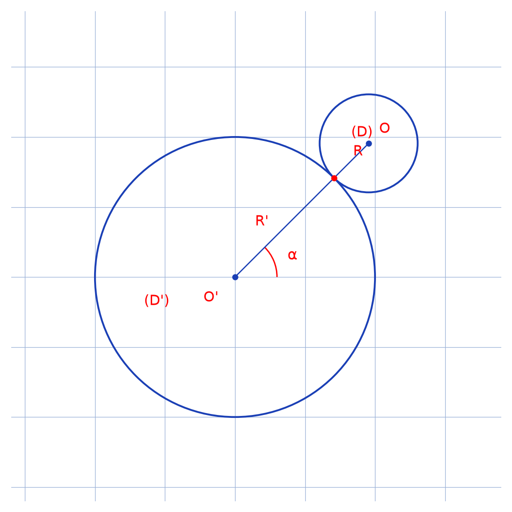

## Page 152 (disque nbre tours N = (1+R'/R)α/2π)

on s'intéresse au nbre de tours n qu'a fait (D) Pour cela on assimilera (D) et (D') à polygones réguliers inscrits dans (D) et (D') resp de côté dl→0 commun [bleu — haut]

Figure (crayon) : polygones dl dθ dθ'. [À reproduire en passe FORME : `lab/scripts/reproduce_polygones_roulement.py` → `assets/polygones-roulement.png`.]

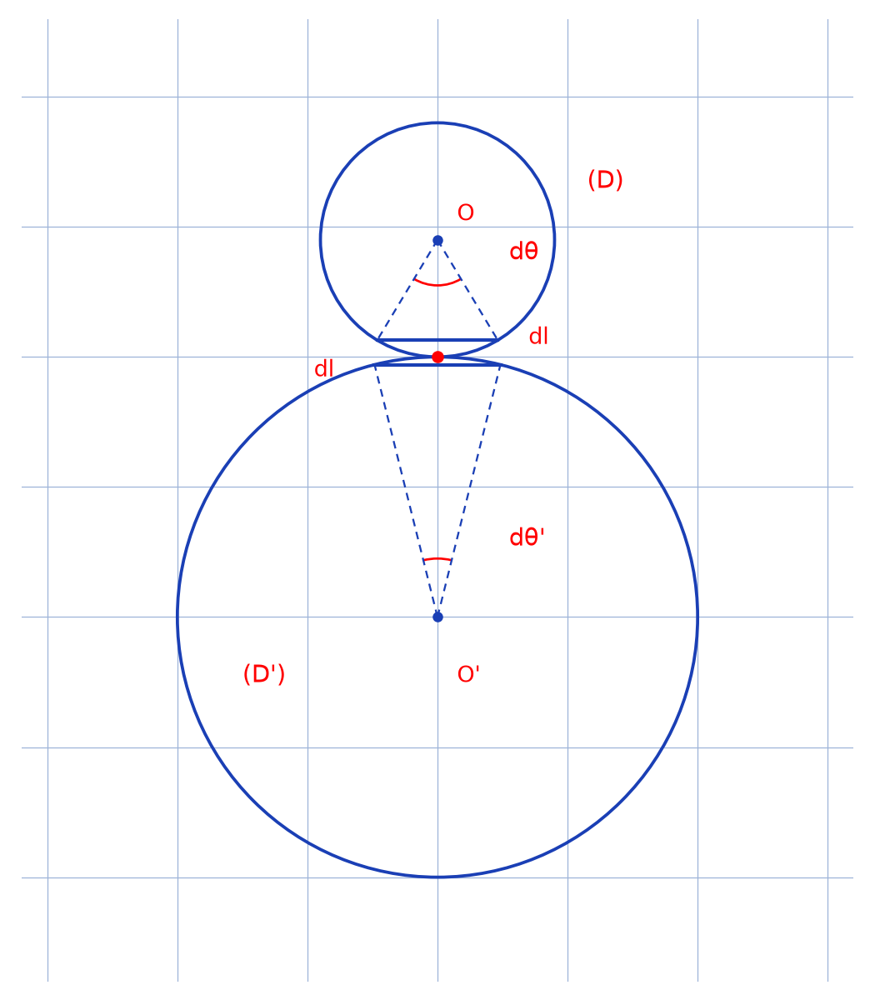

(D) dθ → dθ [bleu]

Ona : dl = R dθ = R' dθ' [bleu]

Quand (D) va d'un côté à un autre (dl à dl suivant), en plus de l'angle dθ dont il roté il rote d'avantage en s'inclinant d'un angle dθ' ainsi par unité infinitésimale de déplacement (D) rote d'un angle dθ+dθ' = dθ + R'dθ'/R [tel quel] [bleu]

Ainsi lorsque (D) balaye un angle α le long de la circonférence de (D'), il balaye en réalité un angle ∫₀^α dθ'(1+R'/R) = (1+R'/R)α [rouge — suite p.153]

## Page 153 (fin N + * ∀x∈I = [0,1[, sin⁻¹(√x) = tan⁻¹(√(x/(1-x))) M1 début)

Donc le nbre de trs effectué par (D) est N = (1+R'/R) α/(2π) [rouge + bleu — haut]

En particulier lorsqu'il balaye entièrement la circonférence, il effectue N = 1+R'/R trs [bleu + rouge]

* ∀x∈I = [0,1[, sin⁻¹(√x) = tan⁻¹(√(x/(1-x))) [rouge]

- M1 : [rouge, souligné]

∀x∈I, √x ∈ [0,1[ ⊂ [?] √(x/(1-x)) ∈ [0,+∞[ ⊂ IR ainsi les réels sin⁻¹(√x) et tan⁻¹√(x/(1-x)) existent [bleu]

ainsi sin⁻¹(√x) = tan⁻¹∘tan(sin⁻¹(√x)) = tan⁻¹∘(tan(sin⁻¹(√x))) d'où la somme = tan⁻¹( sin(sin⁻¹√x)/√(1-sin²(sin⁻¹√x)) ) Batman de … [bleu — « Batman » tel quel, blague]

car ∀x∈I, tan(x) = sin x/√(1-sin²x) [bleu — suite p.154]

## Page 154 (M1 fin + M2 f = 0)

d'où sin⁻¹(√x) = tan⁻¹( √x/√(1-(√x)²) ) [bleu — haut]

Donc ∀x∈[0,1[, sin⁻¹(√x) = tan⁻¹(√(x/(1-x))) [rouge]

* M2 : [rouge]

∀x∈I, Soit f(x) = sin⁻¹(√x)-tan⁻¹(√(x/(1-x))) [bleu]

on dq que f est définie et dérivable sur I en appliquant les propriétés de dérivation appliquées aux fonctions composées [bleu]

ainsi ∀x∈I, f'(x) = 1/(2√x)×1/√(1-x) - 1/(2(1-x)²)×√((1-x)/x)×1/(1+(x/(1-x))²) [bleu — tel quel]

= 1/(2√x√(1-x)) - 1/(2√(1-x)√x) [bleu]

f'(x) = 0 [bleu]

ainsi f est constante sur I cad ∃K∈IR | ∀x∈I, f(x) = K or f(0) = 0-0 = 0 [bleu + rouge]

ainsi ∀x∈I, f(x) = 0 [bleu]

Donc ∀x∈[0,1[, sin⁻¹(√x) = tan⁻¹(√(x/(1-x))) [rouge — suite p.155]

## Page 155 (M2 fin + * (Uₙ) arithmético-géométrique rappel)

Donc ∀x∈[0,1[, sin⁻¹(√x) = tan⁻¹(√(x/(1-x))) [rouge — haut, fin M2]

* (Uₙ)ₙ∈IN : Uₙ₊₁ = aUₙ+b et U₀∈IR a [rouge — titre, coupé à droite]

Exprimons Uₙ en fonction de n [bleu]

Soit l∈IR | l = al+b ⇔ l = b/1-a [bleu + rouge pour l = b/1-a]

ainsi ∀n∈IN, Uₙ₊₁ = aUₙ+b [bleu]

l = al+b [bleu]

soit (Uₙ₊₁-l) = a(Uₙ-l) [bleu]

ainsi la suite (Uₙ-l)ₙ∈IN est géométr[ique] [bleu — coupé]

de raison a et de 1ᵉʳ terme U₀-l [bleu + rouge pour a et U₀-l]

D'où ∀n∈IN, (Uₙ-l) = aⁿ(U₀-l) [bleu]

càd Uₙ = aⁿ(U₀-b/(1-a)) + b/(1-a) [bleu]

Donc ∀n∈IN, Uₙ = aⁿ(U₀-b/(1-a)) [rouge — fin coupée à droite]

De façon générale on démontre [bleu — suite p.156]

∀n,p∈IN | n≥p Uₙ = aⁿ⁻ᵖ(Uₚ-b/(1-a)) + [bleu + rouge — coupé, suite p.156]

## Page 156 (* (E) diophantienne ax+by = c, inverse modulaire)

∀n,p∈IN | n≥p Uₙ = aⁿ⁻ᵖ(Uₚ-b/(1-a)) + b/(1-a) [bleu — fin du rappel, haut]

*(E) : ax+by = c a,b,c∈Z* avec a∧b≠0 [rouge]

S_Z² = ? [rouge]

Rha : S = a∧b, | a et b ainsi s|c [bleu — « Rha » tel quel]

si c≠0 [s?] alors S_Z² = ∅ [bleu + rouge pour ∅]

si s|c, (E) ⇔ ax = c-by [bleu]

⇒ ax ≡ c[b] [bleu]

on cherche l'inverse a' de a modulo [b] [rouge + bleu]

soit par tâtonnement ou en résolvant [rouge]

l'éqn : aa' ≡ 1[b] d'inconnue a' [bleu]

a' trouvé, (E) ⇒ aa'x ≡ a'c[b] [bleu]

⇒ x ≡ a'c[b] cad ∃K∈Z | x = a'c + bK [rouge — « +bK » en marge]

ainsi (E) ⇒ a(a'c+bK) = c-by [bleu]

⇒ by = -aa'c+c-abK [bleu]

⇒ [raturé — deux lignes biffées] [bleu]

étant connue [bleu — marge droite]

or aa'-1 ≡ 0[b] ainsi aa'-1 = λb [bleu — « λb d' ? »]

donc y = cα - a?K [bleu — lecture incertaine, suite p.157]

## Page 157 (réciproque (E) + * Trick + * lim produit)

Réciproquement les couples (a'c+bK ; cα-aK) [rouge — haut]

K∈Z vérifient (E) [rouge]

Donc S_Z² = {(a'c+bK ; cα-aK), K∈Z} où [bleu + rouge]

a' est un inverse de a [b] cad une solution [bleu]

de aa' ≡ 1[b] et α est l'entier relatif | [bleu]

aa' = λb+1 qui existe car b|(aa'-1) ! [rouge]

* Trick [rouge, souligné]

x³+y³+z³-3xyz = (x+y+z)(x²+y²+z²-xy-xz-yz) [rouge]

* lim 1/n² ∏ ln(n²+k²)^{1/n} = ? [rouge] 23/06/2020 [bleu — date]

∀n∈IN, soit Uₙ = 1/n² ∏_{k=1}ⁿ (n²+k²)^{1/n} [bleu — « ∀n » raturé puis réécrit]

= 1/n² ∏_{k=1}ⁿ n^{2/n}(1+(k/n)²)^{1/n} [bleu]

= ∏_{k=1}ⁿ (1+(k/n)²)^{1/n} [bleu — tel quel, facteur 1/n² absorbé]

& ainsi lnUₙ = Σ_{k=1}ⁿ 1/n ln(1+(k/n)²) [bleu + rouge pour « & ainsi », suite p.158]

## Page 158 (lim produit fin Riemann + * (Uₙ) βγ)

ainsi lnUₙ = 1/n Σ_{k=1}ⁿ f(0+k/n ×1) où f : IR→IR [bleu — haut]

x↦ln(1+x²) [bleu]

alors lim_{n→+∞} lnUₙ = ∫₀¹ ln(1+x²)dx [bleu]

= [xln(1+x²)]₀¹ - ∫₀¹ 2x²dx/(1+x²) [bleu]

= ln2 - 2∫₀¹ (1 - 1/(1+x²))dx [bleu]

= ln2 - 2[x - arctan x]₀¹ [bleu — « arctan » noté « archan »]

cad lim_{n→+∞} lnUₙ = ln2 - 2(1-π/4) = ln2-2+π/2 [bleu]

cad ln(lim_{n→+∞} Uₙ) = ln2-2+π/2 car ln est [continue sur] IR₊* et [bleu]

∀n∈IN*, Uₙ>0 [bleu]

Donc lim_{n→+∞} 1/n² ∏_{k=1}ⁿ (n²+k²)^{1/n} = e^{ln2-2+π/2} [rouge]

* (Uₙ)ₙ∈IN : Uₚ (p∈E) et ∀n∈E, (Uₙ₊₁-α = β(Uₙ-α)^γ) [rouge — titre]

γ≠1, β>0 et α<Uₙ ∀n∈IN [rouge]

Uₙ = f(n) = ? [rouge — marge]

∀n∈E, (Uₙ₊₁-α) = β(Uₙ-α)^γ ⇔ ln(Uₙ₊₁-α) = lnβ+γln(Uₙ-α) [bleu]

Soit m∈IR | m = lnβ+γm ainsi m = lnβ/(1-γ) [bleu — suite p.159]

## Page 159 (suite βγ géométrique + * I = ∫₀¹ ln(x+a)/(x+1)dx)

alors ln(Uₙ₊₁-α) = lnβ+γln(Uₙ-α) [bleu — rappel haut]

m = lnβ+γm [bleu — souligné]

[ln(Uₙ₊₁-α)-m] = γ[ln(Uₙ-α)-m] [bleu]

la suite (ln(Uₙ-α)-m)ₙ∈E est géométrique [bleu]

de raison γ dont un terme est ln(Uₚ-α)-m₀ [bleu — « m₀ » tel quel]

ainsi [ln(Uₙ-α)-m] = γⁿ⁻ᵖ[ln(Uₚ-α)-m] [bleu]

cad ln(Uₙ-α) = m+γⁿ⁻ᵖ[ln(Uₚ-α)-m] [bleu]

cad Uₙ-α = e^{m+γⁿ⁻ᵖ[ln(Uₚ-α)-m]} [bleu]

Donc ∀n∈IN, Uₙ = α+e^{lnβ/(1-γ)+γⁿ⁻ᵖ[ln(Uₚ-α)-lnβ/(1-γ)]} [rouge — tel quel]

ou encore [rouge]

Uₙ = β^{(1-γⁿ⁻ᵖ)/(1-γ)} × (Uₚ-α)^{γⁿ⁻ᵖ} + α [rouge]

16/08/2020 [bleu — date]

* I = ∫₀¹ ln(x+a)/(x+1) dx = ? [rouge]

f : x↦ln(x+a)/(x+1) est continue sur ]-1,+∞[ [bleu + rouge]

car [0,1] ⊂ ]-1,+∞[ alors I existe et [est finie] [bleu — coupé, suite p.160]

## Page 160 (I = π/8 ln2 + * inégalité tan Meth1 début)

Ainsi I = ∫₀^{π/4} ln(1+tant) dt [bleu — haut, coupé]

ou en posant [bleu — marge]

= ∫₀^{π/4} ln(1+tan(π/4-u)) du [bleu]

d'où dx = 1+tan²t dt [bleu — marge]

où u = π/4-t [bleu]

et t : arctanx [bleu — marge]

= ∫₀^{π/4} ln(2/(1+tanu)) du [bleu]

= ∫₀^{π/4} (ln2)du - I [bleu]

Donc I = ∫₀¹ ln(x+a)/(x+1) dx = π/8 ln2 [rouge — « a = 1 » implicite]

* Mq ∀x,y∈IR, |(x+y)(1-xy)/((x²+1)(y²+1))| ≤ 1/2 [rouge, souligné]

Soient x,y∈IR | |(x+y)(1-xy)/((x²+1)(y²+1))| ≤ 1/2 (I) [bleu]

Car ∀x,y∈IR, (x²+1)(y²+1)≠0 alors (I) existe [bleu + rouge pour « (I) existe »]

Meth 1 : [rouge, souligné]

(I) ⇔ -1/2 ≤ (x+y)(1-xy)/((x²+1)(y²+1)) ≤ 1/2 pour x,y∈IR [bleu + rouge]

(⇔) { 2(x+y)(1-xy)+(x²+1)(y²+1) ≥ 0 (I₁) [bleu]

-2(x+y)(1-xy)+(x²+1)(y²+1) ≥ 0 (I₂) [bleu]

car ∀x,y∈IR, (x²+1)(y²+1)>0 [bleu]

(I₁) ⇔ 2x-2x²y+2y-2xy²+x²y²+x²+y²+1 ≥ 0 [bleu]

⇔ x²+2x+1+y²(x²-2x+1)+2y(1-x²) [bleu]

⇔ (x+1)²+[y(x-1)]²-2(x+1)[y(x-1)] ≥ 0 [bleu — suite p.161]

## Page 161 ((I₁)(I₂) carrés + Meth2 tan début)

(I₁) ⇔ (x+1-y(x-1))² ≥ 0 [bleu — haut]

⇔ (x,y)∈IR² [bleu]

(I₂) ⇔ -2x+2x²y-2y+2xy²+x²y²+x²+y²+1 ≥ 0 [bleu]

⇔ x²-2x+1+y²(x²+2x+1)+2y(x²-1) [bleu]

(⇔) (x-1)²+[y(x+1)]²+2[y(x+1)](x-1) [bleu]

⇔ [x-1+y(x+1)]² ≥ 0 [bleu]

(⇔) (x,y)∈IR² [bleu]

Ainsi (I) ⇔ (x,y)∈IR² [rouge]

Donc ∀(x,y)∈IR², |(x+y)(1-xy)/((1+x²)(1+y²))| ≤ 1/2 [rouge]

- Meth 2 [rouge, souligné]

(I) ⇔ -1/2 ≤ (x+y)(1-xy)/((1+x²)(1+y²)) ≤ 1/2 [bleu]

Car x,y∈IR et tan est bijective de [?] vers IR, ∃! α,β∈]-π/2,π/2[ / tanα=x et tanβ=y [bleu + rouge]

Ainsi (I) ⇔ -1/2 ≤ (tanα+tanβ)(1-tanαtanβ)/((1+tan²α)(1+tan²β)) ≤ 1/2 [bleu]

⇔ -1 ≤ 2(sinα/cosα + sinβ/cosβ)(1 - sinαsinβ/(cosαcosβ)) [cosαcosβ ?] [bleu — coupé, suite p.162]

## Page 162 (Meth2 fin sin + * (a+b)^c binôme)

α,β∈]-π/2,π/2[ ⇒ cosα,cosβ≠0 [bleu — haut]

⇔ -1 ≤ 2sin(α+β)cos(α+β) ≤ 1 [bleu]

⇔ -1 ≤ sin(2|α+β|) ≤ 1 [bleu — « || » tels quels]

⇔ { α,β∈]-π/2,π/2[ [bleu]

α,β∈IR [bleu]

⇔ α,β∈]-π/2,π/2[ [bleu]

(I) ⇔ x,y∈IR [bleu]

Donc ∀x,y∈IR, |(x+y)(1-xy)/((1+x²)(1+y²))| ≤ 1/2 [rouge]

* ∀a,b∈C (a+b)^c = ? c∈Z [rouge, souligné + raturé]

Si c∈IN, on dq par récurrence que [bleu]

(a+b)^c = Σ_{k=0}^c C_c^k a^k b^{c-k} [rouge]

Si c∈IN* Soit c∈Z\IN*, Soit [bleu — « Soit » raturé-réécrit]

P(-c) : ∀-c∈N et a,b∈C ||a|<|b|, [bleu]

(a+b)^c = Σ_{k=0}^{+∞} C_{-c+k-1}^k (-a)^k b^{c-k} [rouge + bleu — suite p.163]

tentons : A [rouge — bas, coupé]

## Page 163 (P(1) série géométrique + hérédité début)

pour c=0, Σ_{k=0}^{+∞} C_{k-1}^k (-a)^k b^{-k} = Σ_{k=0}^{+∞} 0 = [limite] [rouge + bleu — haut, lecture incertaine]

• pour c≥1, Σ_{k=0}^{+∞} C_{k+m-1}^k (-a)^k b^{1-1-k} = S [bleu]

où S = 1/b Σ_{k=0}∞ (-a/b)^k n→+∞ [bleu]

= 1/b × (1-(-a/b)^{n+1})/(1+a/b) [bleu]

= 1/(a+b)(1-(-a/b)^∞) [bleu]

d'où = 1/(a+b)(1-0) car |a|<|b| ⇒ |(-a/b)|^∞ = 0 [bleu]

Donc Σ_{k=0}^{+∞} C_{k+1-1}^k (-a)^k b^{1-k} = (a+b)^m Donc P(1) [rouge + bleu — « m » tel quel pour « 1 »]

est vraie [rouge]

• hérédité [rouge]

∀-c∈IN* [bleu]

(a+b)^{c-1} = (Σ_{i=0}^{+∞} C_{c+i-1}^i (-a)^i b^{c-i})(Σ_{j=0}^{+∞} C_{1+j-1}^j (-a)^j b^{1-j}) [bleu]

= Σ_{i≥0}Σ_{j≥0} C_{c+i-1}^i C_{1+j-1}^j (-a)^{i+j} b^{c-1-(i+j)} [bleu — suite p.164]

## Page 164 (produit Cauchy + C_{m+n-1}^m = (-1)^m C_{-n}^m)

(a+b)^{c-1} = Σ_{i≥0}Σ_{j≥0} C_{c+i-1}^i C_{1+j-1}^j (-a)^{i+j} b^{c-1-(i+j)} [bleu — rappel haut]

où p,q→∞ [bleu — marge]

= Σ_{K=0}Σ_{i=0}^K C_{c+i-1}^i C_{1+j-1}^j (-a)^K b^{c-1-K} où K=i+j [bleu]

= Σ_{K≥0} (-a)^K b^{c-1-K} Σ_{i=0} C_{c+i-1}^i C_{1+j-1}^j où j=K-i [bleu]

= Σ_{K≥0} (-a)^K b^{c-1-K} × C_{c+1+K-1}^K [bleu + raturé — produit Cauchy admis]

∀m,n∈IN*, C_{m+n-1}^m = (m+n-1)!/(m!(n-1)!) [bleu]

avec m≤n et [bleu]

= (m+1-m)(n-1+m)×…×[?]/(m!(n-1)!) [bleu — raturé puis réécrit]

= (n-1+m)×…×(n)/(m!) [bleu]

= (-1)^m × (-n)(-n-1)…×…/(m!) [bleu]

= (-1)^m × A_{-n}^m/m! [bleu]

Donc C_{m+n-1}^m = (-1)^m C_{-n}^m [rouge — suite p.165]

## Page 165 (binôme généralisé fin + forme générale)

ainsi [bleu — haut]

(a+b)^{c-1} = Σ_{K≥0} (-a)^K b^{c-1-K} Σ_{i≥0} (-1)^i C_{-c}^i × (-1)^{K-i} C_{-1}^{K-i} [bleu — lecture incertaine]

= Σ_{K≥0} (-a)^K b^{c-1-K} (-1)^K Σ_{i=0}^K C_{-c}^i C_{-1}^{K-i} [bleu]

= Σ_{K≥0} (-a)^K b^{c-1-K} (-1)^K × C_{-c-1}^{1+K-1} [bleu]

= Σ_{K≥0} (-a)^K b^{c-1-K} × C_{c-1+K-1}^K [bleu]

Donc (a+b)^{c-1} = Σ_{K≥0} (-a)^K b^{c-1-K} C_{(c-1+K)-1} [rouge — tel quel]

Donc ∀c∈Z\IN, P(c) est vraie [?] [bleu — raturé]

Alors de façon générale, [bleu + rouge]

∀c∈Z a,b∈C avec |a|<|b|, [rouge]

(a+b)^c = Σ_{K≥0} C_c^K a^K b^{c-K} [rouge]

où - C_c^K = c!/(K!(c-K)!) pour c∈IN, K∈[[0,c]] [bleu + rouge]

- C_c^K = 0 pour c∈IN et K∈[[c+1,+∞[ [bleu + rouge — suite p.166]

## Page 166 (C_c^K généralisés + * somme 2 complexes polaires)

- C_c^K = C_{-c+K-1}(-1)^K pour n∈Z\IN et [rouge + bleu — haut]

K∈[[0,-c]] [rouge]

- C_c^K = 0 pour c∈ZK et K∈Z\IN [rouge — tel quel]

25/08/2020 [bleu — date]

* Soient z₁ = re^{iα} et z₂ = r'e^{iα'} et Z = z₁+z₂ [rouge, souligné]

(r,r',α,α')∈IR₊² × ]-π,π]². Soient (R,A)∈IR₊×[?] [rouge]

/ Z = Re^{iA} [rouge]

Donc Z = (rcosα+r'cosα')+i(rsinα+r'sinα') [bleu]

R = √((rcosα+r'cosα')²+(rsinα+r'sinα')²) [bleu]

cad R = √(r²+r'²+2rr'cos(α-α')) [rouge]

R=0 ⇔ rcosα+r'cosα'=0 et rsinα+r'sinα'=0 [bleu]

⇔ Z=0 [bleu]

⇔ re^{iα} = -r'e^{iα'} [bleu]

⇔ re^{iα} = r'e^{i(α'+π)} [bleu]

⇔ r=r' et α ≡ α'+π[2π] [rouge — suite p.167]

ainsi [bleu — bas, coupé]

## Page 167 (Z = 0 vs Z = Re^{iA}, cas r = r')

- Pour r=r' et α ≡ α'+π[2π], [rouge — haut]

Z=0 et donc R=0 et A n'existe pas [bleu]

- Pour r≠r' ou α≠α'+π[2π] alors R≠0 [rouge]

ainsi Z = R((rcosα+r'cosα')/R + i(rsinα+r'sinα')/R) [bleu]

Car ((rcosα+r'cosα')/R)² + ((rsinα+r'sinα')/R)² = 1 [bleu]

alors ∃! A∈]0,π]? | cosA = (rcosα+r'cosα')/R [bleu — intervalle incertain]

et sinA = (rsinα+r'sinα')/R [rouge + bleu]

ainsi Z = Re^{iA} où R=√(r²+r'²+2rr'cos(α-α')) [bleu]

et A∈]0,π]? | cosA = (rcosα+r'cosα')/R sinA = (rsinα+r'sinα')/R [rouge + bleu — raturé en fin]

et tanA = (rsinα+r'sinα')/(rcosα+r'cosα') [rouge]

• En particulier pour r=r' et α≠α'+π[2π] [bleu]

R≠0 et [?] R = √2×√2|cos((α-α')/2)| [bleu]

cad R = 2r|cos((α-α')/2)| [rouge — suite p.168]

## Page 168 (A = (α+α')/2 + remarque exponentielle + Fresnel annonce)

[cosA = (cosα+cosα')/(2|cos((α-α')/2)|)] [bleu — haut, coupé]

= 2cos((α+α')/2)cos((α-α')/2)/(2|cos((α-α')/2)|) [bleu]

= ±cos((α+α')/2) [bleu]

De même sinA = ±sin((α+α')/2) [bleu]

avec A = (α+α')/2 pour cos((α-α')/2)>0 [rouge + bleu]

et A ≡ π+(α+α')/2[2π] pour cos((α-α')/2)<0 [bleu + rouge]

Le calcul aurait été plus aisé en remarquant que [bleu]

Z = re^{i(α-α')/2}(e^{i(α+α')/2?} + e^{-i(α-α')/2}) [bleu — lecture incertaine]

cad Z = 2rcos((α-α')/2) e^{i((α+α')/2)} [rouge]

La détermination générale de A et R [bleu]

aurait aussi pu se faire par une appro- [rouge + bleu]

che géométrique, notamment en remar- [rouge + bleu]

quant que la bijection entre C et [bleu]

l'ensemble des vecteurs du plan et en [bleu]

exploitant le fait que sommer 2 complexes [bleu — suite p.169]

## Page 169 (Fresnel + Al-Kashi, cos/sin/tan A)

revient à sommer leurs vecteurs [bleu — haut]

associés (méthode de Fresnel) [rouge]

[figure Fresnel : parallélogramme OBC, flèche rouge OB, points O/F/D/A, axe Δ] [crayon + rouge — (cas r≠r' ou α≠α'+π[2π]) en marge]

D'après le théorème d'Al Kashi dans OBC, [bleu]

R² = r²+r'²-2rr'cosĈ [bleu]

= r²+r'²-2rr'cos(π-(α+α')) [bleu — « α+α' » tel quel pour α-α']

Donc R = √(r²+r'²+2rr'cos(α+α')) [rouge — tel quel]

cosA = OD/R cad cosA = (OF+FD)/R [rouge]

Donc cosA = (rcosα+r'cosα')/√(r²+r'²+2rr'cos(α+α')) [rouge — tel quel]

sinA = (OG+GE)/R cad sinA = (rsinα+r'sinα')/√(r²+r'²+2rr'cos(α+α')) [rouge]

et tanA = sinA/cosA = (rsinα+r'sinα')/(rcosα+r'cosα') [rouge — suite p.170]

## Page 170 (* somme 2 amplitudes A cosθ, Fresnel)

soient a₁,a₂∈IR₊*, α₁,α₂∈IR, | [bleu — haut]

a₁cosα₁+a₂cosα₂ = Acosθ Connaissant [bleu]

a₁,a₂,α₁,α₂ qu'en est-il de A et θ [bleu]

Pour cela on pose z₁ = a₁e^{iα₁} z₂ = a₂e^{iα₂} id est [bleu]

Z = z₁+z₂ = Ae^{iθ} car C est stable pour + [bleu + rouge pour « stable pour + »]

où A = √(a₁²+a₂²+2a₁a₂cos(α₁-α₂)) et θ | [rouge]

cosθ = (a₁cosα₁+a₂cosα₂)/A et sinθ = (a₁sinα₁+a₂sinα₂)/A [rouge]

ainsi Z = z₁+z₂ ⇔ Acosθ = a₁cosα₁+a₂cosα₂ [bleu]

et Asinθ = a₁sinα₁+a₂sinα₂ [bleu]

Donc A et θ existe bel et bien et valent [rouge, souligné]

A = √(a₁²+a₂²+2a₁a₂cos(α₁-α₂)) et [rouge]

θ | cosθ = (a₁cosα₁+a₂cosα₂)/A et sinθ = (a₁sinα₁+a₂sinα₂)/A [rouge]

• le constat est le même pour la somme [bleu]

des fonctions sin [bleu]

• De façon générale, la somme de 2 fonctions [bleu + rouge]

sinusoïdales en est une autre [bleu — suite p.171]

## Page 171 (* lim √(1/n ΣK^M) = ⁿ√n! + * lim ((-a)^M-1)/M)

* l = lim_{M→0} √(1/n Σ_{K=1}ⁿ K^M) = ⁿ√(n!) ? [rouge — titre]

Soit n∈IN* [bleu]

Donc l = lim_{M→0} e^{1/M ln(1/n Σ_{K=1}ⁿ K^M)} [bleu]

= lim_{M→0} e^{1/M ln(1+1/n Σ_{K=1}ⁿ (K^M-1))} [bleu]

= lim_{M→0} e^{1/M ×1/n Σ_{K=1}ⁿ (e^{MlnK}-1)} car 1/n Σ_{K=1}ⁿ (K^M-1)→0 [bleu]

= lim_{M→0} 1/n Σ_{K=1}ⁿ (xlnK+1-1)/M car xlnK→0 [bleu — tel quel]

= lim_{M→0} 1/n [ln ∏_{K=1}ⁿ K] [bleu — raturé]

l = ⁿ√(n!) [rouge]

* l = lim_{M→0} ((-a)^M-1)/M où M∈IR₊* [rouge]

on définira ici la fonction ln élargie à C [bleu]

conservant les m propriétés [bleu]

ainsi l = lim [bleu — coupé, suite p.172]

## Page 172 (fin lim log complexe + * I = ∫ln|x+a|/(x+b)dx, Li₂)

l = lim_{M→0} (e^{M(iθ+ln a)}-1)/(M(iθ+ln a)) × (iθ+ln a) [bleu — haut]

Donc lim_{M→0} ((-a)^M-1)/M = iπ+lna [rouge]

* I = ∫ ln|x+a|/(x+b) dx = ? x∈C\{-a,-b} [rouge, souligné] 23/08/20 [bleu — date] a,b∈C [bleu]

En définissant ln, le logarithme complexe [bleu + rouge]

∀z∈C*, ln : z↦ln|z| = ∫₁^z dt/t, on a : [rouge + bleu]

- si a=b, I = ∫ (ln|x+a|)' ln|x+a| dx [rouge]

Donc I = ∫ ln|x+a|/(x+b) dx = 1/2 ln²(x+a)+c [rouge]

- si a≠b, ∀x∈C* on pose (x+a)/d = 1-t et (x+b)/d = -t [rouge]

où (d,t)∈C*×C\{?} car point = -b/d, [bleu — lecture incertaine]

(x+a)/d = 1-t et (x+b)/d = -t ⇒ d-dt-a = -dt-b [bleu]

⇒ d = a-b [bleu]

ainsi I = ∫ ln|(a-b)(1-t)|/(-(a-b)t) (-(a-b)dt) [bleu]

= ∫ ln|a+b|? dt - ∫ ln|1-t|/(-t)? [bleu — lecture incertaine, suite p.173]

## Page 173 (I = ln|a-b|ln - Li₂ + brouillon biffé)

Donc I = ∫ ln|x+a|/(x+b) dx = ln|a-b|lnt - Li₂(t)+c c∈C [rouge — haut]

or où Li₂ est le dilogarithme intégral | [rouge]

∀z∈C, Li₂(z) = ∫₀^z -ln|1-t|/t dt [rouge]

Donc I = ln|a-b|ln(-(x+b)/(a-b)) - Li₂(-(x+b)/(a-b))+c, c∈C x∈C\{-b} [bleu + rouge]

[brouillon biffé en X rouge : N = a,bC̄ / N = a+0,bC̄ / 10^{m+m}N = a×10^{m+m}+bc,C̄ / Mar-?+Δ M² = M+A / U M+SSS / θhC̄ = θhd₁, C̄] [bleu + rouge — grande croix rouge, suite p.174]

## Page 174 (* I = ∫ln(ax+b)/(cx+d)dx + * Problème RDV 12h-13h)

* I = ∫ ln(ax+b)/(cx+d) dx = ? [rouge — haut]

- les cas où a=0 ou c=0 sont triviaux [bleu + rouge]

- Pour a≠0 et c≠0, [rouge]

I = 1/c ∫ (ln|x+b/a|+lna)/(x+d/c) dx b,d∈C x∈C\{-b/a,-d/c} [bleu]

et on se ramène ainsi au cas précédent [bleu + rouge]

* Problème [rouge, souligné]

2 pers P₁ et P₂ se sont donné rendez-vous [bleu]

entre 12h et 13h et se sont promis qu'elles [bleu]

ne s'attendront pas plus de 10 min. En [bleu]

admettant qu'il y a équiprobabilité entre les [bleu]

instants d'arrivée possibles de rencontre, qu'elle est [bleu — « qu'elle » tel quel]

la probabilité que les 2 individus se rencontre [bleu — « rencontre » tel quel]

Cas général : P₁ et P₂ se sont donné rendez- [rouge, souligné + bleu]

vous entre 2 instants séparés d'une durée [bleu]

de a min (a∈IR₊*) et se sont promis qu'elles [bleu]

ne s'attendront pas plus de b min (b∈ [bleu — coupé, suite p.175]

## Page 175 (Problème RDV Meth1 repère)

En admettant qu'il y a équiprobabilité, [bleu — haut]

qu'elle est la probabilité p de rencontre entre [bleu — « qu'elle » tel quel]

P₁ et P₂ [bleu]

• Meth1 : On se munit d'un repère orthogonal [rouge + bleu]

direct (O,I,J), les axes étant gradués en min | [bleu]

OI = OJ = 10 min. Soit A(a,0), B(0,a) [bleu — « 10 » tel quel pour « a »]

et C(a,a). A tout M(x,y) du carré OACB, [bleu]

correspond de façon unique une instant de rencon- [bleu]

tre cad possibilité d'arrivée de P₁ et P₂ où [bleu]

P₁ est arrivé après x min et P₂ après y min [bleu]

x,y∈[0,a] [bleu]

- si a<0, alors P₁ et P₂ arrivent obligatoire- [rouge + bleu]

ment après 0 min et se rencontrent forcément [bleu]

Donc P = 1 [rouge]

- sinon, si b≥a, P₁ et P₂ se rencontre néces- [rouge + bleu]

sairement d'où P = 1 [bleu + rouge]

sinon on définit Ω, l'univers des éventu- [bleu — coupé, suite p.176]

## Page 176 (Ω = OACB, |A| = a², bande |y-x| ≤ b)

[é]tant donné qu'il y a équiprobabilité, cel- [bleu — haut, coupé]

a revient à dénombrer le nbre de pts M [bleu]

∈ OACB plus explicitement à compter le [bleu]

nombre de petites unités d'aire comprises [bleu — « de page » raturé]

dans OACB où u.a = OI×OJ = 100 min² [bleu — « 100 » tel quel]

ainsi |A| = A_OACB = OA×OB a.a = a×a u.a [bleu]

Donc |A| = a² u.a [rouge]

De plus P₁ et P₂ se rencontrent [bleu]

ssi |y-x| ≤ b ⇔ -b+x ≤ y ≤ b+x [bleu]

ainsi l'ens des pts M satisfaisant la contrainte [bleu]

sont situé entre (Δ₁) : y = -b+x et (Δ₂) : y = b+x [bleu]

[figure carré OACB, diagonale y = x, bande b, a-b, a] [crayon — bas]

ainsi P = A_D/|A| = A_D/a² [rouge]

• pour b≤0, P = Q/a² = 0 [bleu + rouge — « Q » tel quel, suite p.177]

## Page 177 (A_D intégrales, P = b(2a-b)/a², cas 2b>a)

Pour b≠0 et 2b≤a [rouge — haut]

A_D = ∫₀^b (b+x)dx + ∫_b^{a-b} ((b+x)-(x-b))dx + ∫_{a-b}^a (a-(x-b))dx [bleu]

= [bx+1/2 x²]₀^b + 2b[x]_b^{a-b} + [(a+b)x-1/2 x²]_{a-b}^a [bleu]

cad A_D = b²+1/2 b²+2b(a-b)-2b²+(a+b)a-1/2 a²-(a+b)(a-b) [bleu]

+1/2 (a-b)² [bleu — marge]

Donc P = b(2a-b)/a² et [?] [rouge + raturé bleu]

Ainsi on rend la rencontre plus probable [bleu]

en prenant b=a et P = 1 [rouge]

• Pour 2b>a [rouge — « 2b>a » réécrit sur raturé]

A_D = ∫₀^{a-b} (b+x)dx + ∫_{a-b}^b (a-0)dx + ∫_b^a (a-(x-b))dx [bleu]

= [bx+1/2 x²]₀^{a-b} + a(b-(a-b)) + [(a+b)x-1/2 x²]_b^a [bleu]

= b(a-b)+1/2 (a-b)²+2ab-a²+(a+b)a-1/2 a²-(a+b)b [bleu — fin coupée]

Donc P = [raturé] = b(2a-b)/a² [rouge + raturé — suite p.178]

## Page 178 (P générale + Meth2 infinitésimaux)

Et de façon générale [bleu — haut]

pour a∈IR₊* et b∈[0,a], P = b(2a-b)/a² [rouge]

et ainsi 0≤P≤1 [rouge]

En revenant au cas particulier où a = 60min [bleu]

et b = 10min, P = 11/36 ≃ 0,306 [rouge]

Meth2 [rouge, souligné]

On travaillera pour a∈IR₊*, b∈[0,a] [bleu]

les autres cas étant évidents ou similaires. [bleu]

En partageant l'intervalle de temps de longue- [bleu]

ur a min en fragments infinitésimaux de lon- [bleu]

gueur dt (pour P₁) et dx (pour P₂), dx,dt→0, [bleu]

|A| = (∫₀^a dx)×(∫₀^a dt) = a² [rouge]

Ainsi [bleu]

P = 1/|A| (∫₀^b dt∫₀^{t+b} dx + ∫_b^{a-b} dt∫_{t-b}^{t+b} dx + ∫_{a-b}^a dt∫_{t-b}^a dx) [bleu]

Donc P = b(2a-b)/a² [rouge — suite p.179]

## Page 179 (* I = ∫₀¹ E(1/√x)dx, paliers)

* I = ∫₀¹ E(1/√x) dx = ? [rouge, souligné] 01/05/2020 [bleu — date]

∀x∈]0,1], ∀K∈IN* [bleu]

si 1/(K+1)² < x ≤ 1/K² alors 1/(K+1) < √x ≤ 1/K [bleu — tel quel, ordre inversé]

d'où K ≤ 1/√x < K+1 [bleu]

Donc K = E(1/√x) [bleu]

Alors ∀x∈]0,1], E(1/√x) = { 1 si x∈]1/4,1] [rouge + bleu]

2 si x∈]1/9,1/4] [rouge]

⋮ [rouge]

n si x∈]1/(n+1)²,1/n²] } n→+∞ [rouge]

ainsi I = ∫₀^{1/(n+1)²} E(1/√x)dx + ∫_{1/(n+1)²}^{1/n²} E(1/√x)dx + ∫ [bleu — coupé]

+ … + ∫_{1/4}^1 E(1/√x)dx + ∫_{1/1}^1 E(1/√x)dx n∈IN* [bleu — tel quel]

= ∫₀^{1/(n+1)²} E(1/√x)dx + Σ_{K=1}ⁿ ∫_{1/(K+1)²}^{1/K²} E(1/√x)dx [bleu — suite p.180]

## Page 180 (I = lim télescopage Σ1/K²)

I = ∫₀^{1/(n+1)²} E(1/√x)dx + Σ_{K=1}ⁿ ∫_{1/(K+1)²}^{1/K²} K dx [bleu — haut]

lorsque n→+∞, [bleu]

I = lim_{n→+∞} (∫₀^{1/(n+1)²} E(1/√x)dx + Σ_{K=1}ⁿ K(1/K²-1/(K+1)²)) [bleu]

= 0+lim_{n→+∞} Σ_{K=1}ⁿ (1+…+1)(1/K²-1/(K+1)²) [bleu — « K fois »]

= lim_{n→+∞} (1)(1/1²-1/2²)+(1+1)(1/2²-1/3²)+…+ [bleu]

(1+…+1)(1/(n-1)²-1/n²)+(1+…+1)(1/n²-1/(n+1)²) [bleu — « (n-1) fois », « n fois »]

= lim_{n→+∞} (1/1²-1/2²+1/2²-…-1/(n-1)²-1/n²+1/n²-1/(n+1)²)+ [bleu]

(1/2²-1/3²+…+1/n²-1/(n+1)²)+…+(1/(n-1)²-1/n²+1/n²-1/(n+1)²) [bleu]

+(1/n²-1/(n+1)²) [bleu]

= lim_{n→+∞} (1-1/(n+1)²)+(1/2²-1/(n+1)²)+…+(1/n²-1/(n+1)²) [bleu]

= lim_{n→+∞} (Σ_{K=1}ⁿ 1/K² - n/(n+1)²) [bleu — suite p.181]

## Page 181 (I = π²/6 + * |4x²y-y-x| ≤ 17/16)

I = lim_{n→+∞} Σ_{K=1}ⁿ 1/K² - 0 [bleu — haut]

Donc I = ∫₀¹ E(1/√x)dx = π²/6 [rouge]

05/09/2020 [bleu — date]

* Soient x,y∈IR | |x|≤1/2 et |y|<1 : [rouge]

Mq |4x²y-y-x| ≤ 17/16 [rouge, souligné]

Soit (I) : |4x²y-y-x| ≤ 17/16 (x,y)∈A×B où A = [-1/2,1/2] [bleu]

(I) ⇔ 4x²y-y-x+17/16 ≥ 0 et 4x²y-y-x-17/16 ≤ 0 [bleu]

(I₁) (I₂) [bleu]

∀(x,y)∈A×B Posons P₁(x) = 4yx²-x+17/16-y [bleu]

• Si y≠0 Δ₁ = 1-16y(17/16-y) = -16y²-10y+1 [bleu]

= 16(y-1)(y-1/16) [bleu — tel quel]

- pour y∈]1/16,1[, Δ<0 d'où P₁(x)>0 [bleu]

et donc (I₁) ⇔ (x,y)∈A×]1/16,1[ [bleu]

- pour y∈]-1,1/16] Δ≥0, x = (1 ± 4√((1y+1)(y-1/16)))/8y [bleu — suite p.182]

## Page 182 ((I₁) signe constant, y = 0)

-1/2 ≤ x ≤ 1/2 incl -1/2 ≤ (1 ± 4√((1y+1)(y-1/16)))/8y < 1/2 [bleu — haut]

cad {-4y-1 ≤ 4√((1y+1)(y-1/16)) [bleu]

4y-1 ≥ 4√((1y+1)(y-1/16)) } [bleu]

cad {16y²+1+4y ≤ 16y²-16y+1 [bleu]

16y²+1-8y ≥ 16y²-16y+1 } [bleu]

cad { y≤0 [bleu]

y≥0 } [bleu]

cad y = 0 Absurde car y∈]/…/ [bleu — coupé]

ainsi x∉[-1/2,1/2] et donc P₁(x) a un signe [bleu]

constant ∀x∈A car P₁(0) = 17/16-y > 0 car y<1 [bleu]

ainsi P₁(x)>0 et donc (I₁) ⇔ (x,y)∈A×]1/16,1]? [bleu — tel quel]

Si y = 0 (I₁) ⇔ -x+17/16+16?≥0 [bleu]

⇔ x ≤ 17/16+16? [bleu]

car [-1/2,1/2] ⊂ ]-∞,17/16] [bleu]

Donc (I₁) ⇔ (x,y)∈A×{0} [bleu]

Mais ∀(x,y)∈A×B, (I₁) est toujours vraie [rouge — suite p.183]

## Page 183 ((I₂) similaire + M1 majoration)

On démontre de façon similaire que (I₂) ⇔ (x,y) [bleu — haut]

∈ A×B [rouge]

Donc |I| ⇔ (x,y)∈A×B [rouge]

Ainsi ∀x,y∈[-1/2,1/2]×]-1,1[, |4x²y-y-x| ≤ 17/16 [rouge]

M1 : [rouge, souligné]

Soient x,y∈A×B où A = [-1/2,1/2] et B = ]-1,1[ [bleu]

On a : |x|≤1/2 |y|<1 [bleu]

ainsi |4x²y-x-y| ≤ |4x²y-xy?|+|x| [bleu — lecture incertaine]

≤ |y||4x²-1|+|x| [bleu]

≤ -(|4x²-1|)+|x| car |y|≤1 d'où [bleu]

4x²-1≤0 [bleu]

≤ -4x²+|x|+1 [bleu]

≤ -4(|x|²-1/4|x|-1/4) [bleu]

≤ -4[(|x|-1/8)²-1/64-1/4] [bleu]

≤ -4(||x|-1/8|²)+17/16 [bleu]

Donc |4x²y-x-y| ≤ 17/16 car -4(|x|-1/8)² ≤ 0 [rouge — suite p.184]

## Page 184 (* I = ∫₀¹ x^{-x}dx = ΣK^{-K}, Γ)

* I = ∫₀¹ x^{-x} dx = Σ_{K≥0} K^{-K} ? [rouge, souligné — haut]

I = ∫₀¹ x^{x}? dx [bleu — « x^{-x} » titre, « x^x » calcul tel quel]

= ∫₀¹ e^{-xlnx} dx [bleu]

= ∫₀¹ Σ_{K≥0} (-xlnx)^K/K! dx [bleu]

= Σ_{K≥0} 1/K! ∫₀¹ (-xlnx)^K dx [bleu]

= Σ_{K≥0} 1/K! ∫_{+∞}^0 e^{…}×(t/(K+1))^K |-1/(K+1) e^{-t/(K+1)}|dt où t = (K+1)(-lnx) [bleu]

d'où x = e^{-t/(K+1)} dx/dt = -1/(K+1) e^{-t/(K+1)} [bleu — marge]

= Σ_{K≥0} 1/K! ∫₀^{+∞} 1/(K+1)^{K+1} t^K e^{-t} dt [bleu]

= Σ_{K≥0} 1/K! × 1/(K+1)^{K+1} × K! [bleu]

• Démontrons que ∀K∈IN, K! = ∫₀^{+∞} t^K e^{-t} dt [bleu]

de façon générale ∀x∈IR\Z*, [bleu]

posons Π(x) = ∫₀^{+∞} t^x e^{-t} dt [bleu]

= -∫₀^{+∞} t^x (e^{-t})' dt [bleu]

= -[t^x e^{-t}]₀^{+∞} + ∫₀^{+∞} x t^{x-1} e^{-t} dt [bleu]

= 0 + xΠ(x-1) [bleu]

ainsi ∀x∈IR\Z* Π(x) = xΠ(x-1) [rouge — suite p.185]

## Page 185 (Π(0) = 1, factorielle généralisée, Π(K) = K!)

De plus Π(0) = ∫₀^{+∞} 1·e^{-t} dt [bleu — haut]

= [-e^{-t}]₀^{+∞} [bleu]

Π(0) = 1 [rouge]

Alors ∀x∈IR\Z*, { Π(0) = 1 [rouge + bleu]

Π(x+1) = xΠ(x-1)? } [rouge — tel quel, pour Π(x) = xΠ(x-1)]

On obtient là une définition par récurrence [bleu]

semblable à celle de la fonction n↦n! [bleu]

car en fait 0! = 1 et n! = n(n-1)! On peut [rouge + bleu]

ainsi conclure que Π : x↦∫₀^{+∞} e? t^x [?] dt [bleu + rouge]

est la fonction factorielle généralisée [rouge]

? Elle n'est pas définie sur Z* car ∀n∈Z* [bleu + rouge]

Π(n) → ±∞ [rouge]

Alors ∀K∈IN, Π(K) = KΠ(K-1) [bleu]

= K×(K-1)Π(K-2) [bleu]

= K(K-1)×…×2×1×Π(0) [bleu]

= K(K-1)×…×2×1 [bleu]

Donc Π(K) = ∫₀^{+∞} t^K e^{-t} dt = K! [rouge — suite p.186]

## Page 186 (I = ΣK^{-K} + * J = ∫₀¹x^xdx = Σ(-1)^{K+1}K^{-K})

ainsi I = Σ_{K≥0} 1/(K+1)^{K+1} [bleu — haut]

= Σ_{K≥1} 1/K^K [bleu]

Donc I = ∫₀¹ x^{-x}dx = Σ_{K≥0} K^{-K} [rouge — « K≥0 » tel quel]

* J = ∫₀¹ x^x dx = Σ_{K≥0} (-1)^{K+1}K^{-K} ? [rouge, souligné]

J = ∫₀¹ x^x dx [bleu]

= ∫₀¹ e^{xlnx} dx [bleu]

= ∫₀¹ Σ_{K≥0} (xlnx)^K/K! dx [bleu]

= Σ_{K≥0} (-1)^K/K! ∫₀¹ (-xlnx)^K dx [bleu]

= Σ_{K≥0} (-1)^K/K! × 1/(K+1)^{K+1}×K! → d'après ce qui [bleu]

précède (en I) [bleu — marge]

= Σ_{K≥0} (-1)^K/(K+1)^{K+1} [bleu]

= Σ_{K≥1} (-1)^{K+1}/K^K [bleu]

Donc J = ∫₀¹ x^x dx = Σ_{K≥1} (-1)^{K+1}K^{-K} [rouge — suite p.187]

## Page 187 (* ΣKf(K) double somme, 17/01/20)

* Σ_{K=a}^b Kf(K) = Σ_{i=a+1}^b Σ_{j=i}^b f(j) + a Σ_{K=a}^b f(K) ? [rouge, souligné] 17/01/20 [bleu — date]

Soient a,b∈IN | b>a, f : IN→IR, S = Σ_{K=a}^b Kf(K) [bleu]

Dna : S = f(a)+…+f(a) [bleu — « a× » accolade]

f(a+1)+…+f(a+1)+f(a+1) [bleu]

⋮ ⋮ ⋮ (b-a)× [bleu]

f(b)+…+f(b)+[f(b)+…+f(b)] [bleu]

= a[f(a)+f(a+1)+…+f(b)] [bleu]

+ f(a+1)+…+f(b) [bleu]

+ ⋮ [bleu]

+ f(b-1)+f(b) [bleu]

+ f(b) [bleu]

Alors S = a Σ_{K=a}^b f(K) + Σ_{i=a+1}^b Σ_{j=i}^b f(j) [bleu + rouge]

Donc ∀a,b∈IN | b>a et f : IN→IR, [bleu + encadré rouge]

Σ_{K=a}^b Kf(K) = Σ_{i=a+1}^b Σ_{j=i}^b f(j) + a Σ_{K=a}^b f(K) [rouge, encadré — suite p.188]

## Page 188 (*(E) x^x = y^y + *(E') x^y = y^x début)

* (E) : x^x = y^y [rouge, souligné] 26/05/2021 [bleu — date]

Rq : (E) existe x,y≠0 car x,y∈C* [bleu + rouge]

Sous cette contrainte posons α = y/x, α∈C* [bleu]

(E) ⇔ x^x = (αx)^{αx} [bleu]

⇔ xlnx = (αx)(lnα+lnx) où ln est le logarithme [?] [bleu — coupé]

⇔ lnx(1-α) = αlnα car x≠0 complexe [bleu]

• Si α = 1, (E) ⇔ 0=0 et on a y = x = k∈C* [bleu]

• Sinon, (E) ⇔ x = e^{αlnα/(1-α)} = α^{α/(1-α)} [bleu]

et ainsi y = α×α^{α/(1-α)} = α^{1/(1-α)} [bleu]

Donc S_{C²} = {(k,k) ; (α^{α/(1-α)}, α^{1/(1-α)}), α∈C*\…} [rouge — fin coupée]

*(E') : x^y = y^x [rouge, souligné]

(E') existe ssi (x,y)≠(0,0) car (x,y)∈[?] [bleu — coupé]

Supp x = 0 et y≠0, (E') ⇔ 0 = 1 ⇔ S₂ = ∅ [bleu]

ainsi x,y∈C* [rouge + bleu]

Sous cette contrainte, posons α = y/x ∈ C* [bleu — suite p.189]

## Page 189 ((E') fin + (?) décimaux périodiques début)

(E') ⇔ x^{αx} = (αx)^x [bleu — haut]

⇔ x^α = αx ln étant le ln complexe [bleu]

- pour α≠1 [bleu]

⇔ x^{α-1} = α [bleu]

⇔ x = e^{lnα/(α-1)} [bleu — « ln » complexe]

⇔ x = α^{1/(α-1)} [rouge]

ainsi y = α×α^{1/(α-1)} = α^{α/(α-1)} [bleu]

- pour α = 1, (E') ⇔ α = 1 et y = x = k∈C* [bleu]

Donc S_{C²} = {(k,k) ; (α^{1/(α-1)}, α^{α/(α-1)}), α∈C*, α∈C*\{1,?}} [rouge]

30/05/2021 [bleu — date]

(?) [rouge]

Prop : ∀x∈Q, x a un développement déci- [rouge, souligné]

mal périodique à partir d'un certain rang [rouge]

Soit x∈Q, ∃!(p,q)∈Z×IN* / p∧q et x = p/q [bleu]

- Si x∈Z, ∃!(m,n)∈IN² / q = 2^n×5^m [bleu]

• Si n≥m, x = p×5^{n-m}/(2^n×5^n?) = [?]×[?]/10^n [bleu — raturé]

où a₂ = … ∈ Z [bleu — coupé, suite p.190]

## Page 190 (décimaux finis 0 périodique + divisions euclidiennes)

• Si n≤m, x = p×2^{m-n}/10^m = a/10^m où a = p×2^{m-n} ∈Z [bleu — haut]

ainsi x∈Z ⇒ ∃(a,n)∈Z×IN | x = a/10^n [bleu]

Or diviser par 10^n revient à décaler la [bleu]

virgule sur l'écriture décimale de a de [bleu]

n fois vers l'avant. Ainsi ce a∈Z [bleu]

⇒ a a un nbre fini de chiffres alors [bleu]

x a un nbre fini de chiffres et ainsi [bleu]

après avoir placé tous les chiffres de x = a/10^n [bleu]

à partir du rang suivant après la « , » [bleu]

on a 0 qui se répète indéfiniment de [bleu + rouge pour « 0 »]

façon périodique, donc (0) est noble [rouge — « noble » tel quel]

- Si x∈Cₐ, ∃!(n₀,r₁)∈Z×IN | p = qn₀+r₁ [rouge + bleu — « Cₐ » tel quel]

avec r₁∈[0,q[. De même, ∃!(n₁,r₂)∈Z×IN / [bleu]

r₁ = qn₁+r₂ avec r₂∈[0,q[. On répète [bleu]

ainsi ce [bleu — coupé, suite p.191]

## Page 191 (* Théorèmes de Guldin, 06/11/2020, Cf posée)

[division euclidienne suite, coupée en haut] [bleu]

* Théorèmes de Guldin & Suppléments [rouge, souligné] 06/11/2020 [bleu — date]

Note : Paul Guldin est un mathématicien suisse [rouge + bleu]

Son théorème est souvent nommé théo- [bleu]

rème de Pappus-Guldin par soucis d' [rouge + bleu]

antériorité de démonstration dudit théorème [bleu]

* Soit la courbe (Cf) d'une fonction continue [rouge + bleu]

et dérivable sur un intervalle [a,b] [bleu]

avec f ≠ (Cf) construite dans le plan (Oxy) [bleu — tel quel]

d'un repère orthonormé direct (O,i,j) [bleu]

et telle que (Cf) ne rencontre/traverse pas [bleu]

(Ox) [bleu]

[figure : (Cf), l₄, A₃, l₃ à Ox, d/2, A₁, A₂, Au par rapport, symétrie, O, a, b, R, « L'autre moitié est obtenue par »] [crayon — bas, suite p.192]

## Page 192 (solide de rotation : l₁l₂l₄, A₁A₂A₄A₃)

on fait tourner (Cf) d'un angle α par [bleu — haut]

rapport à (O,i) et on s'intéresse au calcul [bleu]

des paramètres dudit solide obtenu [bleu]

Dna : • l₁ = |b-a| = b-a pour b>a [bleu + rouge]

• l₂ = |f(b)| avec f(b), f(a)≥0 [rouge + bleu]

• l₄ = L(Cf) = ∫_{x=a}^b dl où dl = √(dx²+dy²) [bleu]

Donc l₄ = L(Cf) = ∫_{x=a}^b √(1+f'(x)²) dx [rouge]

A₁ = ∫_a^b f(x)dx, A₂ = α/(2π)×πf(a)² = α/2 f(a)² [rouge]

A₄ = α/(2π)×πf(b)² = α/2 f(b)² [rouge]

A₃ = ∫_{x=a}^b dl×(αf(x)) (car f(x)≥0) [bleu + rouge]

d'où A₃ = ∫_{x=a}^b αf(x)√(1+f'(x)²) dx [rouge]

en outre A₃ = α∫_a^b f(x)dx × L₄?/∫_a^b f(x)dx [bleu — lecture incertaine]

en découpant (Cf) en éléments de longueur [bleu — coupé, suite p.193]

chaque portion [bleu — coupé]

## Page 193 (G(gx,gy), A₃ = α×L(Cf)×Gy)

dl | en admettant que (Cf) est une masse [bleu — haut]

uniformément répartie de densité linéique λ [bleu]

a pour coordonnées (x,f(x)) à une [bleu]

portion x quelconque sur (Cf) | [bleu]

ainsi en appelant G(gx,gy) le centre [bleu]

de masse de (Cf), on a : [bleu]

gx = ∫_a^b x dm / ∫_a^b dm où dm = λdl = λdx√… [bleu]

gx = ∫_a^b x√(1+f'(x)²) dx / ∫_a^b √(1+f'(x)²) dx [rouge]

gy = ∫_a^b f(x) dm / ∫_a^b dm d'où gy = ∫f√…/∫√… [bleu + rouge]

ainsi A₃ = α∫x?f√… dx × ∫f√…/∫√… [bleu — tel quel]

• Donc A₃ = α×L(Cf)×Gy [rouge, souligné — suite p.194]

## Page 194 (1er énoncé Guldin + ex demi-cercle Gy = 2R/π)

d'où le 1ᵉʳ énoncé du théorème de Guldin [rouge + bleu — haut]

« la mesure de l'aire engendrée par la [bleu]

rotation d'un arc de courbe plane autour [bleu]

d'un axe de son plan ne traversant pas [bleu]

l'arc de courbe, est égal au produit [bleu]

de la longueur de l'arc de courbe par [bleu]

la longueur de la circonférence décrite [bleu]

par son centre de gravité » [bleu + rouge pour « » »]

Eq : Ce théorème peut aider à dét [rouge + bleu]

le centre de gravité d'un arc de courbe [rouge]

Ex : Lorsque f est un demi-cercle où [rouge + bleu]

x²+y² = R² avec y≥0, le théorème nous donne [bleu]

pour une rotation complète (α = 2π?) de [bleu]

cet arc donnant la sphère de rayon R [bleu]

ceci : 2π×πR×Gy = 4πR² ⇒ Gy = 2R/π [bleu + rouge]

et par principe de symétrie Gx = 0, Gz = 0 [rouge — suite p.195]

## Page 195 (aire tore + G' surface A₃ découpage)

• Pour le calcul de l'aire d'un tore [bleu — haut]

on remplace (Cf) par un cercle qu'on [bleu]

fait toujours tourner d'un tour complet [bleu]

ainsi A = 2π×2πr×R = 4π²rR [rouge + bleu]

où r et R sont les rayons du tore [bleu]

d'où A = 4π²rR [rouge]

• En reconsidérant le cas général [bleu]

pour trouver les coordonnées du centre [bleu]

de masse G' de la surface d'aire A₃ [bleu]

On la découpe en des [rectangles] infini- [bleu — lecture incertaine]

maux de largeur dx et de longueur [bleu]

f(x). Le centre de masse de chaque [bleu]

rectangle a pour coord (x, f(x)/2?) [bleu — lecture incertaine]

en une abscisse x quelconque. En [bleu]

supposant que cette surface est de masse uniforme [bleu]

de densité surfacique σ, on a : [bleu — suite p.196]

## Page 196 (G₁ surface + G₃ barycentre arc de rotation)

{ Gx = ∫_a^b x dm / ∫_a^b dm [bleu — haut]

Gy? = ∫_a^b 1/2 f(x)? dm / ∫_a^b dm } où dm = σdxf(x) [bleu — lecture incertaine]

Soit G₁( ∫_a^b xf(x)dx/∫_a^b f(x)dx ; 1/2 ∫_a^b f(x)²dx/∫_a^b f(x)dx, 0) [rouge]

• Quant à la surface S₃ (d'aire A₃), [bleu]

son barycentre est le pt G₃, barycentre [bleu]

des pts M obtenus par rotation de G [bleu]

par rapport à (Ox) d'angle θ∈[0,α] [bleu]

Cet arc de pts forme ainsi un arc de cercle [bleu]

délimité par G et G' = r((Ox),α) [bleu — « r » rotation]

et étant identiques, ils forment une distri- [bleu]

bution massique uniforme. En raisonnant [bleu]

de façon analogue qu'à la dét de G [bleu]

mais cette fois ci dans le [bleu]

plan contenant GG' où cet arc va de [bleu — suite p.197]

## Page 197 (G₃x = Gx, G₃y = 2Gy sin(α/2)/α)

a = -Gy sin α/2 b = Gy cos? α/2 [bleu — haut, lecture incertaine]

on a ? [bleu]

G₃x = ∫ … / ∫ … [bleu — formules illisibles, lecture incertaine]

[figure cône/sphère : y = √(Gy²-?)] [crayon — marge]

G₃y? = 0 car z↦z√(1+?/Gy²-?) est impaire [rouge + bleu]

et a = -b [rouge]

• G₃y = 2∫₀^b √(Gy²-z²)√(1+?)/… dz / 2∫₀^b √(1+?)/… dz [bleu — lecture incertaine]

car z↦√(Gy²-z²)×√(1+?)/… est paire [rouge + bleu — marge]

ainsi que y↦√(1+?)/… [rouge — marge]

= 2Gy b / (GyGy ∫₀^b Gy/√(Gy²-(?)²) dz) [bleu — tel quel]

= Gy sin α/2 / … [bleu]

… b/Gy → 0 [bleu — tel quel]

Donc G₃y = 2Gy sin α/2 / α [rouge]

Il vient que G₃x = Gx [rouge — suite p.198]

## Page 198 (G₃ complet + * volume V = ∫α/2 f²)

Soit G₃ (0? ; ∫_a^b x√(1+f'(x)²)dx/∫_a^b √(1+f'(x)²)dx ; 2Gy sin(α/2)/α × …) [bleu + rouge — haut, lecture incertaine]

* Quant au volume tout entier décrit, [bleu]

V = ∫₀^b (α/(2π)×πf(x)²) dx [bleu]

D'où V = ∫_a^b α/2 f(x)² dx [bleu + rouge]

Pour le centre G' du volume (en supposant [bleu]

une répartition uniforme de masse en [bleu]

raisonnant car pour la détermination [bleu]

de G₃ mais maintenant plutôt sur la [bleu]

surface de la portion de cercle, on a : [bleu]

G'x = ∫₀^b x f(x)? dz / ∫₀^b f(x)? dz où f : z↦y = √(Gy²-z²)? [bleu — lecture incertaine]

G'y = 0 car z↦z√(Gy²-z²)? est impaire [rouge + bleu]

et a = -b [rouge]

G'y? = ∫₀^b (…) dz / ∫₀^b √(Gy²-z²)? dz = 2/2 × …/… [bleu — illisible, suite p.199]

## Page 199 (* retour V, 2ᵉ énoncé Guldin volume)

Donc G'(Gx = ∫_a^b x√(1+f'(x)²)dx/∫_a^b √(1+f'(x)²)dx ; …) [bleu + rouge — haut, formules partiellement illisibles]

où Gy = ∫_a^b f(x)√(1+f'(x)²)dx/∫_a^b √(1+f'(x)²)dx [rouge]

* En revenant à V, [rouge]

V = α× 1/2 ∫_a^b f(x)²dx/∫₀^b f(x)dx × ∫_a^b f(x)dx [bleu]

cad V = α×Gy×A(Cf?) [rouge — « A(Cf) » lecture incertaine, souligné]

D'où le 2ᵉ énoncé : La mesure du [rouge + bleu]

volume engendré par la révolution [bleu]

d'un ell de surface plane autour d'un [bleu — « ell » tel quel pour « élément »]

axe situé dans son plan et ne le coupant [bleu]

pas, est égale au produit de l'aire [bleu]

de la surface par la longueur de la [bleu]

circonférence décrite par son centre [bleu]

de gravité [bleu — suite p.200]

## Page 200 (AN tore volume + boule Gy = 4R/3π)

AN : En considérant le tore de rayon r et R [rouge + bleu — haut]

de l'exemple précédent, son volume intérieur [bleu]

est V_T = 2π×R×πr² = 2π²r²R [rouge — tel quel, souligné]

Eq : Ce théorème peut être utile pour déterminer [rouge + bleu]

le centre de gravité (sa position) d'une surface [bleu]

En prenant pour surface un demi-disque [bleu]

qu'on fait tourner de 2π autour de (Ox) [bleu]

pour obtenir une boule, son volume est [bleu]

V = 4/3 πR³ = 2π×Gy×πR²/2 ⇒ Gy = 4R/3π [bleu + rouge]

d'où G(0 ; 4R/3π) [rouge — suite p.201]

## Page 201 (* x⃗∧a⃗ = b⃗, solution p⃗ = a⃗∧b⃗/||a⃗||²)

* Soient a⃗,b⃗∈V₃, x⃗∈V₃ | x⃗∧a⃗ = b⃗, … [rouge, souligné] 12/01/2020 [bleu — date]

• Si a⃗∧b⃗? x⃗∈∅ [rouge — lecture incertaine]

• Sinon x⃗⊥b⃗ … [bleu]

Car a⃗⊥b⃗ et a⃗∧b⃗⊥b⃗ alors ∃α,β∈IR | [bleu]

x⃗ = αb⃗+βa⃗∧b⃗ [bleu]

En particulier (a⃗∧b⃗)∧a⃗ = a²b⃗-(a⃗·b⃗)a⃗ [bleu]

[figure : a⃗, b⃗, p⃗, a⃗∧b⃗, base] [rouge + bleu — marge]

ainsi ((x⃗∧a⃗)∧a⃗?) = … Donc une solution [bleu — illisible]

particulière est p⃗ = 1/||a⃗||² a⃗∧b⃗ si a⃗≠0⃗ [rouge + bleu]

• Si a⃗ = b⃗ = 0⃗, S₃ = V₃ [rouge]

• Si a⃗ = 0⃗ et b⃗≠0⃗, S₃ = ∅ [rouge]

• Si a⃗≠0⃗ et b⃗ = 0⃗, S₃ = {ka⃗, k∈IR} [rouge]

• Sinon ∀x⃗∈V₃ | x⃗∧a⃗ = b⃗ [rouge + bleu]

Dna : (-x⃗+p⃗)∧a⃗ = -x⃗∧a⃗+p⃗∧a⃗ = -b⃗+b⃗ = 0 [bleu — suite p.202]

## Page 202 (S droite + * cas x⃗·a⃗ = c)

ainsi -x⃗+p⃗ = -ka⃗ -k∈IR [bleu — haut]

d'où x⃗ = p⃗+ka⃗, k∈IR, (k uplement…) [bleu — coupé]

Donc S = {p⃗+ka⃗, k∈IR} [rouge]

S = {ka⃗+(a⃗∧b⃗)/||a⃗||², k∈IR} [rouge]

* Cas x⃗·a⃗ = c∈IR [rouge, souligné]

x⃗·a⃗ = c ⇔ ||x⃗|| ||a⃗|| cos(x⃗,a⃗) = c [bleu]

Dans le cas particulier où [bleu]

cos|x⃗,a⃗| = 1 ||x⃗|| = c/||a⃗|| [bleu]

ainsi une solution particulière est p⃗ = c/||a⃗||×a⃗/||a⃗|| [rouge + bleu]

= c a⃗/||a⃗||² [rouge]

[figure axe a⃗] [bleu — marge]

∀x⃗∈V₃ | x⃗·a⃗ = c [bleu]

Dna : x⃗·a⃗ = p⃗·a⃗ ⇒ (x⃗-p⃗)·a⃗ = 0 [bleu]

⇒ x⃗-p⃗ = kn⃗ où n⃗ est un [bleu]

vecteur normal à a⃗ [bleu — marge]

Donc S = {c a⃗/||a⃗||² + kn⃗ où [rouge — coupé, suite p.203]

## Page 203 (* a^{lnb} = b^{lna} + * équation fonctionnelle f = 2x)

[x⃗·a⃗ = 0 ?] [rouge — haut coupé, suite de p.202]

* Rq : ∀a,b>0, a^{lnb} = b^{lna} [rouge]

App : Résoudre dans IR [rouge + bleu]

2lnx/5 + 2x^{ln5} + 1 = 0 [bleu — lecture incertaine]

En posant y = x^{ln5} alors (?) = (5^{lnx})? [bleu — illisible]

ainsi y²-2y+1 = 0 [bleu]

alors y = 1 ⇔ 5^{lnx} = 1 ⇔ lnx = 0 [bleu]

⇔ x = 1 [bleu]

S_{IR} = 1/? [rouge — coupé]

* Chercher f∈F(IR,?) ∀x,y∈D?, f(x+y)+f(x-y) = 6x+2y [rouge]

sachant que ∀x∈D?, -x, f(x)∈M? [rouge]

… ∀x∈M?, f(x)∈M d'où -f(x)∈M? [bleu — illisible]

En prenant y = -f(x) [bleu]

(E) ⇔ f(x) = 6x-2f(x) ⇔ f(x) = 2x [bleu]

S_R = {f : IR→IR, x↦f(x) = 2x} [rouge — suite p.204]

## Page 204 (* I = ∫x²tan? + * aⁿ≡1[2b+1], rₙ)

* I = ∫ x²tan?x dx = ? [rouge, souligné — haut]

∀x∈IR, par continuité de x↦x tan?x [bleu]

I existe et on a : [bleu]

I = 1/2 x²tan?x - 1/2 ∫ x²/(1+x²) dx [bleu]

= 1/2 x²tan?x - 1/2 ∫ (1-1/(1+x²)) dx [bleu]

Donc ∀x∈IR, I = 1/2 x²tan?x - x + tan⁻¹(x)+c, c∈IR [rouge]

## Page 205 — [découpage logique — aucun marqueur « suite p.205 » ; coupure au changement de sujet (congruences aⁿ≡1[2b+1])]

* Soient (a,b)∈IN*×IN*×IN*? Cherchons n∈IN* | [rouge, souligné]

aⁿ ≡ 1[2b+1] avec a = 2 [rouge, souligné]

Dna : 2⁰ ≠ 1[2b+1] 2¹ ≠ 2[2b+1] car 2<2b+1 [bleu]

* Meth1 (N?ocou Bac ?) [rouge, souligné — raturé]

Supposons par l'absurde que ∀n∈IN*, 2ⁿ≠1(2b+1)? [bleu]

Dans la suite on écrira 2ⁿ ≡ rₙ[2b+1] [bleu]

où rₙ est le reste de la DE de 2ⁿ par 2b+1 [bleu]

ainsi 2⁰ ≡ r₀[2b+1] 2¹ ≡ r₁[2b+1] [bleu]

2² ≡ r₂[2b+1], 2³ ≡ r₃[2b+1] [bleu]

le nbre de restes devant intervenir dans [bleu]

reste de la DE de 2ⁿ par 2b+1 est au plus [bleu]

2b+1 ainsi la suite des restes (rₙ)ₙ va [bleu]

se repeter de façon cyclique se [bleu]

repeter de façon cyclique et pour la [bleu]

1ère fois à partir d'un rang r_c ! [bleu — lecture incertaine]

car pour se repeter r_c doit d'abord avoir [bleu]

apparu dans la suite r₁, ..., r_{c-1} [bleu]

NB: r_c est exclu car si c'est r₀ qui se repete [bleu — "NB:" souligné]

alors 2^c ≡ r_c ≡ r₀ ≡ 1[2b+1] ce [bleu]

qui est absurde car on a supposé que [bleu]

∀n∈IN*, 2ⁿ ≠ 1[2b+1] [bleu]

Ayant au plus 2b+1 restes pouvant se [bleu]

repeter, c ≤ 2b+1. Soit d, le [bleu]

1er rang | 2^d ≡ r_c[2b+1] avec r_c = r_d [bleu — lecture incertaine]

## Page 206 — [découpage logique — marqueur « suite p.206 » ; phrase chevauchante gardée entière]

Ainsi r_c = r_d est le tout 1er reste à se [bleu]

repeter apparaissant pour la 1ère fois au [bleu — suite p.206]

rang d et se repetant pour la 1ère fois au [bleu]

rang c (1 ≤ c < d ≤ 2b+1) [bleu]

* Meth1 (Niveau Bac S) [rouge, souligné]

Or: 2^{c-1}×2 ≡ 2^c[2b+1] ≡ r_c[2b+1] ≡ r_d[2b+1] ≡ 2^{d-1}×2[2b+1] [bleu — lecture incertaine]

ainsi 2×2^{c-1} ≡ 2×2^{d-1}[2b+1] => 2r_{c-1} ≡ 2r_{d-1}[2b+1] [bleu]

c-à-d ∃K∈Z | 2r_{c-1} - 2r_{d-1} = (2b+1)K [bleu]

c-à-d 2(r_{c-1} - r_{d-1}) = (2b+1)K (1) [bleu]

2 | [(2b+1)K] et 2∧(2b+1) = 1 D'après le [bleu]

théorème de Gauss, 2|K ainsi ∃K'∈Z | K = 2K' [bleu]

(1) => r_{c-1} - r_{d-1} = (2b+1)K' [bleu]

=> r_{c-1} ≡ r_{d-1}[2b+1] [bleu]

=> r_{c-1} = r_{d-1} car r_{c-1}, r_{d-1} ∈ ⟦0,2b⟧ [bleu]

Ainsi r_{c-1} est le tout 1er reste à se repeter [bleu]

d'ici au rang (c-1) car d-1 < d et c-1 < c [bleu]

ce qui est A! car le 1er reste à se repeter [rouge]

supposé se repeter pour la 1ère fois au [rouge]

rang d et non d-1. [rouge — suite p.207]

## Page 207 — [découpage logique — marqueur « suite p.207 » sur la phrase précédente, gardée entière en p.206]

Donc ∃n∈IN* | 2ⁿ ≡ 1[2b+1] [rouge]

En prenant n le plus petit des entiers [bleu]

positifs non nuls vérifiant 2ⁿ ≡ 1[2b+1] [bleu]

tout autre entier m vérifiant la même [bleu]

propriété est de la forme m = Kn K∈IN* [bleu — "m = Kn K∈IN*" en rouge]

(ceci se démontre en effectuant la DE [bleu — "(" en rouge]

de m par n) [bleu]

Donc S_m = nIN [rouge, souligné double]

Rq: On peut généraliser le même principe [rouge "Rq:" + bleu reste]

de démonstration à a,b∈IN* | 1∧? [bleu — lecture incertaine]

En suivant le processus en amont [bleu]

on démontre qu'il existe n(a,b)∈IN [bleu — "qu'il existe n(a,b)" en rouge]

∀m∈IN, a^m ≡ 1[b+1?] (⇔ m∈n(a,b)IN) [rouge — lecture incertaine]

## Page 208 — [découpage logique — phrase suivante en « haut p.208 » ; item gardé entier]

• Mieux encore on peut extrapoler [bleu]

de manière plus globale en [bleu]

suivant le même processus de démonstration [bleu]

... avec quelques ... le genre modifie ... [bleu — haut p.208, lecture incertaine]

que ∀(a,b,r)∈IN*²×IN∩[0,b-1?] [rouge "∀(a,b,r)" + bleu reste — lecture incertaine]

s'il existe c |= 1, n(a,b) | a^c ≡ r[b] [rouge — lecture incertaine]

alors ∀m∈IN, a^m ≡ r[b] ⇔ (a∧b = 1) [bleu — "(a∧b = 1)" en rouge]

m ∈ n(a,b)IN + c [rouge]

et réciproquement [bleu]

HINT: a^{n(a,b)N+c} ≡ a^{n(a,b)N}×a^c[b] [rouge "HINT:" + bleu reste]

≡ 1×r[b] [bleu]

a^{n(a,b)N+c} ≡ r[b] [rouge]

On remarque ainsi que [bleu — "ainsi" en rouge?]

{r_k, k∈IN} = {1, r_1, ..., r_{n(a,b)-1}} [bleu — accolades en rouge]

et ainsi r_0 = 1 est le 1er reste à se repeter [bleu — "1er reste à se repeter" en rouge]

## Page 209 — [découpage logique — marqueur « suite p.209 » ; item gardé entier]

• Et dans le cas où a∧b ≠ 1 la suite des [bleu — "a∧b ≠ 1" en rouge]

r_k (k∈IN) sera cyclique à partir d'un [rouge "cyclique"]

certain rang puisque qu'on a qu'un [bleu]

nbre fini de restes possibles et en particulier [bleu]

on pourra avoir le cas où ∃c∈IN* | [rouge "∃c∈IN*" + bleu reste — suite p.209]

a^c ≡ 0[b] et c'est juste r≥0 qui [rouge "a^c ≡ 0[b]" + bleu reste]

se repetera en cycle. [bleu]

* Meth1: Niveau 1 [rouge, souligné]

Cherchons plutôt de façon générale [bleu]

les n∈Z | 2^{|n|} ≡ 1[2b+1] [bleu]

Soit G = {n∈Z | 2^{|n|} ≡ 1[2b+1]} [bleu — barré]

∀n,m∈G, 2^{|-n+...} = 2^{|n|} ... ≡ 1×1[2b+1] [bleu — barré, lecture incertaine]

• ... [bleu — barré, illisible]

Posons m... = min ... ; ... [bleu — barré, illisible]

... soit |n|+n = 2n ou 0 alors [bleu — barré]

2^{|n|+n} = |...| ou 2⁰ pour n∈Z [bleu — barré]

d'où 2^{|n|+n} ≡ 1[2b+1], ainsi [bleu — barré]

... 2^{|n+m|} - 2^{n+m} ≡ r_{n+m}[2b+1] [bleu — barré, lecture incertaine]

... d'où 2^{n+|n|+m+|m|} ≡ r_{n+m}×... [bleu — barré]

... car 1×1 ≡ r_{n+m}[2b+1] [bleu — barré]

[grande croix bleue sur tout le bloc G — essai abandonné]

## Page 210 — [haut droite p.210]

24/01/2021 [bleu — haut droite p.210]

* N.B: ∀n,m∈N, a∈IR, a^{n×1/m} n'est pas tjs (a^n)^{1/m} [rouge "* N.B:" + bleu reste]

Cette propriété n'est vraie que pour a∈IR+* [bleu — "n'est vraie que pour a∈IR+*" en rouge]

* Pour évaluer Σ f(K) où f est une [rouge "Pour évaluer" + bleu reste]

fonction définie sur I⊂IR avec IN⊆I, il [bleu]

est très rigoureux de l'évaluer de la [bleu — "très rigoureux" en rouge]

façon f(0)+f(1)+...+f(n)+... faisant des [rouge "f(0)+f(1)+...+f(n)+..." + bleu reste]

transformations sur cette forme car cela [bleu]

peut conduire à des absurdités. Mais, il [bleu — "à des absurdités" en rouge]

serait qu'il serait plus rigoureux d'évaluer [bleu]

Σ f(K) (n∈IN) et puis calculer lim_{n→+∞} Σ f(K) [bleu — "lim_{n→+∞} Σ f(K)" en rouge]

Ex: Pour f: ∀K∈IN, f(K) = 1 [rouge "Ex:" + bleu reste]

Par l'écriture lim_{n→∞} Σ f(K) ≟ Σ f(K), on tombe [bleu]

bien sur le résultat lorsque +∞ [bleu — "résultat lorsque +∞" en rouge]

mais par l'écriture Σ f(K) = 1+...+1+... [bleu — "Σ f(K) = 1+...+1+..." en rouge]

on tombe sur des absurdités car [bleu — suite p.211]

## Page 211 — [découpage logique — marqueur « suite p.211 » sur la phrase précédente, gardée entière en p.210]

• Σ f(K) = 1+...+1+... [rouge]

= (1-0)+(2-1)+(3-2)+... = 0 [bleu — "= 0" en rouge]

• Σ f(K) = (2-1)+(3-2)+(4-3)+... = 1 [bleu — "Σ f(K)" en rouge, "= 1" en rouge]

Rq: l'écriture avec ... n'a de sens que sur [rouge "Rq:" + bleu reste]

des sommes finies [rouge]

• Cela est valable pour Π_{K=0}^{∞} f(K) [bleu — "Π_{K=0}^{∞} f(K)" en rouge]

* Lorsqu'on évalue les limites les opérations [rouge "*" + bleu reste]

de manipulations des eqns ne sont plus [bleu]

toujours vraies car sur les réels ... [bleu — "toujours vraies" en rouge, fin illisible]

et non à savoir car les limites ∈ R ... [bleu — "les limites ∈ R" en rouge, lecture incertaine]

Ex: Si on a la limite l d'une fonction [rouge "Ex:" + bleu reste]

vérifiant l = l+1 cela ne veut pas dire [bleu]

que 1 = 1 => 0 = 1. Au contraire elle [bleu]

absurdité mtq l∈{?+∞, ...} [bleu — "l∈{?+∞" en rouge, lecture incertaine]

## Page 212 — [découpage logique — marqueur « suite p.212 » ; item gardé entier]

* Toutefois les évolutions les plus [rouge "*" + bleu reste]

spécifiques ... des sciences ne sont [bleu — suite p.212, fin de ligne rognée]

passer pour la majorité sur des concepts [bleu — suite p.212]

illogiques (méc quantique, géométrie [rouge]

gaussienne, nbre complexe...) et des égalités [rouge]

illogiques sur les sommes infinies proscrites plus [bleu — "sommes" en rouge]

haut peuvent avoir elles aussi des [bleu]

significations cachées et méritent d'être [bleu]

explorées. C'est le cas de 1+1+1+1+... = 1/2, [bleu]

(-1)^∞ = 0, 1+2+... = -1/12, 1×2×... = √2π, ... [rouge]

## Page 213 — [haut droite p.213]

12/02/2021 [bleu — haut droite p.213, lecture incertaine]

* |B_v|_M: a^r ≡ b[c] où a,b,c∈IN, avec b,c ≠ 0 et 1 (Hint) [rouge, souligné]

• Si a∧c = 1 [bleu]

• Si b = 0, |B| ⇔ a|r^? (⇔ S_... = ...) [bleu — lecture incertaine, barré partiel]

• Si b = 1, considérons R_0 = {r∈Z|...} et ... (Z,+,×). a ≡ 1[?] => ... [bleu — barré, lecture incertaine]

* ... • Soient r,r'∈B ... r-r'∈R ... [bleu — barré]

• Si sgn(r×r') = -1 alors ... d'où r-r'∈R [bleu — barré]

• Si sgn(r,r') = +1, en prenant |r|>|r'| sans nuire à la généralité, ... [bleu — barré]

Lemme: Si a^{r_1}, a^{r_2} ≡ 1[c] avec ... et r_1 > r_2 alors a^{r_1-r_2} ≡ 1[c]. [rouge "Lemme:" + bleu reste — barré]

∃ d≥0, c-1 | a^{r-1} ≡ 1+cZ ... [bleu — barré, lecture incertaine]

c-à-d a^r = (1+cZ)(1+cZ) = 1+cZ ... [bleu — barré]

[grande croix bleue sur tout le bloc p.213 — essai abandonné, suite p.214]

## Page 214 — [découpage logique — marqueur « suite p.214 » sur la croix p.213, gardée entière en p.213]

ENIGMES ET PROBLEMES NON RESOLUS [rouge, encadré]

2^{3n}+1 ≡ 0[3^m] n∈IN, S = ? [rouge]

∃? ∃r∈IN* | 2^r-1 ≡ 0[2K+1] K∈IN* ✓ où r = nq n étant unique et q variable (q∈IN*) [rouge "∃? ∃r∈IN* | 2^r-1 ≡ 0[2K+1] K∈IN* ✓ où" + bleu "r = nq n étant unique et q variable (q∈IN*)"]

Etude Intégrale en particulier des zéros de [bleu]

la fonction ζ de Riemann définie par: ∀z∈C S(z) = Σ_{K=1}^{+∞} 1/K^z [bleu — "ζ de Riemann" en rouge]

✓Etude de la suite S_n = Σ_{K=1}^{n} 1/√(1+K²) et montrer [bleu — "✓" en rouge]

que (S_n) converge vers ln(1+√2) [rouge]

• Mvt d'un système mécanique sur un plan [bleu]

incliné avec frottements (cas1✓ cas2) [bleu — "cas1✓" en rouge]

## Page 215 — [découpage logique — marqueur « suite p.215 » ; système gardé entier]

• {x'' = -f x'/m√(x'²+y'²) et y'' = -g - f y'/m√(x'²+y'²) [bleu — lecture incertaine]

de façon générale {f'' = a f'/√(g'²+g'²)+b, g'' = c g'/√(g'²+g'²)+b' [rouge — lecture incertaine, suite p.215]

• |4MA-MB| = 2 où A(a;a') et B(b;b') [rouge — suite p.215]

• Cours Yoya [rouge]

• De façon générale, la recherche de l'ensemble M∈... | αMA+βMB = K où α,β,K∈IR, A(a;a';a'') et B(b;b';b'') [bleu]

• ff'' = c c∈IR f = ? [rouge]

11/06/2021 [bleu — haut droite p.215]

* lim_{M→0} √(1/n Σ_{K=0}^{N} K^M) = ⁿ√n! ? [rouge]

∀n∈IN*, lim_{M→0} √(1/n Σ_{K=0}^{n} K^M) = lim_{M→0} e^{1/M ln(1/n Σ K^M)} [bleu]

= lim_{M→0} e^{1/(nM) Σ(K^M-1) × ln(1+1/n Σ(K^M-1))/1/n Σ(K^M-1)} [bleu]

= lim_{M→0} e^{ln(1+1/n Σ(K^M-1))/1/n Σ(K^M-1) × 1/n Σ_{K=0}^{n} (e^{M lnK}-1)/M lnK × lnK} [bleu]

= lim_{M→0} e^{1/n Σ_{K=0}^{n} 1×lnK} = e^{1/n Σ 1×lnK} [bleu]

= e^{1/n Σ lnK} car M lnK→0 et 1/n Σ(K^M-1)→0 [bleu — marge droite]

= ⁿ√n! [rouge — FIN 215/215]

---

## Figures

> Inventaire passe FORME : 22 figures reproduites (`lab/scripts/reproduce_*.py` → `assets/*.png`), embeds in-place + galerie ci-dessous.

- Page 49 — Figure (crayon) : cercle, axe M horizontal, point avec angle θ, ω, v annotés. 
- Page 23 — Figure (crayon) : cercle de centre O, diamètre M₂–M₀, point M₁ sur le cercle, angle α en M₂, angle θ au centre O (cas 2). 
- Page 20 — Figure (crayon) : cercle, diamètre horizontal BD [B à gauche, D à droite], point A en haut relié à D, point C en bas, AC coupant BD en E (angle droit), F, M, y. 
- Page 27 — Figure (crayon) : cercle de centre O, cordes (M₃, M', M₂, M₁, M₀), angles α, α', α'', θ. 
- Page 123 — Schemas : cylindre creux rayon r hauteur e^{-r²}, déroulé 2πr. 
- Page 3 — Figure : même hexagone inscrit (crayon gris) annoté r, h, α. 
- Page 120 — Schema haut : dA/dr, rdθ — Jacobien polaire. 
- Page 119 — Schema axes (x, y), rectangle dx×dy + Jacobien dA/dx. 
- Page 14 — Figure (crayon) : lentille mince convergente (flèche verticale en O), axe optique horizontal, objet AB en A, image A'B' renversée. 
- Page 50 — Figure (crayon) : carré ABCD avec diagonale AC, droites (Δ₁), (Δ₂), point A, angle π/4. 
- Page 51 — Figure (crayon) : deux droites sécantes (Δ₁), (Δ₂), cercles tangents O₁, O', O'', point A. 
- Page 53 — Figure (crayon) : quadrilatère ABCD avec diagonales, point E sur diagonale. 
- Page 25 — Figure (crayon) : quadrilatère M₃–M₂–M₁–M₀ inscrit dans un cercle de centre O, diagonales tracées. 
- Page 35 — Figure (crayon) : cylindre (C) (spires + silhouette) et prisme (T) à base polygonale (zigzag), longueur l. 
- Page 123 — Schema triangle ABC, point intérieur, sous-aires A₁ A₂ A₃ A₄, longueurs m y x' t z b' d c. 
- Page 106 — Figure (crayon) : cercle, point M, vecteurs vitesse V, accélération a, base (t, n), angle θ. 
- Page 107 — Figure (crayon, en haut) : pendule, angles θ, tensions T, poids P. 
- Page 128 — Figure (crayon) : triangle BB'C avec point A', hauteurs h₁ h₂ angle α. 
- Page 136 — Figure (crayon) : chaînette (C), hauteur H, sol. 
- Page 136 — Figure (crayon, bas) : morceau T(x+dx), P(x), angle α, dx. 
- Page 151 — Figure (crayon) : deux disques (D) (D'), suite p.152. 
- Page 152 — Figure (crayon) : polygones dl dθ dθ'. 

> Total : 22 mention(s) `assets/`, 22 fichier(s) unique(s), 44 embeds image effectifs (22 in-place + 22 galerie).

## Vocabulaire

> 26 termes/notions clés extraits du contenu (théorèmes, objets, notations).

- **FI (forme indéterminée)** — 0/0, 0×∞, ∞−∞ : formes indéterminées signalées en rouge.
- **Division par zéro (a/0)** — a/0 = a×∞ ; 0/0 FI, a/0 indéfini.
- **Suite d'or** — étude en deux parties (I/ puis II/).
- **Hypercubes (formule)** — formule des hypercubes.
- **Angles inscrits / au centre** — cordes du cercle, cas 1–3, conséquences.
- **Théorème d'Al-Kashi** — équation du rayon via les cordes.
- **Théorème de Ptolémée** — similitudes, inégalité, quadrilatère inscriptible.
- **Méthode de Cardan** — résolution d'équations cubiques.
- **Carré magique** — constante magique.
- **SEND + MORE = MONEY** — cryptarithme.
- **Binôme de Newton (généralisé, multinôme)** — cas entier, généralisé, multinôme.
- **Récurrence** — démonstrations par hérédité.
- **Théorème fondamental de l'arithmétique** — existence et unicité du produit de premiers.
- **PGCD / théorème de Gauss** — a∧b, lemmes de divisibilité.
- **Irrationalité de √2** — démonstration par l'absurde.
- **Nombres premiers (Euclide)** — infinité des nombres premiers.
- **Série de Taylor** — reste, applications eˣ, ln, cos, sin.
- **Règle de l'Hôpital** — forme réduite + application.
- **Somme télescopique** — telescoping sum, télescopage Σ1/K².
- **Factorielle généralisée (Π/Γ)** — Π(0)=1, Π(K)=K!.
- **Sophomore's dream ∫₀¹ x⁻ˣdx = ΣK⁻ᴷ** — via Γ, plus J = ∫₀¹xˣdx.
- **Théorèmes de Guldin** — volumes/aires de rotation, tore, boule.
- **ζ de Riemann** — zéros de ζ(z) = Σ1/Kᶻ (énigme non résolue).
- **Décimaux périodiques** — finis vs périodiques, divisions euclidiennes.
- **Équation fonctionnelle** — recherche de f (ex. f = 2x).
- **Produit vectoriel (∧)** — résolution x⃗∧a⃗ = b⃗.
