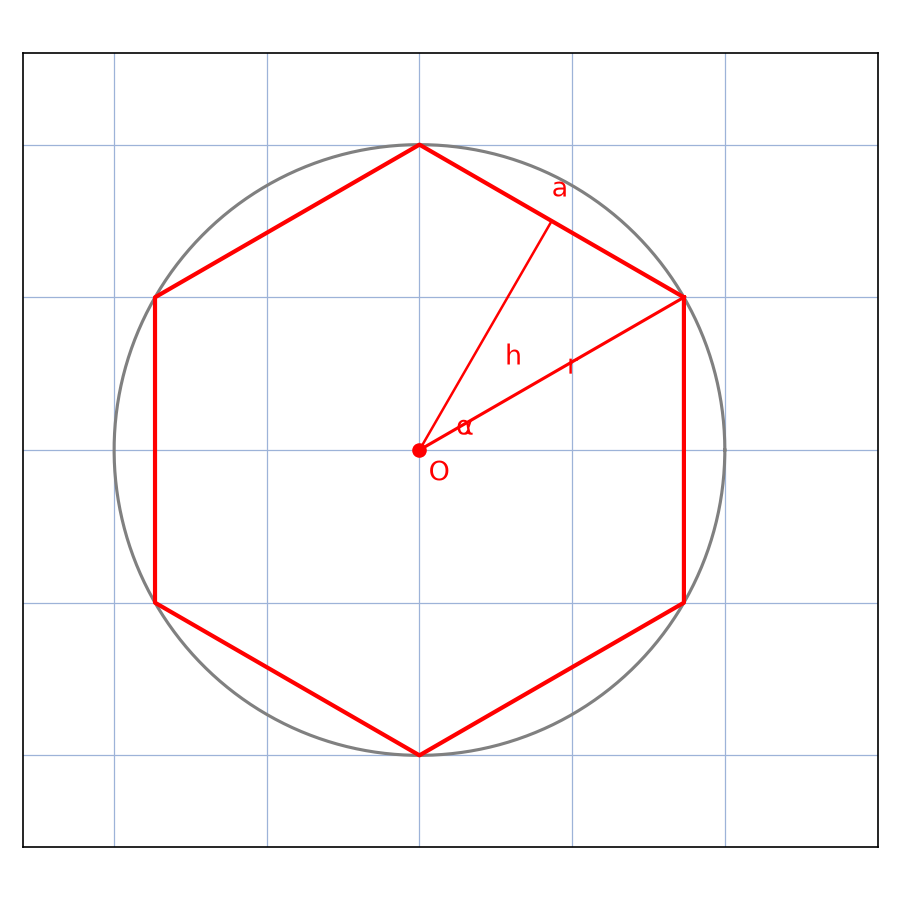
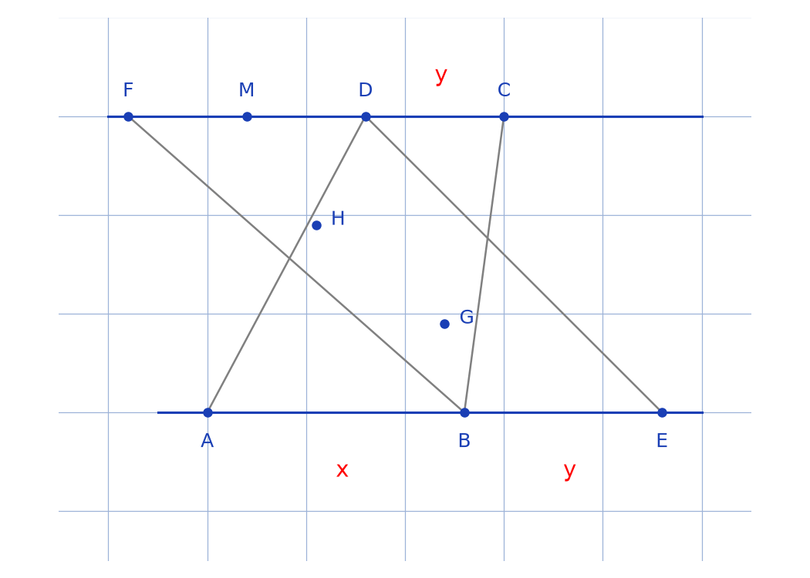
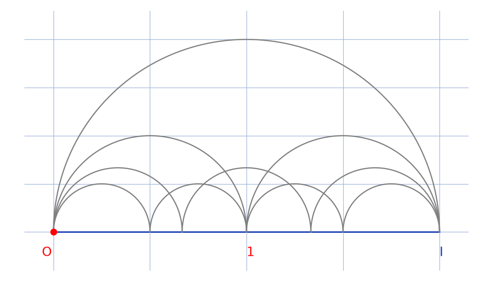
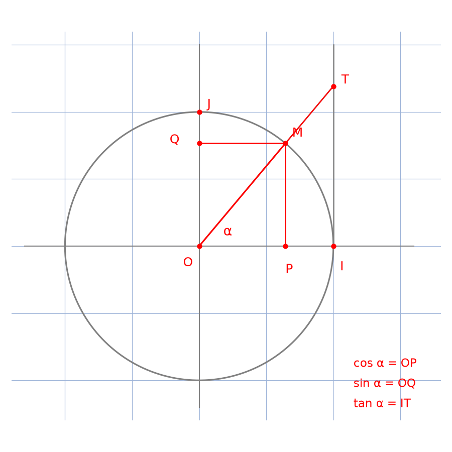

# Troisième Bloc-Notes — transcription fidèle (33 pages, 14/01/2013 → …)

Source : `troisieme-bloc-notes.pdf` (33 pages, 21 Mo). Carnet quadrillé, stylo bleu + rouge, chiffres « 1 » en forme de Λ.
Méthode : mot-à-mot, orthographe/notations d'origine conservées, figures rebuildées, erreurs signalées `[Correction]`.
CONVENTION FORME (fond COMME forme) : tout titre manuscrit rouge → `## <span style="color:red"><u>…</u></span>` (reste du texte bleu par défaut du carnet, sauf mention) ; toute figure → script `lab/scripts/reproduce_*.py` + PNG dans `assets/` + embed ``. Titres rouges convertis par `scripts/apply-forme-titres.py` (41/41, vérifié propre). Figures reproduites 4/4 : `assets/hexagone-cercle.png`, `assets/thales-erreur.png`, `assets/demicercles-pi2.png`, `assets/cercle-trigo.png` (scripts `lab/scripts/reproduce_*.py`, embed ci-dessus).

---

## p.1 (14/01/2013)

En haut à droite : 14/01/2013 (souligné).

* <span style="color:red"><u>Divisibilité par zéro (0)</u></span>

On a : a/b = a × 1/b = a × b' où b × b' = 1

Or pour b = 0

On obtient a/0 = a × 1/0 = a × 0' où 0 × 0' = 1

⇒ 0 = 1
↓
(Impossible) [rouge]

Donc ∀ a ∈ IR, a/0 n'existe pas

* <span style="color:red"><u>Résultat de a⁰ ∀ a ∈ IR*</u></span>

On a : aⁿ = aⁿ⁻¹⁺¹ ⇔ aⁿ = aⁿ⁻¹ × a

⇔ aⁿ⁻¹ = aⁿ/a avec a ≠ 0

pour n = 1 on obtient a¹⁻¹ = a/a

## p.2

Donc ∀ a ∈ IR* a⁰ = 1

* <span style="color:red"><u>Résultat de a⁻ⁿ ∀ a ∈ IR* et n ∈ IR</u></span>

On a : ∀ a ∈ IR* et n ∈ IR₊,

a⁰ = aⁿ⁻ⁿ

⇔ 1 = aⁿ × a⁻ⁿ

⇔ a⁻ⁿ = 1/aⁿ avec a ≠ 0 et n ∈ IR₊

[Correction : l'auteur écrit n ∈ IR₊ ; au sens strict des puissances entières il faudrait n ∈ IN. La formule reste vraie pour n réel avec a > 0.]

* <span style="color:red"><u>Résultat de 0!</u></span>

On a : ∀ n ∈ IN*, n! = n(n−1)!

⇔ (n−1)! = n!/n

pour n = 1, on obtient (1−1)! = 1!/1

⇔ 0! = 1

---

## p.3 (29/12/2019)

En haut à droite : 29/12/2019 (souligné).

## <span style="color:red"><u>* Démonstration Aire du cercle = πr²</u></span>

Soit un polygone régulier de n côtés de longueur a dont le cercle circonscrit a pour rayon r et de centre O



Figure d'origine (rouge) : hexagone régulier inscrit dans un cercle (crayon gris), centre O, un triangle central annoté : côté r (rayon), apothème h (flèche verticale), angle α au centre, base r en bas. À droite : a = 2π/n [lecture : le « r » semble omis, voir Correction].

Soit A, l'aire de ce polygone

A = h×r×n/2 or h = r sinα = r sin(2π/n)

[« or » pour « où » — faute conservée telle quelle.]

A = r²n/2 × sin(2π/n)

Posons N = 2π/n ⇔ n = 2π/N

## p.4

A = 2π/N × r²/2 × sin(N)

= r²π × sin(N)/N

Quand n → +∞, N → 2π/+∞ = 0

et le polygone devient un cercle de rayon r

Alors A = lim_{n→+∞} r²n/2 × sin(2π/n)

= lim_{N→0} r²π × sinN/N

A = r²π × 1

Alors, l'aire de tout cercle de rayon r est A = r²π

[Correction : a = 2π/n devrait être a ≈ 2πr/n (périmètre 2πr divisé par n) ; la suite du calcul utilise correctement sin(2π/n), donc la démo reste valide.]

---

## <span style="color:red"><u>p.5 — * Équations - Résolution</u></span>

- x√x = (√x)ˣ ⇔ (√x)³ = (√x)ˣ
avec x ≠ 0 ⇔ x = 3 ou x = 1
S_IR = {1 ; 3}

- x^√x = (√x)ˣ ⇔ (√x)^2√x = (√x)ˣ
avec x ≠ 0 ⇔ √x = 1 ou 2√x = x
⇔ √x = 1 ou x = 0 ou x = 4
S_IR = {1 ; 4}

- { √x |1 + 1/(x+y)| = 2 avec x+y ≠ 0, x,y ∈ IR₊* ; √y |1 − 1/(x+y)| = 3, Z ∈ ]0 ; 1[ }

Posons Z = 1/(x+y) ⇔ x+y = 1/Z

De plus √x × √y = 6/(1 − Z²)

⇔ xy = √(36/(1−Z²)²) [lecture incertaine sur la mise sous racine]

## p.6 (suite système)

or x+y = (√x)² + (√y)²

⇔ 1/Z = (2/(1+Z))² + (3/(1−Z))²

⇔ Z⁴ − 13Z³ − 12Z² − 13Z + 1 = 0

⇔ Z⁴ − 14Z³ + Z³ + Z² − 14Z² + Z² + Z − 14Z + 1 = 0

⇔ Z²(Z² − 14Z + 1) + Z(Z² − 14Z + 1) + (Z² − 14Z + 1) = 0

⇔ (Z² − 14Z + 1)(Z² + Z + 1) = 0

⇔ Z = 7 − 4√3 ou Z = 7 + 4√3

⇔ Z = 7 − 4√3 car Z ∈ ]0 ; 1[

d'où x+y = 1/Z = 1/(7 − 4√3) = (7 + 4√3)/36 [tel quel sur le manuscrit ; la rationalisation exacte donne 7 + 4√3 — le « /36 » recopie probablement le dénominateur de la ligne xy suivante]

xy = 36/(1 − (7 − 4√3)²)² = √(18624 − 10752√3) [tel quel, mise sous racine incertaine]

d'où le système x+y = 7 + 4√3 ; xy = 36/(18624 − 10752√3)

S = {(7 + 4√3)/4 ; (21 + 12√3)/4} [lecture incertaine sur le second élément]

---

## p.7 (fin système + carré magique)

[Haut de page, fin du système précédent :] ⇔ p! = 0 ; S_1N = {(n ; 0) ; (n ; 1)}, n ∈ IN [haut rogné, lecture partielle]

- <span style="color:red"><u>Carré magique</u></span>

```
        15  15  15
        ↓   ↓   ↓
     ┌───┬───┬───┐
15 ← │ 4 │ 9 │ 2 │ → 15
     ├───┼───┼───┤
15 ← │ 3 │ 5 │ 7 │ → 15
     ├───┼───┼───┤
15 ← │ 8 │ 1 │ 6 │ → 15
     └───┴───┴───┘
       15  15  15 (+ diagonales 15)
```

[Toutes les lignes, colonnes et diagonales somment à 15 — carré de Lo Shu.]

## <span style="color:red"><u>p.8 — * Où est l'erreur ?</u></span>

Figure : configuration de Thalès (points F, M, D, C en haut ; H, G au centre ; A, B, E en bas), segments croisés.



[Reproduction `lab/scripts/reproduce_thales_erreur.py` : droites F–M–D–C et A–B–E bleues, segments croisés gris, H et G aux intersections, x et y rouges.]

AB = x, CD = y

Dans ABH et CDH : y/x = HD/HB ⇔ HD = y·HB/x

Dans DFG et BEG : y/x = GB/GD ⇔ GB = y·GD/x

Posons HD − GB = y/x (HB − GD)

= y/x (HG + GB − GH − HD)

− (GB − HD) = y/x (GB − HD)

---

## p.9 (fin « Où est l'erreur ? » + paradoxes 2/ et 3/)

⇔ y = −x

⇔ |y| = |x|

Alors tout trapèze est un parallélogramme

[Chute du sophisme : de −(GB−HD) = y/x (GB−HD) on ne peut pas « simplifier » si GB = HD ; le cas GB = HD donne 0 = 0, et la conclusion y = −x suppose GB ≠ HD sans le justifier. Le « donc tout trapèze est un parallélogramme » est la fausse conclusion du paradoxe.]

2/ <span style="color:red">1 + 2 + 4 + 8 + 16 + … = −1</span>

On a : A = 1 + 2 + 4 + 8 + 16 + …

⇔ 2A = 2 + 4 + 8 + 16 + 32 + …

⇔ 2A + 1 = 1 + 2 + 4 + 8 + 16 + …

⇔ 2A + 1 = A

⇔ A = −1

⇔ 1 + 2 + 4 + 8 + 16 + … = −1

[Paradoxe classique : manipulation algébrique d'une série divergente comme si elle convergeait.]

3/ <span style="color:red">1 est le plus grand entier</span>

Soit A le plus grand entier

Supposons A > 1

⇔ A² > A

(absurde car A est supposé être le plus grand entier) [rouge]

## p.10 (suite 3/ + 4/ π = 2)

Supposons maintenant que A < 1 → absurde car A est supposé être le plus grand entier

On déduit que A = 1 ce qui est logique car A² = A = 1

4/ <span style="color:red">π = 2</span>

Figure (crayon) : un grand demi-cercle de diamètre [O, I], avec O marqué, « 1 » en rouge au milieu ; à l'intérieur, 2 moyens demi-cercles, puis 3 petits, puis 4 minuscules — emboîtement fractal.



[Reproduction `lab/scripts/reproduce_demicercles_pi2.py` : 1 grand + 2 moyens + 3 petits + 4 minuscules arcs gris sur [O, I] bleu, O et « 1 » rouges.]

- Pour le grand demi-cercle l₁ = 2πR/2 = π [rouge : π seul, R = 1 implicite]

- Pour les deux moyens l₂ = 2 × (2πr/(2×2)) = π car r = R/2

- Pour les trois petits l₃ = 3 × (2πr/(2×3)) = π

## p.11 (chute 4/ + 5/ 0 ≠ 0)

Ainsi, si l'on va jusqu'à l'infini l_∞ = π, or à l'infini ces demi-cercles se confondraient avec le diamètre

⇔ l_∞ = D = π

⇔ 2r = π

⇔ 2 = π car r = 1

[Paradoxe : la longueur ne se conserve pas par convergence simple vers le diamètre — la limite des longueurs ≠ longueur de la limite.]

5/ <span style="color:red">0 ≠ 0</span>

Soit a = 0 et b = 1

a ≠ b ⇔ a² ≠ ab

⇔ a² − b² ≠ ab − b²

⇔ (a−b)(a+b) ≠ b(a−b)

⇔ a+b ≠ b

⇔ a ≠ 0

⇔ 0 ≠ 0

[Erreur : simplification par (a−b) alors que a−b = −1 ≠ 0 ici… la faute est ailleurs : de a² ≠ ab on ne tire a²−b² ≠ ab−b² sans justifier la soustraction membre à membre d'inégalités — soustraire b² des deux côtés d'une inégalité large change le sens de façon non contrôlée. Le « paradoxe » illustre qu'on ne manipule pas ≠ comme =.]

## <span style="color:red">p.12 — 6/ i² = +1 et non −1</span>

On a : e^{2πi} = cos2π + i sin2π

= cos2π + 0

= 1

(e^{2πi})^p = 1^p

e^{2πip} = 1

pour p = 1/4

On obtient e^{2πi×1/4} = 1

⇔ e^{iπ/2} = 1

⇔ cos π/2 + i sin π/2 = 1

⇔ 0 + i = 1

⇔ i = 1 d'où i² = 1

[Erreur : (e^{2πi})^p = e^{2πip} n'est valable que pour p entier en complexes — la puissance non entière d'un complexe est multiforme.]

7/ <span style="color:red">∀ a ∈ IR −a ≥ 0</span> [raturé puis réécrit]

On a : −A = (−A)¹

= (−A)^{2×1/2} [suite p.13]

## p.13 (suite 7/ + 8/ 3 = 0)

= ((−A)²)^{1/2}

= (−A × −A)^{1/2}

= (A × A)^{1/2}

= (A²)^{1/2}

⇔ −A = A

[Erreur : (A²)^{1/2} = |A|, pas A — la racine carrée donne la valeur absolue. D'où la fausse conclusion −A = A, soit ∀ a ∈ IR −a ≥ 0.]

8/ <span style="color:red">3 = 0</span>

Soit E : x + 1 + 1/x = 0 avec x ≠ 0

⇔ x³ + x² + x = 0

⇔ x³ + x(x + 1) = 0

⇔ x³ + x(−1/x) = 0 car x + 1 + 1/x = 0 [le manuscrit écrit « car x+1+1/x = 0 » en réutilisant (E)]

⇔ x + 1 = −1/x

⇔ x³ − 1 = 0

⇔ x = 1, en vérifiant dans (E)

On a : 1 + 1 + 1/1 = 0 ⇔ 3 = 0

[Paradoxe : de (E) on tire x + 1 = −1/x, mais la substitution est fautive — x³ + x(−1/x) = x³ − 1 = 0 donne x = 1 qui ne vérifie pas (E) (1+1+1 = 3 ≠ 0). L'erreur est de « vérifier » en gardant le ⇔ : x = 1 n'est pas solution, la chaîne d'équivalences est rompue à la substitution.]

## <span style="color:red">p.14 — 9/ 0/0 = 2</span>

On a : 0/0 = (100 − 100)/(100 − 100)

= (10² − 10²)/(10(10 − 10))

= ((10 − 10)(10 + 10))/(10(10 − 10))

= 20/10

d'où 0/0 = 2 [rouge]

[Erreur : simplification par (10 − 10) = 0 — division par zéro.]

10/ <span style="color:red">1 = 2</span>

Soient A et B ∈ IR

Posons A = B

⇔ A² = AB

⇔ A² − B² = AB − B²

⇔ (A−B)(A+B) = B(A−B)

⇔ A+B = B [suite p.15]

## p.15 (chute 10/ + 11/ + début 12/)

⇔ B+B = B

⇔ 2B = B

⇔ 2 = 1

[Erreur : simplification par (A−B) = 0 — division par zéro, puisque A = B par hypothèse.]

11/ <span style="color:red">2 = 1, 1 = 0</span>

On a : 1² − 1² = 1 − 1

⇔ (1−1)(1+1) = (1−1)×1

⇔ 1+1 = 1

⇔ 2 = 1 ou 1 = 0

[Même erreur : simplification par (1−1) = 0.]

12/ <span style="color:red">2 = 3</span>

Soit f(x) = x³

f'(x) = 3x²

f(x) = x × x² = x² + x² + … + x² (x fois, accolade)

f'(x) = 2x + 2x + … + 2x (x fois, accolade) [suite p.16]

## p.16 (suite 12/ + 13/ 3 = 4)

= x × 2x

= 2x²

or f'(x) = 3x² = 2x²

⇔ 2 = 3

[Erreur : dériver terme à terme une somme dont le nombre de termes dépend de x comme si c'était constant — la « dérivée » de x²+…+x² (x fois) n'est pas 2x+…+2x car on dérive aussi le compteur.]

13/ <span style="color:red">3 = 4</span>

On a : 9 − 21 = 16 − 28

⇔ 3² − 3×7 = 4² − 4×7

⇔ 3² − 2×3×7/2 = 4² − 4×2×7/2

⇔ 3² − 2×3×7/2 + (7/2)² = 4² − 2×4×7/2 + (7/2)²

⇔ (3 − 7/2)² = (4 − 7/2)²

⇔ 3 − 7/2 = 4 − 7/2

⇔ 3 = 4

[Erreur : de X² = Y² on ne tire X = Y sans les signes — ici 3−7/2 = −1/2 et 4−7/2 = +1/2, opposés.]

---

## p.17 — 14/ IN = 1 [rouge : « tout entier vaut 1 »]

Soit n ∈ IN

On a : 1 + 2 + … + n = n(n+1)/2

⇔ 1 + 2 + … + n − 1 = n(n+1)/2 − 1

⇔ 1 + 2 + … + n − 1 = n(n−1)/2

⇔ 1 + 2 + … + n = n(n−1)/2 + 1

⇔ n(n+1)/2 = n(n−1)/2 + 1

⇔ n(n+1 − n+1)/2 = 1 [le manuscrit écrit « n(n+1−n+1) » sans le /2 à cette ligne]

⇔ n = 1

ainsi ∀ n ∈ IN, n = 1

[Erreur : 1+2+…+(n−1) = n(n+1)/2 − 1 est faux — on soustrait 1 (le dernier terme serait n, pas 1). La somme 1+…+(n−1) vaut (n−1)n/2 par la formule elle-même, et l'« équivalence » fabrique n = 1 en confondant les deux écritures.]

## <span style="color:red">p.18 — 15/ 0 = +∞</span>

On a : 1 = 1 ; 1 = −1+2 ; 1 = −2+3 ; 1 = −3+4 ; ⋮

Sommation membre à membre (accolade : 1+1+1+…+1, +∞ fois) = 1−1+2−2+3−3+…

+∞ = 0 [rouge]

[Paradoxe : sommation infinie traitée comme finie + réarrangement de série divergente.]

16/ <span style="color:red">1 = −1</span>

On a : 1 = √1

= √((−1)(−1))

= √−1 × √−1

= i × i

1 = i² = −1

[Erreur : √ab = √a√b faux pour a,b < 0 en réels — √−1 n'existe pas dans IR.]

---

## <span style="color:red"><u>p.19 — * Denombrement : les Grilles de Fleissner</u></span>

C'est une méthode de Cryptographie utilisée par les Allemands lors de la 1ère guerre mondiale. Elle est constituée d'un carré de côté 6. On le divise en 36 petits carrés égaux de côté (1) et on ôte 9 de ces carrés de sorte à ce que les trous qu'on obtient après une rotation d'angle 0, π/2, π, 3π/2 soient tous différents.

On peut alors fabriquer

N = (36 + 32 + … + 4)/9! [tel quel]

= (4×9 + 4×8 + … + 4×1)/9! = 4⁹ grilles

[Lecture : le manuscrit écrit « Fleissner » avec diverses orthographes (« Fleissner ») ; la formule compte les choix ordonnés de 9 trous ramenés aux rotations.]

## p.20 (généralisation + escalier 17 marches)

De façon générale pour construire une grille de Fleissner de côté n il faut pouvoir réaliser n²/4 trous (Ainsi, n doit être pair, n² est multiple de 4).

On aura alors

N = (4×n²/4 + 4(n²/4−1) + … + 4×1)/(n²/4)! = 4^{n²/4} grilles

- <span style="color:red"><u>De combien de façons peut-on descendre un escalier à 17 marches</u></span>

Soit S(n) le nbre de façons d'en descendre un à n marches [NB : on fait au plus 3 marches — encadré]

S(1) = 1, S(2) = 2, S(3) = 4

S(n) = S(n−1) + S(n−2) + S(n−3)

d'où S(17) = S(16) + S(15) + S(14) = 19513

## p.21 — algorithme Python de S(n)

On peut calculer S(n) à l'aide d'un algorithme sous Python [rouge : « d'un algorithme sous Python »]

```python
def s(n):
    if n < 1:
        return 0
    elif n == 1:
        return 1
    elif n == 2:
        return 2
    elif n == 3:
        return 4
    else:
        return s(n-1) + s(n-2) + s(n-3)
```

[Recopie fidèle de l'indentation manuscrite.]

## p.22 — Polygones / Échiquier

□ Polygone [rouge, souligné]

- Le nbre de polygones à n ≤ p côtés (avec p points) qu'on peut réaliser est N = 1/2 C_p^n × (n−1)!
- Le nbre de polygones convexes à n ≤ p côtés est N' = C_p^n
- Le nbre de diagonales d'un polygone à n côtés est N'' = n(n−3)/2

□ Echiquier [rouge, souligné]

Pour placer p tours dans un échiquier de taille n, on commence par choisir les p lignes où sont les tours soit C_n^p. Pour la tour située sur la 1ère ligne on a n choix, pour la 2e n−1 choix ainsi de suite [suite p.23]

## p.23 (fin Échiquier + Poker 52 cartes)

soit N = C_n^p × A_n^p = (C_n^p)² × p! de telle sorte que ces tours ne puissent se prendre

□ Poker (52 cartes) [rouge, souligné]

Tableau 4 colonnes : Trèfle (♣) | Carreau (♦) | Cœur (♥) | Pique (♠) ; 13 lignes : As, Roi, Dame, Valet, 10, 9, 8, 7, 6, 5, 4, 3, 2.

Une main de Poker est formée de 5 cartes extraites des 52 cartes

## p.24 — dénombrement des mains

- Quinte flush (5 cartes consécutives de la même couleur) est 9×4 = 36
- Carré (4 cartes de la même valeur) est C_4^4 × C_13^1 × C_48^1 = 13×48 = 624
- Full (3 cartes de la même valeur et 2 autres de la même valeur) est 13×C_4^3 ×12×C_4^2 = 13×4×12×6 = 3744
- Quinte (5 cartes consécutives qui ne sont pas toutes de la m̃ couleur) est 9×4⁵ − 9×4 = 9180
- Brelan (3 cartes de même valeur, ni un carré, ni un full) est 13×C_4^3 × C_48^2 − 13×C_4^3 ×12×C_4^2 = 54912 [suite p.25]

## <span style="color:red">p.25 — POKER (32 cartes)</span>

Tableau 4 colonnes : Trèfle (♣) | Carreau (♦) | Pique (♠) | Cœur (♥) ; rangs : As, Roi, Dame, Valet, 10, 9, 8, 7, 6, 5, 4, 3, 2.

[Correction : le titre annonce « 32 cartes » mais le tableau liste 13 rangs × 4 = 52 cartes — le vrai jeu de 32 cartes ne garde que As, Roi, Dame, Valet, 10, 9, 8, 7.]

## p.26 — inégalités des moyennes + limites usuelles

[Haut rogné : (√a − √b)² ≥ 0, a+b > 0, ⇔ √ab(√a − √b)²/(a+b) ≥ 0]

⇔ √ab ≥ 2ab/(a+b)

D'où (a+b)/2 ≥ √ab ≥ 2ab/(a+b) ∀ (a,b) ∈ (IR₊*, IR₊*)

□ lim_{t→0} sint/t = 1 ; lim_{t→0} tant/t = 1 [lecture : le manuscrit porte une surcharge « 1−cost »]

lim_{t→0} (1−cost)/t² = 1/2

Soit α ∈ ]0 ; π/2[ tel que M soit [suite p.27]

## p.27–28 — démonstration géométrique de lim sinα/α = 1

M image de α sur le cercle trigonométrique et T sur la tangente issue de I

Figure : cercle de centre O, point I (1,0), P projeté de M sur OI, Q projeté sur OJ ; cosα = OP, sinα = OQ, tanα = IT.



[Reproduction `lab/scripts/reproduce_cercle_trigo.py` : cercle et axes gris, triangle OMP + tangente IT rouges, points O, I, J, M, P, Q, T et angle α.]

On a : A_OIM = OI×MP/2

= 1×OQ/2

A_OIM = sinα/2

De plus A_OIT = OI×IT/2

= 1×tanα/2

A_OIT = tanα/2

De même A_secteur OIM = r²π×α/2π

= 1²×α/2

A_secteur OIM = α/2

Or A_OIM ≤ A_secteur OIM ≤ A_OIT

⇔ sinα/2 ≤ α/2 ≤ tanα/2

⇔ sinα ≤ α ≤ tanα

⇔ 1/tanα ≤ 1/α ≤ 1/sinα

⇔ cosα ≤ sinα/α ≤ 1

or lim_{α→0} cosα = lim_{α→0} 1 = 1 [suite p.29 : gendarmes ⇒ lim sinα/α = 1]

## p.29 (cas α < 0)

⇔ lim_{α→0} sinα/α = 1

Soit α ∈ ]−π/2 ; 0[

On a : −π/2 < α < 0

⇔ 0 < −α < π/2

⇔ sin(−α) < −α < tan(−α)

⇔ cos(−α) < sin(−α)/(−α) < 1

⇔ cosα < −sinα/−α < 1

⇔ cosα < sinα/α < 1

⇔ lim_{α→0} sinα/α = 1

Ainsi pour tout α ∈ ]−π/2 ; π/2[, lim_{α→0} sinα/α = 1

## p.30 — lim tanα/α et lim (1−cosα)/α²

- lim_{α→0} tanα/α = 1

On a : lim_{α→0} tanα/α = lim_{α→0} sinα/(α cosα)

= lim_{α→0} sinα/α × lim_{α→0} 1/cosα

= 1 × 1

lim_{α→0} tanα/α = 1

- lim_{α→0} (1−cosα)/α² = 1/2

On a : lim_{α→0} (1−cosα)/α² = lim_{α→0} 2sin²(α/2)/(4×(α/2)²)

= lim_{α→0} 1/2 × (sin(α/2)/(α/2))²

= 1/2 × 1²

lim_{α→0} (1−cosα)/α² = 1/2 [suite p.31]

## p.31 — lim (1−cosα)/α, Euler, inégalité triangulaire

- lim_{α→0} (1−cosα)/α = 0

On a : lim_{α→0} (1−cosα)/α = lim_{α→0} α × ((1−cosα)/α²)

= lim_{α→0} α × lim_{α→0} (1−cosα)/α²

= 0 × 1/2

lim_{α→0} (1−cosα)/α = 0

□ e^{πi} + 1 = 0

On a : e^{πi} + 1 = cosπ + i sinπ + 1

= −1 + i×0 + 1

= −1 + 1

e^{πi} + 1 = 0

□ |a+b| ≤ |a| + |b|

On a : Supposons que |a+b| > |a| + |b|

⇔ |a+b|² > (|a| + |b|)² [suite : haut de p.32 rogné — (1),(2),(3) donnent alors]

## p.32 (système + pari de Pascal)

(1), (2) et (3) donnent alors

{ x + 4y + 4z = a² ; x + 3y + 2z = a²/4 ; x + 2y + z = a²(5/3 − …√3/4) } [lecture partielle, bas de page rogné sur la photo]

On déduit alors que x = a²(5/3 + 1 − √3), y = (π/12 − 1 + √3/2)·a² et z = a²(−π/6 + 1 − √3/4) [tel quel, notations mixtes π/√ du manuscrit]

* Il faut croire en Dieu [bleu, « Dieu » en rouge]

En effet

1er Cas : tu es chrétien [« tu es » bleu, « chrétien » rouge]

- si Dieu existe, tu vas au paradis pour l'éternité = +∞ avec une probabilité de 1/2 soit +∞×1/2 = +∞

## p.33 (fin du pari)

- si Dieu n'existe pas, tu sombres dans le néant = 0 avec une probabilité de 1/2 soit 1/2×0 = 0

Bilan : 0 + ∞ = ∞, donc tu vas au paradis

2e Cas : tu es païen [« païen » rouge]

- Si Dieu n'existe pas tu sombres dans le néant = 0 avec une probabilité de 1/2 soit 1/2×0 = 0

- Si Dieu existe tu vas en enfer = −∞ pour l'éternité avec une probabilité de 1/2 soit −∞×1/2 = −∞

bilan : 0 − ∞ = −∞, donc tu vas en Enfer

En conclusion il vaut mieux croire en Dieu

---

*Fin du 3e Bloc-Notes (33/33 pages transcrites). Carnet mixte : résultats de base (p.1–2), aire du cercle (p.3–4), équations (p.5–6), 16 paradoxes « Où est l'erreur » (p.7–18), dénombrement/Fleissner/escalier/Python (p.19–21), polygones/échiquier/poker (p.22–25), moyennes/limites trigonométriques (p.26–31), Euler/triangle (p.31), système (p.32), pari de Pascal (p.32–33). Recopié sans censurer : le pari de Pascal est une pièce du manuscrit, transcrite telle quelle.*

---

## Figures

- **p.3 — hexagone inscrit** : `assets/hexagone-cercle.png` — script `~/KpihX-Labs/Explore/lab/scripts/reproduce_hexagone_cercle.py` (vérifié `uv run`, grille `#9db3d8`).
- **p.8 — Thalès « Où est l'erreur ? »** : `assets/thales-erreur.png` — script `~/KpihX-Labs/Explore/lab/scripts/reproduce_thales_erreur.py` (vérifié `uv run`, grille `#9db3d8`, `tick_params` sans étiquettes).
- **p.10 — demi-cercles π = 2** : `assets/demicercles-pi2.png` — script `~/KpihX-Labs/Explore/lab/scripts/reproduce_demicercles_pi2.py` (vérifié `uv run`, grille `#9db3d8`, `tick_params` sans étiquettes).
- **p.27–28 — cercle trigonométrique** : `assets/cercle-trigo.png` — script `~/KpihX-Labs/Explore/lab/scripts/reproduce_cercle_trigo.py` (vérifié `uv run`, grille `#9db3d8`, `tick_params` sans étiquettes).
- **p.7 — carré magique de Lo Shu** : tableau ASCII dans le corps (sommes à 15), pas de PNG — tracé texte suffisant, rien de plus à coder.

## Vocabulaire

- **Apothème / polygone régulier** : aire $A = r^2n/2 \times \sin(2\pi/n)$ → $\pi r^2$ (p.3–4).
- **Sophismes « Où est l'erreur »** : 16 paradoxes (trapèze-parallélogramme, $\pi = 2$, $i^2 = +1$, $0/0 = 2$…) avec chute signalée (p.7–18).
- **Grilles de Fleissner** : cryptographie, $N = 4^{n^2/4}$ (p.19–20) ; escalier 17 marches $S(17) = 19513$ (p.20–21).
- **Dénombrement** : polygones, tours sur échiquier, mains de poker 52 cartes (p.22–25).
- **Limites usuelles** : $\sin\alpha/\alpha \to 1$, $\tan\alpha/\alpha \to 1$, $(1-\cos\alpha)/\alpha^2 \to 1/2$ (p.26–31) ; identité d'Euler $e^{\pi i}+1 = 0$ (p.31).
