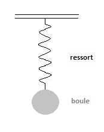
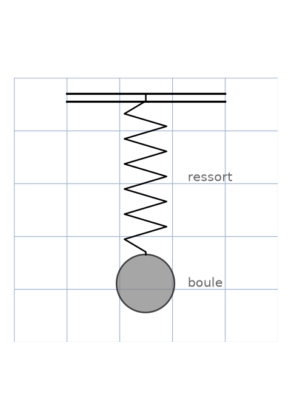

# Boule de cristal — schéma ressort + boule — transcription fidèle

> 🧾 **Photo originale :** `boule-cristal.jpg` (174×221, 5,4 Ko, JFIF 1.01) — 1 image, aucun texte manuscrit en dehors des 2 labels.
> 🔍 **Statut :** lisible (~100 %), transcrit mot à mot, schéma de physique minimaliste (dessin numérique simple, fond blanc).
> 📐 **Contenu :** oscillation masse-ressort (support fixe + zigzag + disque gris, labels « ressort » et « boule »).
> 🖼️ **Restauration :** copie de lecture `/tmp/qpd/boule-cristal_boule-cristal.jpg` (174×221) — transcription fidèle, rien d'inventé.



## Page 1 — transcription

Labels présents sur l'image (dactylographiés, pas manuscrits) :

- « ressort » — à droite du zigzag, mi-hauteur.
- « boule » — à droite du disque gris, bas de l'image.

Rien d'autre : ni titre, ni formule, ni chiffre, ni signature.



## Figures

Schéma d'origine (support + ressort + boule) : rebuild figure ci-dessous, reproduite en code.

```
━━━━━━━━━━━━━━  support fixe (2 traits horizontaux parallèles)
      |
      ∼∼   ressort (zigzag vertical, ~6 ondulations)
      |
     ●    boule (disque plein gris, ~1/4 de la hauteur)
```

- Haut : deux traits horizontaux parallèles = plafond/support fixe.
- Milieu : ligne brisée en zigzag vertical = ressort, attachée au support en haut.
- Bas : disque plein gris = boule (masse), attachée à l'extrémité basse du ressort.
- Labels à droite : « ressort » face au zigzag, « boule » face au disque.


Reproduction (script `reproduce_boule-cristal_1.py`, exécuté avec `uv run`) : support double trait, zigzag noir (~6 ondulations), disque gris, labels gris, quadrillage bleu `#9db3d8`. PNG relu et conforme.

## Vocabulaire / notions

- **Support fixe** : plafond ancré, point d'attache haut du ressort.
- **Ressort** : zigzag vertical, rappel élastique (loi de Hooke).
- **Boule (masse)** : disque plein gris en bout de ressort ; système masse-ressort vertical, oscillateur harmonique.
- **Fichier source intact**, copié `cp -p` depuis `Travaux/Images/`.
