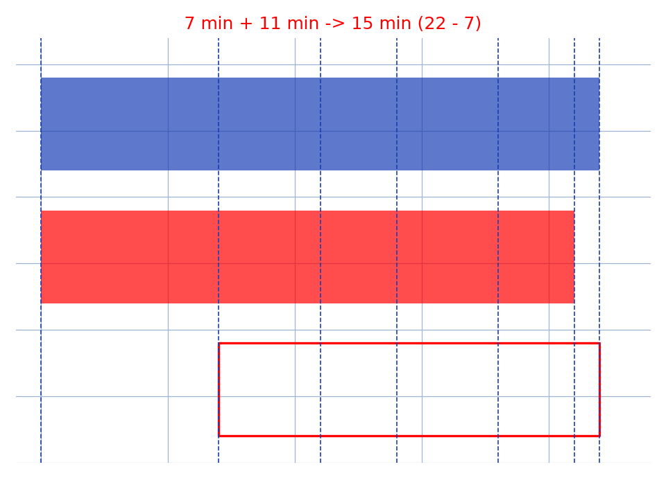

# Énigme des sabliers — transcription fidèle

🧾 Source : [enigme-sabliers.jpg](enigme-sabliers.jpg) — feuille manuscrite, encre noire, sabliers hachurés + deux schémas de circuits à droite.
🔍 Contenu : « cuisson de 15 min œuf avec [sabliers] 11 min et 7 min » — chronologie $t = 0, 7, 11, 22$ min ($22 - 7 = 15$).
📄 Transcription : mot-à-mot, image rendue en grand vers `/tmp/t-b/enigme-sabliers.jpg` — rien d'inventé.

## Page 1 — transcription

Sol : cuisson de 15 min œuf avec [schéma sablier] 11 min et [schéma sablier] 7 min

$t = 0$ : [sablier 7 bas hachuré] [sablier 11 bas hachuré] : on lance les deux ... on met ... [lecture incertaine] ... allumer le feu ... l'œuf

$t = 7$ : [sablier 7 : haut hachuré, bas clair] [sablier 11 partiel] ... on met de côté [lecture incertaine]

[raturé — grand sablier hachuré biffé d'une croix]

simultanément on retourne celui de ... 11 min et on met l'œuf au feu [lecture incertaine]

$22 - 7 = 15$ min (accolade)

$t = 11$ min : [sablier 11 haut hachuré] ... l'œuf cuit ... [lecture incertaine]

↻ (flèche de retournement)

$t = 22$ min : [sablier : haut clair, bas hachuré] ... on retourne ... on retire l'œuf [lecture incertaine]

Bonne dégustation (souligné, paraphe)

À droite : deux schémas de circuits électriques [motif incertain] — rectangles avec pont de 4 diodes en losange, une résistance (rectangle en haut) et une source (cercle en bas) ; le schéma du bas porte les annotations « $\wedge$ » et « $G_3$ » [lecture incertaine].

## Figures

1. **Frise des sabliers** (partie gauche) : 6 petits sabliers hachurés jalonnant $t = 0 \to 22$ min, avec flèche de retournement à $t = 11$.
2. **Circuits** (partie droite) : deux variantes du même circuit (pont de diodes + résistance + source), fils avec pont (saut de fil) en haut à droite.

Reproduction (script `reproduce_enigme-sabliers_1.py`, exécuté avec `uv run`) : frise chronologique — bande 11 min (bleu, $0\to11$, $11\to22$), bande 7 min (rouge, $0\to7$, $7\to14$, $14\to21$), fenêtre de cuisson 15 min ($7\to22$, cadre rouge), jalons en pointillés, quadrillage bleu `#9db3d8`. PNG relu et conforme à la solution ($22 - 7 = 15$).

## Vocabulaire / notions

- **Sabliers** : 7 min et 11 min ; **retournement** simultané.
- **Fenêtre de cuisson** : $22 - 7 = 15$ min.
- **Pont de diodes** (schémas de droite, motif incertain) : 4 diodes en losange, résistance, source.
