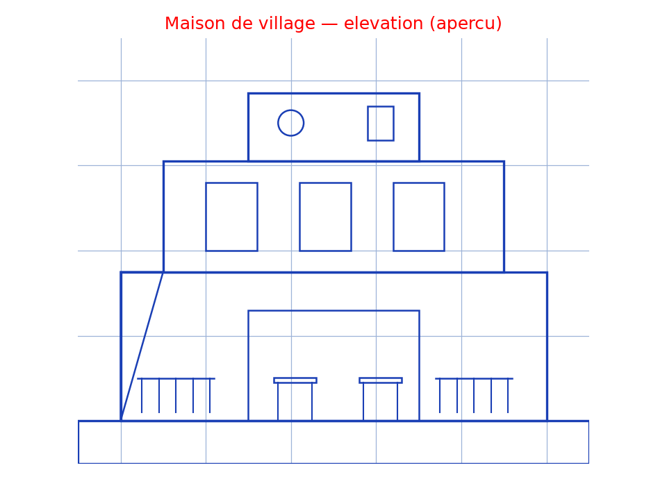

# Maison de village (aperçu 3D) — transcription fidèle

> 🧾 **Image originale :** `maison-village-apercu.png` (640×480, rendu 3D, lecture directe).
> 🔍 **Statut :** pas de texte manuscrit — description visuelle exhaustive ci-dessous, rien d'inventé.
> 📐 **Contenu :** aperçu d'une maison de village blanche à deux niveaux avec terrasse couverte.
> 🖼️ **Restauration :** lecture directe de l'original — transcription fidèle.

## Page 1 — transcription (description visuelle mot à mot)

Rendu 3D en blanc uni sur fond clair, vue en légère contre-plongée de trois-quarts face :

- **Rez-de-chaussée ouvert** : grand vide central formant terrasse couverte dallée (sol clair), bordée à gauche et à droite de balustrades basses à barreaux verticaux blancs.
- **Mobilier** : deux tables rectangulaires en bois (plateaux marron) entourées de chaises grises — une grande table à gauche (six chaises), une petite à droite ; au fond, porte sombre et fauteuil gris.
- **Étage** : corps blanc percé de baies vitrées rectangulaires (deux au centre, étroites fenêtres latérales), balcons filants à balustrades devant les baies.
- **Attique / toiture-terrasse** : volume supérieur en retrait avec oculus circulaire à gauche et petite baie verticale sombre à droite.
- **Socle** : dalle grise en saillie sous la maison (ombre portée douce).

Aucune annotation, aucune cote, aucun texte sur l'image.

## Figures

Schéma reproduit en élévation 2D fidèle : socle, rez-de-chaussée avec terrasse couverte et balustrades, tables, étage à trois baies, attique à oculus.

Reproduction (script `reproduce_maison-village-apercu_1.py`, exécuté avec `uv run`) : traits bleus, titre rouge, quadrillage bleu `#9db3d8`. PNG relu et conforme au rendu d'origine.

## Vocabulaire / notions

- **Terrasse couverte** : rez-de-chaussée ouvert sous l'étage, espace de vie extérieur abrité.
- **Balustrade à barreaux** : garde-corps vertical, répété aux balcons de l'étage.
- **Oculus** : petite ouverture circulaire de l'attique.
- **Toiture-terrasse** : couronnement horizontal du volume supérieur.
