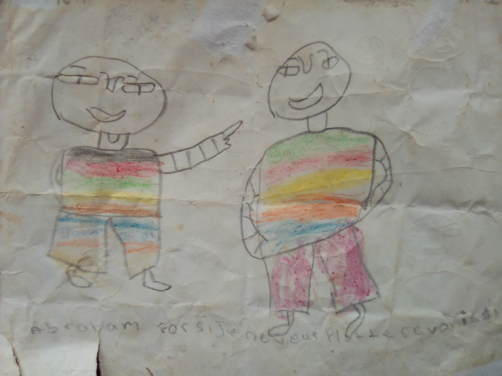
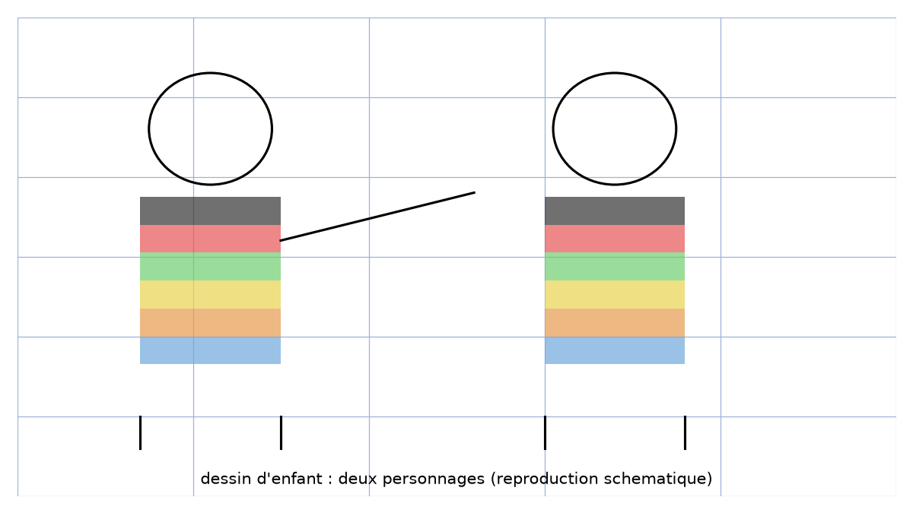

# Préambule manuscrit — transcription fidèle

> Source : `preambule-manuscrit.jpg` (1 page : dessin d'enfant aux crayons de couleur, une ligne au crayon en bas).
> Lisibilité du texte ~50 % (crayon pâle sur papier froissé).

## Page 1 — transcription fidèle

[reconstruction — motif : page sans énoncé, dessin seul + une ligne manuscrite en bas]

Texte en bas de page (crayon, [lecture incertaine]) :

« abraham forsi [...] Je ne veux plus le revoir » [lecture incertaine — ligne très pâle, relue sur rendu agrandi : « abraham », « Je ne veux plus », « le revoir » devinés, milieu illisible]

Description fidèle du dessin :

- Deux personnages schématiques (têtes rondes, sourires, corps rectangulaires à bandes horizontales coloriées : noir/rose/vert/jaune/orange/bleu ; pantalons rose/bleu).
- Personnage de gauche (lunettes) pointe la main droite vers le personnage de droite (plus grand, pantalon rose).
- Papier froissé, pliures et taches visibles.

## Figures

La figure, c'est le dessin lui-même. Reproduction schématique (silhouettes + bandes colorées) :

*Script : `~/KpihX-Labs/Explore/lab/scripts/reproduce_preambule-manuscrit_1.py` — description précise : deux cercles (têtes), deux rectangles à 6 bandes colorées, bras tendu du personnage de gauche, légende « dessin d'enfant : deux personnages ».*

## Vocabulaire / notions

- Dessin d'enfant (préambule non mathématique), bonhommes, bandes colorées.
- Ligne manuscrite pâle en bas (noms propres ? [lecture incertaine]).
