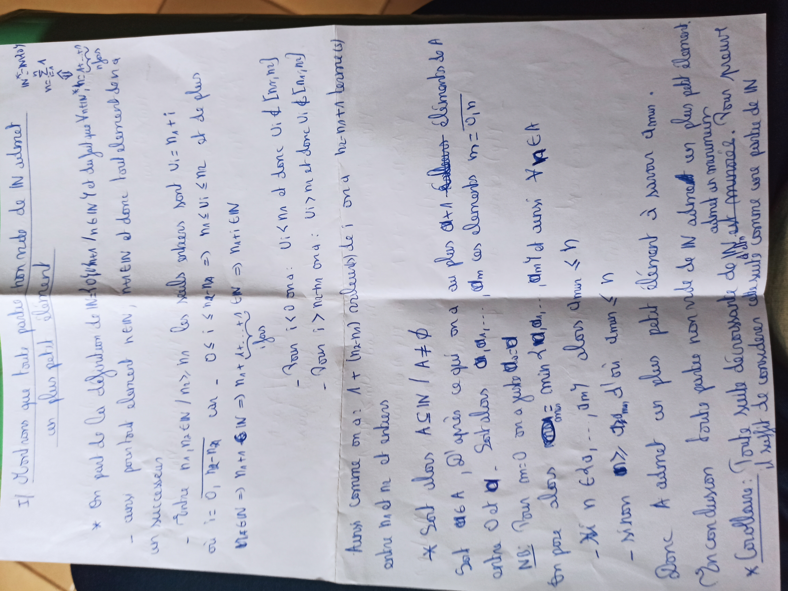
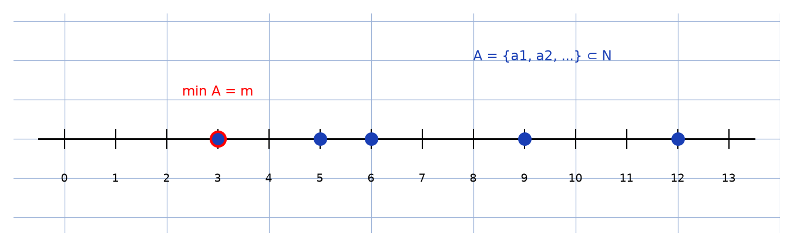

# Bon ordre de N — transcription fidèle

> Source : `bon-ordre-n.jpg` (1 page, stylo bleu, pliée, photo pivotée 90°).
> Lisibilité ~65 % — nombreuses [lecture incertaine].

## Page 1 — transcription fidèle

Il s'agit que toute partie non vide de $\mathbb{N}$ admet

un plus petit élément

$\ast$ On part de la définition de $\mathbb{N}$ : [lecture incertaine] $n \in \mathbb{N} \mid$ …

— avec pour tout élément $n \in \mathbb{N}$, $n + 1 \in \mathbb{N}$ et donc tout élément de $\mathbb{N}$ a

un successeur

— Entre $n_{1}, n_{2} \in \mathbb{N} \mid n_{2} > n_{1}$ les seuls entiers sont $n_{1} = n_{2} + !$ [lecture incertaine]

où $i := 0, \overline{n_{2} - n_{1}}$, car — $0 \le i \le n_{2} - n_{1} \Rightarrow n_{1} \le n_{1} + i \le n_{2}$ et de plus

$M \in \mathbb{N} \Rightarrow M_{n} + N \in \mathbb{N} \Rightarrow n_{1} + i \in \mathbb{N}$ [lecture incertaine]

— Soit ona : $U_{i} < n_{2}$ et donc $U_{i} \notin \{ [m_{n}, n_{2}] \}$ [lecture incertaine]

— Soit ona : $U_{i} > n_{2} + n$ et donc $U_{i} \notin \{ [m_{n}, n_{2}] \}$ [lecture incertaine]

Ainsi comme on a : $1 + (n_{2} - n_{1})$ ardeur(s) de $i$ on a $n_{2} - n_{1} + 1$ bonne(s) [lecture incertaine]

entre $n_{1}$ et $n_{2}$

$\ast$ Soit alors $A \subseteq \mathbb{N} \mid A \neq \emptyset$

Soit $a \in A$, Q' après ce qui on a au plus $a + 1$ [lecture incertaine] éléments de $A$

entre $0$ et $a$. Soit alors $a_{1}, a_{1}, \dots$ ces éléments $m = \overline{a_{n}}$ [lecture incertaine]

NB : Pour $m = 0$ on a juste … $a_{m1}$ et aussi $A \ni A$ [lecture incertaine]

En pos alors … $= \min \{ a_{1}, \dots \}$ alors $a_{\min} \le n$ [lecture incertaine]

— Si $n \in \{ a_{0}, \dots \}$, $a_{m1}$ … [lecture incertaine]

— Sinon … $a_{\min} \le n$ d'où $a_{\min} \le n$ [lecture incertaine]

Donc $A$ admet un plus petit élément à savoir $a_{\min}$.

En conclusion toute partie non vide de $\mathbb{N}$ admet son plus petit élément.

$\ast$ Corollaire : Toute suite décroissante de $\mathbb{N}$ … est … [lecture incertaine] Son …

Il suffit de considérer cette suite comme une partie de $\mathbb{N}$

## Figures

Pas de schéma sur le manuscrit. Illustration du principe (partie $A$ en bleu, minimum en rouge) :

*Script : `~/KpihX-Labs/Explore/lab/scripts/reproduce_bon-ordre-n_1.py`.*

## Vocabulaire / notions

- Bon ordre de $\mathbb{N}$, plus petit élément / minimum.
- Successeur, définition de $\mathbb{N}$, appartenance, inclusion.
- Borne, min, suite décroissante (corollaire).
