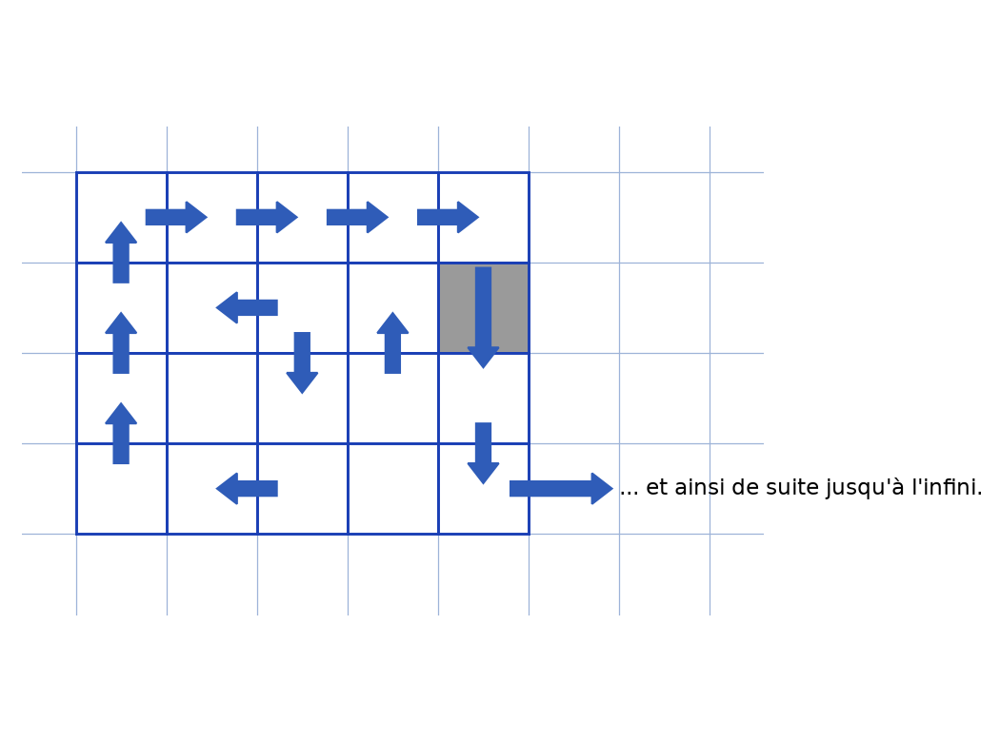
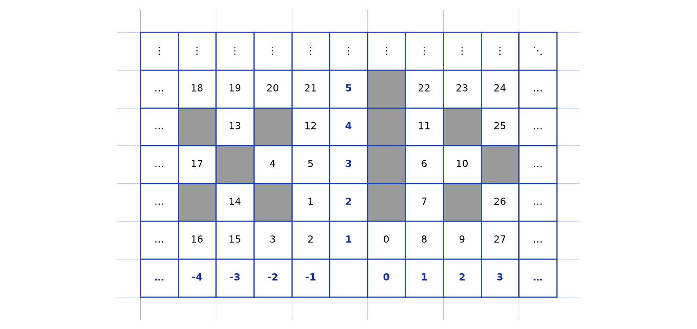

# Dénombrabilité de Q — transcription fidèle

> 🧾 **Manuscrit original :** `denombrabilite-q.pdf` (scan, 2 pages) · ✍️ KpihX
> 🔍 **Statut :** devoir ENSPY dactylographié, page 1 de garde et page 2 de démonstration ; deux figures reproduites (scripts + PNG + descriptions). Transcrit mot à mot.
> 📄 **Source scannée :** [denombrabilite-q.pdf](denombrabilite-q.pdf) (restaurée Datas1, vérifiée pdfinfo, 2026-09-07)

---

## Page 1

UNIVERSITÉ DE YAOUNDÉ I — THE UNIVERSITY OF YAOUNDE I

ÉCOLE NATIONALE SUPÉRIEURE POLYTECHNIQUE DE YAOUNDÉ — NATIONAL ADVANCED SCHOOL OF ENGINEERING OF YAOUNDE

DÉPARTEMENT DE MATHÉMATIQUES ET SCIENCES PHYSIQUES — MATHEMATICS AND PHYSICAL SCIENCES DEPARTMENT

[Logo ENSPY]

ANALYSE RÉELLE 1 (STI 1081)

DÉMONSTRATION DE LA DÉNOMBRABILITE DE $\mathbb{Q}$

➢ ÉTUDIANT :

NOM : KAMDEM POUOKAM

PRÉNOM : IVANN HAROLD

MATRICULE : 21P254

NIVEAU : 1

GROUPE : B1

➢ DATE : Dimanche, 03 Octobre 2021

➢ ENSEIGNANT : Pr E. TAKOU

## Page 2

Dire que $\mathbb{Q}$ est dénombrable, revient à trouver une bijection entre lui et $\mathbb{N}$, une sorte de procédé de numérotation biunivoque de ses éléments avec ceux de $\mathbb{N}$.

On se munit de la grille ci-dessous ($2^{\text{ième}}$), dont le repérage se fait à l'aide des éléments de $\mathbb{Z}$ suivant l'horizontale (de gauche à droite), et de ceux de $\mathbb{N} \setminus \{0\}$ suivant la verticale (de bas en haut).

Dans cette grille obtenue, on hachure toutes les cases de coordonnées $(p, q) \in \mathbb{Z} \times \mathbb{N} \setminus \{0\}$ avec $\text{pgcd}(p, q) \neq 1$. Chaque case ainsi non hachurée (de coordonnées $(p, q) \in \mathbb{Z} \times \mathbb{N} \setminus \{0\}$ avec $\text{pgcd}(p, q) = 1$), autre que celles des axes, correspond de façon unique à un rationnel à savoir $r = p/q$.

On numérote alors les cases (et par ce fait les rationnels correspondants), avec les entiers naturels, en suivant l'évolution des flèches ci-dessous ; ce qui permet de balayer toute la grille.

NB : Si une case est hachurée ou appartient aux axes, on la saute et on va à la suivante (dans l'ordre numérotation).

Figure 1 — grille de balayage : petite grille $5 \times 4$ avec flèches bleues qui serpentent (montée à gauche, traversée haute vers la droite, descente à droite en sautant la case hachurée grise, retour), flèche de sortie vers la droite avec « … et ainsi de suite jusqu'à l'infini ».

[Reproduction `lab/scripts/reproduce_denombrabilite_q_1.py` : grille bleue $5 \times 4$, case sautée grise, flèches bleu soutenu en serpent, flèche de sortie et mention.]

On obtient alors :

Figure 2 — tableau de numérotation (extrait) : $11$ colonnes, ligne de « $\vdots$ », $5$ lignes de numéros ($18$–$27$ visibles), colonne d'axe en gras ($5, 4, 3, 2, 1$), ligne d'étiquettes $p$ en gras ($-4, -3, -2, -1$, vide, $0, 1, 2, 3$) ; cases grises $=$ couples non premiers entre eux ou axes, sautées.

[Reproduction `lab/scripts/reproduce_denombrabilite_q_2.py` : valeurs relevées mot à mot sur le scan (lignes $18$–$27$, $13$, $12$, $11$, $25$, $17$, $4$, $5$, $6$, $10$, $14$, $1$, $7$, $26$, $16$, $15$, $3$, $2$, $0$, $8$, $9$), cases sautées grises, axe en bleu gras.]

On définit par $f$, cette correspondance décrite plus haut, qui à toute case non hachurée (tout rationnel) associe un entier naturel. Par exemple $f(0) = f(0 ; 1) = 0$, $f(1/2) = f(1 ; 2) = 7$, $f(-3/4) = f(-3 ; 4) = 13$ …

Pour avoir l'image d'un rationnel ou l'antécédent d'un entier naturel par $f$, il suffit d'agrandir la grille en suivant le processus énoncé en amont, jusqu'à l'apparition dudit élément, et on pourra ainsi identifier son correspondant par $f$.

**Justifions que f est bijective**

• En poursuivant la numérotation jusqu'à l'infini, on se rend compte que chaque case aura un unique numéro ; alors **f est une application**.

• **Injection :** Le processus de numérotation évoluant de façon strictement croissante, il est impossible à 2 cases différentes non hachurées (2 rationnels différents), d'avoir le même numéro ; alors **f est injective**.

• **Surjection :** Le processus de numérotation évoluant en pas de 1, on balaie ainsi tous les éléments de $\mathbb{N}$ et par ce fait, tout élément de ce dernier est attribué à une case (et ainsi à un rationnel) ; alors **f est surjective**.

$f$ étant une **application injective et surjective**, elle est **bijective**.

En conclusion $\mathbb{Q}$ **est dénombrable**.

Page 2 sur 2

---

## Figures

- **Figure 1 (p.2)** — grille de balayage $5 \times 4$ et flèches : `assets/grille-fleches.png` (reproduction via `lab/scripts/reproduce_denombrabilite_q_1.py`, vérifié `uv run` 2026-09-07 ; grille `#9db3d8`, `tick_params` sans étiquettes, jamais `axis("off")`).
- **Figure 2 (p.2)** — tableau de numérotation (extrait) : `assets/tableau-numerotation.png` (reproduction via `lab/scripts/reproduce_denombrabilite_q_2.py`, vérifié `uv run` 2026-09-07, valeurs relevées mot à mot).

## Vocabulaire

- **Dénombrable** : en bijection avec $\mathbb{N}$.
- **$\text{pgcd}(p,q) = 1$** : case non hachurée $\leftrightarrow$ rationnel $r = p/q$.
- **Hachuré / sauté** : case ignorée par la numérotation (axes ou couples non premiers entre eux).
