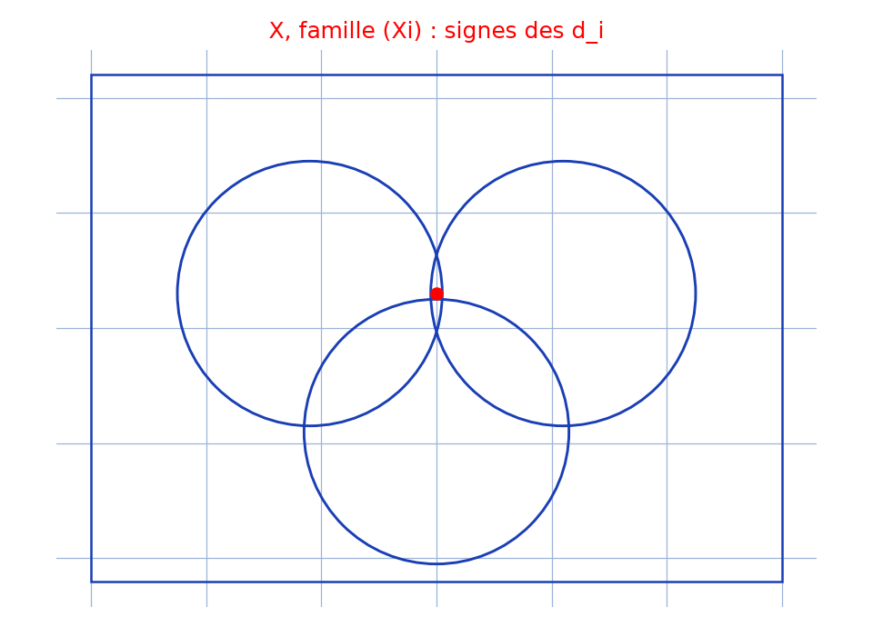

# Ensembles et parties — transcription fidèle

🧾 Source : [ensembles-parties-ens.jpg](ensembles-parties-ens.jpg) — page de cahier à carreaux, encre bleue (un doigt masque une zone au centre).
🔍 Contenu : raisonnement ensembliste avec famille $(X_i)$, coefficients $d_i$, sommes $\sum d_i x_i$, disjonction selon les signes.
📄 Transcription : mot-à-mot, image rendue en grand vers `/tmp/t-b/ensembles-parties-ens.jpg` — rien d'inventé.

## Page 1 — transcription

Soit ... le vecteur ... inter... [lecture incertaine — haut de page, lignes serrées]

$M \subset \{0, 1\}^n$ de $X_i$ ... telle que ... [lecture incertaine]

est en ... sur la ... coordonnée est 1 [lecture incertaine]

... une famille ... de l'en... ... [lecture incertaine]

... est une ... Il ... qu'elle est ... [lecture incertaine]

... (un ... ...) ... avec ... $d_i$ ... $\neq 0$ ? [lecture incertaine]

... $\sum_{i \in ...} d_i x_i = 0$ avec ... $d_i$ ... $\neq 0$ ? [lecture incertaine]

Posons $X$ = ... [lecture incertaine]

$(1) \Rightarrow \sum_{i \in K} d_i x_i = 0$ ... [lecture incertaine]

Or ... les ... ... de ... sont [lecture incertaine]

... pour ... et ... ... ... ... ... ... [lecture incertaine — zone sous le doigt]

... ... ... ... ne peuvent [lecture incertaine]

... tous ... ... tous $> 0$ [lecture incertaine]

... $I = \sum |x_i|$ ... $+ \phi$ ... ... ... [lecture incertaine]

Prenons ... dans ... $\sum d_i x_i$ ... ... ... [lecture incertaine]

Donc : $\sum d_i x_i$ ... ... ... ... ... [lecture incertaine]

Soit ... dans $X \subset UX_i$, ... $\sum_{i \in ...} d_i x_i$ ... $< 0 \iff \sum_{j \in ...} d_j x_j < 0$ [lecture incertaine]

$D$ ou ... $X_i$ ... $\Rightarrow X \subset ...$ [lecture incertaine]

En raisonnant de façon analogue, ... ... ... [lecture incertaine — dernière ligne]

## Figures

Pas de figure géométrique : page de calculs ensemblistes uniquement.

Reproduction (script `reproduce_ensembles-parties-ens_1.py`, exécuté avec `uv run`) : ensemble $X$ (rectangle) recouvert par une famille $(X_1, X_2, X_3)$ (trois cercles), intersection centrale marquée (rouge) évoquant la disjonction selon les signes des $d_i$, quadrillage bleu `#9db3d8`. PNG relu et conforme au cadre ensembliste du manuscrit.

## Vocabulaire / notions

- **Famille d'ensembles** $(X_i)$, **recouvrement** $X \subset \bigcup X_i$.
- **Coefficients** $d_i$, **sommes** $\sum d_i x_i$, **signe** ($> 0$ / $< 0$).
- **Raisonnement par cas** selon les signes + « façon analogue » pour le cas symétrique.
