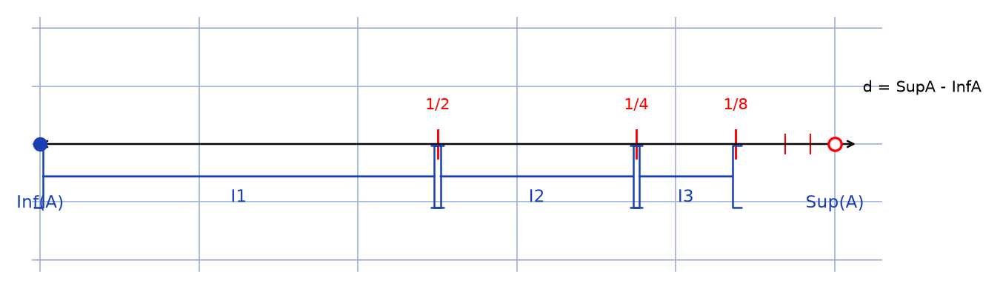

# Hint bornes dénombrable — transcription fidèle

> 🧾 **Manuscrit original :** `hint-bornes-denombrable.pdf` (scan, 4 pages) · ✍️ KpihX
> 🔍 **Statut :** démonstration manuscrite (stylo bleu) : tout borné de $\mathbb{R}$ admettant un point d'accumulation est dénombrable ; une figure reproduite (script + PNG + description). Transcrit mot à mot.
> 📄 **Source scannée :** [hint-bornes-denombrable.pdf](hint-bornes-denombrable.pdf) (restaurée Datas1, vérifiée pdfinfo, 2026-09-07)

---

## Page 1

Soit $A \subset \mathbb{R}$ | $A$ est borné et admet un pt d'accum

$\star$ Mtg [lecture incertaine — « Mtg », probablement « Montrer que »] $A$ est dénombrable

Soit $a$ = pt d'accum ($A$)

$A \subset \mathbb{R}$ d'où $A$ a des bornes Sup et Inf du fait que $A$ est borné

– Si $a = \text{Sup } A$ [raturé — suite de la ligne biffée, se lit encore : « $A$ = $A \setminus \{\text{Sup } A\}$ n'a pas de pt d'accum »]

Donc $\text{Inf}(A) \in A'$ car sinon $\forall \varepsilon > 0, \exists x_{\varepsilon} \in A$ |

$\text{Inf}(A) + \varepsilon > x_{\varepsilon} \Rightarrow (]\text{Inf}(A) - \varepsilon ; \text{Inf}(A) + \varepsilon[ \setminus \{\text{Inf}(A)\}) \cap A \neq \varnothing$

[annotation sous la ligne : $\cup$, $x_{\varepsilon} \in$, puis gribouillis [raturé]]

$\Rightarrow \text{Inf}(A)$ est un pt d'accum de $A$ ($A$ !) [lecture incertaine — « ($A$ !) »]

De surcroît $A'$ peut être représenté sur son intervalle support $I$, lequel intervalle sera partitionné car l'indique ce schéma [*sic* — « car l'indique », lire « comme l'indique »]

Figure 1 — partition de l'intervalle support : droite graduée de $\text{Inf}(A)$ (point plein) à $\text{Sup}(A)$ (point vide), marques $1/2$, $1/4$, $1/8$, sous-intervalles $I_1$, $I_2$, $I_3$, … ; mention $d = \text{Sup } A - \text{Inf } A$.

[Reproduction `lab/scripts/reproduce_hint-bornes-denombrable_1.py` : droite bleu/rouge, point plein en $\text{Inf}(A)$, point vide en $\text{Sup}(A)$, marques $1/2$, $1/4$, $1/8$, accolades $I_1$, $I_2$, $I_3$, mention $d = \text{Sup } A - \text{Inf } A$.]

## Page 2

[raturé — ligne biffée en tête de page, se lit encore : « On définit ainsi la suite $(U_n)_{n \in \mathbb{N}}$ »]

$\forall n \in \mathbb{N}^*$, on pose alors $A_n = I_n \cap A'$. Car $A_n$ est borné et n'a pas de pt d'accumulation, d'après la contraposée du théorème de Bolzano-Weierstrass, $|A_n| = m_n$, $m_n \in \mathbb{N}$ [lecture incertaine — passage « $|A_n|$ $m_n \in \mathbb{N}$ », sens : $A_n$ est fini]

• $A_1 \neq \varnothing$ puisque $\text{Inf}(A) \in A_1$. On numérote ainsi ses elts dans l'ordre croissant : $u_1 < \dots < u_{m_1}$.

• $\forall n \in \mathbb{N}^*$, si $A_{m_1+n} \neq \varnothing$ [lecture incertaine — indice « $m_1+n$ »], on numérote ses elts ce suit [*sic* — « ce suit »] dans l'ordre croissant : $u_{m_1+1} < \dots < u_{m_1+m_n}$

On définit ainsi la suite $(U_n)_{n \in \mathbb{N}}$ par $U_0 = \text{Inf}(A) < U_1 < \dots < U_{m_1} < U_{m_1+1} < \dots < U_{m_1+m_n} < \dots$

[en marge droite — calculs biffés [raturé] : « $U_1$ », encadrés, « $U_1 + U_2 = 0$ », « $U_1 - U_2 = 0$ »]

• A tout $n \in \mathbb{N}^*$ est associé un elt $U_n$ de $A$

• tout $a \in A$ est dans une partition $A_n$ de $A$ ($n \in \mathbb{N}^*$) et donc a un numéro $m \in \mathbb{N}^*$ (d'après ce qui précède)

– Si $\text{Sup } A \in A$ on pose $U_0 = \text{Sup } A$ [*sic* — $U_0$ désigne déjà $\text{Inf}(A)$ plus haut] et on peut conclure que $A$ est dénombrable

– si [raturé — « Sup » biffé] $A$ est en bijection avec $\mathbb{N}^*$ [raturé — membre biffé] par $f : \mathbb{N}^* \to A$, $n \mapsto U_n$ et ainsi avec $\mathbb{N}$ par la bijection $g : \mathbb{N} \to A$, $n \mapsto U_{n+1} = f(n+1)$

## Page 3

Donc $A$ est dénombrable

– Si $a = \text{Inf } A$, le raisonnement est le m̂ que celui qui précède en remplaçant tous les mots de la m̂ famille que $\text{Sup } A$ apparaissant plus haut par leurs équivalents dans les mots de la m̂ famille que $\text{Inf}$ [*sic* — formulation]

– Si [raturé — début biffé] $a \in \mathopen{]}I(A)\mathclose{[} \setminus \{\text{Inf } A, \text{Sup } A\}$ [lecture incertaine — « $]I(A)[$ », peut-être $]\text{Inf}(A), \text{Sup}(A)[$], on pose

$A' = A \cap [\text{Inf } A, a[$ et en raisonnant comme au début on définit la bijection $(U_n)$ entre $A'$ et $\mathbb{N}$

et $A'' = A \cap [a ; \text{Sup } A]$ et en raisonnant comme dans le cas où on avait ($a = \text{Inf } A$), on construit la bijection $(V_n)$ entre $A''$ et $\mathbb{N}$.

Puisque ($A'$ et $A''$) forment un système de partition de $A$ alors la bijection entre $A$ et $\mathbb{N}$ est $(W_n)_{n \in \mathbb{N}}$ [raturé — première formule biffée] $W_n = U_{n/2}$ si $n$ pair, $W_n = V_{(n-1)/2}$ si $n$ impair

et on peut donc conclure que $A$ est dénombrable (car $A'$ et $A''$ sont infinis en cardinal)

$\star$ Mtr $\lim W_n = a$ [lecture incertaine — « Mtr », probablement « Montrer que »]

Soit $\varepsilon > 0$. $a$ = pt d'accumulation de $A$ ainsi : $\forall N \in \mathbb{N}$ / ($]a-\varepsilon, a+\varepsilon[ \cap A \ni W_n$, $W_N$ [lecture incertaine — passage très raturé, $\forall n \in \mathbb{N}$ | $n > m$, $U_{n_2}$, $U_N$ et $V_n \in V_{N_1}$, $\forall n \in \mathbb{N}$ | $n > m$, d'où $|U_n - a| \leqslant \varepsilon$, $|V_n - a| \leqslant \varepsilon$]

## Page 4

où les elts de $(W_n)$ étant alternativement ceux de $(U_n)$ et $(V_n)$ aussi [raturé — mot biffé] en prenant $N = 2m+1$, $\forall n \in \mathbb{N}, n \geqslant N \Rightarrow \begin{cases} \text{si } n \text{ pair } |W_n - a| = |U_{n/2} - a| < \varepsilon \text{ avec } n/2 \geqslant m \\ \text{si } n \text{ impair } |W_n - a| = |V_{(n-1)/2} - a| < \varepsilon \text{ avec } (n-1)/2 \geqslant m \end{cases}$

c-à-d $\forall n \in \mathbb{N}, n \geqslant N \Rightarrow |W_n - a| < \varepsilon$

Donc $\lim W_n = a$

NB : cas où $A''$ est fini en cardinal (sans nuire à la généralité) [raturé — calcul biffé en marge gauche] $(W_{n_2})$ [$W_0 = V_0$, …], $W_{N_1}$, $V_{N_1}$ où $c = |A''|$ [lecture incertaine — « $W_0 = V_0 \dots$, $W_{n/c}$, $W_n = U_{n-c}$ »]

(si $|A''| = 0$ on revient au tout $1^{er}$ cas)

et pour $\lim W_n = a$ prendre $N = N' + c$

Page 4 sur 4

---

## Figures

- **Figure p.1** — partition de l'intervalle support en $I_1, I_2, I_3$ : `assets/hint-bornes-denombrable-1.png` (reproduction via `lab/scripts/reproduce_hint-bornes-denombrable_1.py`, vérifié `uv run` 2026-09-07 puis re-vérifié `uv run` au 2e passage ; grille `#9db3d8`, `tick_params` sans étiquettes, jamais `axis("off")`). Pp.2–3 vérifiées visuellement au 2e passage le 2026-09-07 (rendus `/tmp/s9/hint-2.png`, `/tmp/s9/hint-3.png`, r150) — tête biffée « On définit ainsi la suite $(U_n)$ », $|A_n| = m_n$, « ce suit » *sic*, conflit $U_0$ (*sic* maintenu), marge biffée $U_1 \pm U_2 = 0$, $]I(A)[$ lu tel quel, $W_n = U_{n/2}$ / $V_{(n-1)/2}$ confirmés ; aucune figure pp.2–3. P.4 vérifiée visuellement au 2e passage le 2026-09-07 (rendu `/tmp/s16/hint-p4-4.png`, r150) — $N = 2m+1$, cas pair/impair, $\lim W_n = a$, NB $A''$ fini ($W_0 = V_0$, $c = |A''|$, $W_n = U_{n-c}$, $N = N'+c$) confirmés ; aucune figure p.4.

## Vocabulaire

- **Pt d'accumulation** : $a$ tel que tout voisinage épointé rencontre $A$.
- **$A'$** : ensemble dérivé (pts d'accumulation de $A$).
- **Mtg / Mtr** : « montrer que » ([lecture incertaine]).
- **Bolzano-Weierstrass (contraposée)** : borné sans pt d'accumulation $\Rightarrow$ fini.
