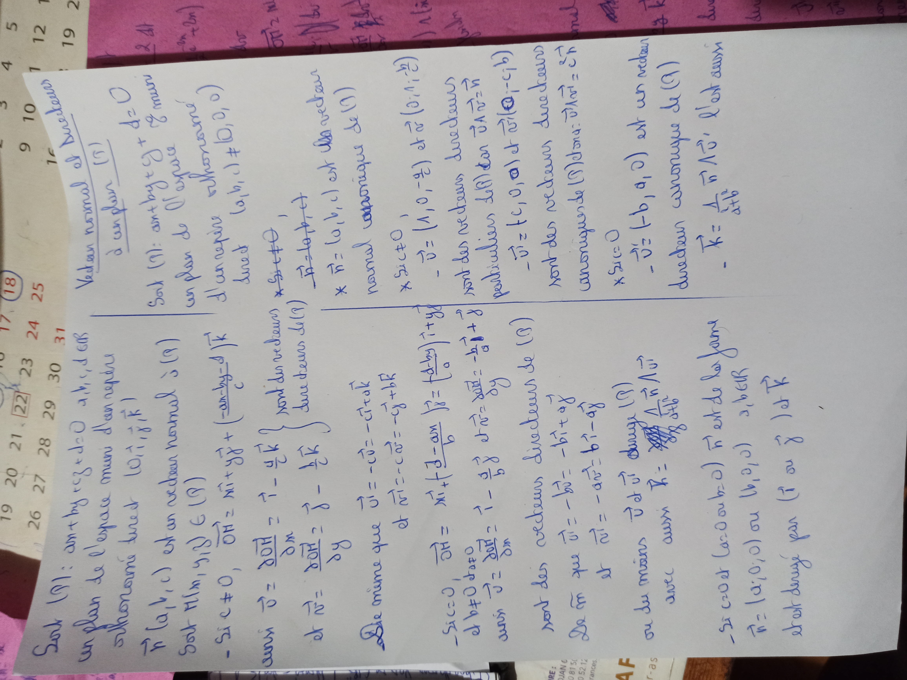
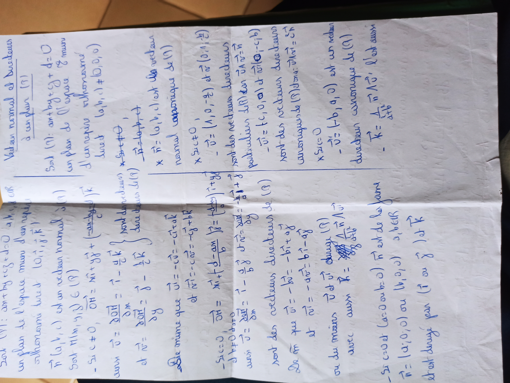
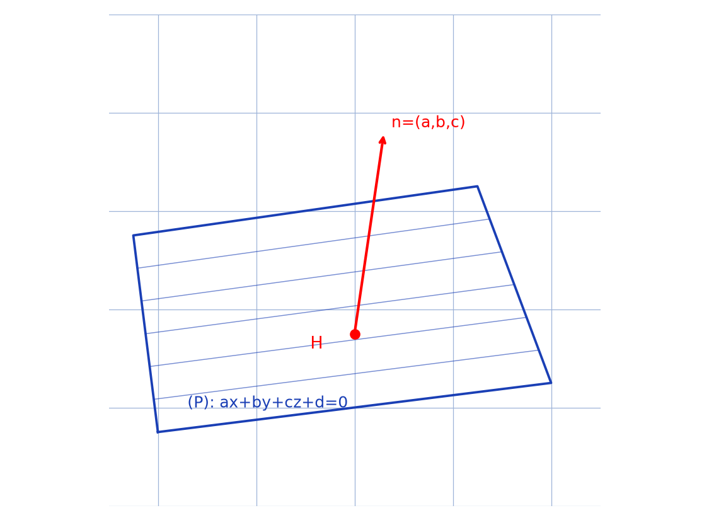
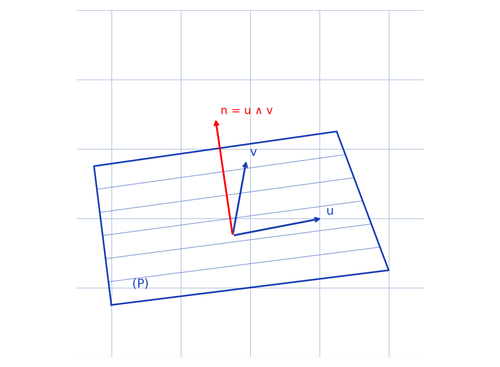

# Vecteur normal et directeurs d'un plan — transcription fusionnée (2 prises)

> Sources : `caracteristiques-plan-prise1.jpg` (ex-`caracteristiques-plan-1`, cadrage large) + `caracteristiques-plan-prise2.jpg` (ex-`caracteristiques-plan-2`, cadrage resserré) — même feuille, stylo bleu, 1 page.
> Vérification visuelle le 2026-09-07 (rendus `/tmp/mtn/` en grand) : même titre « Vecteur normal et directeurs à un plan (P) », même pliure, même écriture — fusion confirmée.
> Lisibilité ~80 %.

## Page 1 — transcription fusionnée (meilleure des 2 anciens md ; prise1 ≡ prise2)

Vecteur normal et directeurs

à un plan $(P)$

---

Soit $(P) : ax + by + cz + d = 0$

un plan de l'espace muni

d'un repère orthonormé

direct $(O, \vec{i}, \vec{j}, \vec{k})$ [lecture incertaine sur « direct »]

$\vec{n}(a, b, c)$ est un vecteur normal à $(P)$

Soit $M(x, y, z) \in (P)$

- Si $c \neq 0$, $\overrightarrow{OH} = x\vec{i} + y\vec{j} + \left(\frac{-ax - by - d}{c}\right)\vec{k}$

ainsi $\vec{u} = \frac{\partial \overrightarrow{OH}}{\partial x} = \vec{i} - \frac{a}{c}\vec{k}$ et $\vec{v} = \frac{\partial \overrightarrow{OH}}{\partial y} = \vec{j} - \frac{b}{c}\vec{k}$ sont deux vecteurs

directeurs de $(P)$

De même que $\vec{u} = -c\vec{i} + a\vec{k}$

et $\vec{v_{1}} = -c\vec{j} + b\vec{k}$ [lecture incertaine]

- Si $c = 0$, $\overrightarrow{OH} = x\vec{i} + \frac{d - ax}{b}\vec{j} + \left(\frac{d - by}{a}\right)\vec{i} + y\vec{j}$ [lecture incertaine]

et $b \neq 0$ dato [lecture incertaine]

ainsi $\vec{v} = \frac{\partial \overrightarrow{OH}}{\partial x} = \vec{i} - \frac{a}{b}\vec{j} + \vec{0}$ [lecture incertaine] et $\vec{u} = \frac{\partial \overrightarrow{OH}}{\partial y} = \frac{-b}{a}\vec{j} + \vec{0}$ [lecture incertaine]

sont des vecteurs directeurs de $(P)$

De même que $\vec{u_{1}} = -b\vec{i} + a\vec{j}$

et $\vec{u_{2}} = -ax\vec{j} = b\vec{i} - a\vec{j}$ [lecture incertaine]

ou du moins $\vec{u}$ et $\vec{v}$ … avec aussi $\vec{k} = \dots$ [lecture incertaine]

- Si $c = 0$ et ($a = 0$ ou $b = 0$) $\vec{n}$ est de la forme

$\vec{n} = (a, 0, 0)$ ou $(b, 0, 0)$ [lecture incertaine] …

droit donné par ($\vec{i}$ ou $\vec{j}$) et $\vec{k}$

## Figures

Pas de figure tracée sur le manuscrit. Deux reproductions complémentaires :

Prise 1 — plan $(P)$ et normale $\vec{n} = (a, b, c)$ au point $H$ :

*Script : `~/KpihX-Labs/Explore/lab/scripts/reproduce_caracteristiques-plan_1.py` (ex-`reproduce_caracteristiques-plan-1_1.py`).*

Prise 2 — deux directeurs $\vec{u}, \vec{v}$ dans $(P)$ et $\vec{n} = \vec{u} \wedge \vec{v}$ :

*Script : `~/KpihX-Labs/Explore/lab/scripts/reproduce_caracteristiques-plan_2.py` (ex-`reproduce_caracteristiques-plan-2_1.py`).*

## Vocabulaire / notions

- Plan $(P) : ax + by + cz + d = 0$, repère orthonormé direct.
- Vecteur normal $\vec{n}(a, b, c)$, vecteurs directeurs $\vec{u}, \vec{v}$.
- Point $H$, vecteur $\overrightarrow{OH}$, dérivées partielles $\partial / \partial x$, $\partial / \partial y$.
- Produit vectoriel $\vec{n} = \vec{u} \wedge \vec{v}$ ; cas $c \neq 0$ / $c = 0$, vecteurs canoniques $(c, 0, -a)$, $(0, c, -b)$, $(-b, a, 0)$.
