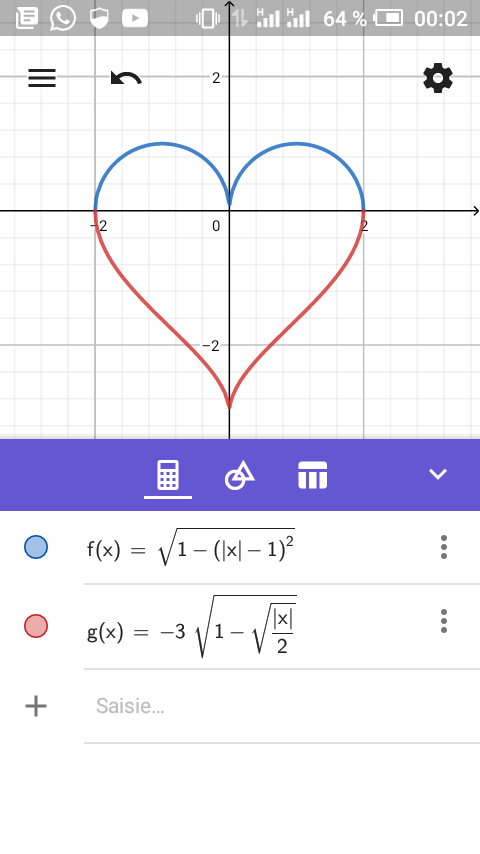
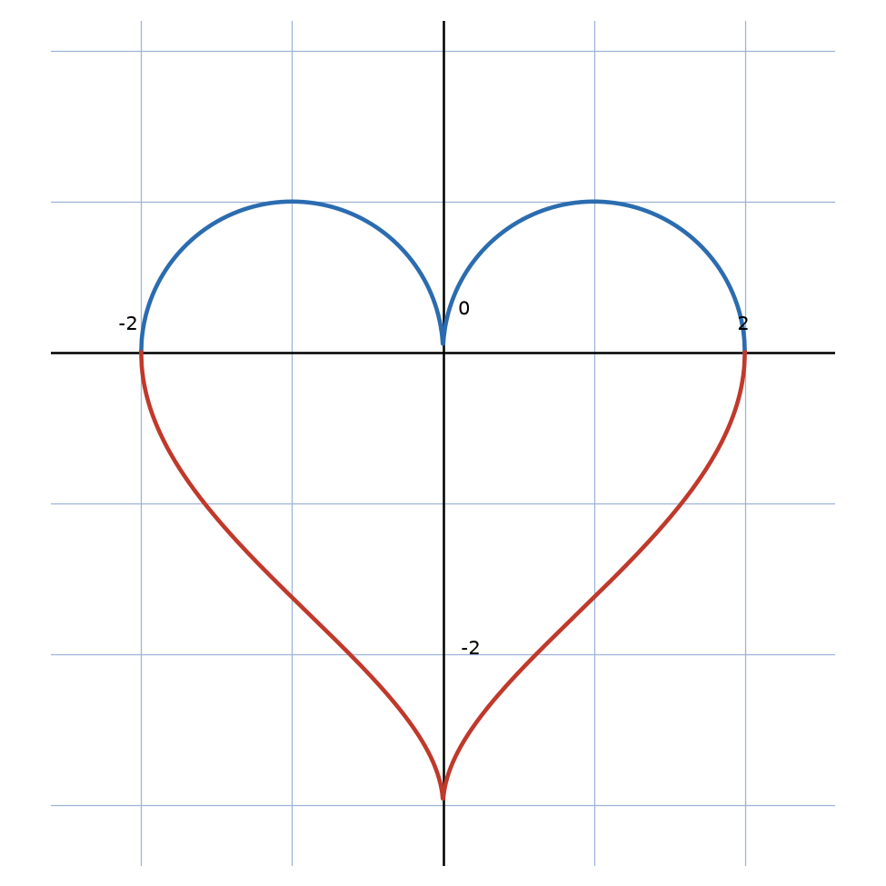

# Cœur (schéma GeoGebra) — transcription fidèle

> Source : `coeur-schema.png` (1 page = 1 capture d'écran, application de géométrie).
> Barre de statut : 64 % batterie, 00:02. Lisibilité 100 %.

## Page 1 — transcription fidèle

[Zone graphique] Repère cartésien : axe horizontal gradué ($-2$, $0$, $2$), axe vertical (graduations $2$ en haut, $-2$ au milieu).

Courbe bleue (haut) : deux demi-cercles se rejoignant en $(0, 0)$ — forme haute du cœur.

Courbe rouge (bas) : pointe du cœur descendant jusqu'à $(0, \approx -2{,}7)$.

[Barre violette d'outils : calculatrice, géométrie, tableau, chevron.]

[Liste des fonctions :]

- (pastille bleue) $f(x) = \sqrt{1 - (|x| - 1)^{2}}$
- (pastille rouge) $g(x) = -3\sqrt{1 - \sqrt{\frac{|x|}{2}}}$
- (champ) Saisie…

## Figures

Le schéma EST la figure : cœur formé de $f$ (haut) et $g$ (bas). Reproduction matplotlib :

*Script : `~/KpihX-Labs/Explore/lab/scripts/reproduce_coeur-schema_1.py` — description précise : axes noirs fins, grille bleu-gris, $f$ en bleu sur $[-2, 2]$, $g$ en rouge sur $[-2, 2]$, aspect égal, marques $-2, 0, 2$.*

## Vocabulaire / notions

- Valeur absolue $|x|$, racine carrée, fonctions définies par morceaux implicites.
- Repère cartésien, courbe représentative, saisie d'expression.
