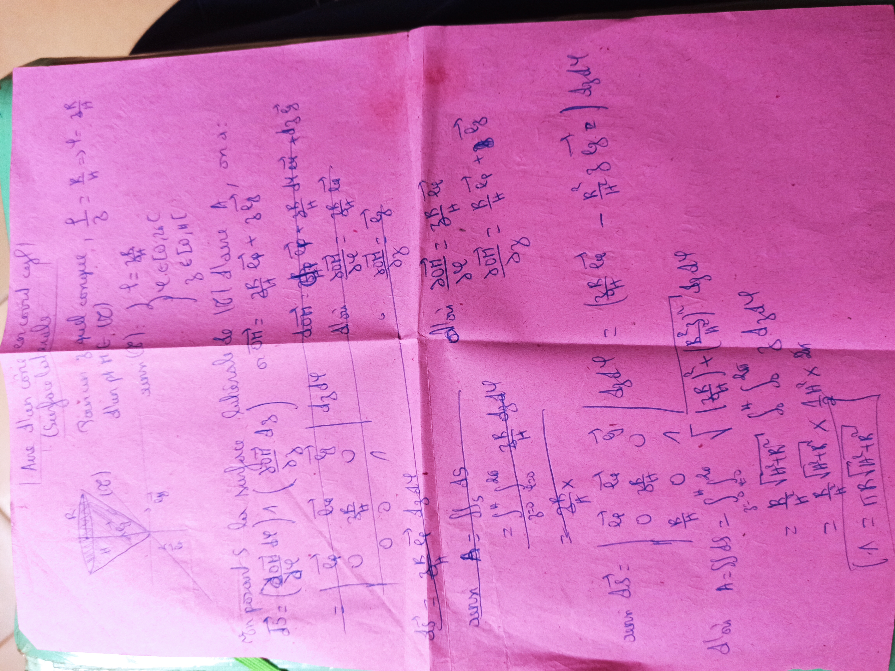
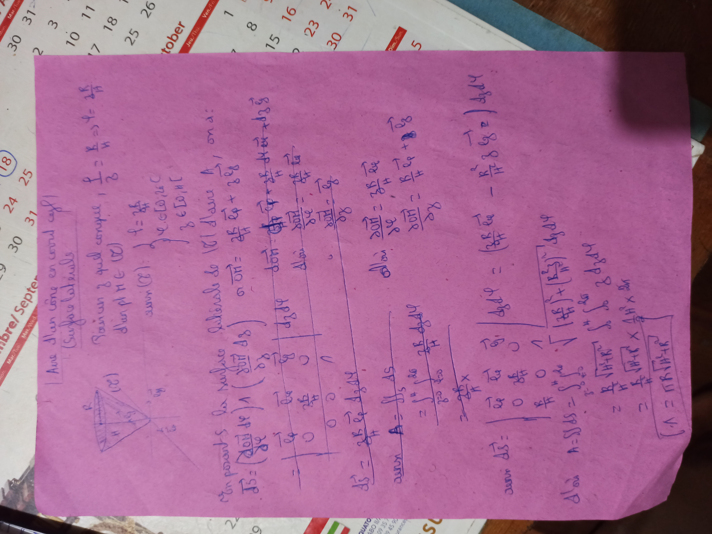
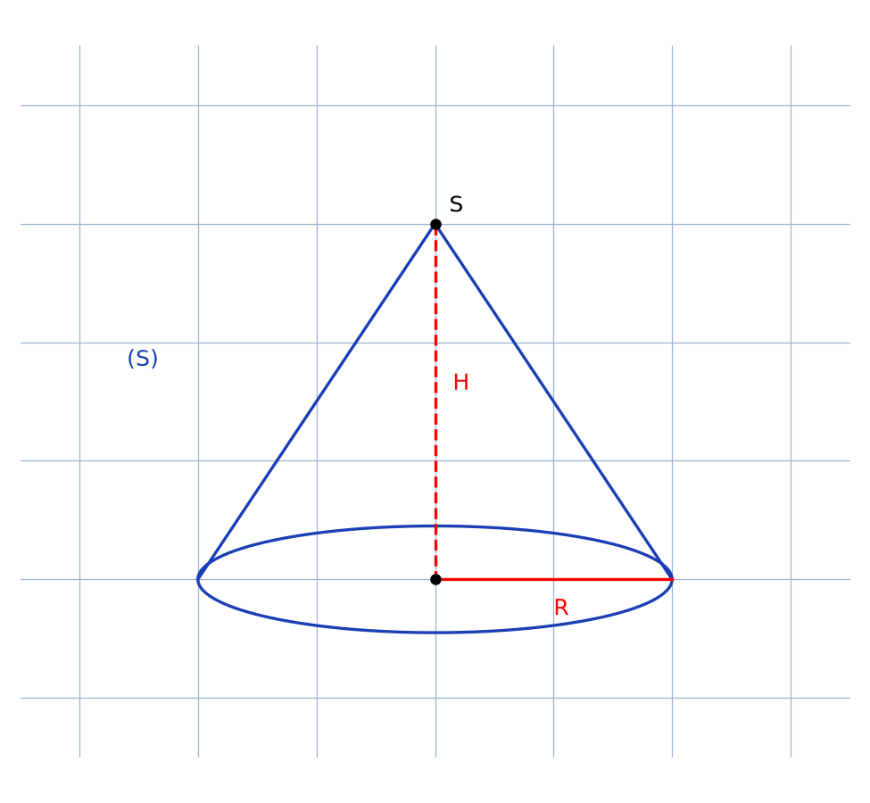
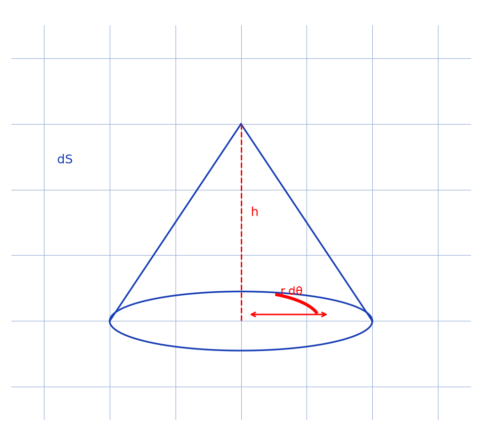

# Aire d'un cône en cylindriques — transcription fusionnée (2 prises)

> Sources : `cone-cylindriques-prise1.jpg` (ex-`cone-coordonnees-1`, sans calendrier) + `cone-cylindriques-prise2.jpg` (ex-`cone-cylindriques-2`, avec calendrier en fond) — même feuille rose, stylo bleu, 1 page.
> Vérification visuelle le 2026-09-07 (rendus `/tmp/mtn/` en grand) : même titre « Aire d'un cône en … (Surface latérale) », même schéma de cône bas-gauche, mêmes plis en croix — fusion confirmée.
> Lisibilité ~60 %, [lecture incertaine] fréquents.

## Page 1 — transcription fusionnée (prise1 ≡ prise2, textes identiques)

Aire d'un cône en … [lecture incertaine]

(Surface latérale)

Soit un … quelconque, $f = \frac{R}{3}$ [lecture incertaine] $\Rightarrow f = \frac{R}{H}$

$d'un$ $M \in (S)$ … avec $(S) : f = \frac{R}{H}$ [lecture incertaine]

avec $(S) : \begin{cases} \ell \in C[\dots] \\ \theta \in \Omega, h[\dots] \end{cases}$ [lecture incertaine]

[schéma $(S)$ : cône, base hachurée, axe, $H$, sommet]

En param… la surface latérale de $(S)$ … on a :

$\vec{OS} = \left(\frac{\partial OH}{\partial R} \wedge \frac{\partial OH}{\partial \theta} \, dS\right)$ [lecture incertaine]

$\sigma \overrightarrow{OH} = \frac{\partial R}{\partial H} \vec{e_{\theta}} + \frac{2R}{H} \vec{e_{\theta}} + \dots$ [lecture incertaine]

donc … $\frac{\partial \dots}{\partial \dots} \times \frac{\partial \dots}{\partial H} \, dH \, d\theta + \dots$ [lecture incertaine]

| $\vec{e_{r}}$ | $\vec{e_{\theta}}$ | $\vec{e_{z}}$ | $d_{3}q$ |
|---|---|---|---|
| $\dots$ | $\frac{2R}{H}$ | $0$ | $0$ |
| $\dots$ | $0$ | $0$ | $0$ |
| $\dots$ | $\dots$ | $0$ | $1$ |

$d\vec{S} = \frac{2R}{H} \vec{e_{\dots}} \, d\dots \, d\dots$ [lecture incertaine]

alors $A = \iint_{S} dS$

$= \int_{2\pi}^{2\pi} \int_{\dots}^{\dots} \frac{2R}{H} \, dH \, d\theta \, dh$ [lecture incertaine]

$= \frac{2R}{H} \times \dots$

$\vec{OH} = \frac{\partial OH}{\partial R} \frac{2R}{H} \vec{e_{R}} + \frac{T_{0}}{R} \vec{e_{\theta}} + \dots$ [lecture incertaine]

avec $d\vec{S} = \begin{vmatrix} \vec{e_{r}} & \vec{e_{\theta}} & \vec{e_{z}} \\ 0 & \frac{2R}{H} & 0 \\ \dots & 0 & 1 \end{vmatrix} \, d\theta \, dh$ [lecture incertaine]

$= \left(\frac{2R}{H} \, \vec{e_{\dots}} - \frac{R^{2}}{H} \vec{e_{\dots}} \right) d\theta \, dh$ [lecture incertaine]

D'où $A = S\iint dS = \int_{0}^{2\pi} \int_{0}^{H} \frac{R}{H} \sqrt{1 + R^{2}} \dots \int_{0}^{H} \int_{0}^{2\pi} d\theta \, dh$ [lecture incertaine]

$= \frac{R}{H} \sqrt{1 + R^{2}} \dots \times \frac{1}{3} H^{2} \times 2\pi$ [lecture incertaine]

$= \frac{R}{H} \sqrt{1 + R^{2}} \dots$ [lecture incertaine]

$(A = \pi R \sqrt{1^{2} + R^{2}})$ [encadré, lecture incertaine — résultat attendu : $A = \pi R\sqrt{R^{2} + H^{2}}$]

## Figures

Schéma bas-gauche du manuscrit : cône de sommet $S$, base circulaire hachurée de rayon $R$, hauteur $H$, point $M$ sur la surface. Deux reproductions complémentaires :

Prise 1 — cône général (sommet $S$, centre $C$, hauteur $H$ rouge pointillée, rayon $R$ rouge) :

*Script : `~/KpihX-Labs/Explore/lab/scripts/reproduce_cone-cylindriques_1.py` (ex-`reproduce_cone-coordonnees-1_1.py`) — sommet $S$ noir en haut, centre $C$ de la base, ellipse bleue (base), génératrices bleues $S$–bords, hauteur rouge pointillée $SC = H$, rayon rouge $C$–bord $= R$, étiquette $(S)$ bleue.*

Prise 2 — élément d'intégration cylindrique ($r$, $d\theta$) :

*Script : `~/KpihX-Labs/Explore/lab/scripts/reproduce_cone-cylindriques_2.py` (ex-`reproduce_cone-cylindriques-2_1.py`) — cône bleu, hauteur rouge pointillée $h$, arc rouge $r\,d\theta$ sur la base, double flèche rouge du rayon, étiquette $dS$ bleue.*

## Vocabulaire / notions

- Aire latérale d'un cône, surface $(S)$, rayon $R$, hauteur $H$.
- Paramétrisation, produit vectoriel, élément de surface $d\vec{S}$, double intégrale $\iint_{S}$.
- Coordonnées cylindriques $(r, \theta, h)$, déterminant, intégrale double sur la surface, aire latérale $A = \pi R\sqrt{R^{2}+H^{2}}$.
