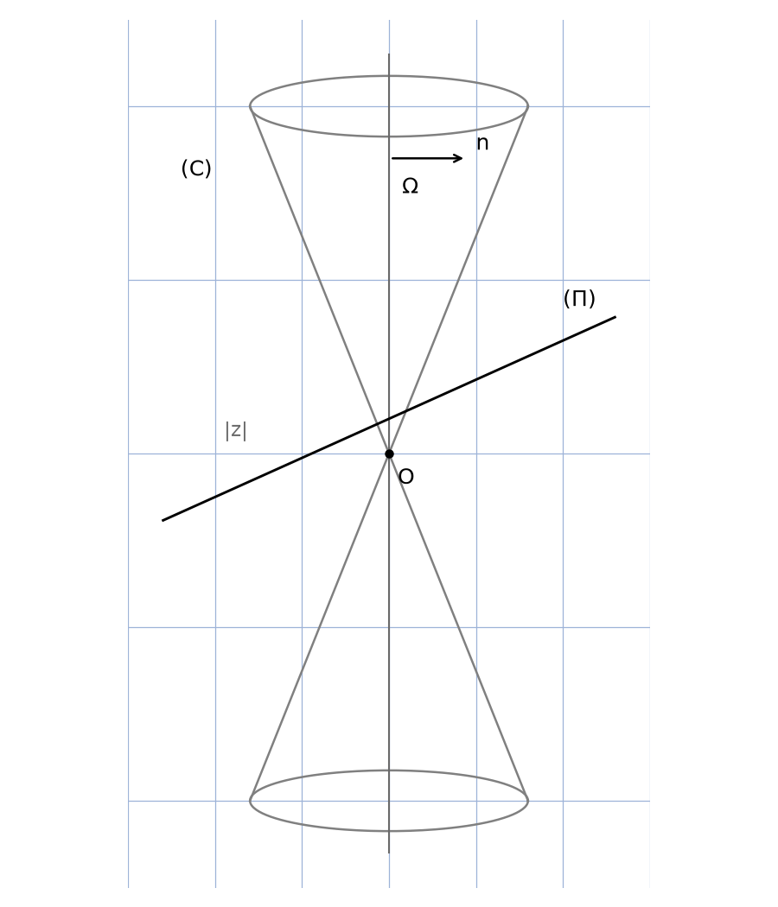
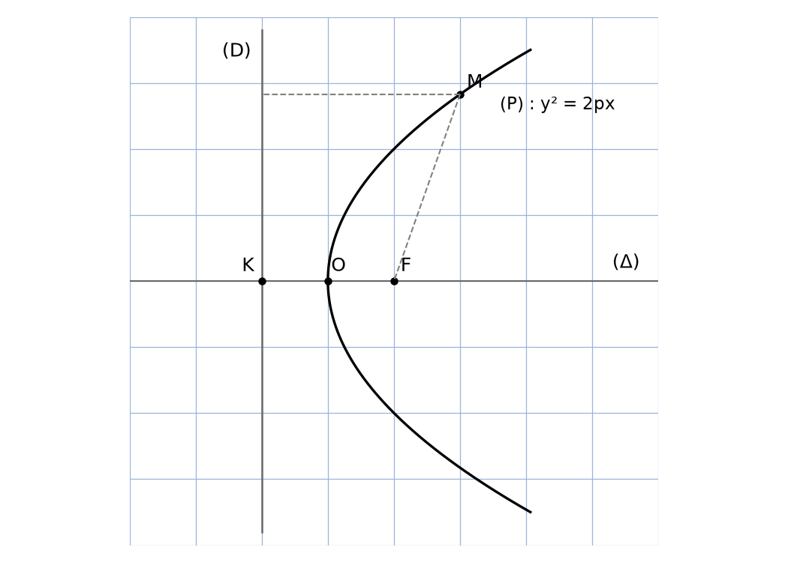
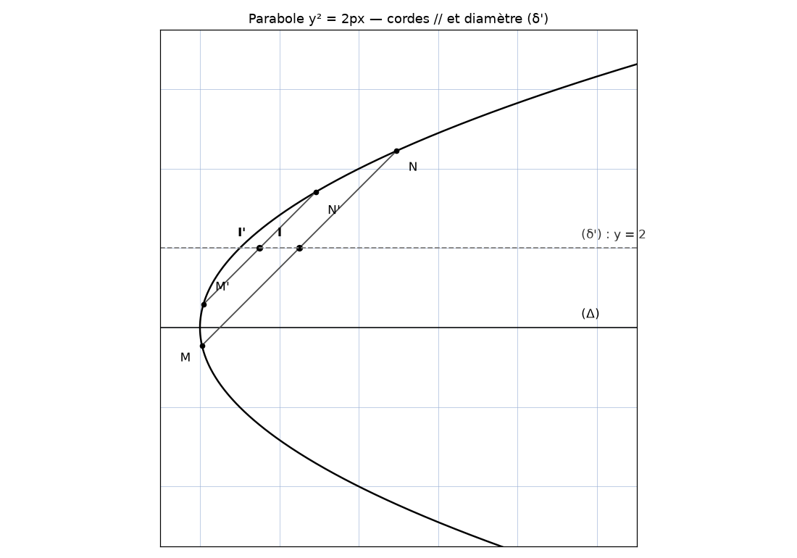
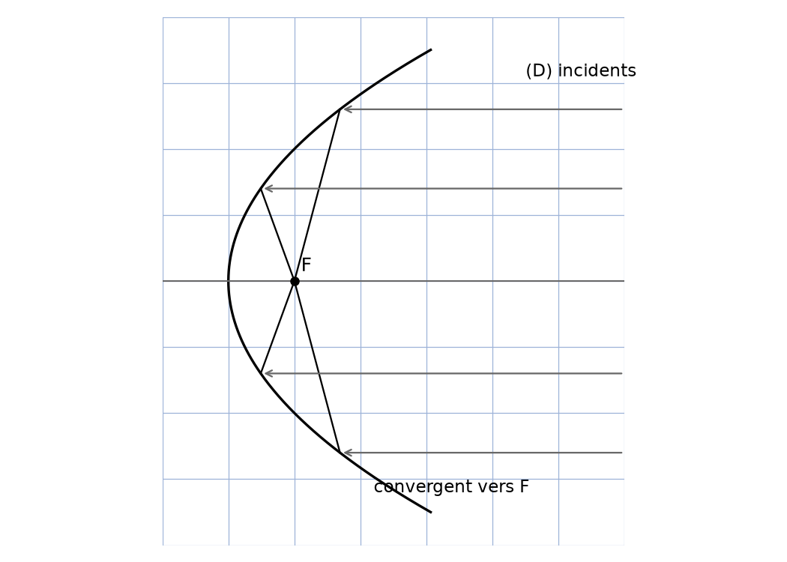
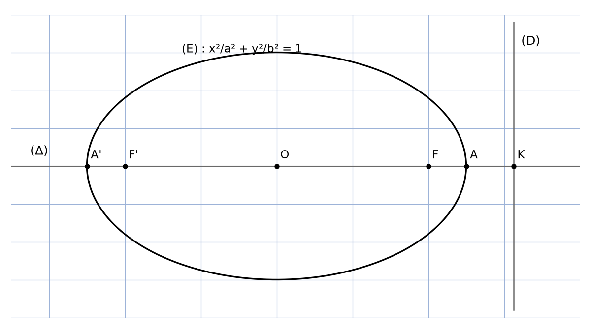
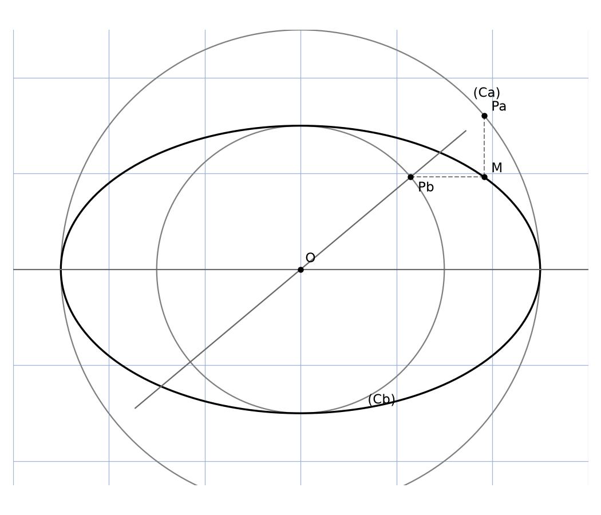
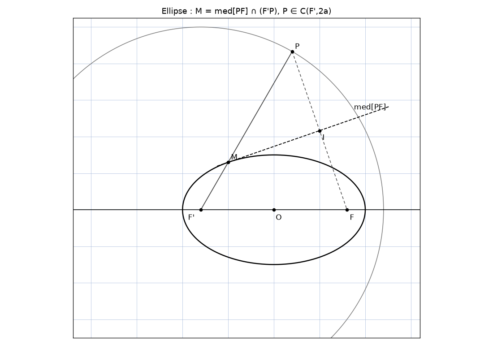
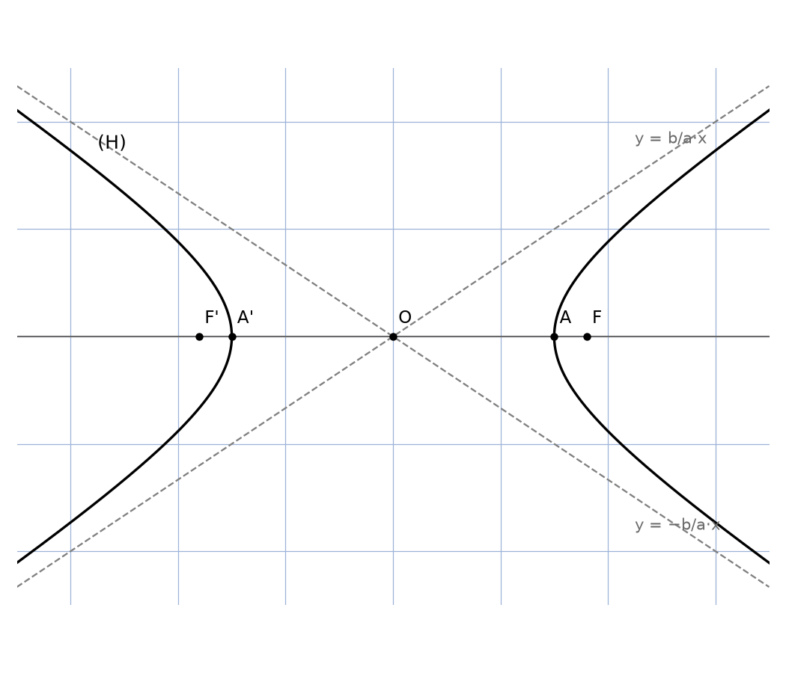
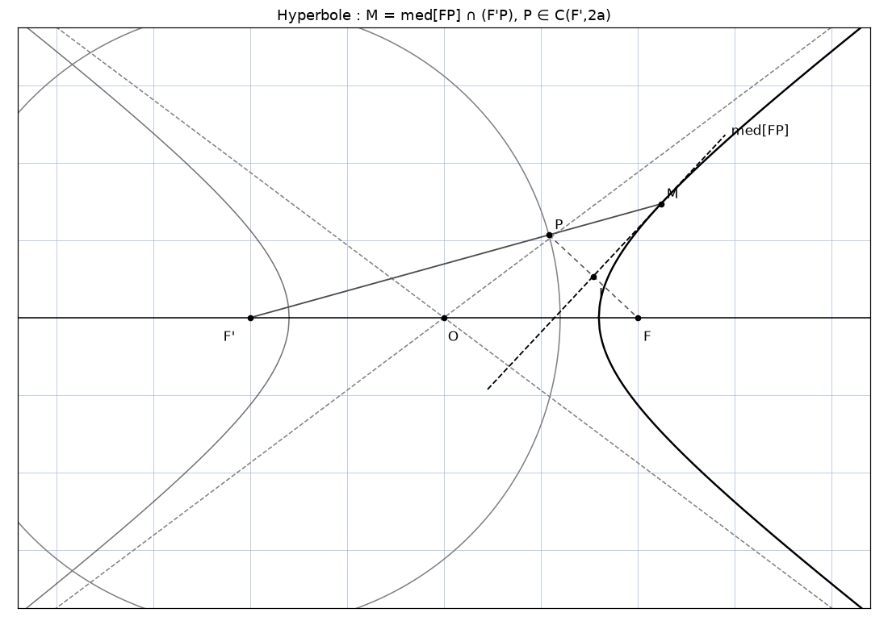
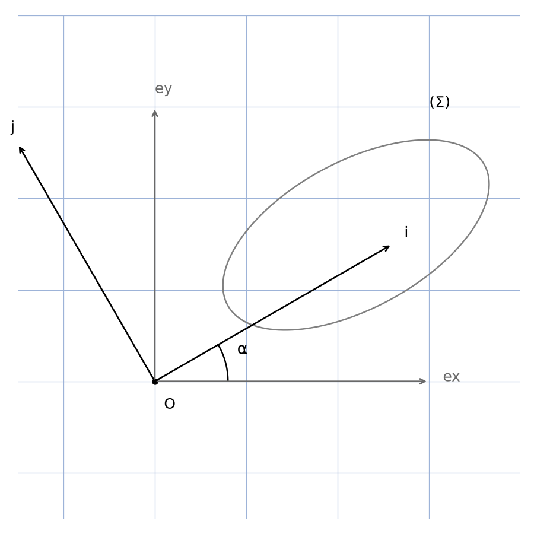

# Coniques — rapport manuscrit (transcription jumelle fond + forme)

> Meta : 19 pages · scan manuscrit pur (stylo bleu, ratures, schémas crayon) ·
> zéro texte tapuscrit détecté (pdffonts/pdftotext vides — voir motif en bas) ·
> source : `coniques-rapport.pdf` (19 p., 520×720 pts) · transcription mot-à-mot ci-dessous,
> figures reproduites en scripts `reproduce_coniques_rapport_N.py` + PNG `assets/`.

## Page 1 — Étude des coniques : cône + plan, cas a = b (parabole)

En haut : « ~Étude des Coniques » (titre souligné), date en haut à droite :
« 15/01/2022 ».

- Dans R = (O, ex→, ey→, ez→) orthonormé direct,
- ★ On peut définir une conique comme l'intersection d'un cône (C) = { M(x,y,z) |
  |z| / √(x²+y²) = a = cte ∈ R₊* [tranché au r250+crop — « cte » lisible, ∈ R₊* en dessous] } et d'un plan
  (Π) = { M(x,y,z) | ΩM→·n→ = 0 où Ω (yΩ ∈ R, zΩ = a·yΩ) ∈ (C) et
  n→ (0, b, 1) } dans un repère orthonormé R = (O, ex→, ey→, ez→).
- (Σ) = (Π) ∩ (C) = { M(x,y,z) | } avec |z| = a√(x²+y²) (1) et
  ΩM→·n→ = 0 (⇔) z = −b·y + yΩ(a+b) [tranché au crop — yΩ net, aucun indice] (2).
- (1),(2) ⇒ a²x² + a²y² = b²y² + yΩ²(a+b)² − 2·b·y·yΩ(a+b)
  ⇒ a²x² + (a²−b²)y² + 2·b·yΩ(a+b)·y = yΩ²(a+b)².
- ★ Cas où a = b : ainsi (Π) est parallèle à un plan tangent à (C) : on parle d'une parabole.
- Soit R' = (Ω, w→, v→, en→) [tranché au crop — « v » pointu, non « u »] où w→ = −ex→, en→ = n→/‖n→‖ = (b·ey→ + ez→)/√(1+b²)
  [tranché au crop — b repassé mais lisible] et ev→ = en→ ∧ w→ [tranché au crop — en→ ∧ w→, non ex→ ∧ w→] = (b·ey→ − ez→)/√(b²+1) [tranché au crop — b repassé mais lisible].
- ∀ M(u,v,w) ∈ (Σ), on a : w = 0 [tranché au crop — « w=0 » net], ΩM→ = u·w→ + v·ev→ [tranché au crop]
  = −u·ex→ + (a·v)/√(b²+1) [lecture incertaine — motif : numérateur surchargé, a/b ambigu (équivalents car a=b ici)] ez→ − v/√(b²+1) [lecture incertaine — motif : assignation ey/ez ambiguë, y/z manuscrits quasi-identiques] ey→.
- Or ΩM→ = x·ex→ + (y−yΩ)·ey→ + (z−a·yΩ)·ez→ avec { x = −u ;
  y−yΩ = −a·v/√(b²+1) [reconstruction — motif : dénominateur partiellement masqué par pli] ;
  z−a·yΩ = a·u/√(b²+1) [idem] }.
- Or (Σ) = { M(x,y,z) | } |z| = a√(x²+y²) (⇔) z = a√(x²+y²) (1) ;
  z = −a·y + 2·a·yΩ, z ≥ 0 (2).
- (1),(2) ⇒ a²x² + 4a²yΩ·y = 4yΩ²a² ⇒ x² = 4yΩ(yΩ−y) = 4yΩ × v/√(b²+1) [lecture incertaine].
- Donc (Σ) = (P) : { M(u,v,w) | v = √(b²+1)/(4yΩ)·u² [lecture incertaine] et w = 0 },
  or v = α·u², α ∈ R₊* cte ≠ 0 [lecture incertaine].
- Ainsi une parabole (P) est encore toute courbe d'un plan où il est possible de
  trouver un repère orthonormé direct (O, ex→, ey→) / (P) = { M(x,y) | y = a·x², a ∈ R* }.
- Figure p.1 (droite, crayon) : cône double (C), axe Ω, vecteur n→, plan (Π)
  oblique, point O, indication |z| → reproduite : `assets/fig01-cone-plan.png`.

## Page 2 — Cas 0 ≤ b < a : ellipse

- ★ Cas où 0 ≤ b < a : on parle d'une ellipse.
- (Σ) = { M(x,y,z) | } |z| = a√(x²+y²) ; z = −b·y + (a+b)·yΩ.
- { |z|² = a√(x²+y²) [*sic* — rappel de (1) qui porte |z| sans carré ; tranché au r250+crop : pas de xΩ] (1) ;
  a²x² + (a²−b²)y² + 2·b·yΩ(a+b)·y = yΩ²(a+b)² (2) }.
- Soit Ω' = (Π) ∩ (Oy) = (0, 0, (a+b)·yΩ) [lecture incertaine]. Travaillons maintenant dans
  R'' = (Ω', ex→, ev→, n→) avec ∀ M(u,v,w) ∈ (Σ),
  ΩM→ = −u·ex→ + (a·v·b)/√(1+b²) [lecture incertaine] ey→ − v/√(1+b²) [idem] ez→
  = x·ex→ + y·ey→ + (z−(a+b)yΩ)·ez→ (3).
- (2) ⇒ a²u² + (a²−b²)v² + 2·b·yΩ … [raturé — réécriture biffée en diagonale] …
  (3) ⇒ z = (a+b)·yΩ − v/√(1+b²) [lecture incertaine].
- Cherchons Ω'' (0, y₁', z₁') pour que dans R'' = (Ω'', ex→, ev→, n→) l'éqn de (Σ)
  soit de la forme { w = 0 ; α·u² + β·v² = δ, α, β, δ > 0 }.
- ∀ M(u,v,w) ∈ (Σ), Ω''M→ = −u·ex→ + (a·v·b)/√(1+b²) ey→ − v/√(1+b²) [idem] ey→
  = x·ex→ + (y−y')·ey→ + (z−z')·ez→ [lecture incertaine].
- (2) ⇒ a·u² + (a²−b²)(y' − α/√(1+b²))² [reconstruction — motif : passage biffé]
  + 2·b·yΩ(a+b)(y' − α/√(1+b²)) = yΩ²(a+b)² (3).
- Ainsi on doit avoir −2(a²−b²)·α·y'/√(1+b²) + 2·b·yΩ(a+b)·α/√(1+b²) = 0
   ⇒ (a−b)·y₁' = −b·yΩ ⇒ y₁' = b·yΩ/(b−a) [tranché au r250 — signe confirmé, $= -b\cdot y\Omega/(a-b)$ comme en Ω'' ci-dessous].
- Et comme Ω' ∈ (Π), on a : z₁' = −b·y₁' + (a+b)·yΩ = b²yΩ/(a−b) + (a+b)yΩ = a²yΩ/(a−b).
- Ainsi dans R'' = (Ω'', ex→, ev→, n→), où Ω'' (0, −b·yΩ/(a−b) [tranché au r250 — cohérent : $= y_1'$], a²yΩ/(a−b)),
  (3) ⇒ a·u² + (a²−b²)/(1+b²)·v² = yΩ²(a+b)² − (a²−b²)b²yΩ²/(a−b)² + 2·b·yΩ(a+b)/(a−b)
  = yΩ²a²(a²−b²)/(a−b)² [reconstruction — motif : calcul dense, indices incertains].
- D'où (Σ) = { M(u,v,w) | w = 0 et a·u² + (a²−b²)/(1+b²)·v² = yΩ²a²(a²−b²)/(a−b)² } ②.
- Ainsi une ellipse serait toute courbe plane telle qu'il est possible de trouver
  un repère orthonormé direct (O, ex→, ey→) avec a, b, c > 0 /
  (Σ) : { M(x,y) | a·x² + b·y² = c } [sic — énoncé manuscrit, constante non réduite à 1].

## Page 3 — Cas b > a : hyperbole + définition foyer-directrice, cas e = 1

- Cas où b > a : on parle d'une hyperbole.
- Le raisonnement est le même que pour le cas où 0 ≤ b < a.
- On obtient ainsi (Σ) = (H) : { M(u,v,w) ∈ (Π) : Ω' (0, b·yΩ/(b−a), −a²yΩ/(b−a)) [sic 2e passage — le manuscrit écrit Ω' ici, non Ω''],
  w→ = −ex→, v→ = (b·ey→−ez→)/√(1+b²) [lecture incertaine],
  en→ = n→/‖n→‖ = (b·ey→+ez→)/√(1+b²) }, −a·u² + (b²−a²)/(1+b²)·v² = yΩ²a²(b²−a²)/(a−b)².
- Et dans l'espace, (Σ) = (H) : ∃ M(x,y,z) ∈ C·(O, ex→, ey→, ez→) /
  { |z| = a√(x²+y²) ; z = −b·y + (a+b)·yΩ }.
- Ainsi une hyperbole serait toute courbe plane (H) telle qu'il est possible de
  trouver un repère orthonormé direct (O, ex→, ey→) du plan contenant (H)
  avec a, b, c > 0 tels que (H) = { M(x,y) ∈ (P) : (O, ex→, ey→) / a·x² + b·y² = c } [sic].
- ★ Une conique peut encore être définie de façon équivalente comme toute courbe :
  dite l'ens(emble) (Σ) des pts M d'un plan (P) [raturé — « (P) = … » biffé]
  vérifiant MF/d(M,(D)) = e où F, (D) sont resp. un pt et une droite de (P),
  F ∉ (D), et e un réel strictement positif.
- Cas e = 1 ; (D) : directrice, (Δ) : axe focal.
- Soit O ∈ (Δ) ∩ (Σ) ainsi OF = OK d'où O = mil[OK].
- On pose ainsi ex→ = KF→/KF et ey→ tel que (ex→, ey→) soit orthonormée directe.
  On pose p = KF : paramètre de (Σ). F(p/2 ; 0), (D) : x + p/2 = 0.
- MF = e·d(M,(D)) (⇔) (p/2−x)² + y² = e²(x+p/2)², e = 1.
- ∀ M(x,y) ∈ (Σ), (P) : y² = 2·p·x.
- Ainsi (Σ) = (P) : { M(x,y) ∈ (O, ex→, ey→) | y² = 2·p·x }.
- NB : en posant plutôt ey→ = KF→/KF on aurait plutôt x² = 2·p·y.
- Propriétés.
- En posant x : R → R, y ↦ x(y) = y²/(2p), x étant dérivable sur R, ∀ y ∈ R,
  x'(y) = y/p ⑥.
- Figure p.3 (droite) : axe (Δ) horizontal, directrice (D) verticale en K,
  foyer F, origine O, parabole → reproduite : `assets/fig02-parabole-foyer.png`.

## Page 4 — Parabole : tangente, construction point par point, diamètres, effet convergent

- Pour un pt M₀(x₀, y₀) de (P), la tangente (Tₘ₀) en M₀ à (P) est donnée par
  (T₀) : x = x'(y₀)(y−y₀) + x(y₀) = (y₀/p)(y−y₀) + y₀²/(2p),
  c.-à-d. x = (y₀·y)/p − y₀²/(2p) [en] M₀.
- Donc (T_{M₀(x₀,y₀)}) : (x+x₀) = y₀·y [sic 2e passage — /p omis dans le manuscrit, lire (x+x₀) = y₀·y/p ; pli].
- NB : dans le cas où x² = 2·p·y on a plutôt : x·x₀ = p(y+y₀) [sic — symétrique].
- Construction pt par pt : (D) et F étant donnés, pour un H ∈ (D) on construit
  (N) ⊥ (D) / (N) ∩ (D) = {H} et ainsi ∀ M ∈ (N), d(M,(D)) = MH.
- Pour M en particulier sur (P), MF = d(M,(D)) = MH ainsi M ∈ med[FH] ;
  donc un pt M de (P) est l'intersection de (N) et med[FH] pour (D) ≠ (MH)
   [et] on mtq que med[MH] est la tangente à (P) en M [sic 2e passage — lire med[FH]].
- Pour des pts M, M', N, N' de (P) / (MN) ∥ (M'N') avec y₀, y₀' > 0 ou y₀, y₀' < 0,
  la droite (δ') = (mil(MN), mil(M'N')) ∥ (Δ') et est indépendante du choix de ces pts.
- En effet pour tout M(x₁, √(2px₁)) et N(x₂, √(2px₂)) [lecture incertaine],
  il suffit de mtq tels que MN→ ∧ v→ = 0→ pour un v→(a,b) donné, b ≠ 0.
- [raturé — « Il suffit de mtq » biffé] y_I = cte pour I = mil[MN].
- En effet on a : I((x_M+x_N)/2, (√(2p)/2)(√x_M − √x_N) [sic 2e passage — le manuscrit écrit bien √(2p)/2, non √p/2]) ;
  or det(MN→, v→) = 0 ⇒ (x_M−x_N)b − a√p(√x_M+√x_N) = 0 ⇒ (√x_M−√x_N)b − a√(2p) = 0 ;
  ainsi y_I = (√(2p)/2) × (a√(2p)/b) = a·p/b. Donc tous ces milieux sont sur (δ') : y = a·p/b.
- Effet convergent : pour un miroir d'onde en forme parabolique, tout faisceau
  parallèle incident converge vers un pt particulier F. En effet, en particulier
  si x_F = x_M = p/2 [et] si ce faisceau est parallèle à l'axe focal ④.
- Figure p.4 (droite) : diamètres (δ'), cordes parallèles MM', NN', milieux I, I'
  alignés sur y = cte → REPRODUITE au 2e passage (info distincte : aucun des
  7 gabarits ne montre les diamètres) : `assets/fig08-parabole-diametres.png`.

## Page 5 — Faisceau : rayon réfléchi, normale, composition complexe

- Un faisceau formé d'un ensemble de droites faisant un angle α avec (MO) [lecture incertaine].
- Soit une droite (D) de ce faisceau d'éqn (D) : y = tan α·x + b, b ∈ R.
- Soit M(x_M, y_M) ∈ (D) ∩ (P). Cas où y_M > 0 avec { y_M = √(2px_M) ; b + tan α·x_M = y_M }.
- Pour faire simple on ne peut que considérer un pt M de (P) et le rayon incident
  en M de support (D) : on a : alors b = y_M − x_M·tan α = √(2px_M) − x_M·tan α.
- D'où (D) : y = tan α(x−x_M) + √(2px_M).
- Trouvons le support (D') du rayon émergent.
- On a : (D') = S_{(n_M)}(D) où (n_M) est la normale en M à (P).
- La tangente en M étant (T_M) : y·y_M = p(x+x_M) [⇔] p·x − y·y_M + p·x_M = 0 [sic 2e passage — ancien tag « signe » retiré : le calcul est correct].
- Ainsi (n_M) : y_M·x + p·y + c = 0 où y_M·x_M + p·y_M + c = 0 ;
  (n_M) : y_M·x + p·y − y_M·x_M − p·y_M = 0,
   y_M(x−x_M) + p(y−y_M) = 0 (⇔) y = y_M(x_M−x)/p + y_M [sic 2e passage — ancien tag retiré : le calcul est correct].
- Expression complexe puis analytique de S_{(n_M)}.
- Soit la similitude directe f| déplacement | f| S_{(n_M)} = f ∘ S_{(OF)} [lecture incertaine],
  avec f = S_{(n_M)} ∘ S_{(OF)}.
- Pour M ≠ O, f = R(Ω, 2α) où Ω = (n_M) ∩ (OF) = (x_M+p, 0) et
  α = arctan(−y_M/p) [−y_M/p coef direct de (n_M)].
- Ainsi pour M ∈ (P) et M' = S_{(n_M)}(M) (= f ∘ S_{(OF)}(M)) [1],
  on a : (z'−x_M−p) = e^{−2i·arctan(y_M/p)} (z̄−x_M−p) [reconstruction — motif],
  posons β = arctan(y_M/p) ;
  d'où { x' = x_M+p + cos 2β (x−x_M−p) − y·sin 2β [lecture incertaine] ;
  y' = −y·cos 2β + (p+x_M−x)·sin 2β } ⑤.
- Figure p.5 (haut droite) : parabole (P), foyer F, F', rayons incidents (D)
  parallèles → reproduite : `assets/fig03-miroir-convergent.png`.

## Page 6 — Suite du calcul : les (D') passent par F ssi tan α = 0

- [Suite du calcul complexe, haut de page — formules de cos 2β, sin 2β en
  fonction de tan β = y_M/p, très raturées ; on retient :]
- cos 2β = 2cos²β − 1 = 2/(1+tan²β) − 1 = (1−tan²β)/(1+tan²β) = (p²−y_M²)/(p²+y_M²) ;
  sin 2β = 2cosβ·sinβ = 2tanβ/(1+tan²β) = (2y_M/p)/(1+y_M²/p²) = (2p·y_M)/(p²+y_M²) [idem].
- Cherchons F' ∈ (D') / x_{F'} = p/2. Cherchons y₁' = y'.
- On a : −y'·(p²−y_M²)/(p²+y_M²) + (x_M+p/2)·2py_M/(p²+y_M²) = √(2px_M) − x_M·tan α
  + (tan α)(x_M+p + (−p/2−x_M)(p²−y_M²)/(p²+y_M²) − y'·2py_M/(p²+y_M²)) ;
  d'où y'·[(2px_M+p²)/(2px_M+p²) + (tan α)(2p√(2px_M)/(p²+2px_M))] =
  √(2px_M) − x_M·tan α − (2x_M+p)·p·√(2px_M)/(p²+2px_M)
  + (tan α)(x_M+p − ((2x_M+p)/2)·(p²−2px_M)/(p²+2px_M)),
  c.-à-d. y'·(((2x_M−p)+tan α·[2√(2px_M)])/(2px_M+p)) [reconstruction — motif]
  = tan α·((p+2x_M)/2) ;
  c.-à-d. y' = ((2x_M+p)²·tan α)/(2((2x_M−p)+tan α·2√(2px_M))).
- Pour (D) : y = x·tan α − x_M·tan α + √(2px_M), sa réflexion par (P) est
  (D') : (2√(2px_M)+(p−2x_M)·tan α)·x + (p−2x_M−tan α·2√(2px_M))·y
  − p√(2px_M) + (3p·x_M+2x_M²)·tan α [reconstruction — motif : encadré manuscrit].
- Ainsi les (D') passent par F(p/2, 0) ssi tan α = 0 (⇒) α = 0 ;
  droites (D') [parallèles à l'axe].
- On peut même vérifier que pour α ≠ 0 ces courbes ne sont pas convergentes,
  car on démontre que 2 de ces droites se rencontrent ssi x_M = x_M' (⇒) (D) = (D')
  et y_M = y_M' [reconstruction — motif : fin de page raturée].
- Par symétrie on déduit de même pour le cas y_M ≤ 0 ⑥.

## Page 7 — Cas e ∈ ]0,1[ : ellipse foyer-directrice, équation réduite

- Cas où e ∈ ]0,1[ [sic 2e passage — haut de page coupé, une suite « ∪ … » est illisible] : soit M ∈ (Σ).
- On a : MF/d(M,(D)) = e. Cherchons les pts O de (Δ) [.]
- |O ∈ (Σ). On a : OF = e·OK ⇔ (OF→−e·ωK→)·(OF→+e·ωK→) = 0 [reconstruction — motif],
  ⇔ (1−e)·OA→·(1+e)·OA'→ = 0 [idem] où A' = [F K ; 1/(1−e)] [idem], A = [F K ; 1/(1+e)] [idem],
  (⇔) OA'→·OA→ = 0 ⇔ O ∈ C([AA']) [cercle de diamètre AA'],
  (⇔) O = mil[AA'] car OC([AA']) = (AA') [et] O ∈ {A, A'} [lecture incertaine].
- Alors les pts de (Σ) sur (Δ) sont A et A'.
- Posons O = mil[AA'], ex→ = FK→/FK, ey→ ⊥ [tel que] (ex→, ey→) soit orth. directe ;
  [raturé — « … avant … » biffé] • OT→ = OA→ + AF→ = … = a·ex→ + AK→ + KF→
  = a·ex→ − 1/(1+e)·KF→ + KF→ = a·ex→ + e/(1+e) × a(1+e)/e·(−ex→) [idem]
  = a·ex→(1 + (1−e)/e) [idem] ;
  or x·OA = AA'/2 = ½‖−KA'→+KA→‖ = Δ/2·‖−1/(1−e)·KF→ + 1/(1+e)·KF→‖ = KF × 2e/((1+e)(1−e)) ;
  et ainsi KF = a(1+e)(1−e)/(2e) = a(1−e²)/e.
- (D) : x = OK = OA + AK = a + 1/(1+e)·KF = a + 1/(1+e) × a(1−e²)/e = a(1 + (1−e)/e) [idem].
- Pour e ∈ ]0,1[, M(x,y) ∈ (Σ) (⇔) (x−[a])² + y² = e²|x−a/e|² [reconstruction — motif],
  (⇔) x² + (1−e²)a²/e² [idem] − a·x(1−e) + y² = e·x + a²(1+e)/4 [idem] − a·x(1+e)/e [idem],
  (⇔) x²/e² [raturé] (⇔) x² + e·a² − 2·e·a·x + y² = e²x² + a² − 2·a·x·e,
  (⇔) x²/a² + y²/(a²(1−e²)) = 1. Posons b = a√(1−e²) et c = √(a²−b²) = a·e = OF ;
  ainsi e = c/a ⑦.
- Figure p.7 (haut droite) : axe avec O(?), A, F, directrice (D) verticale en K
  → reproduite : `assets/fig04-ellipse-foyer.png`.

## Page 8 — Ellipse : tangente, MF + MF' = 2a, constructions point par point

- Soit F' = S_O(F) = (−ae ; 0) [sic 2e passage — tag « lecture incertaine » retiré : lisible] on vérifie bien que MF'/d(M,(D)) = e où
  (D') = S_O(D) : x = a/e.
- En posant plutôt ey→ = FK→/FK l'éqn serait de la forme x²/a² − y²/b² = 0 [sic — lapsus,
  lire « = 1 » d'après la suite].
- Mais en remplaçant partout a par b et A, A' par B et B' et avec a² = b²(1−e²) [sic],
  c = √(b²−a²) = e·b [sic — cas d'échange d'axes].
- ∀ M(x₀,y₀) : par analyse on mtq la tangente (T_{M₀(x₀,y₀)}) : (x·x₀)/a² + (y·y₀)/b² = 1.
- ∀ M(x,y) ∈ (Σ), MF + MF' = √((x−ae)²+y²) + √((x+ae)²+y²)
  = √((x−ae)² + (1−x²/a²)a²(1−e²)) + √((x+ae)² + (1−x²/a²)a²(1−e²))
  = √(e²x²+a²−2aex) + √(e²x²+a²+2aex) = |ex−a| + |ex+a| = a−ex + a+ex = 2a.
- Pour construire pt par pt (Σ) = (E) connaissant a et b, on trace C_a(0,a) et
  C_b(0,b), on trace une droite quelconque passant par O, elle coupe C_a et C_b
  resp. en P_a1, P_a2 et P_b1, P_b2 avec P_a1, P_b1 en haut.
- Pour chaque couple (P_a i, P_b i) on trace la parallèle à (D) passant par P_b i
  et la perpendiculaire à (D) passant par P_a i. Ces 2 droites se coupent en M ∈ (Σ).
- En effet x_M/a = cos α et y_M/b = sin α [reconstruction — motif : « x/a = cos α »],
  or cos²α+sin²α = 1 donc (x_M/a)² + (y_M/b)² = 1, donc M ∈ (E) ⑧.
- Pour construire (E) connaissant F, F' et a, on trace (E') : (F', 2a) [cercle],
  O = mil[FF'], on trace pour un pt P quelconque de (E'), (FF') [puis] la droite (F'P)
  puis med[FP], et on construit M = med[PF] ∩ (F'P) ; M ∈ (E) et on a :
  (MI) où I = mil[PF] est la tangente à (E) en M [reconstruction — motif].
- En effet MF + MF' = MP + MF' = 2a d'où M ∈ (E).
- Figure p.8 (bas droite) : cercles (Ca), (Cb), points Pa1, Pb1, M, axe (D)
  → reproduite : `assets/fig05-ellipse-cercles.png`.

## Page 9 — Ellipse : tangente via med[PF], paramétrisation

- [Haut de page, très raturé — calculs biffés en diagonale :]
  puis dans (O, ex→, ey→), O = mil[FF'], F(c,0) où c = ae,
  P(2a·cos θ, 2a·sin θ) avec M(α·cos θ, α·sin θ) = (x₀, y₀),
  M ∈ med[PF] (⇔) MF = MP, d'où cos θ = x₀/α [idem], sin θ = y₀/α [idem], d = √(x₀²+y₀²).
- M ∈ med[PF] (⇔) MF = MP (⇔) y₀² + (x₀−ae)² = (x−2a·x₀/α)² + (y−2α·y₀/α)² [idem]
  (⇔) −2·ae·x + a²e² = −4x₀x + 4x₀² + 4y₀² − 4y₀y [idem] (⇔) x₀x/a² + y₀y/[idem].
- [★ :] M ∈ med[PF] (⇔) MF = MP
  (⇔) y₀² + (x−ae)² = (x − 2a·x₀/α)² + (y − 2α·y₀/α)² [lecture incertaine]
  (⇔) −2aex + a²e² = 4a²x₀²/α² [idem] − 4a·x₀·x/α + 4a²y₀²/α² − 4a·y₀·y/α
  (⇔) −2a·x√(a²−b²) + a²−b² = 4a² − 4a/√(x₀²+y₀²)·(x₀x+y₀y) [reconstruction — motif],
  (⇔) [idem] (⇔) en posant d = PM [idem], OH→ = Mx₀·ex→ + y₀·ey→ = OF'→ + F'M→
  = −c·ex→ + 2a·cos θ·ex→ + 2a·sin θ·ey→, d'où { x_M = −c + d·cos θ ;
  y_M = d·sin θ }, or x_M²/a² + y_M²/b² = 1 ⇒ ((d·cos θ−c)²)/a² + d·sin²θ/[idem].
- Or F(c,0) et { x_P²+y_P² = 4a² (1) ; det(FP→, F'M→) = 0 (2) },
  |x_P+c|/|x_M+c| = |y_P|/|y_M| [et] (x_P+c)·y_M = (x_M+c)·y_P [avec] y_M [et] y_P > 0 (2).
- P = C(F',2a) ∩ (F'M) où C(F',2a) : { x = 2a·cos θ − c, θ ∈ [0, α[ [lecture incertaine] ;
  y = 2a·sin θ }, (F'M) : { x = −c + (x_M+c)t ; y = (y_M)t },
  avec { 2a·cos θ = (x_M+c)t ; 2a·sin θ = y_M·t } ;
  or cos²θ+sin²θ = 1 ⇒ 4a² = ((x_M+c)²+y_M²)t² ⇒ t = 2a/√((x_M+c)²+y_M²),
  car y_M [et] y_P > 0, ainsi P : { x_P = −c + 2a(x_M+c)/√((x_M+c)²+y_M²) ;
  y_P = y_M·2a/√((x_M+c)²+y_M²) } ⑨.
- Figure p.9 (haut droite) : cercle directeur C(F',2a), points P, M, F', O, F,
  M = med[PF] ∩ (F'P), med[PF] = tangente en M → REPRODUITE au 2e passage
  (info distincte : fig04 montre foyer-directrice, fig05 les cercles (Ca,Cb),
  aucune ne montre C(F',2a) + médiatrice) : `assets/fig09-ellipse-directeur-med.png`.

## Page 10 — Ellipse : M ∈ med[PF] ⇒ tangente, cas hyperbole e > 1

- Ainsi M(x,y) ∈ med[PF] (⇔) MP = MF
  (⇔) (x+c − 2a(x_M+c)/√((x_M+c)²+y_M²))² + (y − 2a·y_M/√(y_M²+(x_M+c)²))² = (x−c)² + y²
  (⇔) x² + 4a² + 2(x_M+c)(−2a)(x_M+c)/√(y_M²+(x_M+c)²) − 4a·y_M·y/√(y_M²+(x_M+c)²) = x²−2cx [idem]
  ⇔ or (x_M+c)²+y_M² = (x_M+ae)² + (1−x_M²/a²)a²(1−e²) = (a+e·x_M)² ;
  ainsi MP = MF (⇔) (x_M+ae − 2a(x_M+ae)/(a+e·x_M))² + (y − 2a·y_M/(a+e·x_M))² = (x−ae)²+y²
  (⇔) 4a² + 4a·e·x_M − 4a·x(x_M+ae)/(a+e·x_M) − 4a²e(x_M+ae)/(a+e·x_M) − 4a·y_M·y/(a+e·x_M) = 0
  (⇔) a²+a·e·x_M + e·a·x/e + e²x·x_M/e − x·x_M − x·a·e − a·x_M − a·e² [raturé]
  − a·e·x_M − a·e² − y_M·y = 0 [idem],
  (⇔) y·y_M + x·(c²/a² [idem]·x_M + x_M + a·e) = a²(1−e²) [idem],
  (⇔) (y·y_M)/(a²(1−e²)) + (x·x_M)/(a²(1−e²))·(1−e) = 1 [idem],
  (⇔) (x·x_M)/a² + (y·y_M)/b² = 1.
- Pour e > 1 (cas de l'hyperbole), avec OF→ = e·OK→ [? voir p.11] ⑩.

## Page 11 — Hyperbole : équation réduite, second foyer, tangente

- M(x,y) ∈ (Σ) (⇔) (x+e·a/e [sic])² + y² = e²|x+a/e|² [reconstruction — motif],
  où x = OK, soit AK : = a + 1/(1+e)·KF = a + 1/(1+e) × a(1−e)(1+e)/e [idem],
  = a + 1/(1+e) × a·(1+e)(1−e)/e [idem].
- (⇔) x²+e²a²/e² [idem] + 2a·x + y² = e²x²+a²+2a·x·e [idem]
  (⇔) x²(1−e²)+y² = a²(1−e²) (⇔) x²/a² + y²/(a²(1−e²)) = 1
  (⇔) x²/a² − y²/b² = 1 où b² = a²(e²−1), et c = a·e = √(a²+b²).
- Soit F' = S_O(F) on a aussi MF'/d(M,(D')) = e où (D') = S_O(D).
- NB : on pose plutôt A° = bar{F K ; 1/(1−e)} [et] A' = bar{F K ; 1/(1+e)} [idem].
- En posant plutôt ey→ = KF→/KF l'éqn serait de la forme −x²/a² + y²/b² = 1 ;
  et on remplacerait dans la démonstration A par A', B par B', a par b,
  avec a² = b²(e²−1), c = √(a²+b²), e = c/a, (D) : y = −a/e [sic — lire x = a/e].
- Par analyse on mtq (T_{M₀(x₀,y₀)}) : +x₀x/a² − y₀y/b² = 1.
- En effet de façon générale pour (Σ) : Mx₀/a² [raturé] ± … x²/a² ± y²/b² = 1
  (⇒) y² = ±(1−x²/a²) ; y = φ(x) où φ est dérivable sauf en A et A',
  avec y₀' = φ'(x₀) or (y²)' = 2y·y' avec ±b²(−2x₀/a²) = 2y₀·y₀' (⇒) y₀' = ∓(b²/a²)(x₀/y₀) ;
  avec (T) : y = ∓(b²/a²)(x₀/y₀)(x−x₀)+y₀ ⇒ (y·y₀)/b² = ∓(x₀x)/a² ± x₀²/a² + y₀²/b²
  ⇒ (x₀x)/a² ± (y·y₀)/b² = 1 (T_{M₀(x₀,y₀)}).
- En considérant l'ellipse (E) : { x = a·cos θ ; y = b·sin θ }, une autre façon de trouver
  T₀ serait de la considérer comme l'unique droite (D) : { x = x₀ + α·t ; y = y₀ + β·t } ⑪.
- Figure p.11 (droite) : axe focal, K, F, branche (H), asymptotes en pointillés
  → reproduite : `assets/fig06-hyperbole-asymptotes.png`.

## Page 12 — Ellipse : unicité de l'intersection droite-ellipse ; hyperbole : |MF' − MF| = 2a

- …recontrant (T) en M₀. Justifions cela en cherchant de [tels que]
  on a : Soit M, il est clair que M₀ ∈ (T) ∩ (E). Soit M(x,y) ∈ (T) ∩ (E) / M ≠ M₀
  avec { a·cos θ = x₀ + α·t = a·cos θ₀ + α·t ; b·sin θ = y₀ + β·t = b·sin θ₀ + β·t },
  θ ∈ [0, α[ [lecture incertaine].
- t = a/α·(cos θ−cos θ₀) = b/β·(sin θ−sin θ₀), en cherchant α, β dans R*,
  or −2a/α·sin((θ+θ₀)/2)·sin((θ−θ₀)/2) = 2b/β·sin((θ−θ₀)/2)·cos((θ+θ₀)/2) [idem],
  i.e. tan((θ+θ₀)/2) = −b·α/(β·a) = sin((θ+θ₀)/2)/cos((θ+θ₀)/2),
  car M ≠ M₀ ⇒ θ ≠ θ₀ ⇒ sin((θ−θ₀)/2) ≠ 0 ;
  ainsi en prenant α = a·sin θ₀ [lecture incertaine], β = −b·cos θ₀ [idem],
  on aura alors tan θ₀ = tan((θ+θ₀)/2) (⇔) θ₀ = θ A ! [sic].
- Donc (T) ∩ (E) = {M₀} avec (T₀) : { x = x₀ + (a·y₀/b)·t [sic 2e passage — tag retiré : cohérent avec α = a·sin θ₀] ;
  y = y₀ − (b·x₀/a)·t }, (⇔) (x·x₀)/a² + (y·y₀)/b² = (x₀²)/a² + (a·x₀y₀·t)/(a²b) [idem]
  + y₀²/b² − (x₀y₀·t)/(a²b) = 1.
- ∀ M(x,y) ∈ (H), |MF'−MF| = √((x+ae)²+y²) − √((x−ae)²+y²)
  = √(x²+a²e²+2aex+m²−m²−a²e²+a² …) [raturé] − √(2aex+a²+m²e² …) [idem],
  car y² = (x²/a²−1)a²(e²−1) = m²e²−x²−a²e²+a² [reconstruction — motif : « m » pour x],
   = |xe+a| − |xe−a|, d'où |MF'−MF| = {|xe+a−xe+a| = 2a ; |−xe−a+xe−a| = |−2a| = 2a} [sic 2e passage — variante « ou … » retirée] ⑫.

## Page 13 — Hyperbole : construction point par point, tangente via med[PP']

- …on construit le cercle de centre F' et de rayon 2a. Pour un pt P quelconque
  de ce cercle [et] med[FP] rencontre (F'P) en un pt M ∈ (Σ).
- En effet |MF'−MF| = |MF'−MP| = F'P = 2a.
- Mtq (T_M) = (IM) [où I = mil[FP] est la tangente à (H) en M — reconstruction].
- Soit P : P ∈ (C) ∩ (MF') ; (C) : { x = −ae + 2a·cos θ ; y = 2a·sin θ } [tranché au r250 — cercle centre F', rayon 2a] ;
  (MF') : { x = −ae + (x_M+ae)t ; y = 0 + y_M·t } ; les coords (x_P,y_P) de P
  vérifient { 2a·cos θ = (x_M+ae)t ; 2a·sin θ = y_M·t } ⇒ 4a² = ((x_M+ae)²+y_M²)t²
  ⇒ t² = 4a²/(x_M²+a²e²+2aex_M + (x_M²/a²−1)a²(e²−1)) = 4a²/(x_M·e+a)² ;
   on peut prendre t = 2a/(x_M·e+a) [tranché au r250 — « on peut prendre », choix justifié p. 14 par la figure], et ainsi
  P : (−ae + 2a(x_M+ae)/(x_M·e+a) ; 2a·y_M/(x_M·e+a)) ;
- NB micro-passage r250 2026-09-07 (page entière relue) : aucun « C = √… » (√2π/√26) sur cette page — le seul « C = √26 » du corpus est en mega-synthese-series p. 13 (tranché + *sic*).
  ainsi ∀ N(x,y) ∈ med[PP'], (T_M) [car I et M ont des coordonnées opposées — biffé],
  NP = NF (⇔) (x+ae − 2a(x_M+ae)/(x_M·e+a))² + (y − 2a·y_M/(x_M·e+a))² = (x−ae)²+y²
  (⇔) 4aex + 4a² − 4a(x_M+ae)(x+ae)/(x_M·e+a) − 4a·y_M·y/(x_M·e+a) = 0
  (⇔) (ex+a)(x_M·e+a) − (x_M+ae)(x+ae) − y_M·y = 0
  (⇔) x·x_M(e²−1) + a²(1−e²) − y·y_M = 0 [reconstruction]
  (⇔) (x·x_M)/a² − (y·y_M)/b² = 1 avec b² [idem].
- Donc … ⑬.
- Figure p.13 (droite) : cercle directeur C(F',2a), F', O, F, M, droite (MF'),
  M = med[FP] ∩ (F'P) → REPRODUITE au 2e passage (info distincte : fig06 montre
  branches + asymptotes, jamais C(F',2a) + médiatrice) :
  `assets/fig10-hyperbole-directeur-med.png`.

## Page 14 — Hyperbole : signe de t, asymptotes y = ±(b/a)x

- NB : si on prenait t = 2a/−(x_M·e+a) on aurait y_P = 2a·y_M/−(x_M·e+a),
  puisque M vient avant F' dans le cas de la fig. x_M < c (⇒) x_M·e < −ae [sic],
  d'où x_M·e+a < 0 et ainsi y_P et y_M ont même signe ; ce qui est absurde
  d'après la fig. Ce constat est généralisable dans tous les cas, d'où t = 2a/(x_M·e+a).
- Rq : ce constat est le même dans le cas de l'ellipse où on a pris
  t = 2a/(x_M·e+a) et non 2a/−(x_M·e+a), car dans ce cas a+e·x_M > 0,
  d'où y_P et y_M seraient de signes opposés, contradictoire à la fig. (et dans le cas général).
- (δ') : y = (b/a)·x et (δ) : y = −(b/a)·x sont asymptotes à (H), aussi bien dans le cas
  où x²/a² − y²/b² = 1 que −x²/a² + y²/b² = 1.
- En effet (cas où x²/a² − y²/b² = 1 (E)) : (E) ⇒ (y−(b/a)x)(y+(b/a)x) = −b².
- Lorsque { x→+∞ ; y→+∞ }, lim y−(b/a)x = lim −b²/(y+(b/a)x) = −b²/+∞ = 0.
- Lorsque { x→+∞ ; y→−∞ }, lim y+(b/a)x = lim −b²/(y−(b/a)x) = −b²/−∞ = 0.
- IDEM pour x→−∞ ⑭.
- Asymptotes → reproduites : `assets/fig06-hyperbole-asymptotes.png` (même gabarit que p.11).

## Page 15 — Équation générale : rotation pour tuer le terme en xy

- Les courbes étudiées (parabole, hyperbole, ellipse) ont toutes pour éqn générale
  dans un plan muni d'un repère orthonormé : a·x² + b·xy [sic — lire c·xy selon la
  suite] + … a·x² + b·y² + c·xy + d·x + e·y + f = 0 (E) avec (a,b,c) ≠ (0,0,0),
  et sont connues sous le nom de coniques. Justifions cela.
- Supposons que dans ce cas on ait : — le but de ce qui suit est d'exprimer
  l'éqn de (Σ) dans un repère dont les axes sont des axes de symétrie,
  à l'occurrence (O, i→, j→) avec Mes(ex→, i→) = α, en vue de faire disparaître
  le terme en xy dans le nouveau repère.
- On a : j→ = −sin α·ex→ + cos α·ey→, i→ = cos α·ex→ + sin α·ey→.
  En posant B = (ex→, ey→) et B₁ = (i→, j→),
  M_{B₀}^{B₁} = (cos α, −sin α ; sin α, cos α) et avec ∀ M = (x,y)_B = (x₁,y₁)_{B₁},
  on a : (x ; y) = (cos α, −sin α ; sin α, cos α)(x₁ ; y₁) (⇒)
  { x = x₁·cos α − y₁·sin α ; y = x₁·sin α + y₁·cos α }.
- (E) (⇒) a(x₁²cos²α + y₁²sin²α − 2x₁y₁cos α·sin α) + b(x₁²sin²α + y₁²cos²α + 2x₁y₁sin α·cos α)
  + c(x₁²cos α·sin α − y₁²sin α·cos α + x₁y₁(cos²α−sin²α))
  + d(x₁cos α − y₁sin α) + e(x₁sin α + y₁cos α) + f = 0.
- Ainsi pour que le coef de x₁y₁ soit nul il faut que −2a·cos α·sin α + 2b·sin α·cos α
  + c·cos 2α = 0, c.-à-d. sin 2α(b−a) + c·cos 2α = 0, càd tan 2α = c/(a−b) [sic 2e passage — ancien tag retiré : la formule est correcte].
- Si a = b, alors on a tout simplement cos 2α = 0 et il suffit de prendre π/4 ;
  dans ce cas (E) (⇔) a(x₁²+y₁²) + 1/√2·(x₁(d+e) + y₁(e−d)) + f = 0
  + c/2·(x₁²−y₁²) [reconstruction — motif : ligne biffée],
  et ainsi en passant par la forme canonique on voit que [biffé] on détermine
  l'expression canonique de l'éqn de (Σ) (et donc sa nature) de la forme
  (x−x₀)²/a² ± (y−y₀)²/b² = 1 ou (y−y₀)² = 2p(x−x₀) ou
  sous forme de couple de droites ou une droite ou un pt [(x−x₀)² = 2p(y−y₀)].
- Figure p.15 (droite) : repère tourné d'angle α, ellipse (Σ) → reproduite :
  `assets/fig07-rotation-axes.png`.

## Page 16 — Coefficients après rotation, discriminant c² − 4ab

- …a+b, tan 2α = c/(a−b), et il suffit de prendre α = ½·arctan(c/(a−b)),
  et on refait le même processus.
- NB : dans le cas général, coef(x₁²) : a·cos²α + b·sin²α + c·cos α·sin α (a≠b) ;
  coef(y₁²) : a·sin²α + b·cos²α − c·sin α·cos α ;
  coef(x₁y₁) = … [raturé] or cos²α = (1+cos 2α)/2 = (1+1/√(1+(c/(a−b))²))/2 ;
  sin²α = (1−1/√(1+(c/(a−b))²))/2 ; cos α·sin α = 1/2 × (c/(a−b))/√(1+(c/(a−b))²), a≠b ;
  avec coef(x₁y₁) : 1/2·(a(1+1/√(1+(c/(a−b))²)) + b(1−1/√(1+(c/(a−b))²))
  + c²/((a−b)√(1+(c/(a−b))²))) = 1/2·(a+b + ((a−b)√((a−b)²+c²))/(a−b))
  = A/2·(a+b + (a−b)√(1+(c/(a−b))²)) [reconstruction — motif : A = 1].
- coef(y₁²) = ½(a+b − (a−b)√(1+(c/(a−b))²)).
- L'un des 2 coef est nul ssi (a+b)² = (a−b)²(1+c²/(a−b)²), càd c² = 4ab ;
  seulement [si] … Si a, b sont de signes opposés on verra jamais c² = 4ab,
  d'où (Σ) ne peut être parabole.
- Si c² = 4ab, (Σ) est une parabole.
- Si c² > 4ab, (a+b)²+c² > (a+b)² [et] coef(x₁²) [raturé] ;
  mieux encore coef(x₁²)×coef(y₁²) = 1/4·((a+b)² − (a−b)²(1+c²/(a−b)²)) = 1/4·(4ab−c²).
- Ainsi (Σ) est une parabole ou une droite ssi coef(x₁²)×coef(y₁²) = 0, càd c² = 4ab ;
  (Σ) est une ellipse ssi coef(x₁²)×coef(y₁²) > 0 ⇒ 4ab > c² ;
  ou un pt ; (Σ) est une hyperbole ou un système de 2 droites sécantes ssi
  coef(x₁²)×coef(y₁²) < 0 ⇔ 4ab < c² ⑯.

## Page 17 — Discriminant Δ = b² − 4ac, repère intermédiaire orthonormé

- …cela est valable pour a≠b car coef(x₁y₁ …) : a²−c²/4 = A/4·(4ab …) [raturé].
- On peut même mieux écrire (Σ) : a·x² + b·xy + c·y² + d·x + e·y + f = 0 [sic —
  permutation de notations a,b,c par rapport à p.15] et poser le discriminant
  Δ = b²−4ac. D'après ce qui précède, si Δ > 0, (Σ) est une hyperbole ou un système
  de 2 droites sécantes ; si Δ < 0, (Σ) est une ellipse ou un pt ;
  si Δ = 0, (Σ) est une parabole ou une droite.
- Si l'angle de changement de repère peut être arctan(c/b·1) [lecture incertaine],
  et ainsi on fera disparaître xy et la suite se fera avec les formes canoniques.
- Au lieu de changer de repère on pourrait aussi bien passer par les similitudes
  (rotation d'angle α = arctan(c/b …)) [lecture incertaine].
- Dans le cas où le repère initial (O, ex→, ey→) n'était pas orthonormé, il fallait
  d'abord passer par un repère intermédiaire (O, ex'→, ey'→) orthonormé où
  [raturé — « … (ex,ey) = … »] où ex'→ = ex→/‖ex→‖ et (ex'→, ey'→) = +π/2 [idem].
- On a : ex'→ = ex→/‖ex→‖, ey'→ = x₁·ex→+y₁·ey→ [avec] ‖ex→‖·‖ey→‖ [et] ‖x₁ey→‖ = 1 [idem] ;
  or ‖x₁ey→‖/y = sin α avec y = 1/sin α, alors ey'→ = x·ex→ + 1/sin α·ey→,
  il suffit de prendre [biffé] ; de même ‖x₁ey→‖/−x = tan α ⇒ x = −1/tan α.
- Donc en posant B = (ex→, ey→), B' = (ex'→, ey'→),
  M_B^{B'} = (1/‖ex→‖, −1/(tan α·‖ex→‖) ; 0, 1/(sin α·‖ey→‖))
  = (1/‖ex→‖, −1/(‖ex→‖·tan α) ; 0, 1/(‖ey→‖·sin α)) ;
  pour avoir ey→ on pourrait simplement prendre ey→ = ((ex→∧ey→)∧ex→)/‖(ex→∧ey→)∧ex→‖
  = −1/(‖ex→‖‖ey→‖sin α)·(ex'→·ey→·ex→ − ex→·ex→·ey→) [reconstruction — motif] ⑰.
- Figure p.17 (droite) : vecteurs ex→, ey→, ex'→, ey'→, angle α
  → couverte par le gabarit `assets/fig07-rotation-axes.png` (même construction,
  [reconstruction — motif]).

## Page 18 — Hyperbole vue comme y = ax + b + c/x ; repères adaptés aux asymptotes

- Mtq dans un repère convenablement choisi l'éqn d'une hyperbole peut être de la
  forme a·x + b + c/x = y [sic], car x²/a² − y²/b² = 1 [raturé].
- R₂ = (O, mx→, my→) étant orthonormé direct, on définit R₂ = (O, mx→, my→) où
  gx→ est un vecteur directeur unitaire à coeff positifs de l'asymptote (D) : y = (b/a)x,
  gy→ = (a·mx→+b·my→)/√(a²+b²) [sic — combinaison des vecteurs de base].
- mx→ est tel que R₂ soit orthonormé direct ; ainsi en posant z→ = mx→ ∧ my→ et
  z₁→ = mx→ ∧ gy→ on a z₁→ ≠ z₂→ [sic] d'où mx→ = gy→ ∧ z₂→ = gy→ ∧ (mx→ ∧ gy→)
  = (gy→·my→)mx→ − (gy→·mx→)my→ = (b/√(a²+b²))mx→ − (a/√(a²+b²))·my→ [reconstruction].
- D'où M_{C₂}^{C₁} = 1/√(a²+b²)·(b, a ; −a, b) ; ∀ M(x₁,y₁)_{C₁} = (x₂,y₂)_{C₂},
  on a (x₂ ; y₂) = 1/√(a²+b²)·(b, a ; −a, b)(x₁ ; y₁) [reconstruction — indices].
- Avec (H) : (x₂²b² + … + 2ab·x₂y₂ − …)/a² [raturé] − (a²x₁²+b²y₁²−2ab·x₁y₁)/b² = a²+b² [idem],
  c.-à-d. x₂²(b²/a²−a²/b²) + 2x₂y₂(b/a+a/b) = a²+b²,
  c.-à-d. y₂ = (a²+b²)/(2(b/a+a/b)x₂) − x₂/2·(b/a−a/b) [idem],
  y₂ = (a²+b²)/2·[ab/((b²+a²)x₂)] − x₂/(2ab)·[idem] | y₂ = ab/(2x₂) − x₂(b²−a²)/(2ab).
- Rq : pour avoir b, [raturé] il suffit de prendre plutôt R₂ = (O', gx→, gy→)
  avec O' ∈ (O, gy→). En effet pour OO'→ = 0·gy→ [et] y₂ = ab/(2x₂) − x₂(b²−a²)/(2ab) − …
  on aurait { x₂ = (b·x₁+a·y₁+o·a)/√(a²+b²) ; y₂ = (−a·x₁+b·y₁+o·b)/√(a²+b²) } ⑱.
- Figure p.18 (haut droite) : asymptotes sécantes, vecteurs mx→, my→, gx→, gy→
  → même famille que `assets/fig06-hyperbole-asymptotes.png` ([reconstruction — motif]).

## Page 19 — Hyperbole équilatère : x₂y₂ = α ; cas d ≠ 0

- Et pour avoir b, d ≠ 0 il suffit de prendre plutôt R₂ = (O', mx→, my→) où
  OO'→ = o_x·mx→ + o_y·my→ [lecture incertaine], et pour simplement dire d extrapolant
  [sic] différent de 0 et on obtient y₂ = ab/(2(x₂−o_x)) − (x₂−o_x)(b²−a²)/(2ab) − o_y.
- (Et en particulier pour d ≠ 0, il suffit de prendre OO'→ = 0·mx→ [sic].)
- ★ Repère particulier où l'éqn de (H) est de la forme x₂y₂ = α ∈ R.
- On prend maintenant m₂→ = (a·mx→−b·my→)/√(a²+b²) vecteur unitaire directeur de
  l'asymptote (D') : y = −(b/a)x et en gardant gy→ = (a·mx→+b·my→)/√(a²+b²).
- On a : M_{C₂}^{C₁} = 1/√(a²+b²)·(a, a ; −b, b) et ∀ M = (x₂,y₂)_{C₂} = (x₁,y₁)_{C₁} [sic],
  avec on a : (x₀ ; y₀) = (a, a ; −b, b)(x₁ ; y₁) [sic — sans le facteur].
- (H) : a²(x₂²+y₁²+2x₂y₁)/[a²(a²+b²)] [raturé] − b²(x₁²+y₁²−2x₁y₁)/[b²(a²+b²)] = 1,
  c.-à-d. 4x₂y₂/(a²+b²) = 1, c.-à-d. x₂y₂ = (a²+b²)/4 [avec α = 1/2 raturé],
  càd x₂y₂ = (a²+b²)/4, (⇔) y₂ = (a²+b²)/(4x₂), α = (a²+b²)/4.
- Rq : pour une hyperbole équilatère a = b = √2 [sic 2e passage — tag retiré : lisible, cohérent avec α = (a²+b²)/4 = 1], (H) : x₂y₂ = 1.

## Figures

| # | Page | Sujet | Script | PNG |
|---|------|-------|--------|-----|
| 1 | 1 | Cône double (C) + plan (Π), axe Ω, normale n→ | `reproduce_coniques_rapport_1.py` |  |
| 2 | 3 | Parabole y² = 2px, foyer F, directrice (D), M et H (MF = MH) | `reproduce_coniques_rapport_2.py` |  |
| 3 | 5 | Miroir parabolique : faisceau incident parallèle → foyer F | `reproduce_coniques_rapport_3.py` |  |
| 4 | 7 | Ellipse x²/a² + y²/b² = 1, F, F', A, A', K, (D) | `reproduce_coniques_rapport_4.py` |  |
| 5 | 8 | Ellipse aux cercles (Ca, Cb), rayon OP, Pa, Pb → M | `reproduce_coniques_rapport_5.py` |  |
| 6 | 11/14 | Hyperbole x²/a² − y²/b² = 1 + asymptotes y = ±(b/a)x | `reproduce_coniques_rapport_6.py` |  |
| 7 | 15/17 | Rotation des axes d'angle α, repères (ex,ey) → (i,j), (Σ) | `reproduce_coniques_rapport_7.py` |  |
| 8 | 4 | Parabole : cordes // MN, M'N', milieux I, I' sur diamètre (δ') y = cte | `reproduce_coniques_rapport_8.py` |  |
| 9 | 9 | Ellipse : cercle directeur C(F',2a), M = med[PF] ∩ (F'P), tangente | `reproduce_coniques_rapport_9.py` |  |
| 10 | 13 | Hyperbole : cercle directeur C(F',2a), M = med[FP] ∩ (F'P), tangente | `reproduce_coniques_rapport_10.py` |  |

Croquis de travail non reproduits en propre (2e passage) :
second volet p.17 (orthonormalisation ex'→ = ex→/‖ex→‖, angle α entre ex→ et ey→)
— redondant avec le gabarit fig07 qui montre déjà deux repères séparés d'un angle α
autour de la même origine avec la même ellipse (Σ) : l'épure n'apporte aucune courbe
ni construction nouvelle, seulement le cas particulier du passage par un repère
intermédiaire ;
p.18 (repères (mx→,my→) → (gx→,gy→) adaptés aux asymptotes) — redondant avec le
gabarit fig06 qui trace déjà les deux asymptotes sécantes y = ±(b/a)x et les deux
branches : les vecteurs de changement de base n'ajoutent aucune information
géométrique au niveau de l'épure (aucune courbe supplémentaire).

## Vocabulaire

- conique, cône (C), plan (Π), sommet O, axe Ω, normale n→.
- parabole (P) : y² = 2px (ou y = ax², x² = 2py selon le repère) ; paramètre p = KF ;
  foyer F ; directrice (D) ; axe focal (Δ) ; tangente (T_{M₀}) ; diamètre (δ') ;
  milieu (mil) ; médiatrice (med) ; effet convergent / miroir parabolique ;
  faisceau (incident, émergent/réfléchi) ; normale (n_M) ; réflexion S_{(n_M)}.
- ellipse (E)/(Σ) : x²/a² + y²/b² = 1 ; foyers F, F' ; directrices (D), (D') ;
  sommets A, A' ; centre O = mil[AA'] ; excentricité e = c/a ∈ ]0,1[ ;
  b = a√(1−e²) ; c = √(a²−b²) = ae = OF ; cercles (Ca), (Cb) ; cercle (E') = (F', 2a).
- hyperbole (H) : x²/a² − y²/b² = 1 (ou −x²/a² + y²/b² = 1) ; c = √(a²+b²) = ae ;
  e = c/a > 1 ; asymptotes (δ),(δ') : y = ±(b/a)x ; cercle directeur (F', 2a) ;
  hyperbole équilatère (a = b) : x₂y₂ = α.
- excentricité e (e = 1 parabole ; e ∈ ]0,1[ ellipse ; e > 1 hyperbole) ;
  paramètre ; foyer-directrice : MF/d(M,(D)) = e.
- repère orthonormé (direct) ; changement de repère ; rotation d'angle α ;
  Mes(ex→, i→) = α ; matrices de passage M_B^{B'} ; formes canoniques ;
  discriminant Δ = b² − 4ac (Δ > 0 hyperbole ou 2 droites sécantes ;
  Δ < 0 ellipse ou point ; Δ = 0 parabole ou droite) ; similitudes, rotation R(Ω, 2α).
- Abréviations du manuscrit : mtq (= montrons que), eqn (= équation),
  resp (= respectivement), pt (= point), cte (= constante), NB, Rq, IDEM, A! [sic].

## Note de transcription (zéro tapuscrit)

- `pdftotext` sur ce PDF ne renvoie aucun texte natif et `pdffonts` ne liste
  aucune police : scan manuscrit pur, 19/19 pages écrites à la main —
  aucune page dactylographiée, donc aucun « SKIPPÉ-TAPUSCRIT ».
- Conventions : [raturé] = passage biffé ; [lecture incertaine] = déchiffrage
  fragile (pli, encre, indice) ; [*sic*] = lapsus/griffonnage du manuscrit conservé ;
  [reconstruction — motif] = formule reconstituée avec le motif indiqué.
- Ne jamais éditer MANIFEST.md (règle respectée : fichier non touché).
