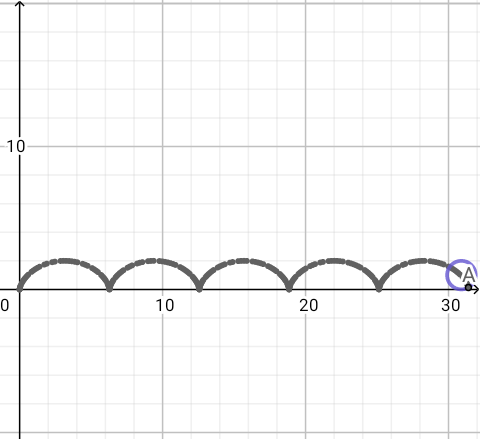
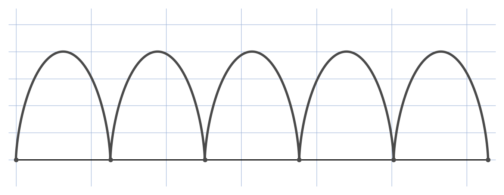

# Cycloïde (schéma) — transcription fidèle

> Source : `cycloide-schema.png` (1 page = 1 capture d'écran, fond quadrillé).
> Lisibilité 100 % (pas de texte manuscrit).

## Page 1 — transcription fidèle

[Zone graphique] Repère : axe vertical (flèche haut, graduation $10$), axe horizontal (flèche droite, origine $0$).

Cinq arches grises épaisses et régulières posées sur l'axe horizontal : zéros en $0$, $\approx 6$, $\approx 12$, $\approx 19$, $\approx 24$, $\approx 30$.

Graduations lisibles : $10$ (axe vertical), $0$, $10$, $20$, $30$ (axe horizontal).

Point $A_{5}$ (?) entouré en bleu-violet à $(30, 0)$ [lecture incertaine — lettre « A » dans un cercle].

## Figures

Le schéma EST la figure : arches de cycloïde. Reproduction paramétrique ($x = t - \sin t$, $y = 1 - \cos t$, 5 arches) :

*Script : `~/KpihX-Labs/Explore/lab/scripts/reproduce_cycloide-schema_1.py` — description précise : courbe grise épaisse à 5 arches tangentes à l'axe noir horizontal, grille bleu-gris, marques aux points de rebroussement, aspect non égal (arches aplaties comme l'original).*

## Vocabulaire / notions

- Cycloïde, arche, roulement sans glissement, point de rebroussement.
- Paramétrisation $x = r(t - \sin t)$, $y = r(1 - \cos t)$.
