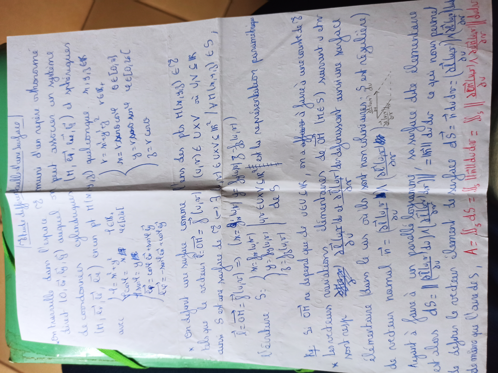
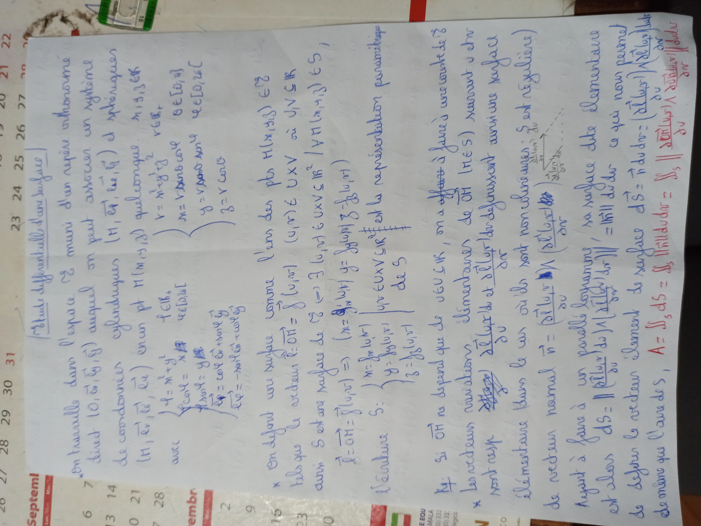
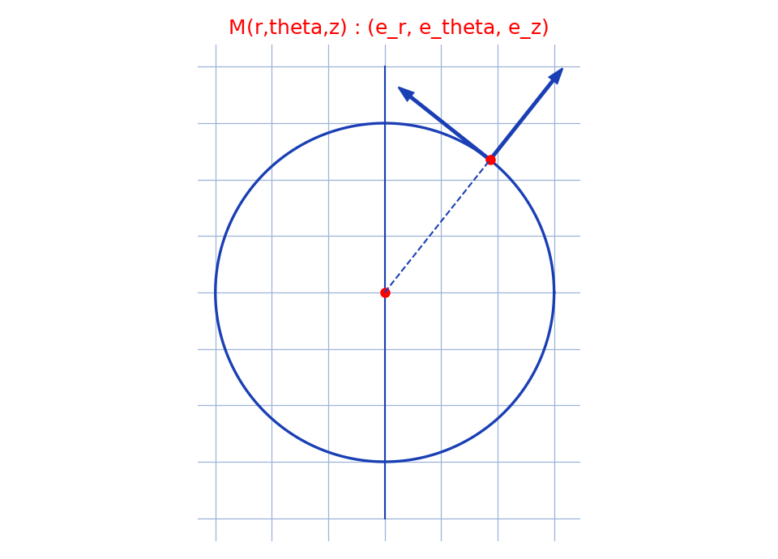
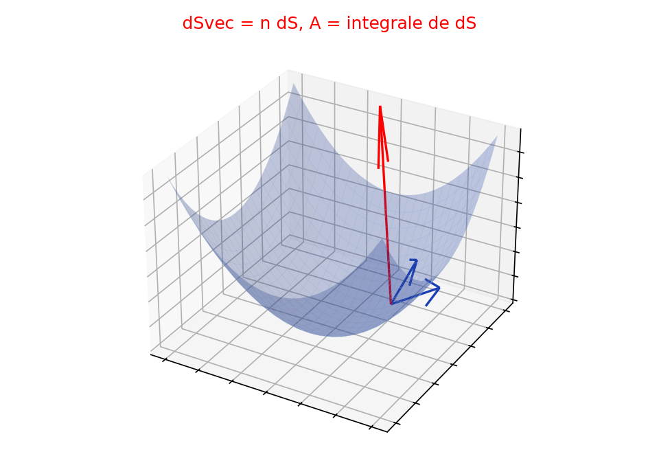

# Étude différentielle d'une surface — transcription fusionnée (2 prises)

> Sources : `differentielle-surface-prise1.jpg` (ex-`differentielle-surface-1`) + `differentielle-surface-prise2.jpg` (ex-`differentielle-surface-2`) — même feuillet double page manuscrite, encre bleue (+ rouge en fin), photo pivotée à 90°.
> Vérification visuelle le 2026-09-07 (rendus `/tmp/mtn/` en grand) : même titre « Etude différentielle d'une surface », mêmes formules, même petit schéma du parallélogramme, mêmes ratures — quasi-jumeaux, fusion confirmée.
> Contenu : paramétrisation $\vec{r} = \overrightarrow{OH} = f(u,v)$, coordonnées cylindriques, vecteurs tangents, normale, élément de surface $d\vec{S}$, aire $A = \iint_S dS$.

## Page 1 — transcription fusionnée (meilleure des 2 ; prise2 = quasi-jumeau de prise1)

|Etude différentielle d'une surface| (titre souligné)

\* On travaille dans l'espace $E$ muni d'un repère orthonorme direct $(O, \vec{e_x}, \vec{e_y}, \vec{e_z})$ [lecture incertaine] auquel on peut associer un système de coordonnées cylindriques $(M, \vec{e_r}, \vec{e_\theta}, \vec{e_z})$ et sphériques [lecture incertaine]

$(M, \vec{e_r}, \vec{e_\theta}, \vec{e_z})$ en un pt $M(r, \theta, z)$ quelconque : $r, \theta, z \in \mathbb{R}$ [lecture incertaine]

avec $\left\{ \begin{aligned} r = x^2 + y^2 &\quad r \in \mathbb{R}_+ \text{ [lecture incertaine]} \\ x = r\cos\theta &\quad \theta \in [0, 2\pi[ \text{ [lecture incertaine]} \\ y = r\sin\theta &\quad z \in \mathbb{R} \text{ [lecture incertaine]} \\ z = z &\quad \ldots \text{[lecture incertaine]} \end{aligned} \right.$

avec $\left\{ \begin{aligned} q = x^2 + y^2 &\quad \ldots \in \mathbb{R}_+ \text{ [lecture incertaine]} \\ \ldots \text{[lecture incertaine]} \end{aligned} \right.$

$\left\{ \begin{aligned} \vec{e_r} &= \cos\theta\,\vec{e_x} + \sin\theta\,\vec{e_y} \text{ [lecture incertaine]} \\ \vec{e_\theta} &= -\sin\theta\,\vec{e_x} + \cos\theta\,\vec{e_y} \text{ [lecture incertaine]} \end{aligned} \right.$

\* On définit une surface comme l'ens des pts $M(u,v) \in E$ [lecture incertaine] tels que le ordonn ... $\vec{r} = \overrightarrow{OH} = f(u,v)$ [lecture incertaine]

avec $S$ est une ... de $E$ ... (=) $f$ : ... $\in UxV \subset \mathbb{R}^2 \mid A(u,v) \in E$ ! [lecture incertaine]

L'écriture $S$ : $\vec{r} = \overrightarrow{OH} = f(u,v)$ (=) $\left( x = f(u,v) \mid y = g(u,v), z = h(u,v) \right)$ [lecture incertaine]

$S$ : $\left\{ \begin{aligned} x &= f(u,v) \\ y &= g(u,v) \\ z &= h(u,v) \end{aligned} \right.$ $\left| \begin{aligned} (u,v) \in UxV \subset \mathbb{R}^2 \text{ ... et la représentation paramétrique} \\ \text{de } S \text{ [lecture incertaine]} \end{aligned} \right.$

Rq : si $\overrightarrow{OH}$ ne dépend que de $U \in \mathbb{R}$, on a affaire à ... une courbe de $S$ [lecture incertaine]

\* Les vecteurs variation élémentaires de $\overrightarrow{OH}$ (les $S$) ... d'un ... : $\frac{\partial \overrightarrow{OM}}{\partial u}$ et $\frac{\partial \overrightarrow{OM}}{\partial v}$ ... définissent ... une surface [lecture incertaine]

Vecteur ... élémentaire ... le ... où ils sont non ... : $S$ est régulière [lecture incertaine]

de vecteur normal $\vec{n} = \frac{\left( \frac{\partial \vec{M}}{\partial u} \wedge \frac{\partial \vec{M}}{\partial v} \right)}{\left\| \ldots \right\|}$ [lecture incertaine] (petit schéma du parallélogramme : flèche $\frac{\partial \vec{M}}{\partial u}$, flèche $\frac{\partial \vec{M}}{\partial v}$, en pointillés)

Ayant à faire à un parallèle logramme, sa surface dite élémentaire est alors $dS = \left\| \frac{\partial \vec{M}}{\partial u} \wedge \frac{\partial \vec{M}}{\partial v} \right\| du\,dv$, $\|\ldots\| = \|n\| \,du\,dv$ ... ce qui nous permet [lecture incertaine]

de définir le vecteur élément de surface $d\vec{S} = \vec{n}\,dS = \left( \frac{\partial \vec{M}}{\partial u} \wedge \frac{\partial \vec{M}}{\partial v} \right) du\,dv$ (en rouge) [lecture incertaine — parenthésage]

de même que l'aire de $S$, $A = \iint_S dS = \iint_S \|\ldots\| \,du\,dv$ (en rouge) [lecture incertaine — intégrande]

## Figures

Figure du manuscrit (au niveau du vecteur normal) : petit parallélogramme en pointillés construit sur $\partial\vec{M}/\partial u$ et $\partial\vec{M}/\partial v$, flèche normale. Deux reproductions complémentaires :

Prise 1 — portion de nappe avec point $M$, deux vecteurs tangents (bleu) et normale (rouge), quadrillage bleu `#9db3d8`. PNG relu et conforme au croquis d'origine.

*Script : `~/KpihX-Labs/Explore/lab/scripts/reproduce_differentielle-surface_1.py` (ex-`reproduce_differentielle-surface-1_1.py`, exécuté avec `uv run`).*

Prise 2 — variante centrée sur les coordonnées cylindriques : cercle $r = \mathrm{cste}$, point $M$, base $(e_r, e_\theta)$, quadrillage bleu `#9db3d8`. PNG relu et conforme au passage cylindrique du manuscrit.

*Script : `~/KpihX-Labs/Explore/lab/scripts/reproduce_differentielle-surface_2.py` (ex-`reproduce_differentielle-surface-2_1.py`, exécuté avec `uv run`).*

## Vocabulaire / notions

- **Représentation paramétrique** : $\vec{r} = \overrightarrow{OH}(u,v)$, $(u,v) \in U \times V \subset \mathbb{R}^2$.
- **Coordonnées cylindriques** : $(r, \theta, z)$, base $(e_r, e_\theta, e_z)$ ; coordonnées sphériques [lecture incertaine].
- **Vecteurs tangents** : $\partial\overrightarrow{OM}/\partial u$, $\partial\overrightarrow{OM}/\partial v$.
- **Surface régulière** : tangents non colinéaires ; **normale** $\vec{n}$.
- **Élément de surface** : $dS = \|\partial\vec{M}/\partial u \wedge \partial\vec{M}/\partial v\| \,du\,dv$, $d\vec{S} = \vec{n}\,dS$ ; **aire** $A = \iint_S dS$.
