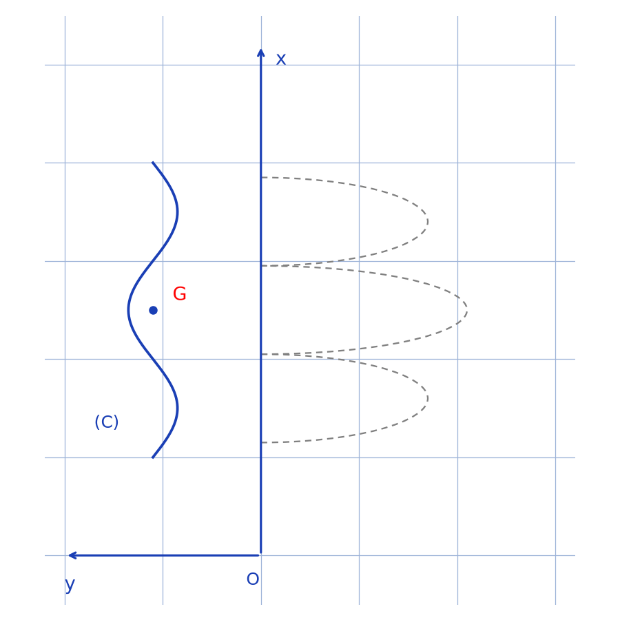
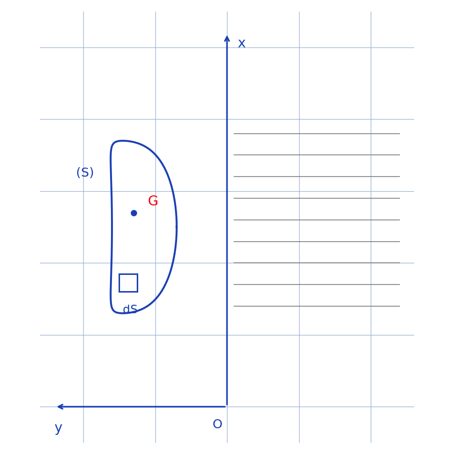
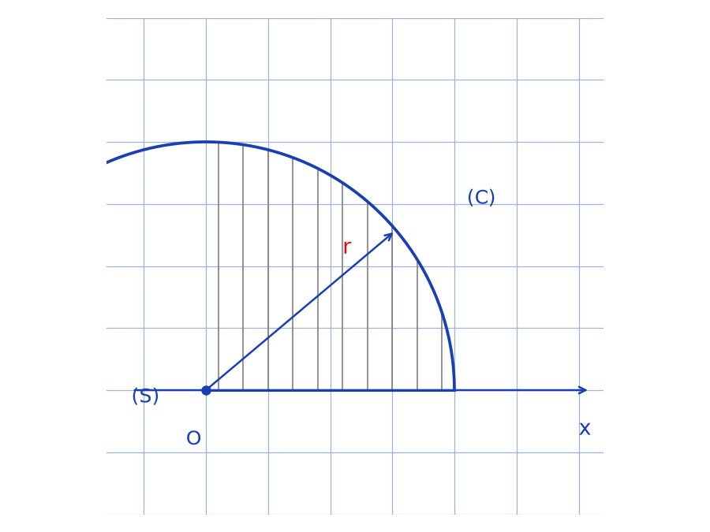
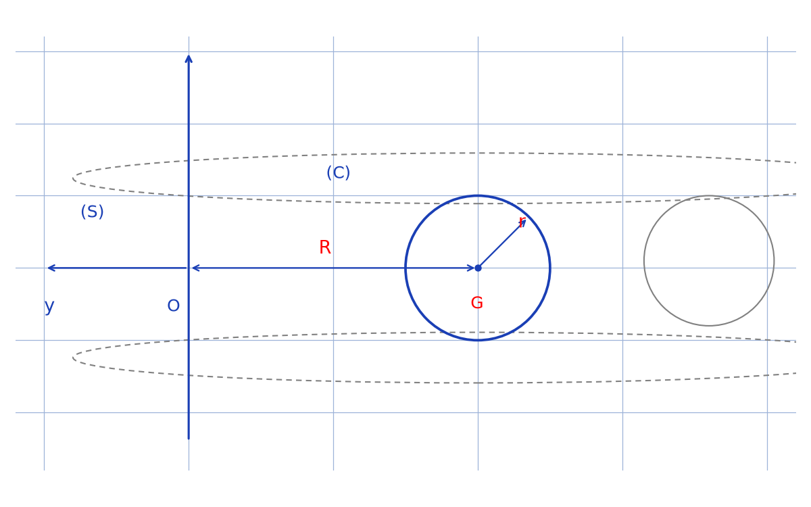

# Théorèmes de Guldin et applications — transcription fidèle

> 🧾 **Manuscrit original :** `guldin-applications.pdf` (scan, 2 pages) · ✍️ KpihX
> 🔍 **Statut :** démonstration des deux théorèmes de Guldin puis applications (sphère/boule, tore) ; une fraction intermédiaire en `[lecture incertaine — …]`. Transcrit mot à mot.
> 📄 **Source scannée :** [guldin-applications.pdf](guldin-applications.pdf) (restaurée Datas1, vérifiée pdfinfo, 2026-09-07)

---

## Page 1

Théor. de Guldin :

1er :

$L$ : longueur de $(C)$, $\lambda$ : masse linéique de $(C)$.

$S$ : l'aire de la surface engendrée par la rotation de $(C)$ autour de $(Ox)$.

$$S = \int_{P \in (C)} 2\pi y_P \, [raturé] \, dx = 2\pi \int y_P \, dl$$

or $\overrightarrow{OG} = \dfrac{1}{\lambda L} \int_{P \in (C)} \overrightarrow{OP} \, \lambda \, dl \Rightarrow y_G = \dfrac{1}{L} \int_{P \in (C)} y_P \, dl$.

Alors $S = (2\pi y_G) \cdot L$.

*Figure p.1 : axe $(Ox)$ vertical, axe $y$ horizontal partant de $O$ ; courbe ouverte $(C)$ ondulée avec son centre de gravité $G$ ; arcs en pointillés à droite suggérant la surface de révolution.*

2e :

$$V = \int_{P \in (S)} 2\pi y_P \, dS$$

or $\overrightarrow{OG} = \dfrac{1}{\sigma S} \int_{P \in (S)} \overrightarrow{OP} \, (\sigma \, dS)$

d'où $y_G = \dfrac{1}{S} \int_{P \in (S)} y_P \, dS$.

Donc $V = (2\pi y_G) \cdot S$.

*Figure p.1 : surface fermée $(S)$ verticale avec son centre de gravité $G$ et un élément $dS$ ; hachures horizontales à droite suggérant le volume de révolution autour de $(Ox)$.*

Exemple : * Centre de gravité de $(C)$ et $(S)$.

Car $(Oy)$ est axe de symétrie de $(C)$ et $(S)$ alors $G_C, G_S \in (Oy)$.

— La rotation de $(C)$ (resp $(S)$) autour de $(Ox)$ engendre une sphère (resp boule). D'après les théorèmes de Guldin, $4\pi r^2 = L_{(C)} \times 2\pi y_{G_C} \Rightarrow y_{G_C} =$ [lecture incertaine — fraction intermédiaire] $= \dfrac{2r}{\pi}$.

*Figure p.1 (bas droite) : axe $x$ horizontal avec origine $O$ ; demi-disque $(S)$ hachuré de rayon $r$, bordé par le demi-cercle $(C)$.*

## Page 2

et $\dfrac{4}{3}\pi r^3 = S_S \times 2\pi y_{G_S} \Rightarrow y_{G_S} =$ [lecture incertaine — fraction intermédiaire, lue $\dfrac{4}{3}\pi r^3 \times \dfrac{2}{\sigma r}$] $= \dfrac{4r}{3\pi}$.

\* Aire et volume d'un tore.

*Figure p.2 : axe vertical et axe $y$ horizontal avec origine $O$ ; cercle $(C)$ de centre $G$ et de rayon $r$, à distance $R$ de l'axe ; ellipses en pointillés et second cercle suggérant le tore engendré par rotation autour de $(Oy)$.*

La rotation de $(C)$ (resp de $(S)$) autour de $(Oy)$ engendre un tore de rayons $r$ et $R$.

D'après les théorèmes de Guldin,
$$S = 2\pi y_{G_C} \cdot L_C$$
$$= 2\pi \times R \times 2\pi r$$
$$= 4\pi^2 r R$$
$$V = 2\pi y_{G_S} \cdot S_S$$
$$= 2\pi \times R \times \pi r^2$$
$$= 2\pi^2 R r^2$$

## Figures

| # | Page | Sujet | Script | PNG |
|---|------|-------|--------|-----|
| 1 | 1 | Courbe $(C)$ + axe $(Ox)$, surface de révolution en pointillés | `reproduce_guldin_applications_1.py` |  |
| 2 | 1 | Surface $(S)$ + axe $(Ox)$, volume de révolution hachuré | `reproduce_guldin_applications_2.py` |  |
| 3 | 1 | Demi-disque $(S)$ hachuré bordé par le demi-cercle $(C)$, rayon $r$ | `reproduce_guldin_applications_3.py` |  |
| 4 | 2 | Cercle $(C)$ de centre $G$ et rayon $r$ à distance $R$ de l'axe, tore en pointillés | `reproduce_guldin_applications_4.py` |  |

Aucune autre figure sur les 2 pages : les 4 schémas ci-dessus couvrent tout le visuel (vérification visuelle des rendus `/tmp/qmix/guldin-applications-*.png`).

## Vocabulaire

- Théorèmes de Guldin (1er : surface ; 2e : volume) : $S = (2\pi y_G) \cdot L$, $V = (2\pi y_G) \cdot S$.
- $(C)$, $(S)$ : courbe et surface génératrices ; $(Ox)$, $(Oy)$ : axes de rotation.
- $G$, $G_C$, $G_S$ : centres de gravité ; $y_G$ : distance de $G$ à l'axe.
- $L$ : longueur de $(C)$ ; $\lambda$ : masse linéique ; $\sigma$ : masse surfacique.
- $dS$, $dl$ : éléments de surface/longueur ; sphère/boule (rayon $r$) ; tore (rayons $r$, $R$).
