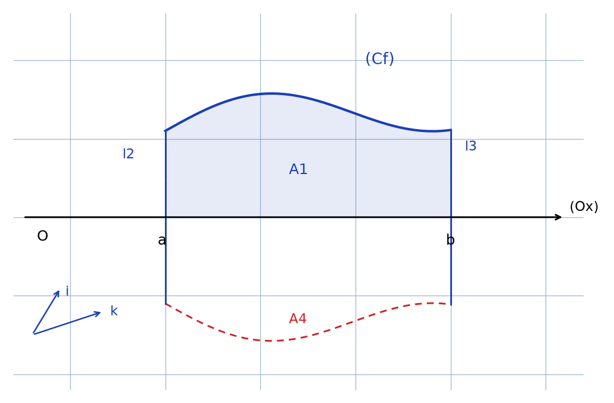
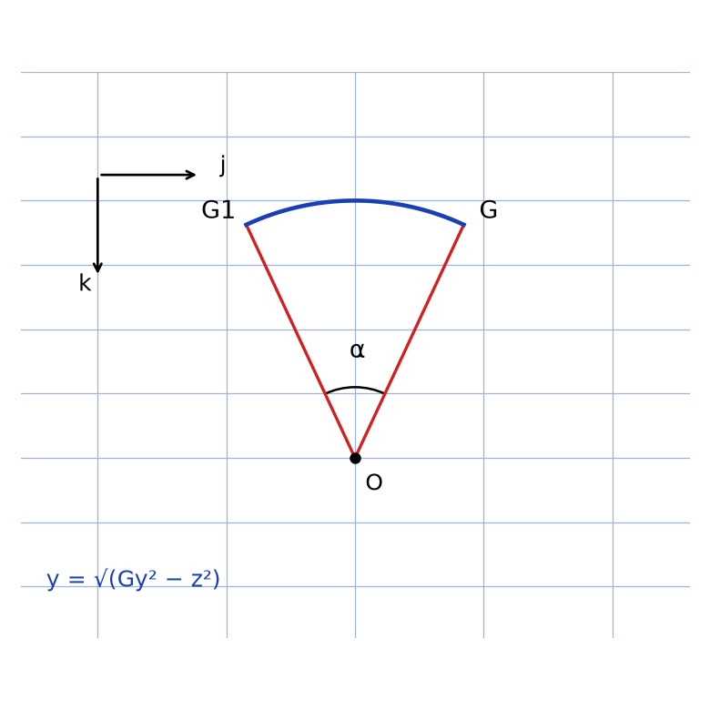

# Théorèmes de Guldin & Suppléments — transcription fidèle

> 🧾 **Manuscrit original :** `guldin-centres-masse.pdf` (scan, 10 pages) · ✍️ KpihX
> 🔍 **Statut :** démonstration des deux théorèmes de Guldin (Pappus-Guldin) via centres de masse, avec applications (sphère, tore, boule, demi-disque) ; papier quadrillé froissé, plusieurs passages en `[lecture incertaine — …]`. Transcrit mot à mot.
> 📄 **Source scannée :** [guldin-centres-masse.pdf](guldin-centres-masse.pdf) (restaurée Datas1, vérifiée pdfinfo, 2026-09-07)

---

## Page 1

06/11/2021

\* Théorèmes de Guldin & Suppléments

Note : Paul Goldin [*sic* — Guldin] est un mathématicien Suisse. Son théorème est souvent nommé théorème de Pappus-Guldin par soucis d'antériorité de démonstration dudit théorème

\* Soit la courbe $(C_f)$ d'une fonction continue et dérivable sur un intervalle $[a, b]$ avec $(C_f)$ construite dans le plan $(xOy)$ d'un repère orthonormé direct $(O, \vec{\imath}, \vec{\jmath}, \vec{k})$ et telle que $(C_f)$ ne [raturé — « rencontre »] traverse pas $(Ox)$

*Figure p.1 : axe $(Ox)$ horizontal avec origine $O$ et repère $(\vec{\imath}, \vec{k})$ ; courbe $(C_f)$ bleue au-dessus de l'axe entre les abscisses $a$ et $b$, avec les cotes verticales $l_2$ (en $a$) et $l_3$ (en $b$) ; aire $A_1$ sous la courbe ; moitié symétrique en pointillés rouges ($A_4$) suggérant la surface de révolution. Légende manuscrite au pied de la figure en partie illisible : [lecture incertaine — mentions « $l_3$ … à $(Ox)$ », « $\alpha/2$ », « $A_1$ », « $A_2$ », « $A_4$ … par rapport … symétrie », « $b$ », et « L'autre moitié est obtenue par » (suite page 2)].*

## Page 2

on fait tourner $(C_f)$ d'un angle $\alpha$ par rapport à $(O, \vec{\imath})$ et on s'intéresse au calcul des paramètres de la solide obtenue [lecture incertaine — « du solide obtenu » ?]

On a : $l_1 = |b - a| = b - a$ pour $b > a$

$l_2 = |f(a)|$, $l_3 = |f(b)|$ avec $f(b), f(a) > 0$

$l_4 = L(C_f) = \int_a^b dl$ où $dl = \sqrt{dx^2 + dy^2}$

Donc $l_4 = L(C_f) = \int_a^b \sqrt{1 + f'(x)^2} \, dx$

$A_1 = \int_a^b f(x) \, dx$ , $A_2 = \frac{\alpha}{2\pi} \times \pi f(a)^2 = \frac{\alpha}{2} \, f(a)^2$

[lecture incertaine — indice raturé/surécrit, lu $A_1$, probablement $A_2$ ou second disque d'extrémité] $= \frac{\alpha}{2\pi} \times \pi f(b)^2 = \frac{\alpha}{2} \, f(b)^2$

$A_3 = \int_a^b dl \times (\alpha f(x))$

d'où $A_3 = \int_a^b \alpha f(x) \sqrt{1 + f'(x)^2} \, dx$

ou encore $A_3 = \alpha \int_a^b f(x) \, dx \times \frac{\int_a^b f(x) \sqrt{1 + f'(x)^2} \, dx}{\int_a^b f(x) \, dx}$

ou en découpant $(C_f)$ en éléments de longueur $dl$ le centre de masse de chaque portion

## Page 3

$dl$ | en admettant que $(C_f)$ est une masse uniformément répartie de densité linéique $\lambda$ a pour coordonnées $(x, f(x))$ à une position $x$ quelconque sur $(C_f)$ !

ainsi en appelant $G$ ($g_x$, $g_y$) [lecture incertaine — second indice surécrit] le centre de masse de $(C_f)$, on a :

$$g_x = \frac{\int_a^b x \, dm}{\int_a^b dm} \quad \text{or } dm = \lambda \, dl = \lambda \, dx \sqrt{1 + f'(x)^2}$$

$$g_x = \frac{\int_a^b x \sqrt{1 + f'(x)^2} \, dx}{\int_a^b \sqrt{1 + f'(x)^2} \, dx}$$

$$g_y = \frac{\int_a^b f(x) \, dm}{\int_a^b dm} \quad \text{d'où } g_y = \frac{\int_a^b f(x) \sqrt{1 + f'(x)^2} \, dx}{\int_a^b \sqrt{1 + f'(x)^2} \, dx}$$

ainsi $A_3 = \alpha \times \int_a^b [\text{lecture incertaine — } \sqrt{1 + f'(x)^2} \, dx] \times \frac{\int_a^b f(x) \sqrt{1 + f'(x)^2} \, dx}{\int_a^b \sqrt{1 + f'(x)^2} \, dx}$

D'où $A_3 = \alpha \times L(C_f) \times G_y$ (souligné deux fois)

## Page 4

D'où le $1^{\text{er}}$ énoncé du théorème de Guldin :

« La mesure de l'aire engendrée par la rotation d'un arc de courbe plane autour d'un axe de son plan ne traversant pas l'arc de courbe, est égal au produit de la longueur de l'arc de courbe par la longueur de la circonférence décrite par son centre de gravité »

By : Ce théorème peut aider à det [lecture incertaine — « déterminer » ?] le centre de gravité d'un arc de courbe

Ex : Lorsque $f$ est un demi-cercle où $x^2 + y^2 = R^2$ avec $y \ge 0$, le théorème nous donne pour une rotation complète ($2\pi$) [lecture incertaine — mot surécrit] de cet arc donnant la sphère de rayon $R$ ceci : $2\pi \times \pi R \times G_y = 4\pi R^2 \Rightarrow G_y = \frac{2R}{\pi}$

et par principe de symétrie $G_x = 0$, $G_z = 0$

## Page 5

- Pour le calcul de l'aire d'un tore on remplace $(C_f)$ par un cercle qu'on fait toujours tourner d'un tour complet ainsi $A = 2\pi \times 2\pi r \times R = 4\pi^2 r R$ où $r$ et $R$ sont les rayons du tore d'où $A = 4\pi^2 r R$

- En reconsidérant le cas général pour trouver les coordonnées du centre de masse $G_1$ de la surface d'aire $A_3$ On la découpe en des rectangles [raturé — mot illisible] infiniment [lecture incertaine — « minces » ?] de largeur $dx$ et de longueur $f(x)$. le centre de masse de chaque rectangle a pour coord $(x, f(x)/2)$ en une abscisse $x$ quelconque. En supposant que cette surface est de masse uniforme de densité surfacique $\sigma$, on a :

## Page 6

$$\begin{cases} x_{G_1} = \dfrac{\int_a^b x \, dm}{\int_a^b dm} \\ y_{G_1} = \dfrac{\int_a^b \frac{1}{2} f(x) \, dm}{\int_a^b dm} \end{cases} \quad \text{or } dm = \sigma \, dx \, f(x)$$

d'où $G_1 \left( \frac{\int_a^b x f(x) \, dx}{\int_a^b f(x) \, dx} \ ; \ \frac{1}{2} \frac{\int_a^b f(x)^2 \, dx}{\int_a^b f(x) \, dx}, \ 0 \right)$

- Quant à la surface $S_3$ (d'aire $A_3$), Son centre de masse [raturé — « barycentre »] est le pt $G_3$, barycentre des pts obtenus par rotation de $G$ par rapport à $(Ox)$ d'angle $\theta \in [0 ; \alpha]$ Cet ens de pts forme ainsi un arc de cercle délimité par $G$ et $G' = r((Ox) ; \alpha)$ [lecture incertaine — rotation d'angle $\alpha$ autour de $(Ox)$] et étant identiques, ils forment une distribution massique uniforme. En raisonnant de façon analogue qu'à la det de $G$ [raturé — fin de ligne illisible] mais cette fois ci dans le plan contenant [?] où cet arc va de

## Page 7

$a_1$ [lecture incertaine — « $a = -G_y \sin \alpha/2$, $b = G_y \sin \alpha/2$ » ?] on a : [lecture incertaine — début de formule rogné en haut de page]

$$G_{3x} = \frac{\int_a^b x \sqrt{1 + \frac{z^2}{G_y^2 - z^2}} \, dz}{\int_a^b \sqrt{1 + \frac{z^2}{G_y^2 - z^2}} \, dz} \quad \text{[lecture incertaine — variables et bornes]}$$

$G_{3z} = 0$ car $z \mapsto z \sqrt{1 + \frac{z^2}{G_y^2 - z^2}}$ est impaire et $a = -b$

$G_{3y} = \frac{2 \int_0^b \sqrt{G_y^2 - z^2} \sqrt{1 + \frac{z^2}{G_y^2 - z^2}} \, dz}{2 \int_0^b \sqrt{1 + \frac{z^2}{G_y^2 - z^2}} \, dz}$ car $z \mapsto \sqrt{G_y^2 - z^2}$ [lecture incertaine — suite : « $\times \sqrt{1 + \frac{z^2}{G_y^2 - z^2}}$ est paire »] ainsi que $z \mapsto \sqrt{1 + \frac{z^2}{G_y^2 - z^2}}$

$$= \frac{2 \, G_y \, b}{G_y \int_0^b \frac{1}{\sqrt{1 - (z/G_y)^2}} \, [\text{lecture incertaine — fin de l'intégrale}]}$$

$$= \frac{G_y \sin \alpha/2}{\text{[lecture incertaine — dénominateur]}} \quad \text{or [lecture incertaine — « avec } b/G_y \to 0 \text{ » ?]}$$

Donc $G_{3y} = \frac{2 G_y \sin \alpha/2}{\alpha}$

Il en résulte $G_{3x} = G_{1x}$

*Figure p.7 (haut droite) : secteur d'angle $\alpha$ de sommet $O$ sur l'axe, délimité par les rayons $OG$ et $OG_1$ ; arc de cercle $G \dots G_1$ de rayon $G_y$ ; petit repère $(\vec{\jmath}, \vec{k})$ ; mention $y = \sqrt{G_y^2 - z^2}$.*

## Page 8

D'où $G_3 \left( 0 \ ; \ \frac{\int_a^b x \sqrt{1 + f'(x)^2} \, dx}{\int_a^b \sqrt{1 + f'(x)^2} \, dx} \ ; \ \frac{2 \sin \alpha/2}{\alpha} \frac{\int_a^b f(x) \sqrt{1 + f'(x)^2} \, dx}{\int_a^b \sqrt{1 + f'(x)^2} \, dx} \right)$ [lecture incertaine — première composante rognée en marge, lue d'après le fragment « $0$ ; $\int \dots / \int \dots$ ; $2\sin\alpha/2 \dots$ »]

\* Quant au volume tout entier décrit, $V = \int_a^b \left( \frac{\alpha}{2\pi} \times \pi f(x)^2 \right) dx$

D'où $V = \int_a^b \frac{\alpha}{2} \, f(x)^2 \, dx$

Pour le centre $G'$ du volume l'en supposant une répartition uniforme de masse en raisonnant [?] pour la détermination de $G_3$ mais maintenant plutôt sur la surface de la portion de cercle, on a : $G'_x = \frac{\int_a^b [\text{lecture incertaine}]}{\int_a^b [\text{lecture incertaine}]}$ où $f : z \mapsto y = \sqrt{G_y^2 - z^2}$

$G'_z = 0$ car $z \mapsto z \sqrt{G_y^2 - z^2}$ est impaire et $a = -b$

$G'_y = \frac{\int_a^b [\text{lecture incertaine — } |G_y^2 - z^2| \, dz]}{\int_a^b \sqrt{G_y^2 - z^2} \, dz} = \frac{2}{2} \times \frac{\frac{1}{3} G_y^3 \sin \alpha/2 \, (3 - \sin^2 \alpha/2)}{G_y^2 (\frac{\alpha}{2} + \frac{1}{2} \sin \alpha)} $ [lecture incertaine — fraction finale en bas de page]

## Page 9

Donc $G' \left( G_x = \frac{\int_a^b x \sqrt{1 + f'(x)^2} \, dx}{\int_a^b \sqrt{1 + f'(x)^2} \, dx} \ ; \ [\text{lecture incertaine — second membre rogné en marge}] \right)$ où $G_y = \frac{\int_a^b f(x) \sqrt{1 + f'(x)^2} \, dx}{\int_a^b \sqrt{1 + f'(x)^2} \, dx}$

\* En revenant à $V$, $V = \alpha \times \frac{1}{2} \frac{\int_a^b f(x)^2 \, dx}{\int_a^b f(x) \, dx} \times \int_a^b f(x) \, dx$

soit $V = \alpha \times G_y \times A(?) $ [lecture incertaine — « $A(C_f)$ », l'aire sous $(C_f)$ ?]

D'où le $2^{\text{e}}$ énoncé : La mesure du volume engendré par la révolution d'un [?] de surface plane autour d'un axe situé dans son plan et ne le coupant pas, est égale au produit de l'aire de la surface par la longueur de la circonférence décrite par son centre de gravité

## Page 10

AN : En considérant le tore de rayon $r$ et $R$ de l'exemple précédent, son volume intérieur est $V_t = 2\pi \times R \times \pi r^2 = 2\pi^2 R r^2$

By Ce théorème peut être utile pour déterminer le centre de gravité (sa position) d'une surface En prenant pour surface un demi-disque qu'on fait tourner de $2\pi$ autour de $(Ox)$ pour obtenir une boule, son volume est $V = \frac{4}{3} \pi R^3 = 2\pi \times G_y \times \pi R^2 / 2 \Rightarrow G_y = \frac{4R}{3\pi}$ Ainsi $G \left( 0 \ ; \ \frac{4R}{3\pi} \right)$

## Figures

| # | Page | Sujet | Script | PNG |
|---|------|-------|--------|-----|
| 1 | 1 | Courbe $(C_f)$ entre $a$ et $b$ au-dessus de $(Ox)$, moitié symétrique en pointillés | `reproduce_guldin-centres-masse_1.py` |  |
| 2 | 7 | Arc de cercle des centres $G$ et $G_1$, angle $\alpha$, $y = \sqrt{G_y^2 - z^2}$ | `reproduce_guldin-centres-masse_2.py` |  |

Aucune autre figure sur les 10 pages : hors p.1 et p.7, le manuscrit ne contient que du texte et des équations (papier quadrillé froissé).

## Vocabulaire

- Théorèmes de Guldin & Pappus-Guldin : $S$, $V$ engendrés par révolution autour d'un axe ne coupant pas la figure.
- $(C_f)$ : courbe d'une fonction continue et dérivable sur $[a, b]$, ne traversant pas $(Ox)$.
- $G$, $G_1$, $G_3$, $G'$ : centres de masse (courbe, surface, solide, volume) ; $G_y$ : distance à l'axe.
- $l_1 \dots l_4$ : $|b-a|$, $|f(a)|$, $|f(b)|$, $L(C_f)$ ; $A_1 \dots A_4$ : aires (sous-courbe, disques d'extrémité, surface, symétrique).
- $\alpha$ : angle de rotation ; $\lambda$ : densité linéique ; tore ($r$, $R$) ; boule ; demi-disque.
- Goldin [*sic* — Guldin] : graphie d'origine p.1, conservée et signalée.
