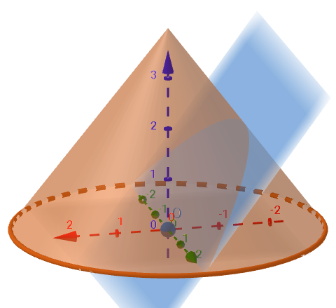
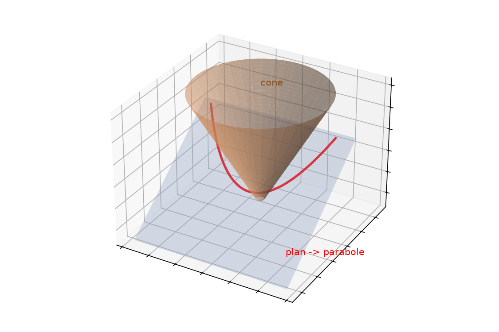

# Parabole schéma — transcription fidèle

> Source : `parabole-schema.png` (1 page : rendu 3D numérique, aucun texte manuscrit).
> Fait-main : non applicable (image de synthèse) ; page conservée comme témoin visuel cône + plan → parabole.

## Page 1 — transcription fidèle

[reconstruction — motif : aucun texte manuscrit sur la page, image de synthèse seule]

Description fidèle du contenu visuel :

- Cône (orange/beige) d'axe vertical bleu gradué ($1, 2, 3$, flèche au sommet), base elliptique soulignée orange avec pointillés arrière.
- Plan sécant bleu clair traversant le cône en oblique ; intersection = courbe grisée (parabole).
- Repères : axe rouge horizontal gradué ($-2, -1, 0, 1, 2$, flèche vers la gauche), axe vert secondaire ($0, 1, 2$), sphère grise au centre (origine).
- Le plan est parallèle à une génératrice du cône : la section est une parabole (cas limite entre ellipse et hyperbole).

## Figures

La figure, c'est l'image elle-même (cône coupé par un plan). Reproduction 3D schématique :

*Script : `~/KpihX-Labs/Explore/lab/scripts/reproduce_parabole-schema_1.py` — description précise : surface conique orange semi-transparente, plan bleu oblique semi-transparent, courbe rouge d'intersection (parabole), annotations « cône » et « plan → parabole ».*

## Vocabulaire / notions

- Cône de révolution, plan sécant, conique : parabole (plan parallèle à une génératrice).
- Sommet, axe, génératrice, intersection cône-plan.
