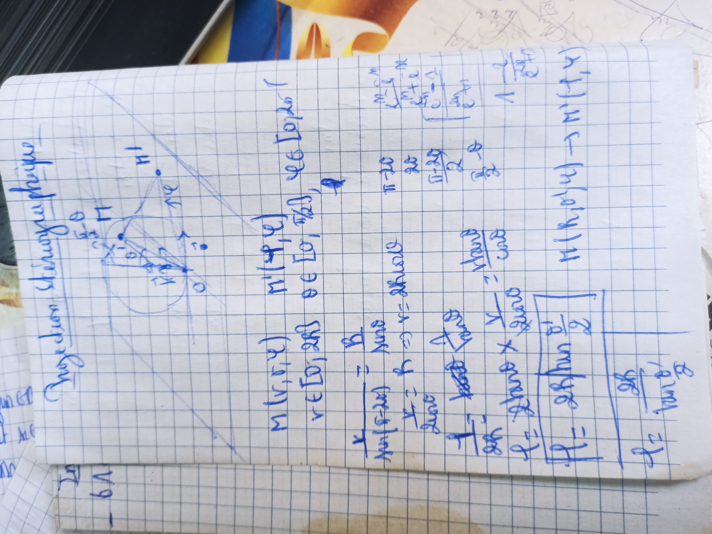
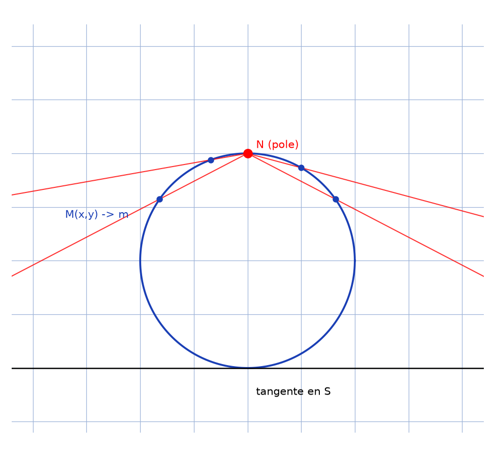

# Projection stéréographique — transcription fidèle

> Source : `projection-stereographique.jpg` (1 page, stylo bleu sur cahier quadrillé, page pivotée).
> Lisibilité ~60 % ; schéma du cercle + tangente à gauche, calculs à droite.

## Page 1 — transcription fidèle

Projection stéréographique [titre vertical, en marge]

[Schéma :] cercle, points $H$ [lecture incertaine], $M$, $O$ [?], tangente en $O$ [?], rayons depuis le pôle.

$M(x, y)$ [lecture incertaine]

$X \in [0, 20]$ [lecture incertaine] $\theta \in [0, \pi]$, $re[to...]$ [lecture incertaine]

$\frac{1}{...} = \frac{y}{...}$ [lecture incertaine — Thalès :] $\frac{X}{...} = \frac{y}{...}$ donc $c = ...$ [lecture incertaine] car ...

donc $X = ...$ [lecture incertaine]

$T = ...$ [lecture incertaine] $...$ $...$ [formules empâtées]

$...$ donc $\frac{X}{...} = \frac{...}{...}$ [lecture incertaine]

$f = ...$ $x$ donc $\frac{X}{...} = \frac{...}{...}$ [lecture incertaine]

$[f = ... \text{ impair } \frac{...}{...}]$ [lecture incertaine — encadré]

$\Lambda$ [lecture incertaine] $\frac{1}{...}$ [lecture incertaine]

$f^2 = \frac{de}{l'mge}$ [lecture incertaine — tableau de variations de $f$, à droite]

$M(1, y) \to M(-1, y)$ [lecture incertaine — bas de page, en travers]

## Figures

Schéma du manuscrit (cercle + rayons depuis le pôle $N$ vers la tangente en $S$) + reproduction :

*Script : `~/KpihX-Labs/Explore/lab/scripts/reproduce_projection-stereographique_1.py` — description précise : cercle unité bleu, pôle $N$ rouge en haut, droite tangente en $S$ en bas, rayons rouges $N \to M \to m$ pour 4 points $M(x,y)$, légende « $M(x,y) \to m$ ».*

## Vocabulaire / notions

- Projection stéréographique, cercle, pôle $N$, tangente en $S$.
- Point $M(x, y)$, projeté $m$, Thalès, parité/imparité de $f$ [lecture incertaine], tableau de variations.
