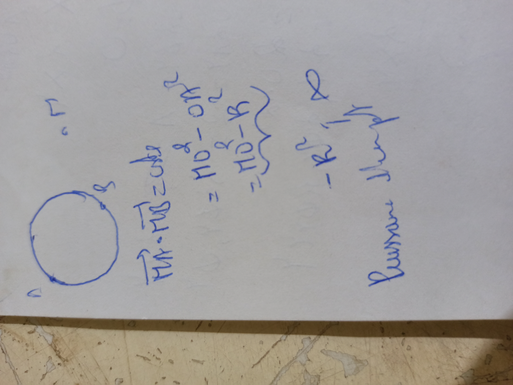
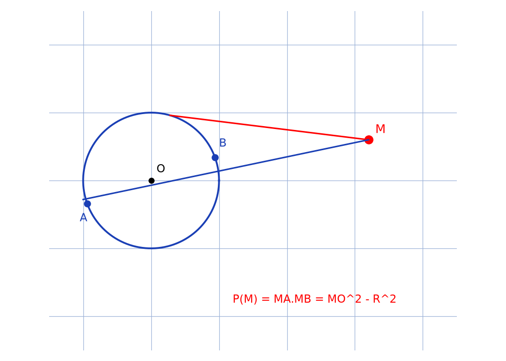

# Puissance point — transcription fidèle

> Source : `puissance-point.jpg` (1 page, stylo bleu, page pivotée).
> Lisibilité ~75 % ; schéma : cercle $C$ avec sécante en haut à gauche.

## Page 1 — transcription fidèle

$[C]$ [lecture incertaine — lettre du cercle, en haut à gauche]

[Schéma :] cercle $C$, point $s$ [lecture incertaine] sur le cercle, sécante coupant en $A$ [?] et $B$ [?].

$\overrightarrow{MA} \cdot \overrightarrow{MB} = 20h$ [lecture incertaine — « $= MA \times MB$ » ?]

$= MO^2 - oH^2$ [lecture incertaine — « $= MO^2 - R^2$ » d'après le contexte puissance d'un point]

$= MH^2 - R^2$ [lecture incertaine]

$f(M) = ...$ [lecture incertaine — « puissance du point $M$ », en haut à droite]

$f(M) = ...$ $M$ ... [lecture incertaine]

## Figures

Schéma du manuscrit (cercle $C$, sécante $M$–$A$–$B$) + reproduction :

*Script : `~/KpihX-Labs/Explore/lab/scripts/reproduce_puissance-point_1.py` — description précise : cercle unité bleu centré en $O$, point rouge $M$ extérieur, sécante bleue $M$–$A$–$B$, tangente rouge $MT$, légende « $P(M) = MA \cdot MB = MO^2 - R^2$ ».*

## Vocabulaire / notions

- Cercle $C$ (centre $O$, rayon $R$), point $M$, sécante coupant en $A$ et $B$.
- Puissance du point $f(M) = \overrightarrow{MA} \cdot \overrightarrow{MB} = MO^2 - R^2$.
