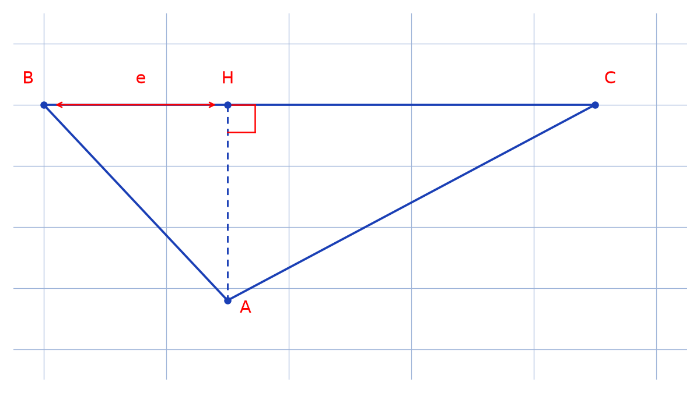

# Triangles rectangles d'hypoténuse donnée — transcription fidèle

> 🧾 **Manuscrit original :** `triangle-rectangle-hypotenuse.pdf` (manuscrit, 3 pages : 1 page d'énoncé + 2 pages d'éléments de solution) · ✍️ KpihX
> 🔍 **Statut :** exercice sur les triangles rectangles $ABC$ d'hypoténuse $[BC]$ de longueur $h$ ($BH = e \in ]0,h[$) : cardinalité, unicité, aire maximale ; une figure reproduite (script + PNG + description). Transcrit mot à mot.
> 📄 **Source scannée :** [triangle-rectangle-hypotenuse.pdf](triangle-rectangle-hypotenuse.pdf) (restaurée Datas1, vérifiée pdfinfo, 2026-09-07)

---

## Page 1

Ex : Soit un segment de longueur $h$ donné $[BC]$. On s'intéresse aux triangles rectangles $ABC$ / $BH = e \in ]0,h[$ avec $H$ le pied de la hauteur relative à $[BC]$

1/ Montrer qu'on a autant de tels triangles que de nombres réels (on pourra montrer qu'il existe une bijection entre l'ens Trect de ces triangles et $\mathbb{R}$ [lecture incertaine — « ens »])

2/ Déduire qu'il y a plus de ces triangles que d'entiers naturels.

1/ Pour $e \in ]0,h[$ montrer qu'il en existe un unique triangle rectangle dont on donnera les valeurs de $AB$, $AC$, $AH$, $(\widehat{\overrightarrow{BA}, \overrightarrow{BC}})$ [*sic* — la numérotation porte deux « 1/ »]

3/ Trouver la valeur de $e$ pour laquelle l'aire de $ABC$ est maximale et donner cette aire max.

[marge droite : fragments d'une autre page, illisibles]

## Page 2

$A = h\sqrt{eh-e^2}$ [lecture incertaine — le facteur $1/2$ de la page 3 n'y figure pas]. $A' = \dfrac{h(-2e+h)}{2\sqrt{eh-e^2}}$ $e = h/2$

Els de Sol

1/ Soit $e \in ]0,h[$.

Tout triangle rectangle / $BH = e$ et $BC = h$ vérifie $AH^2 = BH \times HC = e(h-e)$ ainsi $AB = \sqrt{AH^2+BH^2} = \sqrt{eh}$ et $AC = \sqrt{AH^2+HC^2} = \sqrt{h(h-e)}$

$ABC$ étant rectangle et $AB$ et $AC$ étant uniques

Il n'existe qu'un seul triangle $ABC$ pour un $e$ dans $]0,h[$ [raturé] $(\widehat{\overrightarrow{BA}, \overrightarrow{BC}})$ : on a $\tan \frac{e}{\sqrt{e(h-e)}}$ [lecture incertaine — formule de l'angle] $= \arctan \sqrt{\frac{e}{h-e}}$ [lecture incertaine — formule de l'angle]

*Figure p.2 : $B$, $H$, $C$ alignés sur l'hypoténuse, $BH = e$, hauteur $HA$ en pointillés jusqu'au sommet $A$ (angle droit marqué en $H$), côtés $BA$ et $AC$.*

1'/ [raturé — « Soit »]. Plus haut on a montré qu'il y a bijection entre $]0,h[$ et Trect, la réciproque (pour tout triangle $ABC$ $e$ est unique et [illisible] $(\widehat{\overrightarrow{BA}, \overrightarrow{BC}})$) étant aussi vraie [lecture incertaine — fin de parenthèse].

ainsi Trect $\equiv ]0,h[$

• En considérant $f : \mathbb{R} \to ]0,h[$ $x \mapsto \frac{h}{\pi}\arctan x + \frac{h}{2}$ [lecture incertaine — lu « Arctan »]

en vérifiant qu'elle est bijective on a :

$\mathbb{R} \equiv ]0,h[ \equiv \text{Trect} \implies \mathbb{R} \equiv \text{Trect}$

2/. Supposons qu'il y ait une bijection entre $]0,1[$ et $\mathbb{N}$ / $0 \leftrightarrow 0,d_{11}d_{12} \dots d_{1n} \dots$

$\dots$

$n \leftrightarrow 0,d_{n1}d_{n2} \dots d_{nn} \dots$

où les $d_{ij}$ sont des chiffres. En considérant $m = 0,c_1 \dots c_n \dots$ où $c_i$ est un chiffre autre que $d_{ii}$ car $c_i \ne d_{ii}$ $\forall i$ alors $m \ne 0,d_{i1} \dots d_{ii} \dots$ $\forall i$ et ainsi $c_i$ n'a pas d'antécédent dans $\mathbb{N}$ [lecture incertaine — « $c_i$ » pour « $m$ »]

Donc $]0,1[ \not\equiv \mathbb{N}$. En considérant l'application bijective $g : \mathbb{R} \to ]0,1[$ $x \mapsto \frac{1}{\pi}\tan x + \frac{1}{2}$ [lecture incertaine — « tan » ou « Arctan »] on a : $]0,1[ \equiv \mathbb{R}$

## Page 3

et donc $]0,1[ \equiv \text{Trect}$. D'après ce qui précède non seulement $]0,1[ \not\equiv \mathbb{N}$ mais ce on a aussi montré que toute application de $\mathbb{N}$ vers $\mathbb{N}$ est injective et pas surjective [*sic* — généralisation abusive] on peut d'une certaine façon écrire $\text{Card } ]0,1[ > \text{Card } \mathbb{N}$

D'où $\text{Card Trect} > \text{Card } \mathbb{N}$ et donc on a plus de rectangles pour $e \in ]0,h[$ et d'entiers naturels [*sic* — « et » pour « que »].

3/ Soit $e \in ]0,h[$ $A_{ABC}(e) = \frac{AB \times AC}{2}$ [raturé]

$$= \frac{\sqrt{eh}\sqrt{h(h-e)}}{2}$$

$$= \frac{h\sqrt{he-e^2}}{2}$$

En étudiant $A_{ABC}$ : $]0,h[ \to \mathbb{R}$ $e \mapsto \dfrac{h\sqrt{he-e^2}}{2}$

on montre que $A_{ABC \max} = A_{ABC}(h/2) = \dfrac{h^2}{4}$ [lecture incertaine — exposant] u.a

## Figures

| # | Page | Sujet | Script | PNG |
|---|------|-------|--------|-----|
| 1 | 2 | Triangle : $B,H,C$ alignés sur l'hypoténuse, hauteur $HA$, angle droit en $H$ | `reproduce_triangle_rectangle_hypotenuse_1.py` |  |

Aucune autre figure sur les 3 pages : p.1 (énoncé) et p.3 (fin de solution) sont du texte seul (vérification visuelle du rendu `/tmp/qmix/triangle-rectangle-hypotenuse-1.png` pour p.1).

## Vocabulaire

- Trect : ensemble des triangles rectangles $ABC$ d'hypoténuse $[BC]$ de longueur $h$, $BH = e \in ]0,h[$.
- $H$ : pied de la hauteur relative à $[BC]$ ; $AH^2 = BH \times HC = e(h-e)$.
- $AB = \sqrt{eh}$, $AC = \sqrt{h(h-e)}$ ; $(\widehat{\overrightarrow{BA}, \overrightarrow{BC}})$ : angle en $B$.
- Bijection Trect $\equiv ]0,h[ \equiv \mathbb{R}$ ; $\text{Card Trect} > \text{Card } \mathbb{N}$ (diagonale de Cantor).
- $A_{ABC}(e) = \frac{h\sqrt{he-e^2}}{2}$ ; max en $e = h/2$, $A_{\max} = h^2/4$ ; u.a : unités d'aire.
- Els de Sol : éléments de solution.
