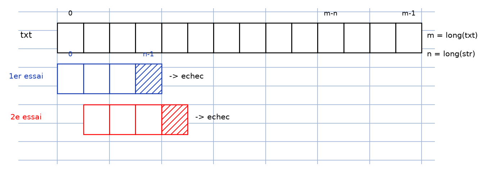
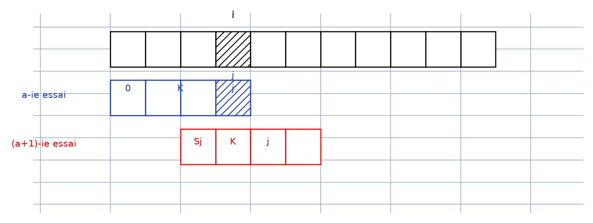
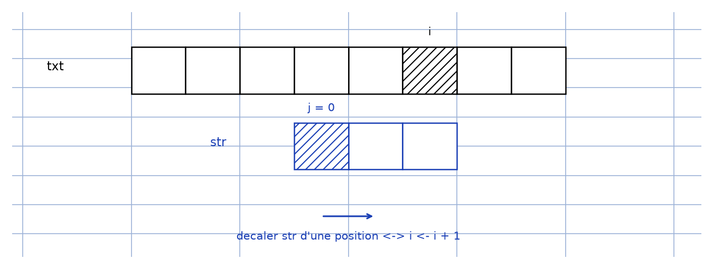
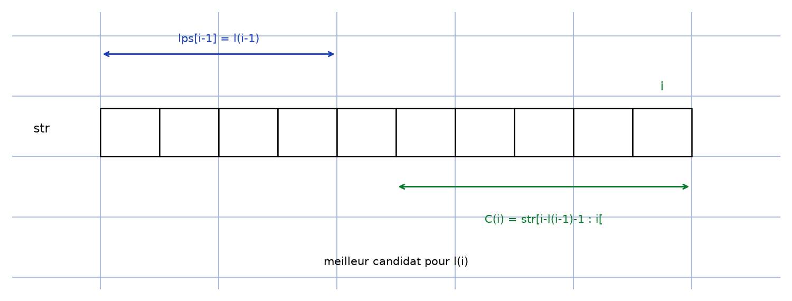

# Algorithme KMP — transcription fidèle

> 🧾 **Manuscrit original :** `algorithme-kmp.pdf` (notes numériques, 4 pages) · ✍️ KpihX
> 🔍 **Statut :** notes « Analyse Numérique » du 24 Novembre 2024 (recherche d'un motif `str` dans un texte `txt`, fonction `lps`, complexités) ; figures d'alignements décrites, deux reproduites (scripts + PNG + descriptions). Transcrit mot à mot.
> 📄 **Source scannée :** [algorithme-kmp.pdf](algorithme-kmp.pdf) (restaurée Datas1, vérifiée pdfinfo, 2026-09-07)

---

## Page 1

Algorithme KMP

24 Novembre 2024 20:02

Contexte : Dans la recherche classique d'une str dans un texte (txt),

[schéma — ligne de cases `txt` indexée $0$, $m-n$, $m-1$ ; $m$ = long(txt), $n$ = long(str) ; 1er essai : `str` aligné en $0$..$n-1$ → échec ; 2e essai : `str` décalé d'une position → échec ; points de suspension puis `str` en fin de texte]

Figure 1 — recherche classique : le motif glisse d'une position à chaque échec.

[Reproduction `lab/scripts/reproduce_algorithme-kmp_1.py` : rangée `txt` ($m$ cases, indices $0$, $m-n$, $m-1$), 1er essai bleu ($n$ cases, échec hachuré), 2e essai rouge décalé d'une position (échec hachuré).]

au pire des cas on se retrouve à faire $n \times (m-n+1)$ comparaisons

⋆ L'objectif ainsi à atteindre est de linéariser cette complexité pour l'avoir en $O(m+n)$ : d'où l'algorithme KMP

Idées : ⋆ On veut exploiter les comparaisons déjà faites qui ont conduit à des presque-égalités pour ne plus avoir à seulement décaler d'une position après un échec

→ cas d'échec à une position $(i, j)$ ($j > 1$) (ce qui se répète tant qu'on ne trouve pas str)

[schéma — portion de `txt` avec échec en $i$ (case hachurée, indices $i-j$, $j$) ; $a$-ième essai : `str` aligné, indices $0$, $K$, $j$ ; $(a+1)$-ième essai : `str` décalé, indices $S_j$, $K$, $j$]

Figure 2 — échec en $(i, j)$, $j > 1$ : shift de $K$ positions, la comparaison reprend en $i$.

[Reproduction `lab/scripts/reproduce_algorithme-kmp_2.py` : rangée `txt` (échec hachuré en $i$) ; $a$-ième essai bleu (indices $0$, $K$, $j$) ; $(a+1)$-ième essai rouge décalé ($S_j$, $K$, $j$).]

⋆ On va tenter de shifter str de $K$ (caractères) qui ne sera plus nécessairement $1$, mais à quelle contrainte ?

N'oublions pas qu'on veut linéariser la complexité et une idée intéressante serait de faire en sorte que la prochaine comparaison au niveau de txt, demeure à l'indice d'échec $i$ ; ainsi soit on avance sur txt soit on reste sur place ; on ne fait jamais de retour en arrière. C'est déjà quelque chose. Voyons ce que ça donne

[schéma — portion de `txt` avec échec (cases hachurées) ; $a$-ième essai : `str` avec indices $0$, $K$, $j$ ; $(a+1)$-ième essai : `str` décalé avec $S_j$, $K$, $j$]

Rq : $\begin{cases} t_i = \text{txt}[i-j, i[ : i \in I \\ S_j = \text{str}[0 : j[ : j \in K \end{cases}$ [lecture incertaine — notations « $I$ », « $K$ »]

Pour que la comparaison continue en position $i$, il faut que les portions $t_i$ et $S_j$ coïncident et ainsi on n'aura qu'à continuer la comparaison avec $\text{txt}[i]$ et $\text{str}[K]$

Or n'oublions pas qu'au $a$-ième essai $\text{txt}[i-j : i[$ et $\text{str}[0 : j[$ coïncidaient et donc en particulier $S_j$ et $t_i$.

Ainsi $S_j' = t_i = S_j$ ; $S_j$ est ainsi un ps (prefixe suffixe) de $\text{str}[0 : j[$ ; la contrainte qu'on cherchait pointe déjà son nez.

Mieux encore un bon shift de str caractérisé par $K$ est tel que $t_i = S_j$ soit le plus long possible, afin qu'il ne manque presque plus de caractères de str à comparer, augmentant ainsi nos chances d'avoir le motif str cherché dans txt.

Il vient naturellement qu'il faut prendre en considération le plus gros ps de $\text{str}[0 : j[$. On veut ainsi minimiser $j-K$ et donc minimiser par ricochet $K$. Or $K > 1 \Rightarrow$ ce petit shift [lecture incertaine — « ce petit shift », peut-être « ce peut shift »]

→ cas d'échec en $(i, j)$ ($j = 0$)

[schéma — courte rangée `txt` avec échec en $i$ (case hachurée) ; `str` court dessous avec échec en $j$ (case hachurée)]

Figure 3 — échec en $(i, j)$, $j = 0$ : décalage d'une position, $i \leftarrow i+1$.

[Reproduction `lab/scripts/reproduce_algorithme-kmp_3.py` : rangée `txt` (échec hachuré en $i$) ; `str` court dessous (échec hachuré en $j = 0$) ; flèche de décalage + mention $i \leftarrow i+1$.]

Dans ce cas il faut juste décaler str d'une position vers la droite ; ça revient tout simplement à incrémenter $i$ dans le processus.

Justification : ⋆ Montrons qu'on ne peut avoir raté une présence de str dans txt qu'on aurait obtenue en shiftant str de seulement $K' < K$ caractères

[schéma — rangée `txt` avec marques $t_i^1$, $t_{K'}$ ; $a$-ième essai : `str` avec $0$, $K$, $S_j$, $j$ ; $(a+1)$-ième essai : `str` décalé avec $S_j$, $K$, $j$]

Rq : $\begin{cases} t_i = \text{txt}[i-j, i[ : i \in I \\ S_j = \text{str}[0 : j[ : j \in K \end{cases}$

## Page 2

[schéma — suite du précédent : $a$-ième essai, $(a+1)$-ième essai ($S_j$, $K$, $j$), essai hypothétique ($S_j'$)]

Si tel était le cas, on aurait $\text{str} = t_{K'}$ et donc en particulier $S_j'' = t_i'$. En raisonnant comme on l'a fait plus haut, on constate qu'on vient de déceler un ps de str[$j'$] [lecture incertaine — « str[$j'$] »] plus long que $t_i$ ; ce qui est absurde au vu de la condition fixée sur $K$

⋆ Le processus de construction de l'idée du plus long ps (lps : longest prefix suffix) assure que l'avancée dans txt se fait dans un seul sens. Mais vu qu'on peut stagner à une position $i$, est-ce qu'on aura vraiment une complexité en $O(n+m)$ ? On verra dans la suite

principe : ⋆ il faut d'abord être en mesure d'évaluer les $\text{lps}[i] = \text{lps de str}[0 : i[$, $\forall i \in \mathopen{[}1 ; n\mathclose{]}$ et sans excéder $O(n)$. Ici par lps on entend la longueur de ce plus long ps.

Rq : Je suis allé jusqu'à $n$ car je me suis dit que ce serait intéressant d'essayer de voir si on ne peut pas une fois avoir toutes les occurrences ; en effet ce cas correspond à la situation où $j = n$ et donc on a trouvé une occurrence de str, mais on aimerait poursuivre la recherche comme si de rien n'était. Le raisonnement en amont s'applique et la situation est équivalente à chercher $\text{lps}[n]$

– $\text{lps}[1] = 0$

– Pour $i \geqslant 2$ ($i \leqslant n$) | qu'on a déjà évalué les $\text{lps}[j]_{j=1}^{i-1}$ on a :

[schéma — rangée de cases `str` avec flèche $\text{lps}[i-1]$ et accolade $\text{lps}[i-1] = l_{i-1}$ pointant l'indice $i$ ; $C_i$ dessous]

Figure 4 — $\text{lps}[i-1]$ et meilleur candidat $C_i = \text{str}[i-l_{i-1}-1 : i[$.

[Reproduction `lab/scripts/reproduce_algorithme-kmp_4.py` : rangée `str` ; double-flèche $\text{lps}[i-1] = l_{i-1}$ en tête ; accolade $C_i$ pointant l'indice $i$ ; mention « meilleur candidat pour $l_i$ ».]

Rq : $\text{lps}[x] = l_x$

• le meilleur candidat est $C_i = \text{str}[i-l_{i-1}-1 : i[$

• S'il ne marche pas alors $l_i \leqslant l_{i-1}$ [avec annotation $\text{lps}[i-1]$ au-dessus du début de la rangée]

[schéma — rangée `str` avec accolade $C_i$ en tête, flèche $\text{lps}[i-1]$, accolade $\text{lps}[i-1] = l_{i-1}$ sous l'indice $i$ ; partie encerclée reliant $C_i$ à la fin, légende $C_i$]

Comme le montre la partie encerclée, la recherche de $l_i$ s'effectue maintenant dans $\text{str}[l_{i-1} : i]$

Cette fois-ci le meilleur candidat est le lps de $l_{i-1}$ car le lps de $i$ s'il n'est pas inférieur en taille à celui-là, en lui retirant un caractère, il devient le lps de $l_{i-1}$

Ainsi, formellement,

Pour $i$ allant de $2$ à $n$ Faire

$l \leftarrow \text{lps}[i-1]$

Tant que $l > 0$ et $\text{str}[i-1] \neq \text{str}[l]$ Faire

$l \leftarrow \text{lps}[l]$ ; // On décroît strict vu que $\text{lps}[l] \leqslant l-1$

Fin Tant que

[bas de page tronqué : « … Si … Faire »]

Analyse Numérique Page 2

## Page 3

Fin Tant que

Si $\text{str}[i-1] = \text{str}[l]$ Faire

$\text{lps}[i] = \text{lps}[l] + 1$

Sinon

$\text{lps}[i] = 0$ ;

FinSi

FinPour

→ Complexité : (En nbre de comparaisons)

On part du constat que $\text{lps}[k] \geqslant 0$ $\forall k \in \mathopen{[}1 ; n\mathclose{]}$

Tant qu'on reste dans l'une des boucles, $l$ ne reste pas stable

le nbre d'itérations est ainsi entièrement déterminé par $l$

Au cours des phases itératives, $l$ commence à $0$ et est incrémenté

On constate qu'au cours d'une itération (while ou for) $l$ est incrémenté au max $1$ fois et ceci de $1$ (indirectement via $\text{lps}[i-1]$)

Or vu que $l$ commence à $0$ et que Pour s'exécute $n-1$ fois et ainsi $l$ est incrémenté au plus $n-1$ fois dans tout le programme

De plus car $l \geqslant 0$, $l$ sera décrémenté au plus $n-1$ fois également ce qui limite le nbre d'itérations de la boucle à $n-1$ au plus

On se retrouve ainsi avec au plus $n-1 + n-1 = 2n-2 = O(n)$ comparaisons

D'où $O(n)$

⋆ Ayant lps il faut maintenant rechercher tous les motifs comme convenu plus haut

[schéma — rangée `txt` avec échecs hachurés ; $a$-ième essai : `str` avec $0$, $K$, $S_j$, $j$ ; $(a+1)$-ième essai : `str` décalé avec $S_j$, $K$, $j$]

Rq : $\begin{cases} t_i = \text{txt}[i-j, i[ : i \in I \\ S_j = \text{str}[0 : j[ : j \in K \end{cases}$

De la figure ci-dessous après un échec en position $i$ ou une occurrence entièrement trouvée, il faudra reprendre la comparaison de $\text{txt}[i]$ avec $\text{str}[d]$ où $d = \text{lps}[j]$

On obtient ainsi le code ci-dessous

$i \leftarrow 0$, $j \leftarrow 0$ ;

Tant que $i \leqslant m-n$ Faire

Tant que $\text{str}[j] = \text{txt}[i]$ Faire

Analyse Numérique Page 3

## Page 4

[haut de page tronqué — suite du code :] Tant que $i \leqslant m-n$ Faire

Tant que $\text{str}[j] = \text{txt}[i]$ Faire

$i \leftarrow i+1$ ;

$j \leftarrow j+1$ ;

FinTantQue

Si $j = 0$ Alors

$i \leftarrow i+1$ ;

Sinon

Si $j = n$ Alors

occ.append($[i-j]$) ;

FinSi

$j \leftarrow \text{lps}[j]$ ;

FinSi

FinTantQue

→ Complexité : (En terme de comparaisons)

On a autant de conditions que de variation de $j$ et de $i$ dans « si $j = 0$… ».

– Dans le $1^{er}$ cas $j$ commence à $0$ et $j$ est incrémenté seulement si $i$ l'est aussi. Or $i$ commence à $0$ et $i \leqslant m-n$ ainsi $j$ est incrémenté au plus $m-n$ fois ; et est donc également décrémenté au plus $m-n$ fois dans tout le processus, soit au plus $2m-2n$ variations de $j$.

– Dans le $2^e$ cas, $i$ est incrémenté ; mais ce cas peut être compté dans le $1^{er}$ car avec le $1^{er}$ on a exactement $m-n$ incrémentations de $i$ en tout (les incrémentations de $j$ étant comptées) et au plus $m-n$ décrémentations de $j$ comme expliqué plus haut vu que $j \leqslant 0$ [lecture incertaine — « vu que $j \leqslant 0$ »]

Soit une complexité en tout de $C_2 = m-n + m-n = 2m-2n$ …$1$ [lecture incertaine — fin de ligne]

En conclusion de complexité, $C = C_1 + C_2 = 2n-2nt + 2n-1 = 1m-2 = O(m)$ [lecture incertaine — calcul final raturé/illisible, se lit : « $2m-2n + 2n-2 = 2m-2 = O(m)$ »]

Analyse Numérique Page 4

## Figures

| # | Page | Sujet | Script | PNG |
|---|------|-------|--------|-----|
| 1 | 1 | Recherche classique : `txt` ($m$ cases), 1er/2e essais → échecs | `reproduce_algorithme-kmp_1.py` |  |
| 2 | 1 | Échec en $(i,j)$, $j > 1$ : shift de $K$, reprise en $i$ | `reproduce_algorithme-kmp_2.py` |  |
| 3 | 1 | Échec en $(i,j)$, $j = 0$ : décalage simple, $i \leftarrow i+1$ | `reproduce_algorithme-kmp_3.py` |  |
| 4 | 2 | $\text{lps}[i-1]$ et meilleur candidat $C_i$ | `reproduce_algorithme-kmp_4.py` |  |

Croquis de travail non reproduits en propre (variantes redondantes des gabarits ci-dessus + texte) :
p.1 (variante $a$-ième/$(a+1)$-ième essai avec $S_j, K, j$ ; justification $K' < K$),
p.2 (suite de l'essai hypothétique ; variante $C_i$ encerclé),
p.3 (variante `txt` + essais avec reprise en $d = \text{lps}[j]$) — [reconstruction — motif : mêmes boîtes-alignements que fig. 2/3/4, le texte transcrit suffit].

## Vocabulaire

- `txt`, `str` : texte ($m = \text{long}(\text{txt})$) et motif ($n = \text{long}(\text{str})$) recherché.
- $i$, $j$ : indices courants dans `txt` et `str` ; $(i, j)$ : position d'échec.
- $K$ : shift (décalage) de `str` après échec ; $S_j = \text{str}[0 : j[$, $t_i = \text{txt}[i-j : i[$.
- ps : « prefixe suffixe » [*sic* — préfixe-suffixe] ; lps : longest prefix suffix ; $l_x = \text{lps}[x]$.
- $C_i = \text{str}[i-l_{i-1}-1 : i[$ : meilleur candidat pour $l_i$.
- Essai : alignement `str`/`txt` testé ; occurrence : $j = n$ (motif trouvé, `occ.append`).
- $O(m+n)$, $O(n)$, $O(m)$ : complexités (comparaisons) ; linéariser : ramener à $O(m+n)$.
- SNALG : sans nuire à la généralité ; Rq : remarque ; d'où / ainsi / or : articulations.
