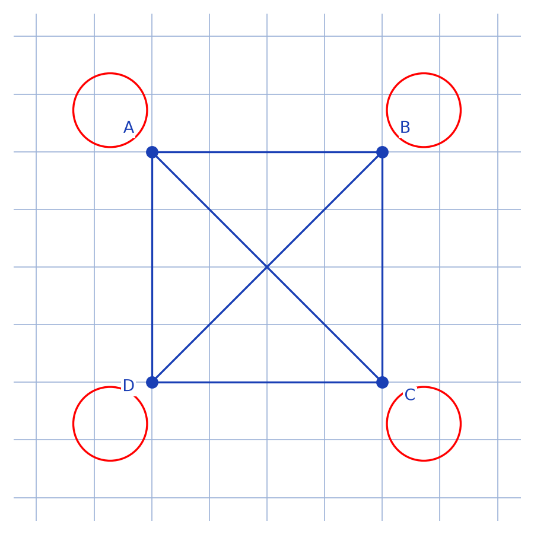
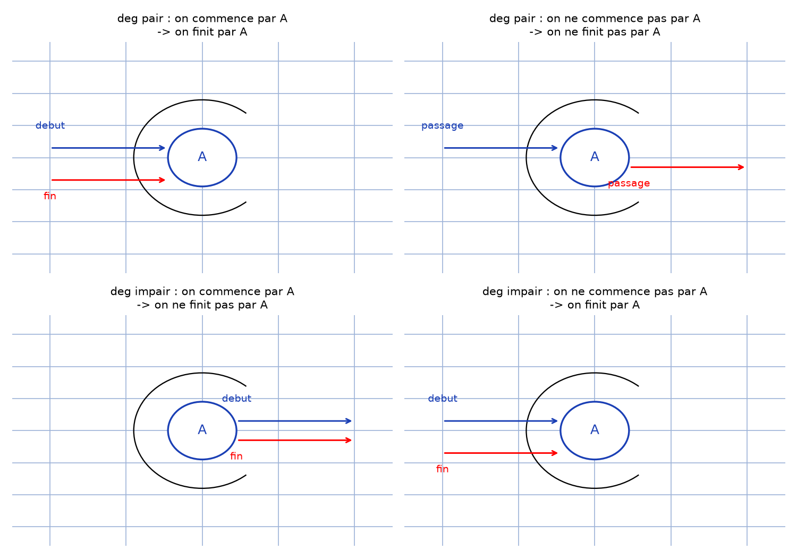
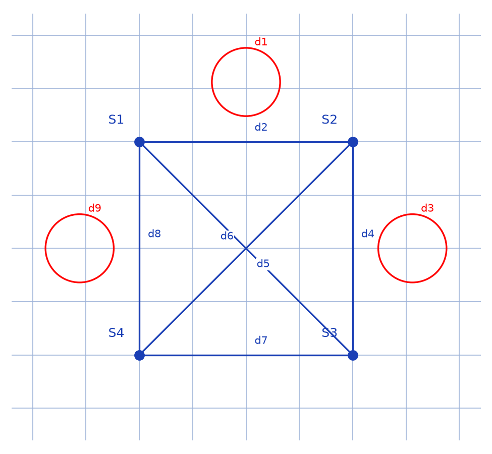
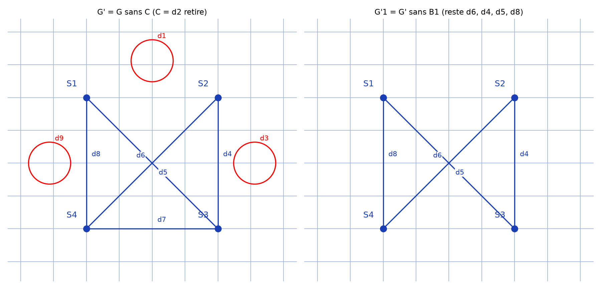

# Parcours de graphes — transcription fidèle

> 🧾 **Manuscrit original :** `parcours-graphes.pdf` (notes manuscrites, 8 pages) · ✍️ KpihX
> 🔍 **Statut :** parcours eulériens (impossibilité sur le graphe à 4 sommets de degré 5, rôle des sommets de degré impair, construction par boucles $B_1 \to \cdots \to B_m$, application à $G$) ; figures de graphes décrites, quatre reproduites (scripts + PNG + descriptions). Transcrit mot à mot.
> 📄 **Source scannée :** [parcours-graphes.pdf](parcours-graphes.pdf) (restaurée Datas1, vérifiée pdfinfo, 2026-09-07)

---

## Page 1

PB : Peut-on parcourir toutes les arêtes de ce graphe dans un seul sens et en ne passant qu'une seule fois sur une arête ?

[schéma — graphe à 4 sommets $A$ (haut-gauche), $B$ (haut-droite), $D$ (bas-gauche), $C$ (bas-droite) : $K_4$ (6 arêtes entre les 4 sommets) + 1 boucle par sommet ; chaque sommet est ainsi de degré 5]

Figure 1 — graphe du problème : 4 sommets équivalents, chacun de degré 5.

[Reproduction `lab/scripts/reproduce_parcours-graphes_1.py` : carré $A$, $B$, $C$, $D$ (arêtes bleues : 4 côtés + 2 diagonales), 1 boucle rouge par sommet.]

. À priori, après plusieurs tentatives, on est poussé à conjecturer que non !

. Vu qu'il y a un nombre limité de possibilités on peut toutes les tester et se rendre compte que c'est impossible.

Soit $N$ une majoration du nbre de possibilités. Les sommets étant équivalents, SNALG on va commencer par $A$. On a 5 possibilités au départ puis si on va à $B$ (SNALG) on aura ensuite 4 possibilités de chemins possibles. Si on décide de revenir en $A$ on aura plus que 3 possibilités en $A$. Pour obtenir alors $N$, il faut le plus possible passer par des sommets différents donc on va aller plutôt à $C$ et on aura 4 pos puis à $D$ ce qui donne 4 possibilités en on revient en $A$ [*sic* — « en on revient »]. à ce [raturé — mot raturé] stade $N = 5 \times 4^3$. En reparcourant les sommets dans l'ordre $A \to B \to C \to D \to A$ on aboutit à $N = 5 \times 4^3 \times 3 \times 2^3 = 7680$. Revenu en $A$ on aura qu'un seul choix possible (aller en $C$ et tout s'arrête) $\boxed{N = 7680}$.

. On va démontrer cette impossibilité avec une approche plus efficiente.

## Page 2

- Pour un sommet $A$ d'un graphe connexe $G$

. si $\deg(A) \in 2\mathbb{N}^*$

- si on commence le parcours de $G$ par $A$ on devra obligatoirement [raturé — mot raturé avant « finir »] finir par $A$ en vue de ne passer sur une arête qu'une seule fois. Ex. [schéma — sommet $A$, flèches « début » vers $A$, « fin » depuis $A$ : on entre et on sort autant de fois]

- sinon on ne commence pas le parcours de $G$ par $A$ on ne pourra finir le parcours par $A$. Ex. [schéma — sommet $A$ : « on vient à $A$ », « on part hors de $A$ », boucle de retour]

. si $\deg(A) \in 2\mathbb{N}+1$ :

- si on commence le parcours de $G$ par $A$ on ne pourra finir par $A$ à moins de repasser sur une arête. Ex. : [schéma — « on commence par $A$ », « on finit par quitter $A$ »]

- sinon, on devra finir en $A$. Ex. [schéma — « on arrive en $A$ », « on finit en $A$ », boucle de retour]

Figure 3 — parité du degré : entrer/sortir de $A$ selon qu'on commence (ou non) par $A$.

[Reproduction `lab/scripts/reproduce_parcours-graphes_3.py` : 4 panneaux (pair/impair × commence/ne commence pas par $A$) ; sommet $A$, flèches « début » (bleu) / « fin » (rouge) orientées selon le cas, boucle de retour.]

NB : on peut bien démontrer cela par récurrence

## Page 3

- On se ramenant à notre PB étant équivalents, on commence le parcours par $A$ (SNALG). [schéma — rappel du graphe $A$, $B$, $C$, $D$ ; « les sommets ($G$) »]

. Puisque $\deg A = 5 \in 2\mathbb{N}+1$, le parcours ne pourra se terminer en $A$ donc soit en $B$ ou $C$ ou $D$

. Puisque $\deg B = 5 \in 2\mathbb{N}+1$ et qu'on ne commence pas par $B$ on devra [raturé — début de mot] terminer le parcours de $G$

. Des raisonnements analogues mtrq [lecture incertaine — abréviation, peut-être « montrent que »] l'on devra aussi terminer le parcours de $G$ en $C$ et en $D$ (Ce qui est absurde !)

[Donc on ne peut parcourir $G$ sans passer par une arête plus d'une fois — souligné]

* Interprétation : Soit $G$ un graphe connexe où $G = (S, A)$ $S = \{S_1, \cdots, S_n\}$

- Si les degrés des sommets de $G$ sont tous [raturé — « en paire » ?] impairs, en raisonnant ce [lecture incertaine — mot] en amont, en commençant par un sommet quelconque $S_i$ on ne pourra finir le par par lui ; par suite on devra finir le parcours par les autres $S_j \ne S_i$ (car $\deg S_j \in 2\mathbb{N}+1$), ce qui est absurde ! donc on ne peut parcourir $G$ [en ne ?] passant une fois par arête

## Page 4

. Si $\mathrm{Card}\, S = 2$ alors on commencera par $S_i$ et on terminera par $S_j$ d'où la possibilité de parcourir $G$.

. Si $\mathrm{Card}\, S \ne 2$ [lecture incertaine — « $\pm 2$ » ou « $+ 2$ »] on a plus de 2 $S_j$ d'où l'impossibilité de finir par ces $S_j$ à la fois, d'où l'impossibilité de parcourir $G$ en passant une fois par arête

- De façon générale, si on commence par un sommet et qu'il y a au moins 2 autres de degrés impairs on ne pourra parcourir $G$ en passant une fois par arête

- Mieux encore, si on a au moins 3 sommets de degrés impairs dans $G$, il y aura toujours au moins 2 par lesquels on ne commencera pas d'où on ne pourra parcourir $G$ en passant une fois par arête

. Si on a que 2 sommets de degrés impairs dans $G$, on commence nécessairement par l'un et on finira sur l'autre car on pourra toujours quitter les autres sommets car de degrés pairs. Le trajet consiste à commencer par l'un des sommets de degré impair puis parcourir les arêtes de l'autre sommet de degré impair [raturé — passage raturé puis réécrit : « en ne laissant »] en ne laissant une seule pour ne passer par toutes les autres arêtes avant de finir par l'arête laissée (Justification dans la suite) [bas de page — fin de ligne illisible]

## Page 5

Rq : on ne peut avoir 1 sommet de degré impair car vu que $\sum_{i=1}^n \deg(S_i) = 2\,\mathrm{card}(A)$ ona [lecture incertaine — « on a »] toujours un nombre pair de sommets de degré impairs.

. Si on que des sommets de degrés pairs, il est possible de parcourir $G$ suivant le processus suivant : Il existe au moins une boucle partant des $S_i$ ($B_1$) [schéma — polygone $S_5$, $S_6$, $S_1$, $S_9$] car $G$ connexe et $\deg(S_i) \in 2\mathbb{N}^*$. on parcourt d'abord les arêtes de cette boucle revenant ainsi à $S_1$ puis en considérant $G \setminus B_1$, $\deg_{G \setminus B_1}(S_i) = \deg(S_i) - 2k$ [lecture incertaine — exposant/fin de formule] on considère alors $G_1 = (G \setminus B_1) \setminus \{S_i \mid \deg_{G_1}(S_i) = 0\}$. on refait le même processus sur $G_1$ engendrant $G_2$ et ainsi de suite jusqu'à aboutir à $\deg(S_i) = 0$ $\forall i$. Le parcours est ainsi terminé et on se trouve en $S_1$ : c'est $\boxed{B_1 \to B_2 \to \cdots \to B_m}$

Ex. : $S_3$ [schéma — boucle $S_3$, $S_1$, $S_n$] on fait d'abord [schéma — boucle hachurée $S_3$] puis revenant cette boucle il ne manque plus qu'à faire $S_3$ [schéma — boucle $S_3$]. les boucles $B_i$ se construisent en partant de $S_i$ et en parcourant les arêtes s'efforçant le plus possible à passer par des sommets non encore parcourus. On finira par revenir sur $S_1$ car on n'en ira hors des autres $S_i$ (puisque $\deg(S_i) \in 2\mathbb{N}^*$) [Suite 1 — bas de page]

## Page 6

. On va mieux illustrer le parcours de $G$ dans le cas où on a 2 sommets de degrés impairs (on prendra $S_1$ et $S_2$ SNALG). Les appeler $S_1$ et $S_2$ SNALG. Le graphe étant connexe, il existe un chemin $C$ permettant de quitter de $S_1$ à $S_2$. on parcourt ce chemin puis on considère $G' = (G \setminus C) \setminus \{S_i \mid \deg'(S_i) = 0\}$ où $\deg' S_2 = \deg - 1 \in 2\mathbb{N}$ de même pour $S_1$. pour les $S_i$ se trouvant sur $C$ entre $S_1$ et $S_2$, $\deg' S_i = \deg S_i - 2 \in 2\mathbb{N}$. Ainsi $G'$ ayant uniquement des sommets de degrés pairs, on peut suivre le parcours et revenir donc à $S_3$ (cas précédent) Rq : les boucles dont l'existence a été justifiée dans le cas précédent peuvent être encore justifiées ce suit [lecture incertaine — « comme suit »] : $G$ étant connexe, $\exists$ $S_i$ adjacent à $S_1$. on parcourt alors l'arête $S_1 S_i$ et on considère $G' = G \setminus \{S_1 S_i\}$. puisque $\deg' S_1 = \deg - 1 \ge 1$ $G$ est encore connexe et il existe un chemin $C$ de $S_1$ à $S_i$. La boucle $B_1$ est alors $B_1 = S_1 S_i \to C$.

Conclusion : Soit $G = (S = \{S_1, \cdots, S_n\}, V)$ un graphe (on a le théo en [lecture incertaine — « en main » ?]) $\mathrm{Card}\, S_I \in 2\mathbb{N}$ car $S_I$ : ens des sommets de degrés impairs) On ne peut parcourir $G$ en passant 1 fois par arête que si $\mathrm{Card}\, S_I \in \{0, 2\}$ [Suite 2 — bas de page]

## Page 7

Application : parcours de $G$ :

$\mathrm{Card}\, S_I = \mathrm{Card}\, \{S_1, S_2\} = 2 \in \{0, 2\}$ d'où $G$ parcourable [schéma — graphe $G$ : sommets $S_1$ (haut-gauche), $S_2$ (haut-droite), $S_4$ (bas-gauche), $S_3$ (bas-droite) ; arêtes $d_1$ (boucle haut $S_1$–$S_2$), $d_2$ (droit haut $S_1$–$S_2$), $d_3$ (boucle droite $S_2$–$S_3$), $d_4$ (droit droite $S_2$–$S_3$), $d_5$ (diagonale), $d_6$ (diagonale), $d_7$ (bas $S_4$–$S_3$), $d_8$ (droit gauche $S_4$–$S_1$), $d_9$ (boucle gauche $S_4$–$S_1$)]

Figure 2 — graphe d'application $G$ : $S_1$, $S_2$ impairs ; $S_3$, $S_4$ pairs ; 9 arêtes $d_1$ à $d_9$.

[Reproduction `lab/scripts/reproduce_parcours-graphes_2.py` : carré $S_1$, $S_2$, $S_3$, $S_4$ (bleu : $d_2$, $d_4$, $d_7$, $d_8$ droits + diagonales $d_5$, $d_6$) ; boucles rouges $d_1$ (haut), $d_3$ (droite), $d_9$ (gauche).]

- On cherche $C = S_1 \to \cdots \to S_2$ ; on trouve simplement $C = d_2$ et on considère $G'$ : [schéma — $G'$ : $S_1$, $S_2$ en haut, $S_4$, $S_3$ en bas ; $d_1$ (boucle haut), $d_6$, $d_5$, $d_4$, $d_3$ (boucle droite), $d_7$ (bas), $d_8$, $d_9$ (boucle gauche)]

Figure 4a — $G' = G \setminus C$ ($C = d_2$ retiré) : 8 arêtes restantes.

- on prend $B_1 = d_1 \to d_3 \to d_7 \to d_9$ et on considère $G'_1 = G' \setminus \{B_1\}$ : [schéma — carré hachuré/raturé à gauche ; à droite triangle $S_1$, $S_2$, $S_4$, $S_3$ avec $d_6$, $d_8$, $d_5$, $d_4$]

Figure 4b — $G'_1 = G' \setminus B_1$ : reste $d_6$, $d_4$, $d_5$, $d_8$ (le carré hachuré/raturé à gauche = $B_1$ retiré, non un graphe).

[Reproduction `lab/scripts/reproduce_parcours-graphes_4.py` : 2 panneaux même gabarit que fig. 2 ; à gauche $G'$ (8 arêtes, $d_2$ retiré) ; à droite $G'_1$ (triangle $d_6$, $d_4$, $d_5$, $d_8$).]

- on prend [raturé — sigle raturé] $B_2 = d_6 \to d_4 \to d_5 \to d_8$ et le parcours est terminé. C'est $P = C \to B_1 \to B_2 = d_2 \to d_1 \to d_3 \to d_7 \to d_9 \to d_6 \to d_4 \to d_5 \to d_8$

[P $= S_2 \xrightarrow{d_2} S_1 \xrightarrow{d_1} S_2 \xrightarrow{d_3} S_3 \xrightarrow{d_7} S_4 \xrightarrow{d_9} S_1 \xrightarrow{d_6} S_3 \xrightarrow{d_4} S_2 \xrightarrow{d_5} S_4 \xrightarrow{d_8} S_1$ — encadré] parcours possible [Suite 3 — bas de page]

## Page 8

Le nbre possible de parcours est fonction du nbre possible des parcours $\boxed{C, B_1, \cdots, B_m}$

[page : verso blanc — texte en creux par transparence du recto, seuls la première ligne ci-dessus et un paraphe en bas à droite sont lisibles]

## Figures

| # | Page | Sujet | Script | PNG |
|---|------|-------|--------|-----|
| 1 | 1 | Graphe PB : $K_4$ + 1 boucle/sommet, 4 sommets de degré 5 | `reproduce_parcours-graphes_1.py` |  |
| 2 | 7 | Graphe d'application $G$ : carré $S_1S_2S_3S_4$, diagonales $d_5d_6$, boucles $d_1d_3d_9$ | `reproduce_parcours-graphes_2.py` |  |
| 3 | 2 | Parité du degré : entrer/sortir de $A$ (4 cas début/fin) | `reproduce_parcours-graphes_3.py` |  |
| 4 | 7 | Étapes intermédiaires : $G' = G \setminus d_2$ (8 arêtes) + $G'_1 = G' \setminus B_1$ (reste $d_6d_4d_5d_8$) | `reproduce_parcours-graphes_4.py` |  |

Croquis de travail non reproduits en propre (étapes intermédiaires redondantes + texte) :
p.3 (rappel du graphe $A,B,C,D$ — doublon strict de la fig. 1, texte suffit),
p.5 (polygone $S_5,S_6,S_1,S_9$ ; boucles $S_3$ — croquis à main levée schématiques, partiellement raturés/illisibles, principe couvert par le texte),
p.7 (carré hachuré/raturé $B_1$ à gauche de $G'_1$ = rature, non un graphe ; parcours $P$ encadré = texte) — [reconstruction — motif : mêmes gabarits que fig. 1/2, le texte transcrit suffit].
Justification des non codables en propre : p.4/p.6 = texte seul (aucun schéma traçable) ; p.8 = verso blanc (transparence du recto + 1 ligne + paraphe, rien à tracer).

## Vocabulaire

- $G = (S, A)$ : graphe (sommets $S = \{S_1, \cdots, S_n\}$, arêtes $A$) ; connexe : d'un seul tenant.
- $\deg$ : degré d'un sommet ; boucle : arête d'un sommet vers lui-même.
- Parcours : suite d'arêtes sans réutilisation ; eulérien (implicite) : parcours utilisant chaque arête une fois.
- SNALG : sans nuire à la généralité ; mtrq [lecture incertaine — « montrent que »].
- $N$ : majoration du nombre de parcours ($N = 7680$ sur PB) ; $B_1 \to \cdots \to B_m$ : décomposition en boucles.
- $C$ : chemin $S_1 \to \cdots \to S_2$ ; $G'$, $G_1$ : graphes résiduels ; $S_I$ : ensemble des sommets de degré impair.
- $d_1 \dots d_9$ : arêtes du graphe d'application ; $P$ : parcours final encadré.
