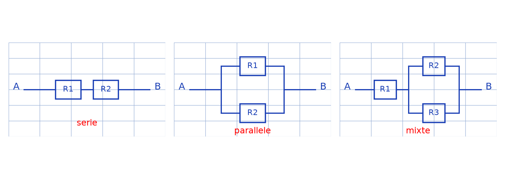
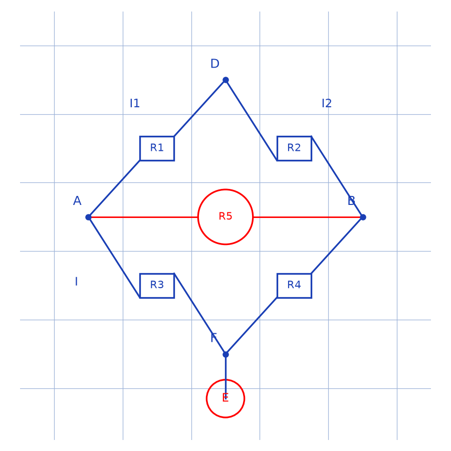

# Associations de résistances — transcription fidèle

> 🧾 **Manuscrit original :** `associations-resistances.pdf` (scan, 2 pages) · ✍️ KpihX
> 🔍 **Statut :** planches de réductions série/parallèle entre bornes A et B puis pont de Wheatstone ; écriture rapide, plusieurs annotations en `[lecture incertaine — …]`. Transcrit mot à mot.
> 📄 **Source scannée :** [associations-resistances.pdf](associations-resistances.pdf) (restaurée Datas1, vérifiée pdfinfo, 2026-09-07)

---

## Page 1

Planche de réductions entre bornes $A$ et $B$ (résistances $R_0 \ldots R_5$, équivalences notées $///$). De haut en bas, colonne de gauche :

- Circuit $(R_0, R_1)$ en haut, $(R_5, R_4)$ en bas, bornes $A$ — $B$ ; $///$ ; croisement noté $C$, $D$ avec « car $R_0$ et $R_5$ [lecture incertaine — suite illisible] ».
- $A$ — $R_{eq}$ — $C$ — $R_{eq}$ — $B$ [lecture incertaine — indices], chaque $R_{eq}$ annotée « parallèle ».
- Circuit mixte $(R_0, R_4)$ en haut, $R_3$ au centre, $(R_5, R_2)$ en bas, bornes $A$ — $B$ ; $///$ ; regroupements en $R_{eq}$ avec « parallèle » à gauche et à droite ; puis $A$ — $R_{eq1}$ — $R_3$ — $R_{eq2}$ — $B$ [lecture incertaine — indices].
- $A$ — $(R_0$ en parallèle avec $(R_4$ en série avec $R_5))$ [lecture incertaine — topologie] $\equiv$ [lecture incertaine] $R_0$ // $R_{eq1}$ [annoté « série » à droite].
- $R_x$ en tête puis $(R_0 \parallel R_1 \parallel R_2)$ [lecture incertaine — nombre de branches] entre $A$ et $B$ ; $///$ ; $A$ — $R_x$ — $R_{eq}$ — $B$ [annoté « parallèle »].

Colonne de droite (suite des réductions) :

- Regroupements $R_{eq}$ entourés, annotations « série », « parallèle » ; flèches de réduction vers $A$ — $R_0$ // $R_{eq}$ — $B$ [annoté « série »].
- Bloc $R_1, R_2, R_3, R_4$ en haut avec $R_5, R_6, R_7, R_8$ [lecture incertaine — indices] : $R_{eq1}$ (série), $R_{eq2}$ (parallèle) [lecture incertaine] ; puis $A$ — $(R_{eq1} \parallel R_{eq2} \parallel R_5 \parallel R_{eq4})$ [lecture incertaine — indices] — $B$ ; $///$ ; trois $R_{eq}$ en parallèle entre $A$ et $B$.

*Figure p.1 (synthèse) : les trois motifs récurrents de la planche — deux résistances en série, deux en parallèle, et $R_1$ en série avec $(R_2 \parallel R_3)$ ; l'original comporte une quinzaine de vignettes de réduction pas à pas annotées « série » / « parallèle » / « $R_{eq}$ ».*

## Page 2

Suite des réductions (haut de page) : $A$ — $R_0$ — $(R_2 \parallel R_1)$ — $C$ — $R_4$ — $B$ avec $R_5$ en dérivation [lecture incertaine] ; $///$ ; « car $C$ et $D$ équivalents » [lecture incertaine] ; $A$ — $R_0$ — $(R_2 \parallel R_1)$ — $C$ — $R_4$ — $B$ avec « $R_{eq1}$ en parallèle » [lecture incertaine] ; $///$ ; $A$ — $(R_0$ — $R_{eq1})$ — $C$ — $R_4$ — $B$ avec $R_5$ en dérivation [lecture incertaine].

Pont de Wheatstone (losange $A$ à gauche, $D$ en haut, $B$ à droite, $F$/$E$ en bas ; $R_1$ sur $AD$, $R_2$ sur $DB$, $R_3$ sur $AF$, $R_4$ sur $FB$, $R_5$ en diagonale, source $E$ en bas ; courants $I, I_1, I_2$, tensions $U_1 \ldots U_4$) :

$$U = V_B - V_C = V_B - V_A + V_A - V_C$$
$$= -U_1 + U_3$$
$$= -R_1 I_1 + R_3 I_2$$

Loi des mailles dans [lecture incertaine — noms des mailles] :

$$E - U_3 - U_4 = U \Rightarrow E = R_3 I_2 + R_4 I_2 \Rightarrow I_2 = \frac{E}{R_3 + R_4}$$

Loi des mailles dans $ADBEFA$ [lecture incertaine — noms des mailles] :

$$E - U_1 - U_2 = U \Rightarrow E = R_1 I_1 + R_2 I_1 \Rightarrow I_1 = \frac{E}{R_1 + R_2}$$

ainsi $U = \dfrac{-R_1 E}{R_1 + R_2} + \dfrac{R_3 E}{R_3 + R_4}$ [lecture incertaine — marge droite illisible].

$$U = \frac{E \, (R_3 R_2 - R_1 R_4)}{(R_1 + R_2)(R_3 + R_4)}$$

2/ Donc on [\*sic\* — « Dont on »] eq pour $U = 0$ c.à.d $R_3 R_2 = R_1 R_4$ d'où $R_1 = \dfrac{R_3 R_2}{R_4}$ [lecture incertaine — marge droite].

3/ $\dfrac{\Delta U}{\Delta R_1} = \dfrac{E}{R_1 + R_2} \times \dfrac{?}{(R_1 + R_2)^2}$ [lecture incertaine — numérateur illisible] d'où $\Delta R_1 = \dfrac{?}{E \, (R_3 R_4 + R_3 R_2)} \, \Delta U$ [lecture incertaine — fraction illisible].

$$\Delta R_1 = \frac{(R_1 + R_2)^2}{E \, R_2} \, \Delta U \quad \Delta V = 1\,\mathrm{mV}$$

*Figure p.2 : losange $A$ (gauche), $D$ (haut), $B$ (droite), $F$ (bas) ; $R_5$ en diagonale $AB$, source $E$ sous le pont.*

---

## Figures

- p.1 : `assets/reductions-serie-parallele.png` — synthèse des trois motifs récurrents (série, parallèle, mixte) — script `lab/scripts/reproduce_associations_resistances_1.py` (vérifié `uv run`, 2026-09-07). L'original comporte une quinzaine de vignettes pas à pas, non reproduites une à une.
- p.2 : `assets/pont-wheatstone.png` — losange $R_1$–$R_4$, diagonale $R_5$, source $E$ — script `lab/scripts/reproduce_associations_resistances_2.py` (vérifié `uv run`, 2026-09-07).

## Vocabulaire

- **$R_{eq}$** : résistance équivalente d'un regroupement.
- **Série / parallèle** : annotations manuscrites de chaque réduction.
- **$///$** : symbole d'équivalence entre étapes de réduction.
- **Pont de Wheatstone** : losange $ADBEFA$ avec diagonale $R_5$.
- **Loi des mailles** : $E - U_i - U_j = U$.
- **Équilibre du pont** : $U = 0 \iff R_3 R_2 = R_1 R_4$.
