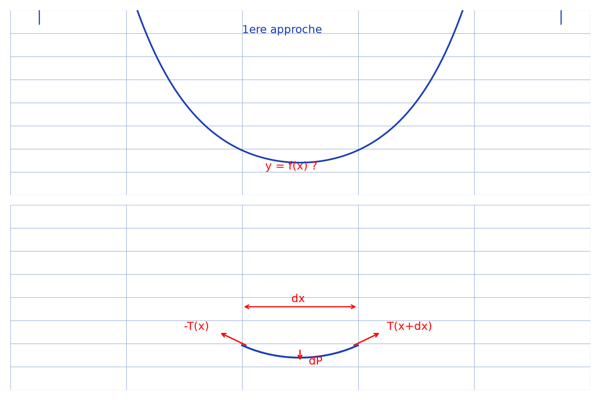
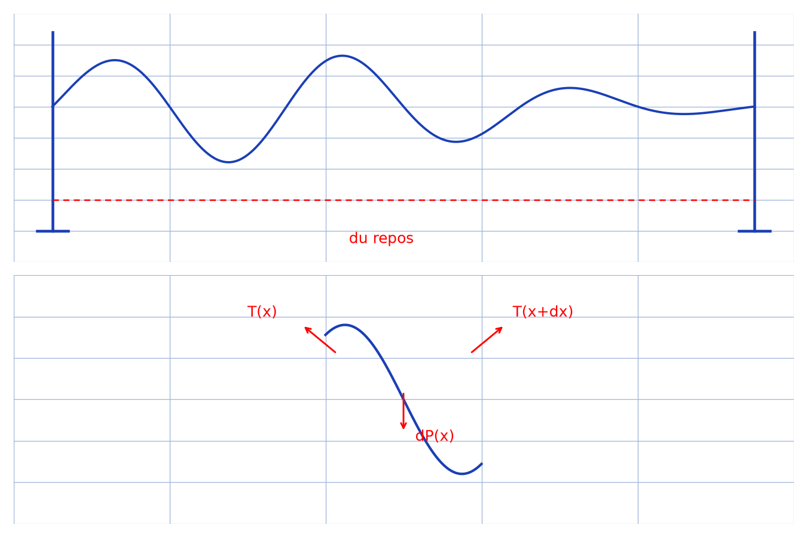

# Chaînette et ondes mécaniques — transcription fidèle

> 🧾 **Manuscrit original :** `chainette-ondes.pdf` (manuscrit, 3 pages : statique de la chaînette, longueur/tension et note de dérivation, ondes sur la corde et solution de d'Alembert) · ✍️ KpihX
> 🔍 **Statut :** calculs d'équilibre (TCI), tension, longueur, cas d'équilibre, équation d'onde et solution sinusoïdale ; écriture très petite et ratures, deux figures reproduites (scripts + PNG + descriptions). Transcrit mot à mot.
> 📄 **Source scannée :** [chainette-ondes.pdf](chainette-ondes.pdf) (restaurée Datas1, vérifiée pdfinfo, 2026-09-07)

---

## Page 1

Chainette I [souligné] — [croquis : courbe suspendue entre deux supports, tensions aux extrémités, $H(x,y)$ ?, $y = f(x)$ ? [lecture incertaine]]

1ère approche [souligné] — [croquis : courbe subdivisée en $dx$ ; zoom encerclé : équilibre des tensions $-T(x)$, $T(x+dx)$ sur un fragment [lecture incertaine — détails]]

*Figure p.1 : en haut la chaînette $y = f(x)$ entre deux supports (« 1ère approche ») ; en bas le zoom sur un fragment $dx$ avec $-T(x)$, $T(x+dx)$ et le poids élémentaire $dP$.*

En appliquant le TCI sur le fragment du milieu, on a : [lecture incertaine — système]

$(G \equiv ?)$ [lecture incertaine] $\begin{cases} T_x(x) = 0 \\ dT_y(x) = -dP(x) = -\mu dx \cdot g \end{cases}$ [lecture incertaine]

où $l$ [lecture incertaine] $\begin{cases} T_x(x) = T_x \\ \dfrac{dT_y(x)}{dx} = -\mu g\sqrt{1+y'^2} \end{cases}$ [lecture incertaine] $(S)$ [lecture incertaine]

or $\dfrac{T_y(x+dx)}{T_x(x+dx)} = y'(x+dx)$ [lecture incertaine]

d'où $T_y(x) = T_x \cdot y'(x-dx)$ [lecture incertaine]

d'où $\dfrac{dT_y(x)}{dx} = T_x \dfrac{y'(x)-y'(x-dx)}{dx}$ [lecture incertaine]

$= T_x \lim_{h \to 0} \dfrac{y'(x+h)-y'(x)}{h}$ [lecture incertaine]

$= T_x \lim_{h \to 0} \dfrac{y(x+h)-y(x)}{h^2}$ (où $h = -dx \to 0$) [lecture incertaine]

$= T_x \cdot y''(x)$

ainsi $(S) \iff \begin{cases} T_x(x) = T_x \quad (1) \\ \dfrac{y''(x)}{\sqrt{1+y'^2}} = \dfrac{\mu g}{T_x} \quad (2) \end{cases}$ [lecture incertaine]

$(2) \iff \dfrac{y''(x)}{\sqrt{1+y'^2}}$ [lecture incertaine] $\text{argsh}(y'(x)) = \dfrac{\mu g}{T_x}x + C_0$, $C_0 \in \mathbb{R}$ [lecture incertaine]

$(1) \iff y(x) = \text{sh}\left(-\dfrac{\mu x}{T_x} + C_0\right)$ [lecture incertaine — « sh »]

or $y'(0) = 0 \iff \text{sh}(C_0) = 0 \iff C_0 = 0$ [lecture incertaine]

$(1) \iff y(x) = \text{ch}\left(-\dfrac{\mu x}{T_x}\right) + C_2$ [lecture incertaine]

or $y(0) = 0 \iff C_2 = -1$

$(2) \iff y(x) = \text{ch}\left(\dfrac{\mu x}{T_x}\right) - 1$ [lecture incertaine]

or $y(d) = H \iff \text{ch}\left(\dfrac{\mu d}{T_x}\right) - 1 = H$ [lecture incertaine]

$\iff \dfrac{\mu d}{T_x} = \ln(H+1 + \sqrt{(H+1)^2-1})$ [lecture incertaine]

$\iff T_x = \dfrac{\mu g d}{\ln(H+1 + \sqrt{H(H+2)})}$ [lecture incertaine]

Donc $y(x) = \text{ch}\left(\dfrac{\ln(H+1+\sqrt{H(H+2)})}{d}x\right) - 1$ [encadré] [lecture incertaine]

\* Longueur $L$ : $L = \int dl = \int dx\sqrt{1+y'^2}$ [lecture incertaine] $= \int \sqrt{1+(\text{sh}(ax))^2}dx$ [lecture incertaine]

\* Tension $\vec{T}$ : on a [lecture incertaine] $T_x = \dfrac{\mu g d}{\ln(H+1+\sqrt{H(H+2)})}$ [lecture incertaine]

$dT_y(x) / T_x(x) = T_x \cdot y'(x) = \dfrac{\mu g d}{\ln(H+1+\sqrt{H(H+2)})} \times \dfrac{\ln(H+1+\sqrt{H(H+2)})}{d}\text{sh}(\dots)$ [lecture incertaine — produit]

Donc $\vec{T} = \dfrac{\mu g d}{\ln(H+1+\sqrt{H(H+2)})}\vec{i} + \dots$ [lecture incertaine — fin]

$(2) \iff y(x) = \dfrac{1}{a}\text{ch}(ax) + C_2$ où $C_2, a \in \mathbb{R}$, $a = \dfrac{\mu g}{T_x}$ [lecture incertaine]

$y(0) = 0 \iff C_2 = -\dfrac{1}{a}$

$y(d) = H \iff \dfrac{1}{a}(\text{ch}(ad)-1) = H$

cette équ. (en $x \mapsto \dfrac{1}{a}(\text{ch}(ax)-1)$) bijective de $\mathbb{R}$ vers $\mathbb{R}^+$ [lecture incertaine — ensembles]

[marge droite : coin de calendrier « AOUT », hors sujet]

## Page 2

Donc $y(x) = \dfrac{1}{a}(\text{ch}(ax)-1)$ où $a = \dfrac{\mu g}{T_x}$ et $T_x = T_x \cdot \vec{i}$ [lecture incertaine]

\* Longueur $L$ : $L = \int_{x_1}^{x_2} dl = \int \sqrt{1+y'^2}dx$ [lecture incertaine] $= \int \sqrt{1+\text{sh}(ax)^2}dx = \int \text{ch}(ax)dx = \dfrac{1}{a}[\text{sh}(ax)]$ [lecture incertaine]

$L = \dfrac{2}{a}\left(\text{sh}\left(\dfrac{ad}{2}\right)\right)$ [encadré] [lecture incertaine — argument]

Connaissant $L$ on a : $\text{sh}(ad/2) = aL/2$ [lecture incertaine] ; $\text{ch}(ad/2) = aH+1$ [lecture incertaine] ; or $\text{ch}^2(ad/2)-\text{sh}^2(ad/2) = 1$ [identité standard, carrés peu lisibles sur le scan] ainsi $(aH+1)^2 - (aL/2)^2 = 1$ [lecture incertaine]

[raturé]

soit $a = \dfrac{2H}{l^2-H^2}$ [lecture incertaine] où $l = \dfrac{L}{2}$ [lecture incertaine]

ainsi $y(x) = \dfrac{l^2-H^2}{2H}\left(\text{ch}\left(\dfrac{2Hx}{l^2-H^2}\right)-1\right)$ [encadré] [lecture incertaine]

\* Tension : car $a = \dfrac{\mu g}{T_x}$, on déduit que $T_x = \dfrac{\mu g(l^2-H^2)}{2H}$ [encadré] et ainsi que $\vec{T} = -\dfrac{\mu g(l^2-H^2)}{2H}\left(\vec{i} + \text{sh}\left(\dfrac{2Hx}{l^2-H^2}\right)\vec{j}\right)$ [lecture incertaine — signes et vecteurs]

Note : $f'(x \pm dx) = \lim_{h \to 0} f(x \pm h) = f(x)$ [lecture incertaine]

• $\dfrac{df(x-dx)}{dx} = \lim_{h \to 0} \dfrac{f(x)-f(x-h)}{h} = \lim_{h \to 0} \dfrac{f(x+h)-f(x)}{h}$ où $h := -h$ [lecture incertaine]

$\dfrac{df(x-dx)}{dx} = f'(x)$ [d'où $f'(x-dx) = f(x)$] [*sic* — $f(x)$ pour $f'(x)$ ?]

• $\dfrac{df(x+dx)}{dx} = \lim_{h \to 0} \dfrac{f(x+2h)-f(x+h)}{h} = \lim_{h \to 0} \dfrac{f(x+h)-f(x)}{h} + \dfrac{f(x+h)-f(x)}{h} = \lim_{h \to 0} 2\dfrac{f(x+h)-f(x)}{h} - f'(x)$ [où $h := 2h$] [lecture incertaine] $= 2f'(x)-f'(x) = f'(x)$

• Notions d'équilibre : cas 1, cas 2, cas 3, cas 4, cas 5 — [5 petits schémas de forces (tensions $\vec{T}$, poids $\vec{P}$), détails illisibles — non reproduits]

[marge droite : coin de calendrier « AOUT », hors sujet]

## Page 3

[haut : bande d'une autre page partiellement visible : « $(E) \iff y(x) = \text{sh}(\dots)$ » [lecture incertaine]]

Ondes mécaniques : cas de la corde [souligné] — [croquis : corde entre deux masses, perturbation, droite « du repos », zoom encerclé : $T(x_0)$ ?, $T(x_0+dx)$ ?, $dP(x)$ ? [lecture incertaine]]

*Figure p.3 : en haut la corde entre deux masses avec la perturbation et la droite « du repos » en pointillés ; en bas le zoom sur un fragment avec $T(x)$, $T(x+dx)$ et $dP(x)$.*

En appliquant le TCI [lecture incertaine — « TC2 » ?] sur le fragment du milieu on a : $dP(x,t) + T(x+dx,t) - T(x,t) = dm \cdot a(x)$ [lecture incertaine]

suivant $(O, \vec{i})$ ? on a : [lecture incertaine]

$\begin{cases} dT_x(x,t) = 0 \\ dP(x,t) + dT_y(x,t) = dm \cdot \ddot{y}(x,t) \end{cases}$ [lecture incertaine]

$T_x(x,t) = T_x(n)$ $(n)$ (on néglige $d\vec{T}$ ou du $\dots$) [lecture incertaine]

$dT_y(x,t) = \mu dx \cdot \ddot{y}(x,t)$ $(2)$ (mais on va en $\dots$) [lecture incertaine]

$dm = \mu dx$ et non $\mu dl$ car $dl$ est la longueur du fil étiré et non celle au repos qui est $dx$

or $\dfrac{T_y(x,t)}{T_x(x,t)} = y'_x(x,t)$ d'où $\dfrac{\partial T_y}{\partial x} = T_x \cdot y''_{xx}(x,t)$ [lecture incertaine]

$(2) \iff \ddot{y}_{x,t} = \dfrac{\mu}{T_x} \cdot \ddot{y}_{t,t}$ [lecture incertaine — membres]

$\iff \dfrac{\partial^2 y(x,t)}{\partial x^2} - \dfrac{\mu}{T_x}\dfrac{\partial^2 y(x,t)}{\partial t^2} = 0 \quad (E)$ [encadré]

Quand le système est immobile $T_x(x,t) \equiv T$ d'où $T_x = T$

$|(E_1) : \left(\dfrac{\partial}{\partial x} - \dfrac{1}{c}\dfrac{\partial}{\partial t}\right)\left(\dfrac{\partial}{\partial x} + \dfrac{1}{c}\dfrac{\partial}{\partial t}\right)y = 0$ où $c^2 = \dfrac{\mu}{T}$ [lecture incertaine — $\mu/T$ ou $T/\mu$]

on voudrait savoir $\frac{d}{dp} \times \frac{d}{dq}y = 0$ $(E)$ [lecture incertaine]

d'où $\dfrac{d}{dp} \cdot \dfrac{d}{dq} - \dots$ [lecture incertaine] et $\dfrac{d}{dq} = \dfrac{d}{dx} + \dots$ [lecture incertaine]

il suffit d'avoir $p = x-ct$ et $q = x+ct$

ainsi $(E_1) \iff \dfrac{\partial}{\partial p}\left(\dfrac{\partial y}{\partial q}\right) = 0$ [lecture incertaine]

$\iff \dfrac{\partial^2 y(p,q)}{\partial q \partial p} = G_1(q)$ [lecture incertaine]

$\iff y(p,q) = \int G_1(q)dq + g(p)$ [lecture incertaine] $f(q)$ [lecture incertaine — surnageant]

Donc $y(x,t) = f(x-\sqrt{\cdot}\,t) + f(x+\sqrt{\cdot}\,t)$ [encadré] [lecture incertaine — radicandes]

Pour une vibration sinusoïdale, $y(x,t) = y_m \cos(b(x-\sqrt{T/\mu} \cdot t))$ où $[b(x,t)] = 1$ [lecture incertaine]

$= y_m \cos(b\sqrt{T/\mu} \cdot t - bx \cdot t)$ [*sic* — $bx \cdot t$ ?] [lecture incertaine]

on a une période temporelle $\mathfrak{T} = \dfrac{2\pi}{b\sqrt{T/\mu}}$ [lecture incertaine] et spatiale $\lambda = \dfrac{2\pi}{b}$ car $y(x,t+\mathfrak{T}) = y(x,t)$ et $y(x+\lambda,t) = y(x,t)$ [lecture incertaine — ordre]

On a alors affaire à une onde qui se déplace à la vitesse $V = \dfrac{\lambda}{\mathfrak{T}} = \sqrt{\dfrac{T}{\mu}}$ et on peut alors écrire $y(x,t) = y_m \cos\left(\dfrac{2\pi t}{\mathfrak{T}} - \dfrac{2\pi x}{\lambda} + \varphi\right)$ [lecture incertaine]

[encadré] $\lambda = V\mathfrak{T}$ [lecture incertaine]

[marge droite : coin de calendrier « AOUT », hors sujet]

---

## Figures

- p.1 : `assets/chainette-tensions.png` — chaînette $y = f(x)$ et tensions sur un fragment $dx$ — script `lab/scripts/reproduce_chainette_ondes_1.py` (vérifié `uv run`, 2026-09-07).
- p.2 : 5 petits schémas de forces (cas 1–5), détails illisibles — décrits p.2, non reproduits.
- p.3 : `assets/corde-onde.png` — corde perturbée, droite de repos et zoom sur un fragment — script `lab/scripts/reproduce_chainette_ondes_2.py` (vérifié `uv run`, 2026-09-07).

## Vocabulaire

- **Chaînette** : courbe $y = f(x)$ d'un fil suspendu (« 1ère approche »).
- **TCI** : théorème du centre d'inertie, appliqué au fragment du milieu.
- **$T_x$** : composante horizontale de la tension (constante).
- **$\mu$** : masse linéique du fil ($dm = \mu dx$, non $\mu dl$).
- **Solution de d'Alembert** : $y(x,t) = f(x-ct) + g(x+ct)$.
- **Célérité** : $V = \lambda/\mathfrak{T} = \sqrt{T/\mu}$.
