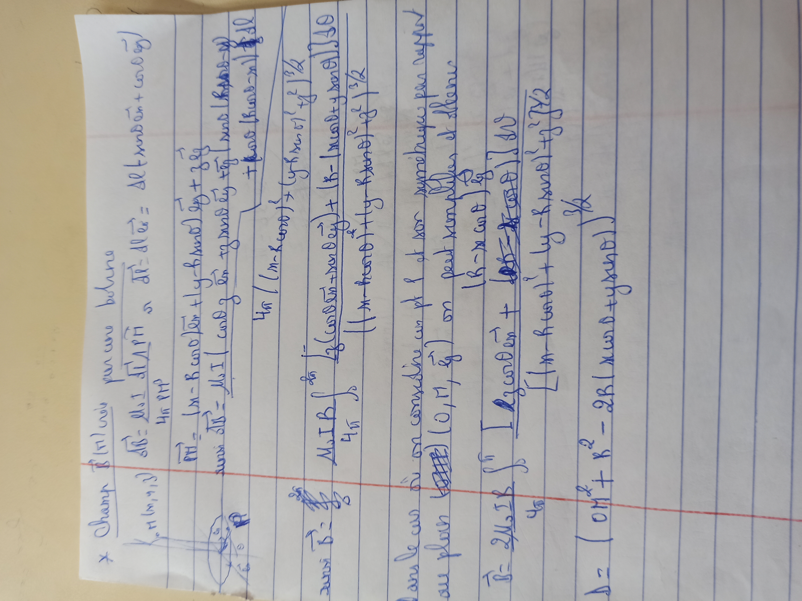
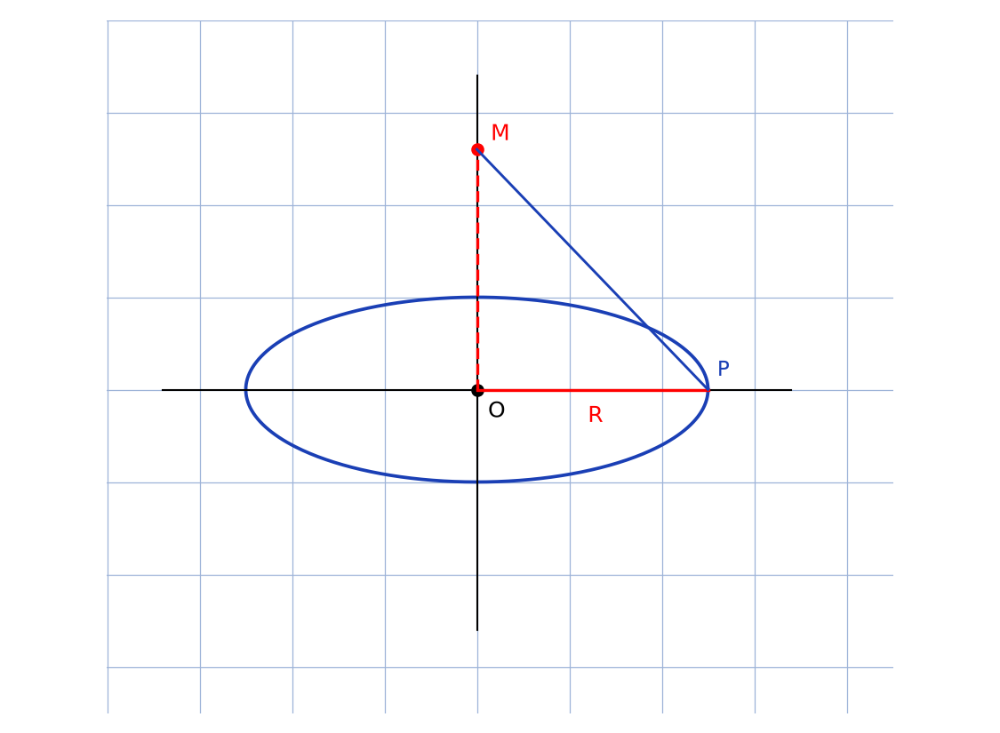

# Champ d'une bobine — transcription fidèle

> Source : `champ-bobine.jpg` (1 page, stylo bleu, réglée, trait rouge horizontal).
> Formules denses, lisibilité ~60 % — nombreuses [lecture incertaine].

## Page 1 — transcription fidèle

$\ast$ Champ $\vec{B}(M)$ créé par une bobine

$d\vec{B} = \frac{\mu_{0} I}{4\pi} \frac{d\vec{l} \wedge \vec{\dots}}{\dots} = \Delta \ell (\text{…} + \cos\theta \, \vec{\dots})$ [lecture incertaine]

$\overrightarrow{OH} = \lvert x - R\cos\theta \rvert \vec{e_{x}} + \lvert y - R\sin\theta \rvert \vec{e_{y}} + \lvert z \dots \rvert \vec{\dots}$ [lecture incertaine]

avec $d\vec{l} = \mu_{0} I$ [lecture incertaine — rature] … en … $\vec{\dots} \dots$ [raturé]

$4\pi \lVert (x - R\cos\theta)^{2} + (y - R\sin\theta)^{2} + z^{2} \rVert^{3/2}$ [lecture incertaine]

avec $\vec{B} = \dots$ [raturé]

… $\frac{\mu_{0}}{4\pi} \int \frac{(\cos\theta \, \vec{\dots} + \sin\theta \, \vec{\dots}) + (R - \lvert x\cos\theta + y\sin\theta \rvert) \vec{\dots}}{\lVert (x - R\cos\theta)^{2} + y \dots + z^{2} \rVert^{3/2}}$ [lecture incertaine]

$\lVert (x - R\cos\theta)^{2} + y \dots + z^{2} \rVert^{3/2}$ [répété]

Dans le cas où on considère un pt $l$ et son symétrique par rapport

au plan $(O, M, \vec{e_{z}})$ on peut simplifier et écrire [lecture incertaine]

$\vec{B} = \frac{2\mu_{0} I R}{4\pi} \int_{0}^{\pi} \frac{\lvert R - x\cos\theta \rvert \vec{\dots}}{\lVert \dots \rVert} + \frac{\lvert \dots \rvert \vec{\dots} + \lvert \dots \rvert \vec{\dots}}{\dots}$ [lecture incertaine]

$A = (OH^{2} + R^{2} - 2R \lvert x\cos\theta + y\sin\theta \rvert)$ [lecture incertaine]

## Figures

Un petit schéma de spire (ellipse vue en perspective) en bas à gauche du manuscrit : cercle/ellipse, centre, point courant. Reproduction (spire de rayon $R$, centre $O$, point $M$ sur l'axe, point $P$ sur le fil) :

*Script : `~/KpihX-Labs/Explore/lab/scripts/reproduce_champ-bobine_1.py` — description précise : ellipse bleue (la spire), axes noir fin, segment rouge $OP = R$, segment rouge pointillé $OM$ (axe), segment bleu $MP$ (vecteur distance).*

## Vocabulaire / notions

- Champ magnétique $\vec{B}(M)$, bobine / spire circulaire, loi de Biot et Savart ($d\vec{l} \wedge$).
- Perméabilité $\mu_{0}$, courant $I$, rayon $R$, point $M(x, y, z)$.
- Symétrie par rapport au plan $(O, M, \vec{e_{z}})$, norme $\lVert \cdot \rVert^{3/2}$.
