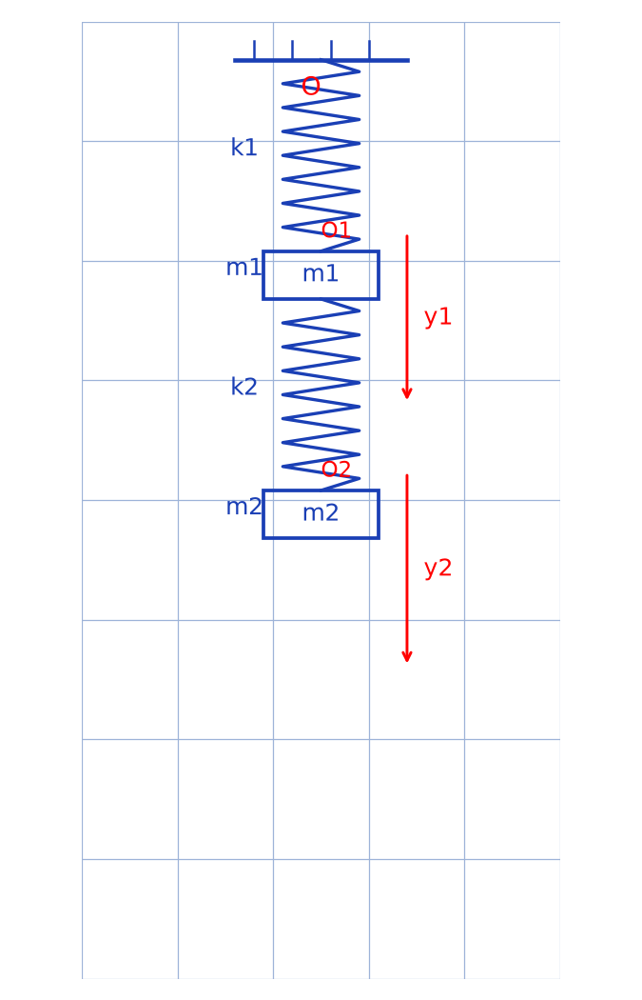

# Couplage masse-ressort (Exercice 61) — transcription fidèle

🧾 Source : `[couplage-masse-ressort.pdf](couplage-masse-ressort.pdf)` (9 pages).

🔍 Nature : énoncé imprimé (page 1) + solution manuscrite (pages 2 à 9). Transcription littérale, sans correction ni ajout. Les équations sont rendues en LaTeX à sens identique ; les passages illisibles ou rognés sont signalés. Rien n'est inventé.

📄 Document restauré — Datas1, 2026-09-07. Page 1 : haut légèrement rogné ; bas avec bandeau éditeur. Pages manuscrites : ratures et surcharges conservées sous tag `[raturé]`.

---

## Page 1

[lecture incertaine — haut de page rogné, fragment : « …d'amortis… »]

**Exercice 61.**

**1** Une masse $m_1$ est suspendue par un ressort $k_1$ à un point fixe $O$. Une deuxième masse $m_2$ est suspendue à $m_1$ par un ressort $k_2$. On ne considèrera que les mouvements de translation verticale des masses $m_1$ et $m_2$. On appellera $y_1$ et $y_2$ les élongations des masses $m_1$ et $m_2$ par rapport à leur position quand le système est au repos.

**1.1** Déterminer les pulsations $w_1$ des oscillations libres verticales de la masse $m_1$ quand la masse $m_2$ est immobilisée et $w_2$ de la masse $m_2$ quand la masse $m_1$ est immobilisée.

**1.2** Établir les équations différentielles des mouvements des deux masses $m_1$ et $m_2$ quand le système est abandonné à lui-même en dehors de son état d'équilibre.

**1.3** En proposant des solutions sinusoïdales du temps de même fréquence pour $y_1(t)$ et $y_2(t)$, établir l'équation aux pulsations propres dans laquelle on fera apparaître le coefficient de couplage $K^2$.

**1.4** Montrez que l'équation aux pulsations propres a toujours des racines qui seront notées $W_p$ et $W_a$ ($W_p < W_a$) dont on comparera les valeurs aux pulsations $w_1$ et $w_2$ [lecture incertaine — « $w_i$ et $w_j$ » ?] en supposant par exemple $w_1 > w_2$.

**1.5** Dans le cas particulier où $k_1 = k_2 = k$ et $m_1 = m_2 = m$, exprimer les pulsations propres $W$ et $W'$ [lecture incertaine — le second $W$ est surchargé/illisible] et déterminer pour chaque mode le rapport des amplitudes des oscillations des deux masses $m_1$ et $m_2$. Proposer pour $y_1(t)$ la solution la plus générale du système d'équations différentielles (12) [lecture incertaine — numéro d'équation] et en déduire l'expression de $y_2(t)$.

**2.** On impose à présent à l'extrémité supérieure du ressort de dureté $k_1$ un mouvement sinusoïdal vertical $y(t) = A \cos wt$ autour de la position d'équilibre initiale $O$. Bien que l'amortissement puisse être considéré comme négligeable, on supposera qu'un régime permanent finit par s'établir.

**2.1** Établir pour ce régime les expressions de $y_1(t)$ et de $y_2(t)$ au cours du temps.

**2.2** Étudier la variation de ces expressions en fonction de $w$. En particulier, pour quelles valeurs de $w$, les amplitudes des mouvements de $m_1$ et $m_2$ sont elles [phrase interrompue — bas de page / suite non reproduite dans l'énoncé scanné].

Schéma imprimé (à gauche du texte) : point fixe $O$ en haut, axe vertical descendant ; ressort $k_1$, masse $m_1$ (rectangle), repère $O_1$ avec flèche $y_1$ vers le bas ; ressort $k_2$, masse $m_2$ (rectangle), repère $O_2$ avec flèche $y_2$ vers le bas.

*Description de la figure reproduite : chaîne verticale accrochée en $O$ : ressort $k_1$, bloc $m_1$, ressort $k_2$, bloc $m_2$ ; deux axes verticaux descendants $y_1$ (origine $O_1$) et $y_2$ (origine $O_2$). Reproduction schématique du croquis imprimé de la page 1.*

Bandeau bas de page : « Livret d'activité / SPÉCIALE PRÉPA / CONCOURS / 2022 » et [lecture incertaine — texte publicitaire rogné : « Toi aussi, fais-nous confiance … une GRANDE ÉCOLE l'année … www.leaderscorp… »].

---

## Page 2

**1.1 / $w_1$, $w_2$ ?**

\* Cas $m_2$ immobile

Ici $m_1$ oscille et $m_2$ immobile [lecture incertaine — écriture peu lisible].

Système : $(S_1)$

Référentiel … [lecture incertaine — mot illisible]

Forces : $\vec{T}_1$, $\vec{P}_1$, $\vec{T}_2$

TCI : $\vec{T}_1 + \vec{P}_1 + \vec{T}_2 = m_1 \vec{a}_1$

Suivant le repère $(O_1, y_1)$ on a :

$$-K_1(y_1 + y_{10}) + m_1 g - K_2(y_{10} - y_{2o}) = m_1 \ddot{y}_1$$

c.-à-d. $m_1 \ddot{y}_1 + (K_1 + K_2) y_1 = m_1 g - K_1 y_{10} + K_2 y_{20}$ $(E)$ [raturé : $K_1$ puis]

$y_{20}$ : Allongement à l'équilibre du ressort 2.

Or à l'équilibre de $m_1$ :

$$\vec{T}_{1eq} + \vec{P}_1 + \vec{T}_{2eq} = \vec{0} \Rightarrow -K_1 y_{10} + m_1 g + K_2 y_{20} = 0$$

ainsi $(E) \Leftrightarrow m_1 \ddot{y}_1 + (K_1 + K_2) y_1 = 0$, c.-à-d. $\ddot{y}_1 + \frac{K_1 + K_2}{m_1} y_1 = 0$.

L'éqn étant de la forme $\ddot{y}_1 + w_1^2 y_1 = 0$, on a :

$$\boxed{w_1 = \sqrt{\frac{K_1 + K_2}{m_1}}}$$

Schémas manuscrits (en haut à droite) : ressort à vide, à l'équilibre (tensions $\vec{T}_{1eq}$, $\vec{T}_2$), puis à $t$ quelconque (tensions $\vec{T}_1$, $\vec{T}_2$, poids $\vec{P}_1$, positions $O_1$, $y_1$, $y_2$). En bas : ressort 1 à vide, ressort 1 à l'équilibre sans $m_2$, ressort 2 à vide / à l'équilibre, puis cas $m_1$ immobile à $t$ quelconque : $(S_1) \to m_1$ immobile, $(S_2)$, tension $\vec{T}_2$, poids $\vec{P}_2$, repère $O_2$, élongations $y_{20}$, $y_2$.

\* Cas $m_1$ immobile

[schémas : ressort 1 à vide ($y_{10}$), ressort 1 à l'équilibre sans $m_2$, ressort 2 à vide, ressort 2 à l'équilibre ($y_{20}$, $\vec{T}_{2eq}$, $\vec{P}_2$)]

(Page numérotée « 1 » en bas à gauche.)

---

## Page 3

Système : $(S_2)$

Référentiel … [lecture incertaine — mot illisible]

Forces : $\vec{P}_2$, $\vec{T}_2$

TCI : $\vec{P}_2 + \vec{T}_2 = m_2 \vec{a}_2$

Suivant $(O_2, y_2)$ on a :

$$m_2 g - K_2(y_2 + y_{20}) = m_2 \ddot{y}_2$$

c.-à-d. $m_2 g - K_2 y_{20} = m_2 \ddot{y}_2 + K_2 y_2$ $(E)$

or à l'équilibre de $m_2$,

$$\vec{P}_2 + \vec{T}_{2eq} = \vec{0} \Rightarrow m_2 g - K_2 y_{20} = 0$$

ainsi $(E) \Leftrightarrow m_2 \ddot{y}_2 + K_2 y_2 = 0$

$$\Leftrightarrow \ddot{y}_2 + \frac{K_2}{m_2} y_2 = 0$$

[E]tant de la forme $\ddot{y}_2 + w_2^2 y_2 = 0$ [lecture incertaine — première lettre rognée], on en déduit que

$$\boxed{w_2 = \sqrt{\frac{K_2}{m_2}}}$$

**1.2 / Éqns difflles de $m_1$ et $m_2$**

[bas de page rogné ; la suite est page 4]

(Page numérotée « 2 ».)

---

## Page 4

$y_{10}$ : élongation de $R_1$ [ressort 1] à l'équilibre.

$y_{20}$ : ————— // ———— $R_2$ ———— // ———— [lecture incertaine — ligne de liaison].

Référentiel : terrestre supposé galiléen.

\* Système : $(S_1)$ — forces : $\vec{T}_1$, $\vec{P}_1$, $\vec{T}_2$.

TCI : $\vec{P}_1 + \vec{T}_1 + \vec{T}_2 = m_1 \vec{a}_1$. Suivant $(O, y_1)$ [lecture incertaine — repère], on a :

$$m_1 g - K_1(y_{10} + y_1) + K_2(y_{20} + y_2 - y_1) = m_1 \ddot{y}_1 \quad (E_1)$$

En effet $T_2' = K_2 \Delta l_2 = K_2(y_{20} + y_2 - y_1)$ [raturé] [avec ratures superposées]

car $R_2$ s'allonge de $y_{20}$ [à l'équilibre, puis] se retracte [\*sic\* — « se retrecte »] de $y_1$ quand $m_1$ descend et enfin s'allonge de $y_2$ quand $m_2$ descend.

ainsi $(E_1) \Leftrightarrow$ [raturé : $m_1 \ddot{y}_1 + K_1 y_1 = K_2 y_2 + m_1 g - K_1 y_{10} =$] $m_1 \ddot{y}_1 + (K_1 + K_2) y_1 = K_2 y_2 + (m_1 g - K_1 y_{10} + K_2 y_{20})$ $(B_1)$

or à l'équilibre $\vec{T}_{1eq} + \vec{T}_{2eq} + \vec{P}_1 = \vec{0} \Rightarrow -K_1 y_{10} + K_2 y_{20} + m_1 g = 0$

ainsi

$$\boxed{(E_1) \Leftrightarrow \ddot{y}_1 + \frac{K_1 + K_2}{m_1} y_1 = \frac{K_2}{m_1} y_2}$$

\* Système $(S_2)$ [tel qu'écrit $(S_1)$ — lapsus, lire $(S_2)$] ; forces : $\vec{T}_2$, $\vec{P}_2$ ; car $T_2 = T_2'$.

TCI : $\vec{T}_2 + \vec{P}_2 = m_2 \vec{a}_2$. Suivant $(O_2, y_2)$ on a : $-K_2(y_{20} + y_2 - y_1) + m_2 g = m_2 \ddot{y}_2$

c.-à-d. $m_2 \ddot{y}_2 + K_2 y_2 = K_2 y_1 + (m_2 g - K_2 y_{20})$ $(B_2)$

or à l'équilibre $\vec{T}_{2eq} + \vec{P}_2 = \vec{0} \Rightarrow -K_2 y_{20} + m_2 g = 0$

ainsi

$$\boxed{(E_2) \Leftrightarrow \ddot{y}_2 + \frac{K_2}{m_2} y_2 = \frac{K_2}{m_2} y_1}$$

Schémas (à gauche) : à l'équilibre ($\vec{T}_{1eq}$, $\vec{P}_1$, $\vec{T}_{2eq}$) et à $t \neq 0$ ($(S_1)$, $\vec{T}_1$, $\vec{P}_1$, $\vec{T}_2$, $(S_2)$, $\vec{T}_2$, $\vec{P}_2$, axes $O_1$, $y_1$, $O_2$, $y_2$).

(Page numérotée « 3 ».)

---

## Page 5

**1.3 / Éqn aux pulsations propres**

Posons $y_1(t) = y_{1m} \cos(wt + \varphi_1)$ [lecture incertaine — indices/phases], $y_2(t) = y_{2m} \cos(wt + \varphi)$ [lecture incertaine].

on a : $\dot{y}_1(t) = -w y_{1m} \sin(wt + \varphi_1)$ [raturé] ; $y_2(t) = -w y_{2m} \sin(wt + \varphi_2)$ [lecture incertaine — $y_2$ pour $\dot{y}_2$ ?].

d'où $\ddot{y}_1(t) = -w^2 y_{1m} \cos(wt + \varphi_1) = -w^2 y_1(t)$ ; $\ddot{y}_2(t) = -w^2 y_{2m} \cos(wt + \varphi_2) = -w^2 y_2(t)$ [lecture incertaine sur les phases].

ainsi
$(E_1) \Rightarrow -w^2 y_1 + \frac{K_1 + K_2}{m_1} y_1 = \frac{K_2}{m_1} y_2 \quad (\alpha)$
$(E_2) \Rightarrow -w^2 y_2 + \frac{K_2}{m_2} y_2 = \frac{K_2}{m_2} y_1 \quad$ [dans l'image : second membre $\frac{K_2}{m_2} y_1$ ; premier membre avec $y_2$]

$$\left. \begin{array}{l} (-w^2 + \frac{K_1+K_2}{m_1}) y_1 = \frac{K_2}{m_1} y_2 \\ (-w^2 + \frac{K_2}{m_2}) y_2 = \frac{K_2}{m_2} y_1 \end{array} \right\}$$

$$\frac{y_2}{y_1} = \frac{(-w^2 + \frac{K_1+K_2}{m_1}) m_1}{K_2} = \frac{K_2}{m_2} \times \frac{1}{-w^2 + \frac{K_2}{m_2}} \quad (E) \Rightarrow \text{ or } w_1 = \sqrt{\frac{K_1+K_2}{m_1}} \text{ et } w_2 = \sqrt{\frac{K_2}{m_2}} \text{ [d'après (1)]}$$
[raturé]

ainsi $(E) \Leftrightarrow (-w^2 + w_1^2)\frac{m_1}{K_2} = w_2^2 \times \frac{1}{-w^2 + w_2^2}$

$$\Rightarrow (w_1^2 - w^2)(w_2^2 - w^2) = w_2^2 \times \frac{K_2}{m_1} = w_2^2 \times \frac{K_2}{m_2} \times \frac{m_2}{m_1} = w_2^4 \times \frac{m_2}{m_1}$$

$$\Rightarrow w_1^2 w_2^2 - w^2(w_1^2 + w_2^2) + w^4 = w_2^4 \frac{m_2}{m_1}$$

$$\Rightarrow w^4 - (w_1^2 + w_2^2) w^2 + w_2^2 \left(w_1^2 \frac{m_2}{m_1} - w_2^2\right) = w_2^2 \left(\frac{K_2}{m_2} \times \frac{m_2}{m_1} - \frac{K_1+K_2}{m_1}\right) = -w_2^2 \left(\frac{K_1}{m_1}\right) \text{ [terme de droite raturé/repris]}$$

$$(E) \Leftrightarrow w^4 - (w_1^2 + w_2^2) w^2 + \frac{K_1}{m_1} w_2^2 = 0$$

Or le coefficient de couplage $K$ est défini par $K = \sqrt{\frac{K_2}{K_1 + K_2}}$.

ainsi $\frac{K_2}{m_1} = \frac{K_1 + K_2}{m_1} - \frac{K_1}{m_1} = w_1^2 - \frac{K_1+K_2}{m_1} \times \frac{K_1}{K_1+K_2} = w_1^2 - w_1^2 \times K^2$ [lecture incertaine — ligne très chargée].

ainsi $(E) \Leftrightarrow w^4 - (w_1^2 + w_2^2) w^2 + w_1^2 w_2^2 (1 - K^2) = 0$.

**1.4 / Montrons cela**

Posons $x = w^2$. $(E) \Leftrightarrow x^2 - (w_1^2 + w_2^2) x + w_1^2 w_2^2 (1 - K^2) = 0$ avec $x > 0$.

$$\Delta = (w_1^2 + w_2^2)^2 - 4 w_1^2 w_2^2 (1 - K^2)$$
$$= w_1^4 + w_2^4 + 2 w_1^2 w_2^2 - 4 w_1^2 w_2^2 (1 - K^2)$$
$$= w_1^4 + w_2^4 - 2 w_1^2 w_2^2 + 4 w_1^2 w_2^2 K^2$$
$$= (w_1^2 - w_2^2)^2 + 4 w_1^2 w_2^2 K^2 > 0$$

ainsi $x_{1,2} = \frac{w_1^2 + w_2^2 \pm \sqrt{(w_1^2 - w_2^2)^2 + 4 w_1^2 w_2^2 K^2}}{2}$

or $(w_1^2 - w_2^2)^2 + 4 w_1^2 w_2^2 K^2 < (w_1^2 - w_2^2)^2 + 4 w_1^2 w_2^2$ car $K^2 < 1$ du fait que $K_2 < K_2 + K_1$ [lecture incertaine].

$< w_1^4 + w_2^4 - 2 w_1^2 w_2^2 + 4 w_1^2 w_2^2 = (w_1^2 + w_2^2)^2$

ainsi $\sqrt{(w_1^2 - w_2^2)^2 + 4 w_1^2 w_2^2 K^2} < w_1^2 + w_2^2$ d'où $x_{1,2} = \frac{w_1^2 + w_2^2 \pm \sqrt{(w_1^2 - w_2^2)^2 + 4 w_1^2 w_2^2 K^2}}{2} > 0$

(Page numérotée « 4 ».)

---

## Page 6

ainsi $(E)$ admet 2 racines $W_p = \sqrt{\frac{w_1^2 + w_2^2 - \sqrt{(w_1^2 - w_2^2)^2 + 4 w_1^2 w_2^2 K^2}}{2}}$ et $W_a = \sqrt{\frac{w_1^2 + w_2^2 + \sqrt{(w_1^2 - w_2^2)^2 + 4 w_1^2 w_2^2 K^2}}{2}}$, car $w > 0$ (en remplaçant $w^2 = x$).

et on a bien $W_p < W_a$.

\* Comparaisons (on suppose $w_2 < w_1$).

. Cas de $w_2$

on a : $w_2^2 - \frac{w_1^2 + w_2^2}{2} < \frac{w_1^2 + w_2^2}{2} < \frac{w_1^2 + w_2^2 + \sqrt{\Delta}}{2} = W_a^2$ d'où $w_2 < W_a$ [lecture incertaine — membre de gauche].

. De plus $W_a \geqslant \sqrt{\frac{w_1^2 + w_2^2 + \sqrt{(w_1^2 - w_2^2)^2 + 4 w_1^2 w_2^2 \times 0}}{2}} \geqslant \sqrt{\frac{w_1^2 + w_2^2 + w_1^2 - w_2^2}{2}} = w_1$ [en supposant $w_1 > w_2$ ; racine positive].

. Cas de $W_p$

$W_p \leqslant \sqrt{\frac{w_1^2 + w_2^2 - \sqrt{(w_1^2 - w_2^2)^2 + 4 w_1^2 w_2^2 \times 0}}{2}} = \sqrt{\frac{w_1^2 + w_2^2 - w_1^2 + w_2^2}{2}} = w_2 < w_1$

Donc $W_p \leqslant w_2 < w_1 \leqslant W_a$. [En marge : « etc. »]

**1.5 / $K_1 = K_2 = K$ [ressort $K$], $m_1 = m_2 = m$**

\* $W = W_p$ [raturé] pour $K_1 = K_2 = K$, $m_1 = m_2 = m$ [lecture incertaine] et $W' = W_a$ pour $K_1 = K_2 = K$, $m_1 = m_2 = m$ [lecture incertaine].

$$w_1^2 = \frac{K_1 + K_2}{m_1} = \frac{K + K}{m} = \frac{2K}{m} \quad ; \quad w_2^2 = \frac{K_2}{m_2} = \frac{K}{m}$$
$$w_1^2 + w_2^2 = \frac{3K}{m} \quad ; \quad K^2 = \frac{K_2}{K_1+K_2} = \frac{2K - K}{2K} = \frac{1}{2} \text{ [tel qu'écrit]}$$
$$(w_1^2 - w_2^2)^2 + 4 w_1^2 w_2^2 K^2 = \frac{K^2}{m^2} + 4 \frac{2K}{m} \times \frac{K}{m} \times \frac{1}{2} = 5 \frac{K^2}{m^2}$$

ainsi $W = \sqrt{\frac{\frac{3K}{m} - \frac{K}{m}\sqrt{5}}{2}} = \sqrt{\frac{3 - \sqrt{5}}{2}} \sqrt{\frac{K}{m}} = \sqrt{\frac{6 - 2\sqrt{5}}{4}} \sqrt{\frac{K}{m}} = \frac{\sqrt{5} - 1}{2} \sqrt{\frac{K}{m}} = W$

$W' = \sqrt{\frac{\frac{3K}{m} + \frac{K}{m}\sqrt{5}}{2}} = \frac{\sqrt{5} + 1}{2} \sqrt{\frac{K}{m}} = w'$ [tel qu'écrit : « $= w'$ »].

\* Amplitudes $y_{1m}$ et $y_2$ [tel qu'écrit]

— pour $w = W$ :

À la question (13) [lecture incertaine — numéro], on a $\frac{y_2}{y_1} = \frac{K_2}{m_1(-w^2 + \frac{K_2}{m_2})} = \frac{K}{m\left(-\frac{3 - \sqrt{5}}{2}\frac{K}{m} + \frac{K}{m}\right)} = \frac{1}{-\frac{3 - \sqrt{5}}{2} + 1} = \frac{1+\sqrt{5}}{2}$

ainsi $\frac{y_{2m} \cos(wt + \varphi_2)}{y_{1m} \cos(wt + \varphi_1)} = \frac{1 + \sqrt{5}}{2}$. Le rapport étant constant on a nécessairement $\cos(wt + \varphi_2) = \cos(wt + \varphi_1)$ [tel qu'écrit : « $\cos(wt+\varphi_2) = \cos(wt+\varphi_1)$ » avec $\varphi_1 = \varphi_2$] d'où $\varphi_1 = \varphi_2$ (en mesures principales [lecture incertaine]).

ainsi $\boxed{\frac{y_{2m}}{y_{1m}} = \frac{1 + \sqrt{5}}{2}}$ et ainsi pour $y_1(t) = y_{1m} \cos(Wt + \varphi)$, $y_2(t) = y_{1m} \frac{(1 + \sqrt{5})}{2} \cos(Wt + \varphi)$ [tel qu'écrit : « $y_{1m} = y_{1m}(1+\sqrt{5})/2 \cos(Wt+\varphi)$ » pour $y_2$ — *sic*, lire $y_2$].

(Page numérotée « 5 ».)

---

## Page 7

— pour $w = W'$, à la question (13) [lecture incertaine] on a :

$$\frac{y_2}{y_1} = \left(-w'^2 + \frac{K_1 + K_2}{m_1}\right)\frac{m_1}{K_2} = \left(-\left(\frac{3 + \sqrt{5}}{2}\right)\frac{K}{m} + \frac{2K}{m}\right) \times \frac{m}{K} = \frac{1 - \sqrt{5}}{2}$$

d'où $\frac{y_{2m} \cos(wt + \varphi_2)}{y_{1m} \cos(wt + \varphi_1)} = \frac{1 - \sqrt{5}}{2} < 0$.

ainsi on a nécessairement $\boxed{\left|\frac{y_{2m}}{y_{1m}}\right| = \left|\frac{1 - \sqrt{5}}{2}\right| = \frac{\sqrt{5} - 1}{2}}$ et ainsi $\cos(wt + \varphi_2) = -\cos(wt + \varphi_1) = \cos(wt + \varphi_1 + \pi)$.

et donc pour $y_1(t) = y_{1m} \cos(W't + \varphi)$,

$$y_2(t) = y_{1m} \frac{\sqrt{5} - 1}{2} \cos(W't + \varphi + \pi)$$

**2 / $y_1(t) = A \cos wt$** [tel qu'écrit — lire $y(t)$, l'excitation en $O$]

**2.1 / $y_1(t)$ et $y_2(t) = ?$**

À l'équilibre / À $t > 0$ : schémas ($O$, $y(t) = A \cos wt$, $O_1$, $y_1$, $O_2$, $y_2$ ; tensions $\vec{T}_1$, $\vec{T}_2$, poids $\vec{P}_1$, $\vec{P}_2$).

Référentiel …

Système $(S_1)$.

TCI : $\vec{T}_1 + \vec{T}_2 + \vec{P}_1 = m_1 \vec{a}_1$.

c.-à-d. $-K_1(y_{10} + y_1 - y) + K_2(y_{20} + y_2 + y_{10})$ [lecture incertaine — ligne chargée] $+ m_1 g = m_1 \ddot{y}_1$.

donc $-K_1 y_{10} + K_2 y_{20} + m_1 g = 0$.

alors $(E_1)$ : $\ddot{y}_1 + \frac{(K_1 + K_2)}{m_1} y_1 = \frac{K_2}{m_1} y_2 + \frac{K_1}{m_1} y$ [avec $y = A \cos wt$ :] $= \frac{K_2}{m_1} y_2 + \frac{A}{m_1} \cos wt$ [tel qu'écrit — lire $K_1 A / m_1$].

— Système : $(S_1)$ [tel qu'écrit — lire $(S_2)$].

TCI : $\vec{T}_2 + \vec{P}_2 = m_2 \vec{a}_2$.

c.-à-d. $-K_2(y_{20} + y_2 - y_1) + m_2 g = m_2 \ddot{y}_2$.

avec $-K_2 y_{20} + m_2 g = 0$. alors

$$\boxed{(E_2) : \ddot{y}_2 + \frac{K_2}{m_2} y_2 = \frac{K_2}{m_2} y_1}$$

(Page numérotée « 6 ».)

---

## Page 8

Le système $(S)$ : $\begin{cases} (E_1) \\ (E_2) \end{cases}$ étant un système linéaire d'éqns différentielles, les solutions sont de la forme $\begin{cases} y_1(t) = y_1^h(t) + y_1^p(t) \\ y_2(t) = y_2^h(t) + y_2^p(t) \end{cases}$ où $(y_1^h(t), y_2^h(t))$ est la solution générale du système sans 2nd membre ($\frac{A}{m_1} \cos wt$) [tel qu'écrit] et $(y_{1p}(t), y_{2p}(t))$ est une solution particulière de $(S)$.

Puisqu'on finit par atteindre un régime permanent pour $t > \tau$ (cte de temps), on a : $\begin{cases} y_1(t) \simeq y_{1p}(t) \\ y_2(t) \simeq y_{2p}(t) \end{cases}$.

\* Cherchons $(y_{1p}(t), y_{2p}(t))$ [raturé] de la forme $\begin{cases} y_{1p}(t) = A_1 \cos(wt + \varphi_1) \\ y_{2p}(t) = A_2 \cos(wt + \varphi_2) \end{cases}$ [lecture incertaine — indices].

on a : $\ddot{y}_{1p} = -w^2 y_{1p}$ et $\ddot{y}_{2p} = -w^2 y_{2p}$.

avec $(y_{1p}, y_{2p})$ vérifie [\*sic\* — « vérifie »] $(S)$, on a : $\begin{cases} -w^2 y_{1p} + w_1^2 y_{1p} = \frac{K_2}{m_1} y_{2p} + \frac{K_1 A}{m_1} \cos wt & (1) \\ -w^2 y_{2p} + w_2^2 y_{2p} = w_1^2 y_{1p} & (2) \text{ [tel qu'écrit — lire } \frac{K_2}{m_2} y_{1p}\text{]} \end{cases}$

$(2) \Leftrightarrow y_{1p} = \left(1 - \frac{w^2}{w_2^2}\right) y_{2p}$ [tel qu'écrit — rapport inversé, *sic*].

$(1) \Leftrightarrow y_{2p} [1 - w^2(1 - \frac{w^2}{w_2^2}) + w_1^2(1 - \frac{w^2}{w_2^2}) - \frac{K_2}{m_1}] = \frac{K_1 A}{m_1} \cos wt$ [tel qu'écrit — ligne très chargée, lecture incertaine].

Donc $\begin{cases} y_{2p}(t) \simeq \frac{\frac{K_2}{m_1} A}{(1 - \frac{w^2}{w_2^2})(w_1^2 - w^2) + \frac{K_2}{m_1}} \cos wt \text{ [raturé/surchargé]} \\ y_{1p}(t) \simeq \frac{A(1 - \frac{w^2}{w_2^2})}{m_1\left[(1 - \frac{w^2}{w_2^2})(w_1^2 - w^2) - \frac{K_2}{m_1}\right]} \cos wt \end{cases}$

[sous-ensemble :] en simplifiant

$$\begin{cases} y_{2p}(t) = \frac{w_2^2 w_2^2 (1 - K^2)}{w^4 - w^2(w_1^2 + w_2^2) + w_1^2 w_2^2 (1 - K^2)} \cos wt \text{ [tel qu'écrit — numérateur : lecture incertaine]} \\ y_{1p}(t) = \frac{(w_2^2 - w^2) w_1^2 (1 - K^2)}{w^4 - w^2(w_1^2 + w_2^2) + w_1^2 w_2^2 (1 - K^2)} \cos wt \end{cases}$$

(Page numérotée « 7 ».)

---

## Page 9

**2.2 / Variations de $y_1(t)$, $y_2(t)$ ?**

À la question (1) [tel qu'écrit], on a montré que $(E_1)$ : $w^4 - (w_1^2 + w_2^2) w^2 + w_1^2 w_2^2 (1 - K^2) = 0$ admet 2 solutions $W_p$ et $W_a$ / $W_p < W_a$ et $W_p < w_2$, $w_1 < W_a$ [tel qu'écrit — ordre : lecture incertaine].

— Pour $w < W_p$ ou $w > W_a$, $P(w) > 0$ [avec $P(w)$ le dénominateur ci-dessus ; écrit $P(w)$ en haut à droite].

— Pour $w < W_p$ [tel qu'écrit : « Pour $w < W_p$ » puis rature], $w < W_p < w_2$ d'où $w_2^2 - w^2 > 0$ et aussi $P(w) > 0$.

$$y_1(t) = \frac{(w_2^2 - w^2) w_1^2 (1 - K^2)}{P(w)} \cos(wt) \text{ où l'amplitude est } y_{1m} = \frac{(w_2^2 - w^2) w_1^2 (1 - K^2)}{P(w)}$$

et la phase à l'origine est $\varphi_1 = 0$.

$$y_2(t) = \frac{w_1^2 w_2^2 (1 - K^2)}{P(w)} \cos(wt) \text{ où } y_{2m} = \frac{w_1^2 w_2^2 (1 - K^2)}{P(w)} \text{ et } \varphi_2 = 0.$$

— Pour $w > W_a$, $w > W_1 > w_2$ [tel qu'écrit] d'où $w_2^2 - w^2 < 0$.

ainsi $y_1(t) = \underbrace{\frac{(w_2^2 - w^2) w_1^2 (1 - K^2)}{P(w)}}_{y_{1m}} \cos(wt + \pi)$ et $y_2(t) = \underbrace{\frac{w_1^2 w_2^2 (1 - K^2)}{P(w)}}_{y_{2m}} \cos(wt + 0)$ [tel qu'écrit : second membre sans déphasage explicite ; « $\cos(wt + 0)$ »].

— pour $w \in ]W_p, W_a[$, $P(w) < 0$.

[raturé : « pour $w$ … »] $y_2(t) = \underbrace{\frac{w_1^2 w_2^2 (1 - K^2)}{-P(w)}}_{y_{2m}} \cos(wt + \underbrace{\pi}_{\varphi_2})$ [tel qu'écrit].

. pour $w \in ]w_2, W_a[$ [tel qu'écrit : « pour $w \in ]w_2, W_a[$, $w \in [$ » — fragment], $y_1(t) = \frac{(w_2^2 - w^2) w_1^2 (1 - K^2)}{-P(w)} \cos(wt + \pi)$ [tel qu'écrit].

. pour $w \in ]w_2, w_p[$ [tel qu'écrit — lire $]W_p, w_2[$], $y_1(t) = \frac{(w_2^2 - w^2) w_1^2 (1 - K^2)}{-P(w)} \cos(wt + \underbrace{0}_{\varphi_1})$ [tel qu'écrit].

. pour $w = w_2$, $y_1(t) = 0$ d'où $y_{1m} = 0$ et $\varphi_2 \in \Phi$ [tel qu'écrit — « $\varphi_2 \in \Phi$ »]. $m_2$ est immobile [tel qu'écrit — lire $m_1$].

— pour $w \in \{W_p, W_a\}$, $P(w) = 0$, $y_1(t) \to +\infty$, $y_2(t) \to +\infty$ [tel qu'écrit : « $y_1(t) \to +\infty$ / $y_{2m}(t) \to +\infty$, $y_{2m}(t) \to +\infty$ », $\varphi_1, \varphi_2 \in \Phi$]. On est en situation de résonnance mécanique. Les oscillations deviennent de plus en plus grandes, tendant vers l'infini.

(Page numérotée « 8 » ; fin du document.)

---

## Figures

- p.1 (énoncé imprimé) : `assets/couplage-masse-ressort_fig1.png` — chaîne verticale $O$ / $k_1$ / $m_1$ / $k_2$ / $m_2$, axes $y_1$, $y_2$ — script `lab/scripts/reproduce_couplage-masse-ressort_1.py` (vérifié `uv run`, 2026-09-07).
- p.2–9 (solution manuscrite) : mini-croquis d'analyse (ressorts à vide / à l'équilibre / à $t$ quelconque, forces $\vec{T}$, $\vec{P}$) décrits dans chaque `## Page`, non reproduits en code (croquis de travail, non cotés).

## Vocabulaire

- **Élongation** : $y_1$, $y_2$ par rapport à la position de repos.
- **Pulsations partielles** : $w_1 = \sqrt{(K_1+K_2)/m_1}$, $w_2 = \sqrt{K_2/m_2}$ (une masse immobilisée).
- **Coefficient de couplage** : $K^2$ (équation aux pulsations propres).
- **Pulsations propres** : $W_p < W_a$, racines de $P(w) = 0$.
- **Résonnance mécanique** : $y_{1m}, y_{2m} \to +\infty$ pour $w \in \{W_p, W_a\}$.
- **TCI** : théorème du centre d'inertie (mise en équation).
