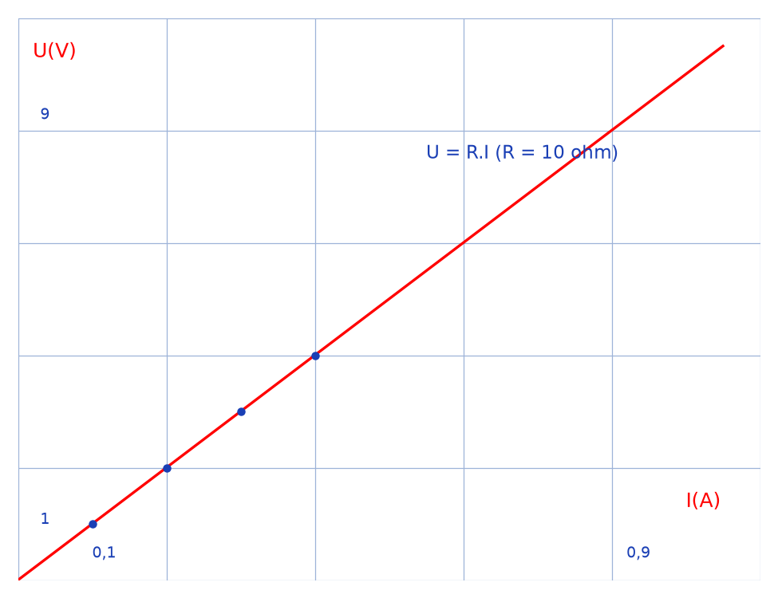
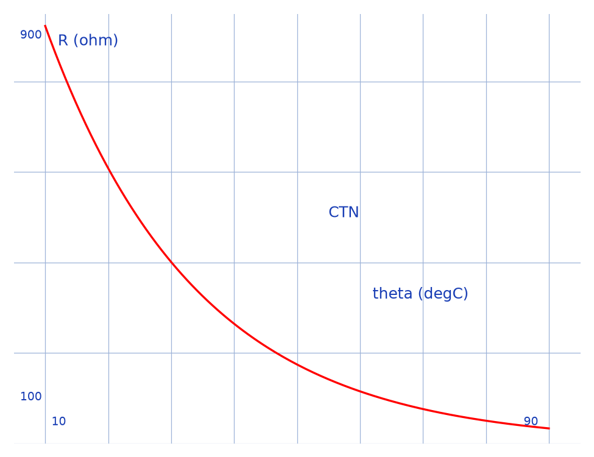
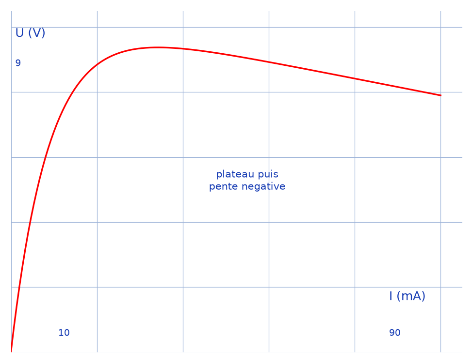
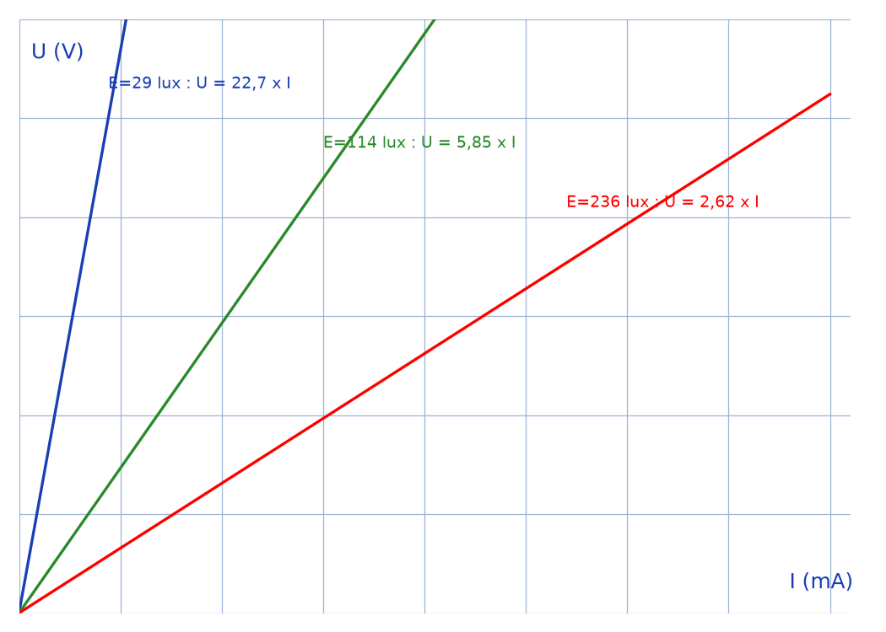
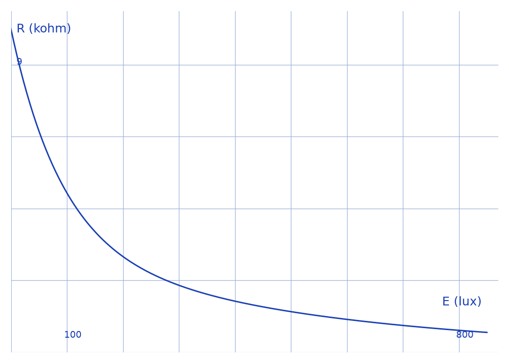

# Étude de quelques dipôles commandés & capteurs — transcription fidèle

> 🧾 **Manuscrit original :** `dipoles-capteurs.pdf` (exposé tapuscrit, 10 pages) · ✍️ Groupe I, coordonnateur Mr Kenvo Fabrice
> 🔍 **Statut :** filigrane diagonal « EXPOSÉ DE PHYSIQUE » sur les pages 2–10 ; schémas du rhéostat et logiciel d'acquisition légendés en anglais ; plusieurs formules et valeurs en `[lecture incertaine — …]`. Transcrit mot à mot.
> 📄 **Source scannée :** [dipoles-capteurs.pdf](dipoles-capteurs.pdf) (restaurée Datas1, vérifiée pdfinfo, 2026-09-07)

---

## Page 1

Bandeau (ruban) : ETUDE DE QUELQUES DIPÔLES COMMANDÉS & CAPTEURS

Cartouche : GROUPE I

Planche de 10 photographies légendées (de haut en bas) :

- Capteur de niveau de liquide ; Bouton poussoir ; Bouton d'arrêt d'urgence
- Détecteur de choc ; Capteur d'humidité ; Capteur de fin de course ; Capteur de proximité à ultrasons
- Détecteur de gaz ; Cellule photoélectrique ; Interrupteur miniature

*Coordonnateur : Mr Kenvo Fabrice*

## Page 2

*Plan du Travail*

I- *Généralités*

II- *Principe de Captage d'une Grandeur*

III- *Exemples de Dipôles Commandés & Capteurs*

IV- *Caractéristiques de Quelques dipôles*

1- *Caractéristique $U=f(I, R)$ d'un rhéostat*

2- *Caractéristiques d'une Thermistance*

a- *Caractéristique $R=f(\theta)$*

b- *Caractéristique $U=f(I, \theta)$*

3- *Caractéristiques d'une Photorésistance*

V- *Capteurs Linéaires & capteurs non linéaires*

VI- *Fonctionnement d'une Antenne*

VII- *Fonctionnement d'un Ecouteur électronique*

VIII- *Fonctionnement d'un pH-mètre électronique*

IX- *Fonctionnement d'un Thermomètre Electronique*

X- *Fonctionnement d'un Lecteur CD*

XI- *Fonctionnement d'un CardioPad*

XII- *Fonctionnement d'un Capteur de Lumière*

Schéma (bloc capteur) : pavé jaune « Capteur » ; flèche verte entrante « Grandeur physique » (sous-titre « - température ») ; flèche rouge descendante « Energie » ; flèche bleue sortante « Signal électrique » (sous-titre « - signal logique (TOR) »).

*Pied de page (identique p. 2–10) : « Etude de Quelques Dipôles Commandés & Capteurs » — « Page N sur 10 ».*

## Page 3

I- *Généralités*

Dans de nombreux domaines (industrie, recherche scientifique, services, loisirs …) on a besoin de contrôler de nombreux paramètres physiques (température, force, position, vitesse, luminosité, …). Le capteur est l'élément indispensable à la mesure de ces grandeurs physiques.

Un capteur est un organe de prélèvement d'information qui élabore à partir d'une grandeur physique, une autre grandeur physique de nature différente (très souvent électrique). Cette grandeur représentative de la grandeur prélevée est utilisable à des fins de mesure ou de commande. Un capteur possède quelques caractéristiques propres :

- ➢ *Etendue de mesure* : Valeurs extrêmes pouvant être mesurée [\*sic\*] — « mesurée »] par le capteur.
- ➢ *Résolution* : Plus petite variation de grandeur mesurable par le capteur.
- ➢ *Sensibilité* : Variation du signal de sortie par rapport à la variation du signal d'entrée. *Exemple* : Le capteur de température LM35 a une sensibilité de $10\,\mathrm{mV} / {}^\circ\mathrm{C}$.
- ➢ *Précision* : Aptitude du capteur à donner une mesure proche de la valeur vraie, [\*sic\*] — la phrase se termine par une virgule]

II- *Principe de Captage d'une Grandeur*

La plupart du temps la grandeur à mesurer n'est pas convertible directement en un signal électrique exploitable. L'élément de mesure (ou élément sensible) convertit la grandeur à mesurer en une grandeur intermédiaire facilement traduisible en signal électrique. La loi qui lie la grandeur intermédiaire à la grandeur à mesurer doit -être parfaitement connue [\*sic\*] — trait d'union surnuméraire]. Le transducteur assure la conversion de la grandeur intermédiaire en une grandeur électrique. Le transducteur, ou encore appelé capteur primaire, peut se comporter comme une impédance (on parlera de capteur passif) ou comme un générateur (capteur actif).

III- *Exemples de Dipôles Commandés & Capteurs*

Placés dans la Partie Opérative d'un système automatisé, les Capteurs permettent de détecter des phénomènes physiques (présence d'un objet, présence d'une chaleur, présence d'une lumière…). Il existe deux grandes familles de capteurs : Les Capteurs à contact et les Capteurs sans contact. Comme exemples de capteurs, on a :

| Photo | Description |
|---|---|
| Capteur de niveau de liquide | C'est un capteur qui permet de détecter le niveau d'un liquide. On peut l'utiliser par exemple dans un réservoir d'essence pour connaitre [\*sic\*] — « connaitre » sans accent] son niveau. |
| Bouton poussoir | C'est un capteur qui permet de détecter la pression d'un doigt ! Il permet à un utilisateur, par exemple, de démarrer une machine. |

## Page 4

| Photo | Description |
|---|---|
| Bouton d'arrêt d'urgence | C'est un capteur qui permet de détecter une forte pression de doigt ! Ce capteur est généralement utilisé sur des machines dangereuses. Il permet à l'utilisateur, en cas de danger, de stopper l'arrêt [\*sic\*] — « stopper l'arrêt »] de la machine en donnant un "coup de poing" sur la partie rouge du capteur. |
| Détecteur de choc | Comme son nom l'indique, ce détecteur est capable de détecter un choc. On peut l'utiliser par exemple dans des alarmes de voitures (détecte les bris de glace). |
| Capteur de fin de course | Ce capteur est utilisé pour détecter la fin d'un déplacement. Exemple : l'ouverture ou la fermeture d'une porte. |
| Capteur d'humidité | Ce capteur permet de détecter le niveau d'humidité. On peut l'utiliser dans une pièce contenant des aliments susceptibles de moisir à cause de l'humidité. |
| Capteur de proximité à ultrasons | Ce capteur permet de détecter, grâce aux ultrasons, la présence d'un objet ou d'une personne. On peut l'utiliser, par exemple, dans un système d'alarme pour voiture. |
| Détecteur de gaz | Comme son nom l'indique, ce détecteur est capable de détecter la présence de gaz. Ce capteur est très pratique puisque comme vous le savez, les fuites de certains gaz, dans une maison, peuvent être mortelles. |
| Cellule photoélectrique | Ce capteur permet de détecter, grâce à un faisceau lumineux, la présence d'un objet ou d'une personne. Son principe de fonctionnement est simple : le capteur réagit dès qu'une personne ou un objet coupe son faisceau lumineux. On peut l'utiliser, par exemple, dans un système d'alarme pour maison. |

En ce qui concerne les dipôles commandés, ce sont des dispositifs possédant deux bornes et pouvant être mis en marche à partir d'un ou plusieurs points. On distingue ceux manuellement commandés et ceux électriquement commandés.

Un dipôle commandé manuellement, est un dipôle dont la manipulation ne nécessite pas l'intervention du courant électrique pour la variation de ses propriétés. Parmi ceux-ci on distingue :

## Page 5

- ➢ Le Rhéostat : c'est un dipôle de résistance variable, qui permet de varier l'intensité du courant d'un circuit électrique
- ➢ Le générateur de tension variable, qui comme son nom l'indique, peut fournir des tensions variables dans un circuit électrique.
- ➢ L'interrupteur : Il permet d'ouvrir ou de fermer un circuit électrique.

Un dipôle électriquement commandé, est un dipôle dont la variation de ses propriétés dépend de la tension électrique qui le traverse. On peut citer :

- ➢ Le condensateur dont la charge varie en fonction du courant qui le traverse.
- ➢ Les récepteurs (Diodes, résistors, électrodes) dont l'arrêt ou la marche dépend de la présence du courant électrique.

IV- *Caractéristiques de Quelques dipôles*

La caractéristique d'un dipôle est la représentation graphique de la tension $U$ entre ses bornes, en fonction de l'intensité $I$ du courant électrique qui le traverse.

1- *Caractéristique $U=f(I, R)$ d'un rhéostat*

Un rhéostat est un dipôle électrique de résistance variable qui permet de faire varier l'intensité du courant dans un circuit. Réaliser sa caractéristique, revient à réaliser la caractéristique intensité-tension du résistor (dit charge) avec lequel il est monté. Comme le montre le schéma ci-contre, en modifiant la position du curseur on fera varier l'intensité et la tension aux bornes du résistor.

Schéma ci-contre (légendes en anglais) : maille avec « battery or cell », ampèremètre « ammeter » ($A$ en cercle, en série), résistor $R$ avec voltmètre « voltmeter » ($V$ en cercle, en dérivation), « rheostat » (symbole à curseur, en série).

Les appareils de mesure permettent de déterminer des couples de valeurs (tension et intensité). Ces couples sont les coordonnées des points qui serviront à tracer la caractéristique sur un graphique où les intensités sont en abscisse (axe horizontale [\*sic\*] — « axe horizontale »]) et les tensions en ordonnée (axe verticale [\*sic\*] — « axe verticale »]).

Pour une résistance de 10 ohm on obtient on obtient [\*sic\*] — « on obtient » répété] les mesures ci-dessous : $(I = 0,1\,A ; U = 1\,V)$, $(I = 0,2\,A ; U = 2\,V)$, $(I = 0,3\,A ; U = 3\,V)$, $(I = 0,4\,A ; U = 4\,V)$, etc.

Ces valeurs permettent de tracer la caractéristique suivante :

*Figure p.5 : graphe d'origine sur papier millimétré, $U(V)$ en ordonnée (1–9), $I(A)$ en abscisse (0,1–0,9), droite rouge passant par l'origine.*

La caractéristique d'une résistance comme on peut le voir est toujours une droite qui passe par l'origine.

Cette droite indique que la tension aux bornes de la résistance est proportionnelle à l'intensité du courant qu'elle reçoit.

Le coefficient de proportionnalité correspond alors à la valeur de la résistance .

On a donc $U=RI$.

2- *Caractéristiques d'une Thermistance*

## Page 6

Une Thermistance est une résistance électrique dont la valeur varie rapidement en fonction de la température, et spécialement en raison inverse de la température. C'est un composant passif en matériau semi-conducteur. Si l'auto-échauffement par effet Joule est négligeable, sa résistance varie avec la température selon la loi : $R(T) = R(T_0).\exp [B\,(1/T - 1/T_0)]$ (Les températures sont exprimées en degrés Kelvin, $B$ et $T_0$ sont des constantes caractéristiques du composant). Comme la résistance diminue avec la température on nomme parfois les thermistances résistances CTN (pour coefficient de température négatif). La caractéristique courant tension présente pour les courants faibles une partie linéaire puis un plateau et enfin pour les courants plus intenses une zone à pente négative qui correspond à l'auto-échauffement du composant. À cause de l'inertie thermique, le tracé de cette caractéristique est délicat.

Capture ci-contre (banc de mesure simulé) : thermomètre affichant « 25 °C », cuve avec sonde jaune, ohmmètre affichant « 500.0 Ω ».

À l'aide de quelques mesures sur la thermistance ci-dessus en fonctionnement, on obtient les tracés ci-dessous, qui concordent bien avec ce qui fut dit plus haut.

a- *Caractéristique $R=f(\theta)$* — b- *Caractéristique $U=f(I, \theta)$*

*Figure p.6a : graphe d'origine sur fond gris, $R$ en $\Omega$ en ordonnée (100–900), $\theta$ en $^\circ\mathrm{C}$ en abscisse (10–90), courbe rouge décroissante.*

*Figure p.6b : graphe d'origine sur fond gris, $U$ en $V$ en ordonnée (0–10), $I$ en $mA$ en abscisse (0–100), courbe rouge montant vers ~9 V puis redescendant doucement.*

3- *Caractéristiques d'une Photorésistance*

Photo (composant à piste en serpentin) : Comme son nom l'indique dans la langue de Shakespeare : LDR pour Light Dependent Resistor, la photorésistance est un dipôle dont la résistance varie en fonction de l'éclairement $E$ qu'elle reçoit d'une source de lumière.

La partie sensible du capteur est une piste de sulfure de cadmium en forme de serpent : l'énergie lumineuse reçue déclenche une augmentation de porteurs de charges libres dans ce matériau, de sorte que sa résistance électrique évolue.

Son symbole normalisé dans un circuit est le suivant : (rectangle, deux flèches obliques incidentes).

C'est une grandeur physique notée $E$, se mesurant à l'aide d'un luxmètre et qui permet de rendre compte de la luminosité plus ou moins forte d'une source lumineuse. Plus la source parait [\*sic\*] — « parait » sans accent] intense, plus son éclairement $E$ est élevé.

Photo (luxmètre) : afficheur numérique [lecture incertaine — valeur d'affichage illisible] avec cellule de mesure déportée.

## Page 7

Réalisons le montage ci-contre et réglons progressivement la valeur de l'éclairement $E$. On obtient différentes valeurs de la résistance $R$ de la photorésistance et ainsi différentes valeurs de de [\*sic\*] — « de de »] l'intensité et de la tension électrique.

Schéma ci-contre (montage manuscrit) : photorésistance (rectangle, flèches incidentes) en haut, ampèremètre $A$ (bornes « Com » [lecture incertaine — libellés manuscrits]) en série à droite, voltmètre $V$ (bornes « V », « Com » [lecture incertaine]) en dérivation aux bornes de la photorésistance.

Capture ci-contre (logiciel d'acquisition, légendes en anglais) : panneau « Ajuster », « Tracé auto. », curseur « << < 22,7 > >> », « Résultats de la modélisation », « Écart données-modèle », « Écart-type sur U=331,3 mV », « Résultat d'un réglage manuel des paramètres. Pour optimiser, cliquer sur ajuster ». Trois modélisations affichées : « E=29 lux: U = 22,7 x I », « E = 114 lux: U = 5,85 x I », « E = 236 lux: U = 2,62 x I » ; ordonnée « Modélisation », abscisse « I/mA » [lecture incertaine — libellé d'axe].

*Figure p.7 (haut) : les trois droites $U = 22,7\,I$ ($E = 29$ lux), $U = 5,85\,I$ ($E = 114$ lux), $U = 2,62\,I$ ($E = 236$ lux) ; plus $E$ est élevé, plus la pente (donc $R$) est faible.*

Comme on peut le constater, les courbes tracées sont des droites affines linéaires [\*sic\*] — « affines linéaires » redondant]. Le coefficient de proportionnalité est donc la résistance $R$ de la photorésistance qui varie en fonction de l'éclairement $E$ suivant le graphe ci-dessous :

*Figure p.7 (bas) : graphe d'origine, $R$ en $k\Omega$ en ordonnée (0–9), $E$ en $lux$ en abscisse (0–800), courbe décroissante.*

V- *Capteurs Linéaires & capteurs non linéaires*

Le capteur est dit linéaire si la courbe d'étalonnage est une droite ou sinon le capteur est dit non linéaire. Ici, la courbe d'étalonnage est la représentation graphique de la relation entre la grandeur de sortie de l'appareil et celle d'entrée.

Comme exemple de capteurs linéaires, on a les capteurs d'altitude, les capteurs de déplacement (accéléromètres), les capteurs d'angles (gyroscopes), les thermomètres à mercure…

Comme exemple de capteurs non linéaires, on a la Sonde de température d'une thermistance, le capteur d'une photorésistance…

VI- *Fonctionnement d'une Antenne*

## Page 8

Il faut au minimum deux antennes lors de toute transmission sans fil.

- L'antenne émettrice permet de diffuser des ondes électromagnétiques qui se propagent dans l'espace séparant l'émetteur du récepteur.
- L'antenne de réception capte ensuite ces ondes afin de retranscrire l'information.

Il est à noter que tout conducteur, c'est-à-dire tout objet au travers duquel le courant électrique peut circuler, peut être utilisé comme antenne.

Un amplificateur vient augmenter le signal une fois les ondes triées par l'antenne de réception. Ainsi, le signal peut être exploité par la télévision, la radio ou le Wi-Fi. Un coupleur permet de connecter des antennes paraboliques et des antennes TNT dans le cas de l'utilisation de plusieurs installations. Ainsi, un seul câble suffit.

L'antenne fonctionne avec un répartiteur dans le cas où plusieurs postes de télévision sont en service. Le signal est ensuite démodulé dans le but de reconstituer l'information :

- de façon numérique pour la réception TV
- de façon analogique pour la réception radio

Photo (toits, antennes râteau et paraboles).

*La propagation des ondes*

Les ondes sont capables de se réfléchir sur de nombreux corps. Pour mieux comprendre, prenons l'exemple d'une télécommande TV ou de chaîne hi-fi. En général, il suffit de pointer le récepteur pour changer de canal. Il est également possible d'envoyer les informations en faisant rebondir le signal sur les murs voisins. En sachant que des obstacles physiques peuvent gêner les ondes électromagnétiques lors de leur propagation, les signaux doivent transiter par une antenne relais

VII- *Fonctionnement d'un Ecouteur électronique*

Les écouteurs fonctionnent sur le même principe qu'un haut-parleur. Le courant électrique, venu du double fil et modulé par la musique, parvient dans une petite bobine entourant un aimant. Les variations de courant dans ce fil de cuivre enroulé sur lui-même modifient en permanence le champ électromagnétique. L'aimant se met à bouger, vibrant avec le courant, donc au rythme de la musique. Il est collé à une fine membrane de plastique, ronde comme l'écouteur. Comme celle d'un haut-parleur ou la peau d'un tambour, cette membrane met en mouvement l'air environnant et le fait chanter.

Un fin grillage métallique, visible de l'extérieur, protège la membrane des écouteurs, interdisant l'entrée aux poussières et autres saletés.

Photo (écouteurs intra-auriculaires noirs).

*Caractéristiques électriques des écouteurs*

Si l'on compte bien les fils, il y en a trois dans le cordon commun aux deux oreillettes. L'un d'entre eux (la « masse », comme disent les électriciens) est relié aux deux écouteurs. Chacun des autres fils va soit à droite, soit à gauche, portant ainsi un signal stéréophonique. Électroniquement, des écouteurs sont caractérisés par leur impédance (la résistance électrique, en ohms, de symbole $\Omega$) et la puissance (en milliwatts, $mW$) qu'ils peuvent diffuser

VIII- *Fonctionnement d'un pH-mètre électronique*

## Page 9

Un pH-mètre est un appareil, souvent électronique, permettant la mesure du pH d'une solution.

Photo (pH-mètre de paillasse avec sonde).

Le pH-mètre est généralement constitué d'un boitier [\*sic\*] — « boitier » sans accent circonflexe] électronique permettant l'affichage de la valeur numérique du pH et d'une sonde de pH constituée d'une électrode de verre permettant la mesure et d'une électrode de référence. Son fonctionnement est basé sur le rapport qui existe entre la concentration en ions (définition du pH) et la différence de potentiel électrochimique qui s'établit dans le pH-mètre une fois plongé dans la solution étudiée. Celui-ci est constitué de deux électrodes, l'une standard dont le potentiel est constant et connu (appelée électrode de référence), l'autre à potentiel variable (fonction du pH, appelée électrode de verre). Ces deux électrodes peuvent être combinées ou séparées.

L'appareil est étalonné au moyen de deux solutions tampon [\*sic\*] — « deux solutions » pour trois valeurs] (pH 4, 7 et 10 disponibles). On peut aussi (après avoir réalisé cet étalonnage) déterminer la valeur du pH par simple corrélation, la différence de potentiel évoluant proportionnellement à la valeur du pH selon la formule suivante :

$$\Delta E = a\,(\mathrm{pH}_{\text{éch}} - \mathrm{pH}_{\text{réf}}) + b$$

avec :

- $\Delta E$, la différence de potentiel entre les deux électrodes ;
- $\mathrm{pH}_{\text{éch}}$, le pH de la solution à mesurer ;
- $\mathrm{pH}_{\text{réf}}$, le pH de la solution de référence ;
- $a$ et $b$, les constantes dépendant de l'appareil, elles sont révélées lors de l'étalonnage du pH-mètre.

IX- *Fonctionnement d'un Thermomètre Electronique*

Photo (thermomètre médical numérique).

Le principe de ces capteurs de température repose sur l'évolution de la caractéristique tension-courant d'un composant en fonction de la température. Dans les capteurs modernes, et pour des températures pas trop élevées ($<100^\circ\mathrm{C}$), ce composant est généralement une jonction au silicium, qu'on alimente avec une source de courant régulée (laquelle est le plus souvent intégrée au circuit du capteur, comme dans le cas du LM35), et qui permet de produire une tension variant linéairement avec la valeur de la température. La tension de sortie donne la température de la jonction de façon quasiment instantanée. En revanche, la température de la jonction met un certain temps à atteindre celle régnant à l'extérieur du boîtier du circuit lorsque celle-ci varie. Cela correspond au phénomène d'inertie thermique.

X- *Fonctionnement d'un Lecteur CD*

Le CD doit son nom de Compact Disk à la quantité d'informations qu'il contient : en 1981, lors de son invention, la musique s'écoute sur des 33 tours, larges rondelles de 30 cm de diamètre, qui ne contiennent pas plus de 40 minutes de musique par face ! Le CD, lui, est un disque de 12 cm de diamètre et de 1,2 mm d'épaisseur permettant de stocker des informations numériques, jusqu'à 700 Mo de données informatiques ou 80 minutes de données audio. Et effectivement, lire un CD implique un rayon laser.

Schéma (lecture optique) : « Diode laser », « Miroir semi réfléchissant », « Miroir », « Chariot », « Diode photoélectrique », disque CD en haut à droite.

## Page 10

Pour comprendre comment fonctionne le lecteur, il faut déjà savoir comment sont stockées les données sur le CD. Le CD est constitué de plastique et d'une fine pellicule métallique réfléchissante recouverte d'un film protecteur. L'information est contenue sur la couche réfléchissante sous forme de creux (les pits) et de plats (les lands) disposés en spirale sur le disque.

*Lecture laser*

Une fois le disque inséré dans son lecteur, il est appliqué contre un plateau rotatif muni d'un moteur qui le fait tourner. Pendant ce temps, une diode émet un faisceau laser. C'est un faisceau de lumière cohérente et directionnelle. Celui-ci est infrarouge, c'est-à-dire invisible pour nos yeux et possède une longueur d'onde de 780 nm. Une lentille située sur un chariot à proximité du CD focalise ce faisceau sur les alvéoles, ce qui lui permet de suivre le sillon, tout au long de la lecture. Une fois que le rayon laser a frappé le disque, il est réfléchi. Pour éviter qu'il ne revienne sur la diode de départ, un miroir semi réfléchissant se charge de le dévier : il permet à la lumière réfléchie d'atteindre une cellule photoélectrique. Dès qu'elle reçoit de la lumière, celle-ci transforme le signal lumineux en signal électrique.

*Interférence destructrice et bit*

Signal lumineux ? Eh oui, car les creux et les plats du CD ne réfléchissent pas la lumière de la même façon : lorsque le laser passe au niveau d'une alvéole, l'onde et sa réflexion sont déphasées d'une demi-longueur d'onde et s'annulent (on parle d'interférence destructrice) : tout se passe alors comme si aucune lumière n'était réfléchie.

Le passage d'un creux à un plat provoque une chute de signal, la photodiode ne recevant aucune lumière, n'émet pas de courant électrique : cela représente un bit. Ces bits forment une suite de 0 et de 1. Ce signal numérique est ensuite transformé par un convertisseur en un signal analogique, qui sera "augmenté" par un amplificateur audio.

XI- *Fonctionnement d'un CardioPad*

Photo (Arthur Zang présentant la tablette CardioPad) : Lors de l'examen médical, les électrodes, placées sur le patient, sont rattachées à un module qui capte la résonnance [\*sic\*] — « résonnance »] des électrodes puis la transmet à la tablette CardioPad.

À l'aide du logiciel dont est équipée la tablette, celle-ci assure le traitement et la sauvegarde des données sur un serveur consultable par les cardiologues camerounais.

L'examen est ensuite interprété par le médecin qui effectue un diagnostic renvoyé au serveur.

Légende : « Au Cameroun, il y a moins de 50 cardiologues pour 20 millions d'habitants ! » Arthur Zang créateur du CardioPad

XII- *Fonctionnement d'un Capteur de Lumière*

Schéma (capteur solaire avec lampe et multimètre) ci-contre.

Un capteur de luminosité est composé d'un panneau solaire et en fonction de la quantité de lumière que reçoit ce dernier, il produira plus ou moins d'énergie. La source lumineuse envoie des ondes électromagnétiques (lumière) vers le capteur. La lumière est constituée d'un nombre extrêmement grand de photons contenant un peu d'énergie. Lorsqu'un panneau photovoltaïque reçoit de l'énergie, il est capable de libérer des électrons. Comme le courant correspond à un déplacement d'électrons, une tension nait donc aux bornes du panneau solaire. Ainsi en fonction de l'intensité lumineuse extérieure, la cellule photovoltaïque créera un courant plus ou moins fort. Et c'est alors la naissance du courant qui permet de détecter la présence de la lumière !
