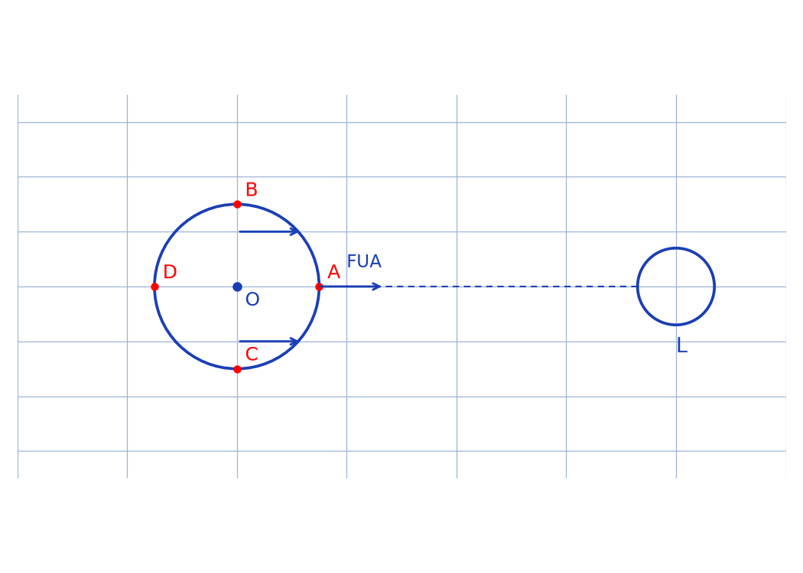
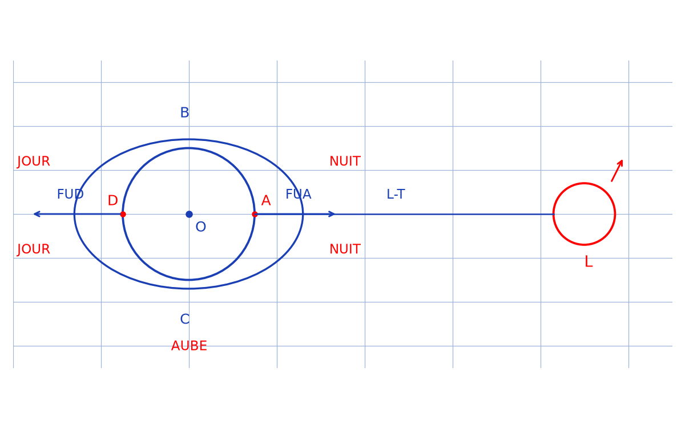

# Explication du phénomène des marées selon la gravitation — transcription fidèle

> 🧾 **Manuscrit original :** `marees.pdf` (scan, 2 pages) · ✍️ KpihX
> 🔍 **Statut :** calcul différentiel d'attraction lunaire en A, B, C, D puis interprétation (marées hautes/basses) ; valeurs numériques d'application en `[lecture incertaine — …]`. Transcrit mot à mot.
> 📄 **Source scannée :** [marees.pdf](marees.pdf) (restaurée Datas1, vérifiée pdfinfo, 2026-09-07)

---

## Page 1

Explication du phénomène des marées selon la gravitation.

$R_L = 1{,}74 \times 10^3\,\mathrm{Km}$, $G = 6{,}67 \times 10^{-11}\,\mathrm{USI}$, $M_L = 7{,}34 \times 10^{22}\,\mathrm{Kg}$, $D = 3{,}84 \times 10^5\,\mathrm{Km}$, $R_T = 6{,}38 \times 10^3\,\mathrm{Km}$.

*Figure p.1 : cercle terrestre de centre $O$ avec $A$ à droite (côté Lune), $D$ à gauche, $B$ en haut, $C$ en bas ; flèches de forces d'attraction lunaire ; Lune $(L)$ à droite.*

Comme l'indique la figure, le phénomène des marées est en effet dû à la différence d'attraction lunaire à laquelle est soumise un point de la terre par rapport à l'attraction à laquelle est soumise le centre $O$.

Dans la suite nous travaillerons avec une masse unitaire d'eau de mer en $A, B, C$ et $D$ ainsi qu'avec une masse unitaire en $O$.

\* En $A$, $F_{UA} - F_{UO} = \dfrac{G M_L}{(D - R_T)^2} - \dfrac{G M_L}{D^2}$
$$= \frac{G M_L}{D^2}\left(\left(\frac{D}{D - R_T}\right)^2 - 1\right)$$
$$= \frac{G M_L}{D^2}\left(\left(1 - \frac{R_T}{D}\right)^{-2} - 1\right)$$
$$= \frac{G M_L}{D^2}\left(1 + \frac{2R_T}{D} - 1\right) \text{ car } R_T \ll D.$$
$$F_{UA} - F_{UO} = \frac{2 G M_L R_T}{D^3} = f_A.$$

De même on obtient $f_D = \dfrac{-2 G M_L R_T}{D^3}$ [raturé : fin de ligne].

\* En $B$, $F_{UB} - F_{UO} = \dfrac{G M_L}{D^2 + R_T^2} - \dfrac{G M_L}{D^2}$
$$= \frac{G M_L}{D^2}\left(\frac{-R_T^2}{D^2 + R_T^2}\right) \text{ or } R_T \ll D \Rightarrow \frac{R_T}{D^2 + R_T^2} \simeq \frac{1}{D} \text{ d'où}\ldots$$
$$\simeq \frac{G M_L}{D^2} \times \frac{R_T}{D}$$
[lecture incertaine — ligne de transition]
$$F_{UB} - F_{UO} = \frac{-G M_L R_T}{D^3} = f_C \text{ [\*sic\* — noté $f_C$]}.$$

De même on obtient $f_C = f_B$.

## Page 2

Or $f_A = \dfrac{-6{,}67 \times 10^{-11} \times 7{,}34 \times 10^{22} \times 6{,}38 \times 10^6}{(3{,}84 \times 10^5)^3} \simeq ?$ [lecture incertaine — valeurs numériques, lues $\approx 1103{,}26\,\mathrm{N}$ et $551{,}63\,\mathrm{N}$] ainsi $f_{OC} \simeq -551{,}63\,\mathrm{N}$ [lecture incertaine — indices], $f_A \simeq 1103{,}26\,\mathrm{N}$ [lecture incertaine — indices et signes].

$f_C$ [\*sic\* — contexte : $f_A$] étant la plus grande valeur, on observera un déversement prononcé des masses d'eau vers la lune (la nuit) ; parallèlement comme $f_C$ [\*sic\* — contexte : $f_D = -f_A$, cf. p. 1] $= -f_A$, on observera une montée d'eau de façon similaire qu'en $A$ mais dans l'autre sens (en journée), formant ainsi les 2 marées hautes : celle diurne et celle nocturne.

Inversement l'attraction en $B$ et $C$ étant moins prononcée et étant particulièrement centrifuge (vers la lune), les masses d'eau auront tendance à vouloir se répandre en $O$ pour rejoindre l'axe $L$-$T$ formant ainsi les 2 marées basses observables à l'aube et au crépuscule.

Tout se passe comme si la terre était étirée vers l'équateur au passage de la lune, et aplatie davantage aux pôles dans le sens [lecture incertaine].

Tout se résume par les figures ci-contre : [CREPUSCULE].

*Figure p.2 : Terre (centre $O$) entourée d'une ellipse (bourrelets) avec $A$ à droite côté Lune et $D$ à gauche ; étiquettes JOUR (côté $D$, doublée), NUIT (côté $A$, doublée), AUBE (en $C$), CREPUSCULE (en $B$) ; forces $F_{UA}, F_{UB}, F_{UC}, F_{UD}, F_{UO}$ ; axe $L$-$T$ jusqu'à la Lune $(L)$ à droite.*

NB : les eaux étant plus fluides, on observe juste les marées à ce niveau contrairement aux solides.

\* les marées s'observent de façon plus prononcée aux niveaux des masses d'eau plus amovibles.

\* les explications ci-contre ne tiennent pas en compte les rotations des différents astres ainsi que leurs révolutions, lesquelles données sont négligeables. KPVH [\*sic\* — signature].

---

## Figures

| # | Page source | PNG (`assets/`) | Script (`lab/scripts/`) |
|---|-------------|-----------------|-------------------------|
| 1 | p.1 (haut gauche) | `terre-lune-points.png` | `reproduce_marees_1.py` (vérifié `uv run`) |
| 2 | p.2 (bas) | `bourrelets-maree.png` | `reproduce_marees_2.py` (vérifié `uv run`) |

100 % code : les 2 figures visibles sont reproduites et embarquées ci-dessus (captions *Figure p.1* / *Figure p.2*).

## Vocabulaire

- **marée haute / basse** — montée (diurne/nocturne, en $A$/$D$) vs retrait (aube/crépuscule, en $B$/$C$).
- **bourrelets de marée** — ellipse d'eau entourant la Terre sur la figure p.2.
- **axe $L$-$T$** — droite Lune–Terre, axe de symétrie des bourrelets.
- **attraction différentielle** — $f_M = F_{UM} - F_{UO}$, moteur du phénomène.
- **masse unitaire** — convention de calcul ($O, A, B, C, D$).
