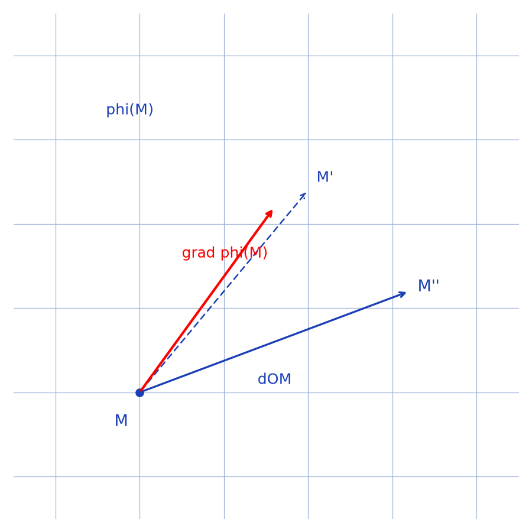
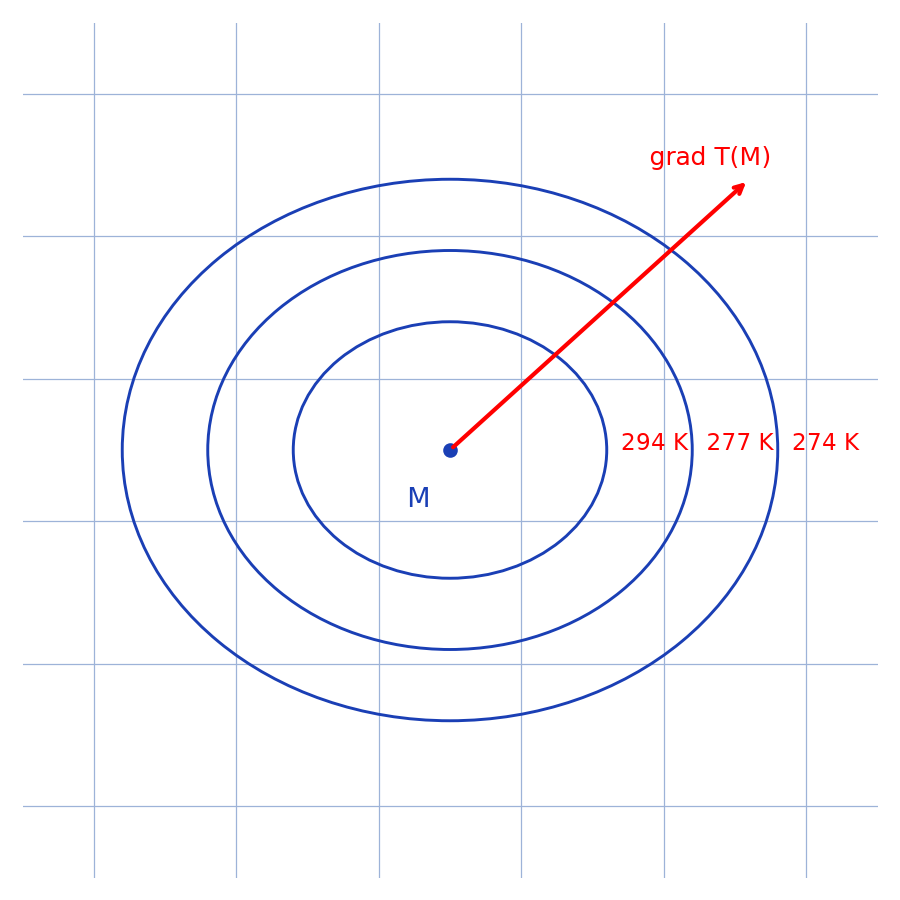

# Nabla, opérateur différentiel — notion de gradient — transcription fidèle

> 🧾 **Manuscrit original :** `operateur-nabla.pdf` (scan, 2 pages) · ✍️ KpihX
> 🔍 **Statut :** définition du gradient (direction de plus grande variation, cas concret de la température) puis évaluation en coordonnées ; abréviations et symboles en `[lecture incertaine — …]`. Transcrit mot à mot.
> 📄 **Source scannée :** [operateur-nabla.pdf](operateur-nabla.pdf) (restaurée Datas1, vérifiée pdfinfo, 2026-09-07)

---

## Page 1

Nabla : $\vec{\nabla}$, opérateur différentiel | A/ Notion de gradient.

Soit $\varphi : \mathcal{E}^3 \longrightarrow \mathbb{R}$ une application $C^1$ sur $\mathcal{E}^3 \equiv$ espace réel : celui associé $M \longmapsto \varphi(M)$ de façon canonique à $\mathbb{R}^3$.

On munit $\mathcal{E}^3$ d'une origine $O$, de son système de coord [coordonnées] canonique $(x, y, z)$.

Soit un système de coordonnées quelconque $X = (x_1, x_2, x_3) = (x_i)_3 \ni M = (x_1, x_2, x_3)$ de repère de base orthonormée directe associée $B = (\vec{e_i})_3$ / $\exists \, P = (n_i)_3$ (système de paramètres) / $\forall \, M = (x_1, x_2, x_3) \in \mathcal{E}^3$, $d\vec{OM} = d\vec{M} = \sum_{i=1}^3 dx_i \cdot \vec{e_i}$.

Étant un champ scalaire, en un pt [point] $M \in \mathcal{E}^3$, on aimerait connaître dans quelle direction un déplacement élémentaire dans $\mathcal{E}^3$ entraînerait la plus grande variation [d?] de $\varphi$. Appelons alors un vecteur directeur de cette direction $\vec{\nabla}\varphi(M)$ ($\vec{\nabla}$ pour G : variation ; et dans notre cas, sens pour lequel tout déplacement élémentaire fait varier $\varphi$ au max). Ce l'indique le $f_3$ [lecture incertaine — référence], plus $d\vec{OM}$ s'éloigne de $\vec{\nabla}\varphi(M)$ plus $d\varphi(M)$ est moins important. On peut alors simplement définir $\vec{\nabla}\varphi(M)$ ce l'indique la figure : si un déplacement élémentaire permet de quitter de $M$ à $M''$ on a : $d\varphi(M) = \varphi(M'') - \varphi(M) = \vec{\nabla}\varphi(M) \cdot d\vec{OM}$ c.à.d. $\boxed{d\varphi(M) = \vec{\nabla}\varphi(M) \cdot d\vec{OM}}$.

*Figure p.1 (haut droite) : point $M$ avec vecteur déplacement $\overrightarrow{dOM}$ vers $M''$ (variante $M'$ en pointillés) et vecteur gradient $\overrightarrow{\mathrm{grad}}\,\varphi(M)$.*

Cas concret : Considérons le champ scalaire $T : \mathcal{E}^3 \longrightarrow \mathbb{R}_+^*$, $M \mapsto T(M)$ : température en K en ce pt de l'espace. La connaissance de $\vec{\nabla}\varphi(M)$ [sic — contexte : $\vec{\nabla}T(M)$] nous permet de connaître dans quelle direction quittant de $M$, tout déplacement infinitésimal conduirait à un pt $M' \in \mathcal{E}^3$ où la température est la plus élevée possible. Mieux encore, si l'on est capable d'évaluer $d\varphi(M) = \vec{\nabla}\varphi(M) \cdot d\vec{OM}$, connaissant $T(M)$ on pourrait trouver $T(M')$ $\forall \, M' \in \mathcal{E}^3$ par la relation $T(M') = T(M) + \int_{M \to M'} \vec{\nabla}\varphi(M) \cdot d\vec{ON}$ [lecture incertaine — borne et variable d'intégration].

*Figure p.1 (bas droite) : point $M$ entouré d'isothermes cotées ($\approx 274\,\mathrm{K}$, $277\,\mathrm{K}$, $294\,\mathrm{K}$ [lecture incertaine — valeurs]) avec le vecteur gradient de $T$ en $M$ pointant vers les températures croissantes.*

## Page 2

Évaluation de $\vec{\nabla}\varphi(M)$ $\forall \, M \in \mathcal{E}^3$.

On a : $d\varphi(M) = \vec{\nabla}\varphi(M) \cdot d\vec{OM}$ (5) [lecture incertaine — numéro] ? sous $\vec{\nabla}\varphi(M) = (\delta_1, \delta_2, \delta_3)$ [lecture incertaine — notations]. Et $(\in)$ $\sum_{i=1}^3 \frac{\partial \varphi(M)}{\partial x_i} dx_i = \begin{pmatrix} \delta_1 \\ \delta_2 \\ \delta_3 \end{pmatrix} \cdot \begin{pmatrix} n_1 dx_1 \\ n_2 dx_2 \\ n_3 dx_3 \end{pmatrix} = \sum_{i=1}^3 \delta_{n_i} dx_i$ [lecture incertaine — facteurs $n_i$].

Par Identification $\boxed{\vec{\nabla}\varphi(M) = \sum_{i=1}^3 \frac{\partial \varphi(M)}{n_i \, \partial x_i} \vec{e_i}}$.

Rq : Cette relation faisant intervenir $\varphi(M)$ des 2 côtés nous permet de définir de façon générale un opérateur dit différentiel $\boxed{\vec{\nabla} = \sum_{i=1}^3 \frac{\vec{e_i}}{n_i} \frac{\partial}{\partial x_i}}$.

$\vec{\nabla}\varphi(M)$ est appelé le gradient de $\varphi$ en $M$.

B/ Notion de rotationnel.

---

## Figures

| # | Page source | PNG (`assets/`) | Script (`lab/scripts/`) |
|---|-------------|-----------------|-------------------------|
| 1 | p.1 (marge droite, haut) | `gradient-deplacement.png` | `reproduce_operateur_nabla_1.py` (vérifié `uv run`) |
| 2 | p.1 (marge droite, bas) | `isothermes-gradient.png` | `reproduce_operateur_nabla_2.py` (vérifié `uv run`) |

100 % code : les 2 figures visibles (toutes p.1 ; p.2 sans figure, texte seul) sont reproduites et embarquées ci-dessus. Valeurs des isothermes lues $\approx 274\,\mathrm{K}$, $277\,\mathrm{K}$, $294\,\mathrm{K}$ [lecture incertaine — voir md].

## Vocabulaire

- **gradient** — $\vec{\nabla}\varphi(M)$, direction de plus grande variation de $\varphi$.
- **champ scalaire** — application $\varphi$ (ou $T$ pour la température) de $\mathcal{E}^3$ vers $\mathbb{R}$.
- **isotherme** — courbe de température constante (figure p.1 bas).
- **déplacement élémentaire** — $d\vec{OM}$, incrément infinitésimal depuis $M$.
- **rotationnel** — notion annoncée en B/ (non développée dans ces 2 pages).
