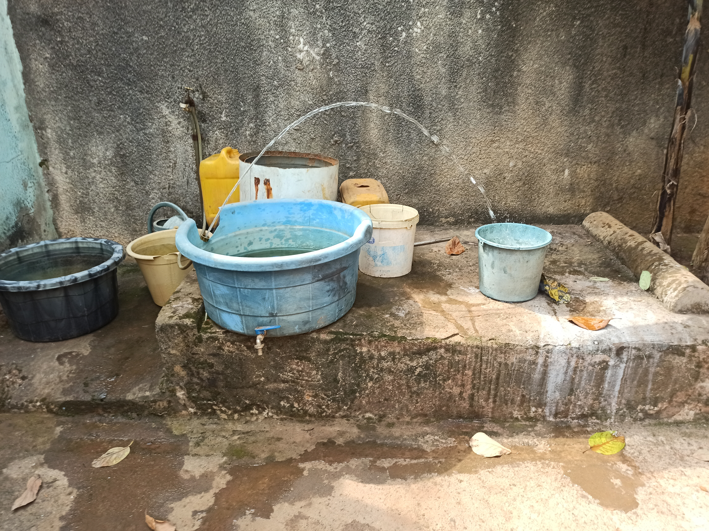
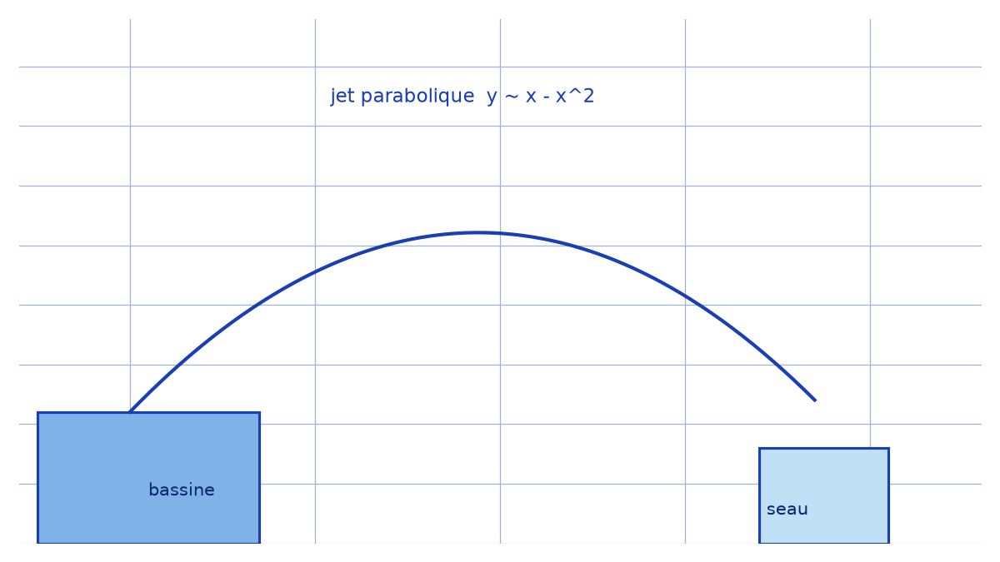

# Parabole naturelle — transcription fidèle

> Source : `parabole-naturelle.jpg` (1 page : photographie couleur, aucun texte manuscrit).
> Fait-main : non applicable (photo) ; page conservée comme témoin visuel d'une parabole réelle.

## Page 1 — transcription fidèle

[reconstruction — motif : aucun texte manuscrit sur la page, photographie seule]

Description fidèle du contenu visuel, de gauche à droite :

- Bassine noire remplie d'eau (hors dalle), seau beige, grande bassine bleue sur dalle béton avec robinet bas.
- Bidon jaune, fût blanc rouillé, bidon et seau blanc en arrière-plan contre un mur crépi gris.
- Un jet d'eau continu jaillit du bord de la bassine bleue et retombe dans un petit seau bleu clair posé à droite : trajectoire en cloche (arc parabolique), éclaboussures à l'impact.
- Sol mouillé, feuilles mortes (jaunes/brunes) au sol et sur la dalle.

## Figures

La figure, c'est la photo elle-même (parabole du jet). Reproduction schématique de la trajectoire $y \sim x - x^2$ :

*Script : `~/KpihX-Labs/Explore/lab/scripts/reproduce_parabole-naturelle_1.py` — description précise : courbe bleue $y = 1.6x - 0.85x^2 + 0.55$, rectangle bleu « bassine » à gauche, petit rectangle « seau » à droite, légende « jet parabolique ».*

## Vocabulaire / notions

- Parabole balistique (trajectoire sous pesanteur), jet d'eau, portée.
- Aucun terme manuscrit à relever (page sans écriture).
