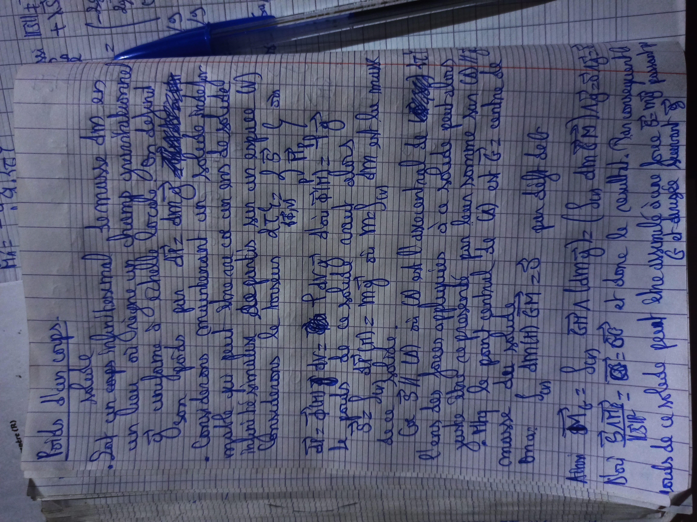
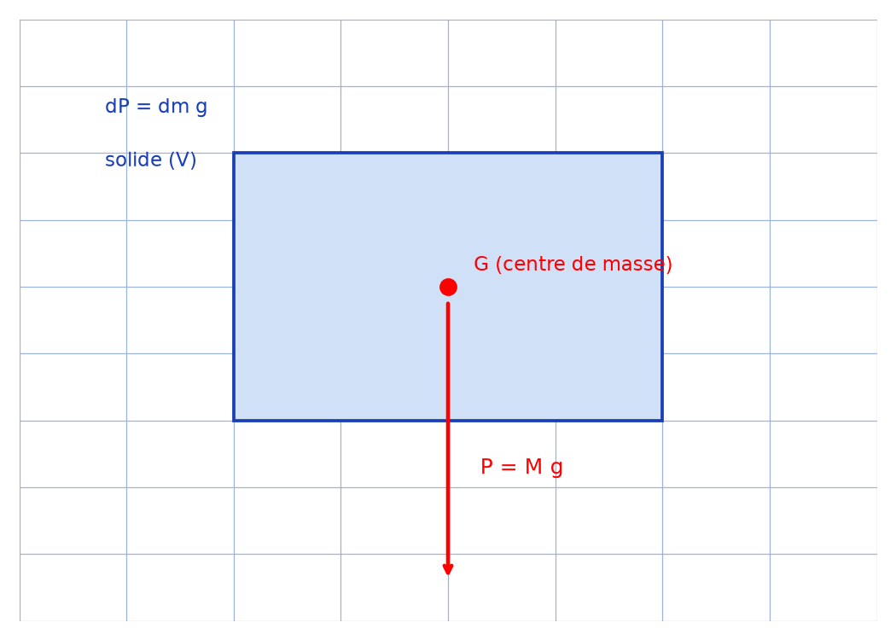

# Poids corps — transcription fidèle

> Source : `poids-corps.jpg` (1 page, stylo bleu sur cahier quadrillé, page pivotée).
> Lisibilité ~70 % ; en-tête « Poids d'un corps. Masse ».

## Page 1 — transcription fidèle

Poids d'un corps.

Masse

- Soit un corps infinitésimal de masse $dm$ en

un lieu où règne un champ gravitationnel

[raturé : passage réécrit] uniforme à l'échelle [lecture incertaine] de ce [lecture incertaine]

De son poids par $d\vec{P} = dm \, \vec{g}$ [raturé : « $\vec{P}$ » réécrit]

- Considérons cependant un solide indéfor[mable — lecture incertaine]

[lecture incertaine — « ... car on dit ... de solide »]

Infinitésimaux de parties sur un espace $(V)$ [lecture incertaine]

Considérons le torseur $d\vec{F}$ [lecture incertaine], $d\vec{G}$ [lecture incertaine] en [lecture incertaine]

[formule raturée puis :] $\vec{P} = \int d\vec{P}$ [lecture incertaine] $= \vec{g}$ [lecture incertaine]

Le poids de ce solide [lecture incertaine]

$8z = \int_{(V)} dm$ [lecture incertaine — « $M = \int dm$ sur $(V)$ »] $=$ $m$ est la masse

du corps [lecture incertaine]

Car $S/V (V)$ où $U$ ascendant [lecture incertaine] de la [lecture incertaine]

Etant des forces appliquées à ce solide peut-plus [lecture incertaine]

entre elles se ramènent par leur somme sur $(V)$ [lecture incertaine]

D'après le point central [?] de $(V)$ est $Gz$ centre de

masse des solides [lecture incertaine]

On a : $\int dm(\vec{M}) \overrightarrow{GM} = \vec{0}$ par défi[nition] delt [lecture incertaine]

Ainsi $\vec{M}_G = \int (\vec{GA} [\text{lecture incertaine}] dm \vec{g}) = (\int dm \overrightarrow{GM}) \wedge \vec{g} = \vec{0}$ [reconstruction — motif : formule du moment en $G$, bas de page flou]

Donc $\frac{\overrightarrow{SVH}}{\overrightarrow{VSH}} = \overrightarrow{OS} - \overrightarrow{OG}$ [lecture incertaine] et dans le sommet $1$, d'un conséquent [lecture incertaine]

Alors de ce related peut shewshlg à une ave force $\vec{P} = m\vec{g}$ passant [lecture incertaine]

par $G$ et d'origine $G$ [reconstruction — motif : conclusion « le poids s'applique en $G$ », écriture très empâtée]

## Figures

Pas de schéma sur le manuscrit. Corps $(V)$, centre de masse $G$, poids $\vec{P} = M\vec{g}$ :

*Script : `~/KpihX-Labs/Explore/lab/scripts/reproduce_poids-corps_1.py` — description précise : rectangle bleu clair (solide $(V)$), point rouge $G$ au centre, flèche rouge vers le bas « $P = Mg$ », annotations « $dP = dm\,g$ ».*

## Vocabulaire / notions

- Masse $dm$, $M = \int_{(V)} dm$, champ gravitationnel $\vec{g}$ (uniforme).
- Poids $d\vec{P} = dm\,\vec{g}$, $\vec{P} = M\vec{g}$, centre de masse $G$.
- Torseur, moment en $G$ ($\vec{M}_G = \vec{0}$), résultante appliquée en $G$.
