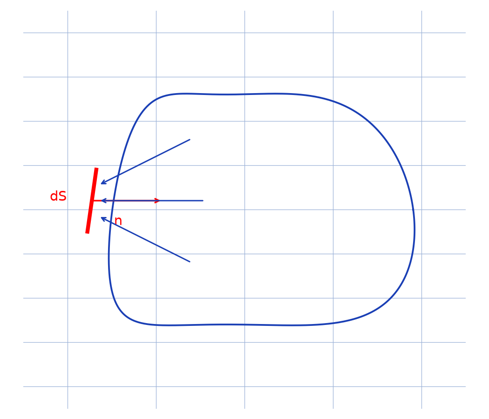

# Pression cinétique d'un gaz — transcription fidèle

> 🧾 **Manuscrit original :** `pression-cinetique.pdf` (carnet quadrillé manuscrit, 3 pages) · ✍️ KpihX
> 🔍 **Statut :** démonstration de $PV = nRT$ par bilan d'impulsion sur un élément de paroi $dS$ ; transcrite mot à mot, notations d'origine conservées, passages incertains signalés `[lecture incertaine — …]`.
> 📄 **Source scannée :** [pression-cinetique.pdf](pression-cinetique.pdf) (restaurée Datas1, vérifiée pdfinfo, 2026-09-07)

---

## Page 1

(Titre bleu souligné :) Pression cinetique [*sic* — sans accent] d'un gaz

(Schéma en haut à gauche : contour fermé = paroi ; élément de surface $dS$ avec vecteur normal $\vec{n}$ ; flèches de particules incidentes — voir reproduction ci-dessous.)

*Figure p.1 : portion de paroi avec l'élément de surface $dS$, sa normale $\vec{n}$ (rentrante) et trois flèches de vitesses incidentes.*

On a : $-P\,dS\,\vec{n} = d\vec{F}_m \to$ force etincelle [lecture incertaine — « extérieure » ?] que subit $dS$ pendant un intervalle infinitesimal [*sic*] de temps $\delta t$. Or l'impulsion $\delta t\,d\vec{F}_m$ que subit la paroi est en fait la contribution des impulsions dues à toutes les particules qui ont heurté $dS$ pendant $\delta t$. Notons $N$, ce nbre [*sic* — pour « nombre »]. On a alors $\delta t\,d\vec{F}_m = \sum_{K=1}^{N} d\vec{f}_{Km}\,dt$ où $d\vec{f}_{Km}$ est la force infinitesimale [*sic*] qu'exerce la particule $K$ sur $dS$ pendant un instant infinitesimal [*sic*] $dt$. Pour mieux evaluer [*sic* — sans accent] cette somme, on va la scinder en sous sommes, chacune concernant les particules [raturé] $\vec{V}_K = \vec{V}_{K'} +$ particules $K$ et $K'$ de cette sous somme [lecture incertaine — passage raturé et surchargé]. Ainsi $\delta t\,d\vec{F}_m = \sum_{\vec{V} \in \mathcal{V}} \sum_{K / \vec{V}_K = \vec{V}} d\vec{f}_{Km}\,dt$ où $\mathcal{V}$ : l'ensemble des vitesses des $N$ particules considérées. Or pour une particule $K$, $-d\vec{f}_{Km}$ est la force que la paroi exerce enretour [*sic* — « en retour »] sur elle d'où d'après le PFD en appelant $\vec{V}_{Ke}$ et $\vec{V}_{Ks}$ resp [*sic* — pour « respectivement »] la vitesse [*sic* — accord] de cette particule, AVCet APC [lecture incertaine — « avant choc et après choc »], on a : $\delta t\,d\vec{F}_m = \sum_{\vec{V} \in \mathcal{V}} \sum_{K / \vec{V}_K = \vec{V}} (\vec{V}_{Ke} - \vec{V}_{Ks})\,m$ [lecture incertaine — indices « e »/« s » (entrée/sortie)] où $m$ : masse de chaque particule

## Page 2

les chocs etant [*sic* — sans accent] elastiques [*sic*] (equilibre [*sic*] thermodynamique), $\vec{V}_{Ks} = -\vec{V}_{Ke}$ d'où $\delta t\,d\vec{F}_m = 2m \sum_{\vec{V} \in \mathcal{V}} \sum_{K / \vec{V}_K = \vec{V}} \vec{V}_{Ke}$

Or avec $\vec{V}_{Km} = V_{Km}\,\vec{n}$ [lecture incertaine — indice « m » ou « n » : composante normale], les particules atteignant $dS$, sont celles pour lesquelles $V_{Km}$ [signe raturé] $0$ d'où (et ce $d\vec{F}_m = -dF_m\,\vec{n}$), alors $dF_m\,\delta t = 2m \sum_{\substack{\vec{V} \in \mathcal{V} \\ V_m > 0}} \sum_{K / \vec{V}_K = \vec{V}} V_{Kn}$

$$= 2m \sum_{\substack{\vec{V} \in \mathcal{V} \\ V_m > 0}} V_n \times n_{\vec{V}} \times Vd_{\vec{V}}$$

où $n_{\vec{V}} =$ densité de particules à la vitesse $\vec{V}$, $Vd_{\vec{V}} =$ volume occupé par les particules à la vitesse $\vec{V}$ / $V_n > 0$ et atteignant $dS$ pendant l'intervalle de durée $\delta t$. Le schèma [*sic* — pour « schéma »] indique que $Vd_{\vec{V}} = dS \times h = dS \times V_n\,\delta t$ d'où $dF_m\,\delta t = 2m \sum_{\substack{\vec{V} \in \mathcal{V} \\ V_m > 0}} V_n \times n_{\vec{V}} \times dS\,V_n\,\delta t$

et ce en termes de norme $dF_m = P\,dS$, alors $P = 2m \sum_{\substack{\vec{V} \in \mathcal{V} \\ V_m > 0}} \frac{V_n^2 \times N_{\vec{V}}}{V}$ où $V$ est le volume hebergeant [*sic* — sans accent] toutes les particules qui heurtent $dS$ pendant $\delta t$ et $N_{\vec{V}}$ leur nbre [*sic*] dans ce volume ($n_{\vec{V}}$ est en fait constant partout, ceci dû à l'equilibre [*sic*] thermi [*sic* — pour « thermique », fin de ligne]).

## Page 3

ainsi $P = \frac{2m}{V} \sum_{K=1 / V_{Kn}>0}^{N} V_{Kn}^2$ avec $V_{Kn} > 0$ qd avec $V_{Kn} < 0$ [lecture incertaine — surcharge] $= \frac{2mN}{V} \frac{\langle V_n^2 \rangle}{2}$ car, d'autre part qu'on a autant de particules [lecture incertaine — mot surchargé] or les gaz obeissent [*sic*] au … [lecture incertaine — un mot] $\Rightarrow$ isotropie de repartitions [*sic*] des vitesses, $\langle V_x^2 \rangle = \langle V_y^2 \rangle = \langle V_z^2 \rangle$ d'où $\langle V_n^2 \rangle = \frac{1}{3} u^2$. Ainsi $P = \frac{1}{3} \frac{mN}{V} u^2$. Or $N$ est le nbr [*sic*] de particules dans le volume $V$ et donc qui heurtent $dS$ pendant $\delta t$ alors $\frac{N}{V} = n_0$ d'où $P = \frac{1}{3} m\,n_0^{(n)}\,u^2 = \frac{1}{3} \frac{M}{N_A}\,n_0^{(n)}\,u^2 = \frac{1}{3} \frac{M}{V}\,n\,u^2$ $(\varepsilon)$

Eq $(\varepsilon) \Rightarrow PV = \frac{1}{3} \times M n \times \frac{3KT}{m} = \frac{1}{3} \times \mathcal{N}_A \times n \times 3KT$ [lecture incertaine — « $\mathcal{N}_A$ » lu « $\alpha l_A$ »] d'où $\boxed{PV = nRT}$ avec $\boxed{R = \mathcal{N}_A K}$ [*sic* — lu « $U_A$ », contexte : $N_A$, constante d'Avogadro] $(\omega)$

---

## Figures

| # | Page source | PNG (`assets/`) | Script (`lab/scripts/`) |
|---|-------------|-----------------|-------------------------|
| 1 | p.1 (haut gauche) | `schema-ds-normale.png` | `reproduce_pression_cinetique_1.py` (vérifié `uv run`) |

100 % code : l'unique figure visible (paroi + $dS$ + normale $\vec{n}$ + vitesses incidentes, p.1 ; p.2–p.3 sans figure, calculs seuls) est reproduite et embarquée ci-dessus.

## Vocabulaire

- **pression cinétique** — $P$ déduite du bilan d'impulsion sur $dS$ ($-P\,dS\,\vec{n} = d\vec{F}_m$).
- **impulsion** — $\delta t\,d\vec{F}_m$, somme des contributions des $N$ particules heurtant $dS$.
- **choc élastique** — $\vec{V}_{Ks} = -\vec{V}_{Ke}$ (équilibre thermodynamique).
- **isotropie** — $\langle V_x^2 \rangle = \langle V_y^2 \rangle = \langle V_z^2 \rangle$, d'où $\langle V_n^2 \rangle = u^2/3$.
- **PFD** — principe fondamental de la dynamique (changement d'impulsion à la paroi).
