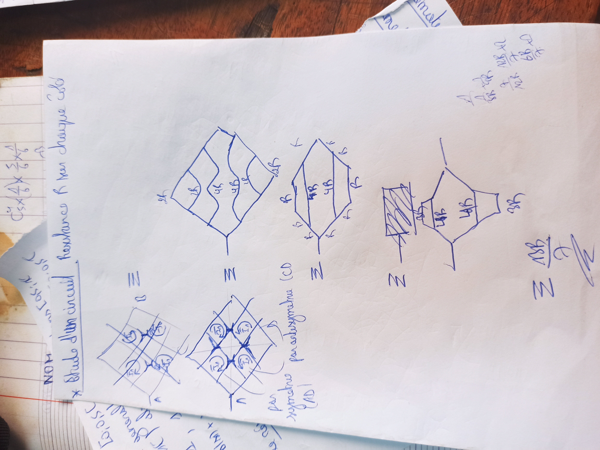
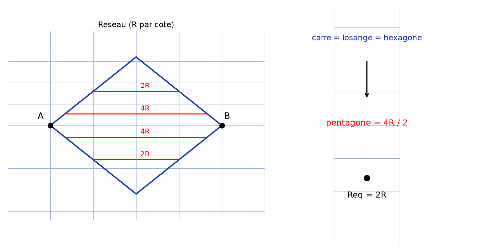
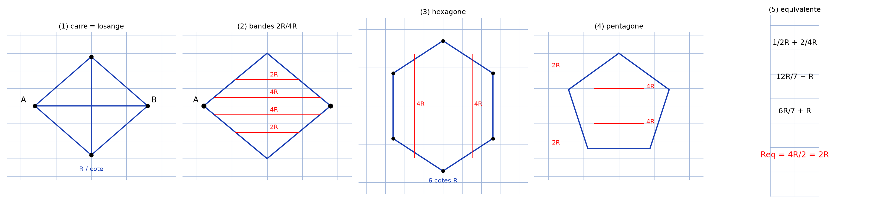

# Réseaux symétries — transcription fidèle

> Source : `reseaux-symetries.jpg` (1 page, photo pivotée 90° — redressée pour lecture).
> Encre bleue sur feuille blanche. Lisibilité ~60 % — calculs marginaux très incertains.

## Page 1 — transcription fidèle

\* Étude d'un circuit [.] Résistance $R$ sur chaque côté [lecture incertaine — « Résistance R sur chaque côté »]

[En haut à gauche, premier schéma : grille carrée en losange, quatre cercles marqués $R$ [lecture incertaine], lettre $A$ à gauche] $B \equiv$ [le signe $\equiv$ relie au schéma suivant]

[Au milieu à gauche, second schéma : même grille en losange, quatre cercles marqués $R$ [lecture incertaine], lettre $A$ à gauche, flèche courbe en dessous] $\equiv$ [le signe $\equiv$ relie au schéma suivant]

par symétrie $(AD)$ [lecture incertaine] par antisymétrie $(CD)$ [lecture incertaine]

[Schéma central : losange alimenté à gauche, quatre bandes horizontales annotées, de haut en bas : $2R$, $4R$, $4R$, $2R$ [lecture incertaine sur les valeurs] ; mention $2R$ [lecture incertaine] sur le côté droit]

$\equiv$ [le signe $\equiv$ relie au schéma suivant]

[Schéma hexagonal : contour à six côtés annotés $R$ (chacun), deux barres horizontales internes annotées $4R$ et $4R$]

$\equiv$ [le signe $\equiv$ relie au schéma suivant]

[Schéma bas : pentagone alimenté à gauche, annoté $4R$ et $4R$ à l'intérieur, $2R$ [lecture incertaine] en haut près d'un rectangle hachuré, $2R$ en bas]

[En marge droite, calculs :] $\frac{1}{2R} + \frac{2}{4R}$ [lecture incertaine] $\frac{12R}{7} + R$ [lecture incertaine] $\frac{6R}{7} + R$ [lecture incertaine]

$\equiv \dfrac{4R}{2}$ [lecture incertaine — résultat final souligné d'un paraphe]

[Paraphe/signature en bas.]

## Figures

Cinq schémas de réduction par symétrie/antisymétrie : réseau carré → losange équivalent → hexagone → pentagone → résistance équivalente. Vue d'ensemble :

*Script : `~/KpihX-Labs/Explore/lab/scripts/reproduce_reseaux-symetries_1.py` — losange résistif (arêtes $R$) et sa chaîne de réductions $\equiv$.*

Éclaté en 5 panneaux (un par $\equiv$ de la chaîne) :

*Script : `~/KpihX-Labs/Explore/lab/scripts/reproduce_reseaux-symetries_2.py` (uv run) — (1) carré/losange $R$/côté $A \to B$, (2) bandes $2R$/$4R$/$4R$/$2R$, (3) hexagone $6 \times R + 2 \times 4R$, (4) pentagone $4R$/$4R$ + $2R$/$2R$, (5) calculs de marge $\to R_{eq} = 4R/2 = 2R$ (valeurs [lecture incertaine], voir transcription).*

## Vocabulaire / notions

- Réseau résistif, résistance $R$ par côté/arête.
- Symétrie $(AD)$, antisymétrie $(CD)$, plans de symétrie.
- Schémas équivalents ($\equiv$), résistance équivalente.
- Association série/parallèle de résistances.
