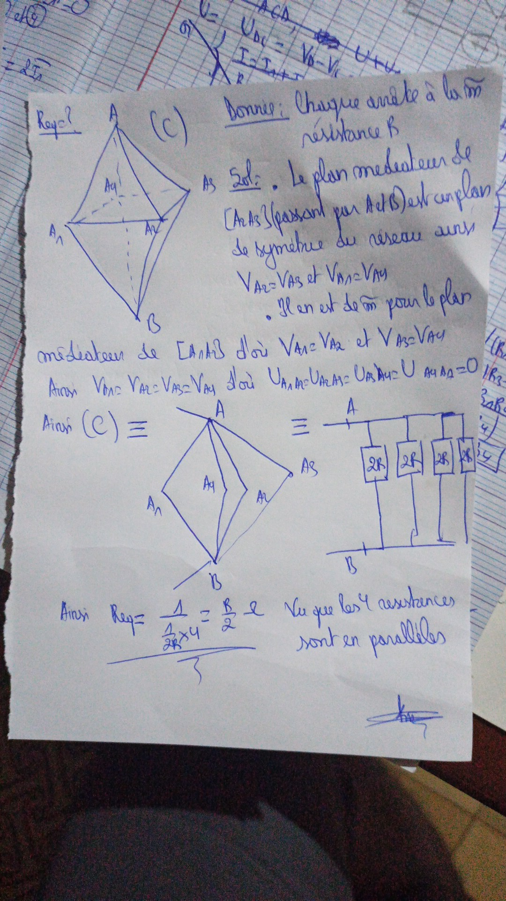
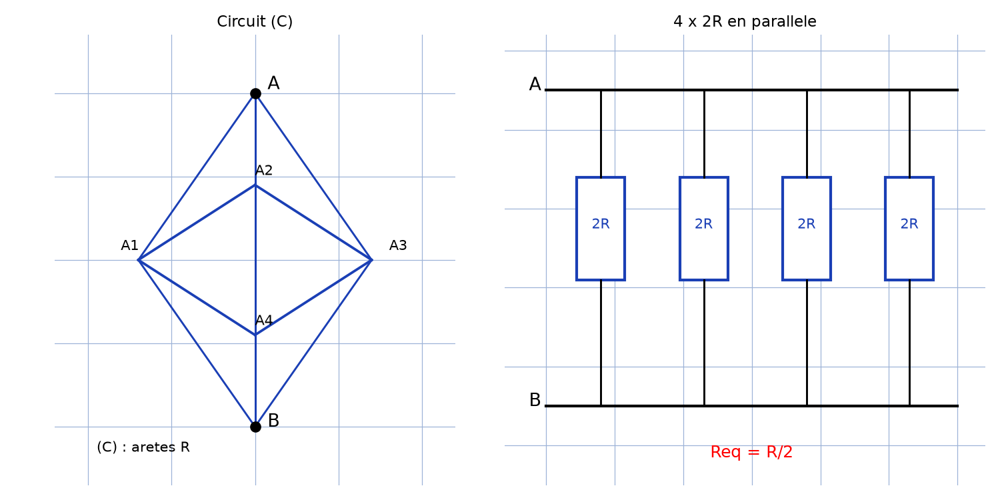

# Résistance équivalente par symétrie — transcription fidèle

> Source : `resistance-equivalente-symetrie.jpeg` (1 page).
> Encre bleue sur feuille blanche. Lisibilité ~85 %.

## Page 1 — transcription fidèle

$R_{eq}$ ? [en haut à gauche] $(C)$ [le circuit]

Donnée : Chaque arrête [\*sic\* — « arête »] a la mêm [\*sic\* — « même »] résistance $R$

$S_{ol}$ : [\*sic\* — « Sol : »] . Le plan médiateur de $[A_2 A_3]$ (passant par $A_1$ et $B$) [lecture incertaine sur les indices] est un plan de symétrie du réseau ainsi $V_{A2} = V_{A3}$ et $V_{A1} = V_{A4}$ [lecture incertaine sur les indices]

. Il en est de mêm [\*sic\* — « même »] pour le plan médiateur de $[A_1 A_3]$ [lecture incertaine sur les indices] d'où $V_{A1} = V_{A2}$ et $V_{A3} = V_{A4}$ [lecture incertaine sur les indices]

Ainsi $V_{A1} = V_{A2} = V_{A3} = V_{A4}$ d'où $U_{A1A2} = U_{A2A3} = U_{A3A4} = U_{A4A1} = 0$ [lecture incertaine sur les indices]

Ainsi $(C) \equiv$ [premier schéma équivalent : losange $A$–$A_1$–$B$ avec branches internes $A_4$, $A_2$, $A_3$] $\equiv$ [second schéma équivalent : quatre blocs $2R$, $2R$, $2R$, $2R$ en parallèle entre les nœuds $A$ et $B$]

Ainsi $R_{eq} = \dfrac{1}{\dfrac{1}{2R} \times 4} = \dfrac{R}{2}$ [souligné] Vu que les 4 résistances sont en parallèles [\*sic\* — « en parallèle »]

[Paraphe/signature en bas à droite.]

## Figures

Trois schémas : le circuit $(C)$ (octaèdre $A$–$A_1$–$A_4$–$B$ avec diagonale), sa réduction par équipotentialité, et les quatre résistances $2R$ en parallèle. Reproduction :

*Script : `~/KpihX-Labs/Explore/lab/scripts/reproduce_resistance-equivalente-symetrie_1.py` — circuit $(C)$ et quatre blocs $2R$ en parallèle entre $A$ et $B$ ($R_{eq} = R/2$).*

## Vocabulaire / notions

- Résistance équivalente $R_{eq}$, loi d'association parallèle.
- Plan médiateur, plan de symétrie du réseau.
- Potentiels égaux ($V_{Ai}$), tensions nulles ($U_{AiAj} = 0$).
- Schémas équivalents ($\equiv$).
