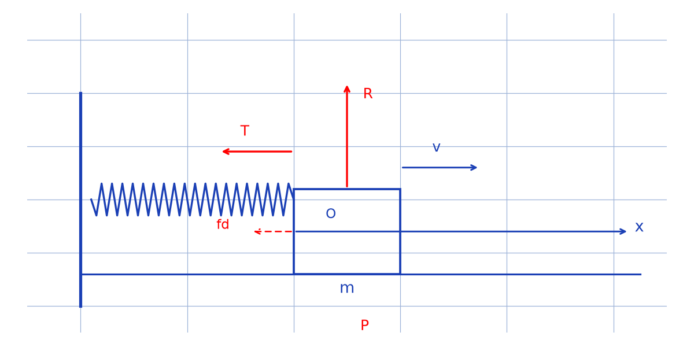

# Étude d'un ressort avec frottements — transcription fidèle

> 🧾 **Manuscrit original :** `ressort-frottements.pdf` (scan, 2 pages) · ✍️ KpihX
> 🔍 **Statut :** oscillateur masse-ressort avec frottement solide (statique/dynamique) ; équations et solutions par intervalles, passages raturés en `[raturé]` et signes en `[lecture incertaine — …]`. Transcrit mot à mot.
> 📄 **Source scannée :** [ressort-frottements.pdf](ressort-frottements.pdf) (restaurée Datas1, vérifiée pdfinfo, 2026-09-07)

---

## Page 1

[6] $K_s > K_d$. $K_s = \frac{[?]}{[?]} KJ$ [lecture incertaine — haut de page], $R(0)$ [lecture incertaine], schéma masse-ressort horizontal (axe $x$).

1/ Pour $x = x_L$ [lecture incertaine], $T = f_s(=)$ [lecture incertaine], $K x_L = K_s m g$ [lecture incertaine] $\Rightarrow \boxed{N_L = \frac{K_s m g}{K}}$ [lecture incertaine — notation].

2/ $X_0 > X_L$. Système $(S)$.

Bilan : $\vec{P}, \vec{R}, \vec{f_d}, \vec{T}$.

TCI : $\vec{P} + \vec{R} + \vec{f_d} + \vec{T} = m\vec{a}$.

Suivant $(Ox)$ on a : $-K_d m g - Kx = m\ddot{x}$, c.à.d $\ddot{x} + \frac{K}{m}x = -K_d g$. Cette éqⁿ n'est applicable que lorsque la masse va dans le sens [raturé] car dans ce sens $\vec{f_d} = -K_s m g \, \vec{e_x}$ [lecture incertaine — $K_s$ ou $K_d$]. En fait lorsqu'elle va dans le sens contraire, $\vec{f_d} = K_d m g \, \vec{e_x}$.

*Figure p.1 : axe $x$ horizontal ; ressort à gauche attaché à un mur, masse $m$ à droite ; poids $\vec{P}$ vers le bas, réaction $\vec{R}$ vers le haut, tension $\vec{T}$ vers la gauche, frottement $\vec{f_d}$ et vitesse $\vec{v}$.*

3/ L'éqⁿ est de la forme $\ddot{x} + \omega_0^2 x =$ [raturé], on a affaire à une éqⁿ diff linéaire d'ordre 2 avec $x(t) = X_p(t) + X_h(t)$ où $X_p$ est une sol part et $X_h$ sol génle de $\ddot{x} + \omega_0^2 x = 0$.

$C_{ae} - K_d g = \mathrm{cste}$, $X_p(t) = c$ cste d'où $0 + \text{[lecture incertaine]} = -K_d g \Rightarrow c = -\frac{K_d m g}{K}$.

$\ddot{X_h} + \omega_0^2 X_h = 0 \Leftrightarrow X_h(t) = X_0 \cos\left(\sqrt{\frac{K}{m}} \, t + \varphi\right)$ [raturé : phase], $v_0 = 0$.

ainsi $x(t) = -\frac{K_d m g}{K} + X_0 \cos\left(\sqrt{\frac{K}{m}} \, t \ldots\right)$. On a affaire à un mvt oscillatoire de période $T = \frac{2\pi}{\omega} = 2\pi\sqrt{\frac{m}{K}}$.

## Page 2

S'il n'y avait pas frottement ($K_d = 0$), $x(t) = X_0 \cos\left(\sqrt{\frac{K}{m}} \, t \ldots\right)$ [lecture incertaine — phase], on a aussi affaire à une oscillation de m̂ [même] période $T = 2\pi\sqrt{\frac{m}{K}}$ que celle où il n'y aurait pas de frottement [*sic* — formulation redondante, comparer au cas avec frottement].

Toutefois le centre des oscillations en [lecture incertaine] n'est plus le m̂ [même].

En effet $X_a = \frac{X_{max} + X_{min}}{2} = \frac{1}{2}\left(\left(\frac{|K_d m g|}{K} + X_0 \times 1\right) + \left(\frac{|K_d m g|}{K} + X_0 \times (-1)\right)\right)$ [lecture incertaine — signes].

$$X_a = -\frac{K_d m g}{K}.$$

4/ Pour décrire dans l'autre sens il faut remplacer $\vec{f_d} = -K_s m g \, \vec{e_x}$ par $\vec{f_d} = K_d m g \, \vec{e_x}$ et de façon générale prendre $\vec{f_d} = \mathrm{sign}(\dot{x}) \, m g \, \vec{e_x} = \frac{|\dot{x}|}{\dot{x}} m g \, \vec{e_x}$ car lorsque la masse avance $\dot{x} > 0$ et lorsqu'elle rentre $\dot{x} < 0$.

L'éqⁿ diff devient $\ddot{x} + \frac{K}{m}x = +K_d g$ [lecture incertaine — signe] et les solutions $x(t) = +\frac{K_d m g}{K} \frac{|\dot{x}|}{\dot{x}} + X_0 \cos\left(\sqrt{\frac{K}{m}} \, t \ldots\right)$ [lecture incertaine — phase].

Or si [lecture incertaine] lorsque $t \in [0; T/2] \cup [T; 3T/2] \cup [2T; 5T/2] \cup \ldots \left[nT; \frac{(2n+1)T}{2}\right]$, $n \in \mathbb{N}$, c.-à-d $t \in \bigcup_{K \in \mathbb{N}} \left[KT; \frac{(2K+1)T}{2}\right]$, ainsi $x(t) > 0$ [lecture incertaine — $x$ ou $\dot{x}$] lorsque $t \in \bigcup_{K \in \mathbb{N}} \left[KT; \frac{(2K+1)T}{2}\right] = \bigcup_{K \in \mathbb{N}} \left]\frac{(2K+1)T}{2}; (K+1)T\right[$ [lecture incertaine — égalité].

Donc il faut alors prendre $x(t) = \begin{cases} -\frac{K_d m g}{K} + X_0 \cos\left(\sqrt{\frac{K}{m}} \, t\right) & \text{lorsque } t \in \bigcup_{K \in \mathbb{N}} \left]\frac{(2K+1)T}{2}; (K+1)T\right[ \\ \frac{K_d m g}{K} + X_0 \cos\left(\sqrt{\frac{K}{m}} \, t\right) & \text{lorsque } t \in \bigcup_{K \in \mathbb{N}} \left[KT; \frac{(2K+1)T}{2}\right] \end{cases}$ [lecture incertaine — affectation des branches].

---

## Figures

| # | Page source | PNG (`assets/`) | Script (`lab/scripts/`) |
|---|-------------|-----------------|-------------------------|
| 1 | p.1 (haut + milieu : 2 croquis redondants du même dispositif) | `masse-ressort-frottement.png` | `reproduce_ressort_frottements_1.py` (vérifié `uv run`) |

100 % code : la p.1 porte 2 croquis du même dispositif masse-ressort horizontal (haut : cas statique $K_s$ ; milieu : cas dynamique $\vec{f_d}$, $\vec{v}$), fusionnés en 1 figure synthétique embarquée ci-dessus (même mur, ressort, masse $m$, axe $x$, forces $\vec{P}, \vec{R}, \vec{T}, \vec{f_d}$ + $\vec{v}$). P.2 sans figure (solutions par intervalles, texte seul).

## Vocabulaire

- **frottement solide statique / dynamique** — coefficients $K_s > K_d$ (notations d'origine, pour $\mu_s$/$\mu_d$).
- **pulsation propre** — $\omega_0 = \sqrt{K/m}$, période $T = 2\pi\sqrt{m/K}$ (inchangée par le frottement).
- **centre des oscillations** — $X_a = -K_d m g / K$ (décalé par le frottement).
- **TCI** — théorème du centre d'inertie ($\vec{P} + \vec{R} + \vec{f_d} + \vec{T} = m\vec{a}$).
