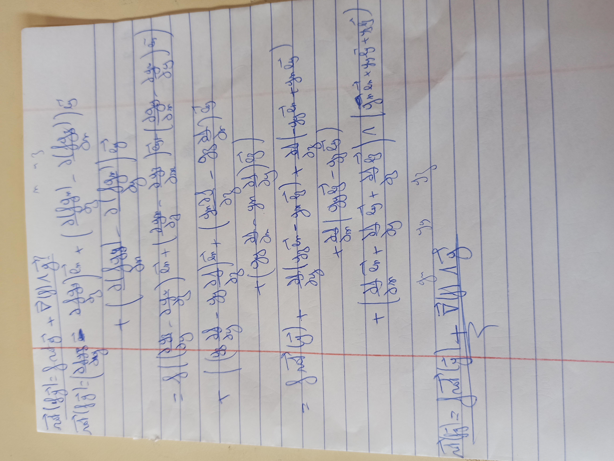
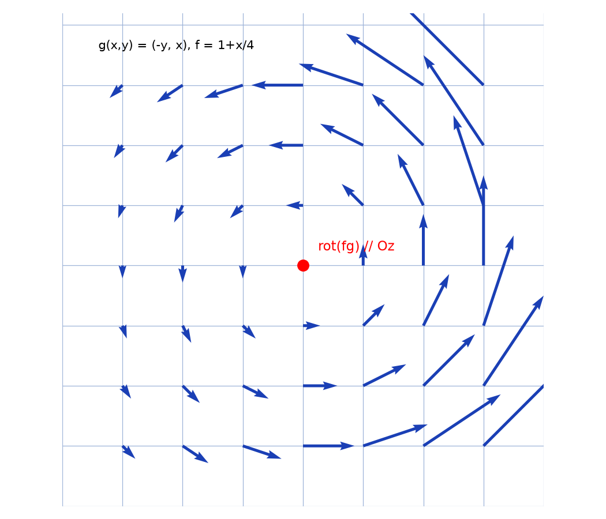

# Rotationnel d'un produit — transcription fidèle

> Source : `rotationnel-produit.jpg` (1 page, photo pivotée 90° — redressée pour lecture).
> Encre bleue sur papier ligné. Lisibilité ~70 % — indices $x, y, z$ souvent ambigus.

## Page 1 — transcription fidèle

$\overrightarrow{\mathrm{rot}}(f\vec{g}) = f\,\mathrm{rot}\,\vec{g} + \vec{\nabla}(f) \wedge \vec{g}$ [formule à démontrer, en haut] $n \sim 3$ [lecture incertaine — mention en haut à droite]

$\overrightarrow{\mathrm{rot}}(f\vec{g}) = \left( \dfrac{\partial f g_z}{\partial y} - \dfrac{\partial f g_y}{\partial z} \right) \vec{e}_x + \left( \dfrac{\partial f g_x}{\partial z} - \dfrac{\partial f g_z}{\partial x} \right) \vec{e}_y$ [lecture incertaine sur les indices]

$+ \left( \dfrac{\partial f g_y}{\partial x} - \dfrac{\partial f g_x}{\partial y} \right) \vec{e}_z$ [lecture incertaine sur les indices]

$= f \left( \left( \dfrac{\partial g_z}{\partial y} - \dfrac{\partial g_y}{\partial z} \right) \vec{e}_x + \left( \dfrac{\partial g_x}{\partial z} - \dfrac{\partial g_z}{\partial x} \right) \vec{e}_y + \left( \dfrac{\partial g_y}{\partial x} - \dfrac{\partial g_x}{\partial y} \right) \vec{e}_z \right)$ [lecture incertaine sur les indices]

$+ \left( \left( g_z \dfrac{\partial f}{\partial y} - g_y \dfrac{\partial f}{\partial z} \right) \vec{e}_x + \left( g_x \dfrac{\partial f}{\partial z} - g_z \dfrac{\partial f}{\partial x} \right) \vec{e}_y \right.$ [lecture incertaine sur les indices]

$\left. + \left( g_y \dfrac{\partial f}{\partial x} - g_x \dfrac{\partial f}{\partial y} \right) \vec{e}_z \right)$ [lecture incertaine sur les indices]

$= f\,\overrightarrow{\mathrm{rot}}(\vec{g}) + \dfrac{\partial f}{\partial y} (g_z \vec{e}_x - g_x \vec{e}_z) + \dfrac{\partial f}{\partial z} (-g_y \vec{e}_x + g_x \vec{e}_y)$ [lecture incertaine sur les indices]

$+ \dfrac{\partial f}{\partial x} (g_y \vec{e}_z - g_z \vec{e}_y)$ [lecture incertaine sur les indices]

$+ \left( \dfrac{\partial f}{\partial x} \vec{e}_x + \dfrac{\partial f}{\partial y} \vec{e}_y + \dfrac{\partial f}{\partial z} \vec{e}_z \right) \wedge \left( g_x \vec{e}_x + g_y \vec{e}_y + g_z \vec{e}_z \right)$ [lecture incertaine sur les indices]

$g_x \quad g_y \quad g_z$ [mention intercalée au-dessus du résultat]

$\overrightarrow{\mathrm{rot}}(f\vec{g}) = f\,\overrightarrow{\mathrm{rot}}(\vec{g}) + \vec{\nabla}(f) \wedge \vec{g}$ [résultat souligné]

## Figures

Pas de schéma géométrique sur le manuscrit (calcul seul). Reproduction illustrative du propos (champ $\vec{g}$ et $\overrightarrow{\mathrm{rot}}(f\vec{g})$) :

*Script : `~/KpihX-Labs/Explore/lab/scripts/reproduce_rotationnel-produit_1.py` — champ tournant $\vec{g}(x,y) = (-y, x)$ modulé par $f$, flèches du rotationnel.*

## Vocabulaire / notions

- Rotationnel $\overrightarrow{\mathrm{rot}}$, gradient $\vec{\nabla}$, produit vectoriel $\wedge$.
- Base $(\vec{e}_x, \vec{e}_y, \vec{e}_z)$, dérivées partielles croisées.
- Fonction scalaire $f$, champ vectoriel $\vec{g}$.
