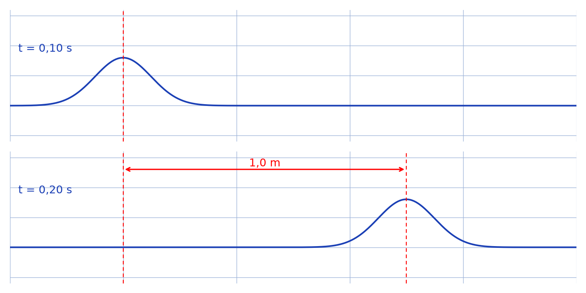
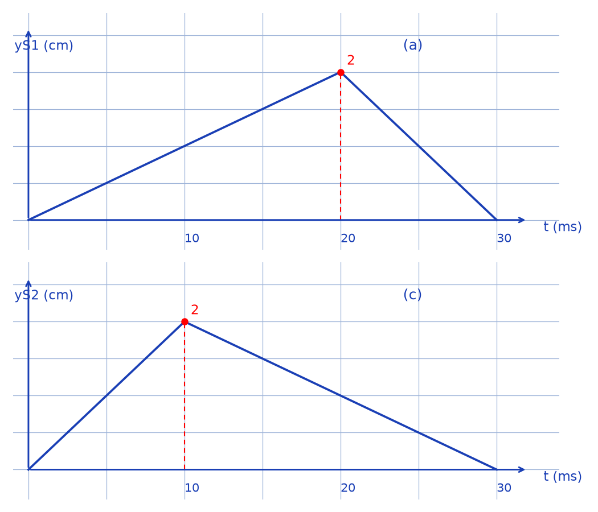

# Propagation de signaux le long d'une corde — transcription fidèle

> 🧾 **Manuscrit original :** `signaux-corde.pdf` (scan, 2 pages) · ✍️ KpihX
> 🔍 **Statut :** énoncé imprimé (exercice 68, corde $S_1S_2$) avec schémas de la perturbation à deux dates et des élongations (a) et (c) ; sans résolution manuscrite. Transcrit mot à mot.
> 📄 **Source scannée :** [signaux-corde.pdf](signaux-corde.pdf) (restaurée Datas1, vérifiée pdfinfo, 2026-09-07)

---

## Page 1

68\. Une corde tendue entre deux points $S_1$ et $S_2$ distants de $5{,}0\,\mathrm{m}$ est soumise à une perturbation en $S_1$. Les photographies d'une partie de la corde aux dates $t_1 = 0{,}10\,\mathrm{s}$ et $t_2 = 0{,}20\,\mathrm{s}$ ont l'aspect représenté sur le schéma ci-dessous.

*Figure p.1 : corde horizontale avec une bosse à gauche à $t = 0{,}10\,\mathrm{s}$ et la même bosse décalée à droite à $t = 0{,}20\,\mathrm{s}$ ; l'écart entre les deux positions est coté $1{,}0\,\mathrm{m}$.*

1. Déterminer, à partir du schéma, la célérité de l'onde se propageant le long de la corde.

2. La célérité des ondes le long d'une corde vérifie la relation $V = \sqrt{\frac{T}{\mu}}$ avec $T$ la valeur de la tension de la corde et $\mu$ la masse linéique de la corde. Les unités S.I. sont utilisées. Vérifier l'homogénéité de cette relation. Calculer la valeur de la célérité sachant que la corde a une masse $m = 500\,\mathrm{g}$ et que la tension vaut $T = 10{,}0\,\mathrm{N}$. Comparer avec la valeur déterminée expérimentalement.

3. La variation de l'élongation du point $S_1$ au cours du temps est représentée sur le schéma (a).

a. Quelle est la longueur de corde affectée par la perturbation ?

b. Représenter l'aspect de la corde aux dates suivantes : $0{,}010\,\mathrm{s}$ ; $0{,}020\,\mathrm{s}$ ; $0{,}030\,\mathrm{s}$ ; $0{,}040\,\mathrm{s}$ ; $0{,}050\,\mathrm{s}$ ; $0{,}060\,\mathrm{s}$ ; l'amortissement est supposé négligeable.

c. Représenter l'élongation du point $M$ d'abscisse $x_M = 0{,}20\,\mathrm{m}$ en fonction du temps.

4. On provoque maintenant à la date $t = 0$ deux perturbations simultanées en $S_1$ et $S_2$ représentées respectivement sur les schémas (b) et (c). Représenter l'aspect de la corde à la date $t = 0{,}265\,\mathrm{s}$.

## Page 2

[En-tête imprimé : LEADER'S CORPORATION / Centre National Bilingue [de préparation aux] Grandes Écoles et Facu[ltés] / +237 690 20 88 68 ; flèche verte manuscrite pointant vers le schéma (a).]

*Figure p.2 : (a) $y_{S_1}(t)$ en cm — triangle montant de $(0, 0)$ à $(20\,\mathrm{ms}, 2\,\mathrm{cm})$ puis descendant à $(30\,\mathrm{ms}, 0)$ ; (c) $y_{S_2}(t)$ — pic de $2\,\mathrm{cm}$ à $10\,\mathrm{ms}$ puis descente à $(30\,\mathrm{ms}, 0)$. [L'énoncé question 4 cite les schémas (b) et (c) [\*sic\*] ; les schémas visibles sont légendés (a) et (c).]*

---

## Figures

| # | Page source | PNG (`assets/`) | Script (`lab/scripts/`) |
|---|-------------|-----------------|-------------------------|
| 1 | p.1 (énoncé 68) | `corde-deux-dates.png` | `reproduce_signaux_corde_1.py` (vérifié `uv run`) |
| 2 | p.2 (schémas (a) et (c)) | `elongations-s1-s2.png` | `reproduce_signaux_corde_2.py` (vérifié `uv run`) |

100 % code : les 2 figures visibles sont reproduites et embarquées ci-dessus. Noter le [\*sic\*] : la question 4 cite « (b) et (c) » alors que les schémas visibles sont légendés « (a) » ($y_{S_1}$) et « (c) » ($y_{S_2}$) — confirmé visuellement.

## Vocabulaire

- **célérité** — $V$ de l'onde le long de la corde (à déterminer : $1{,}0\,\mathrm{m} / 0{,}10\,\mathrm{s}$).
- **élongation** — $y_{S_1}(t)$, $y_{S_2}(t)$ en cm, signaux triangulaires d'origine.
- **perturbation** — bosse se propageant sans amortissement (hypothèse).
- **masse linéique** — $\mu = m/L$ dans $V = \sqrt{T/\mu}$ (homogénéité à vérifier).
