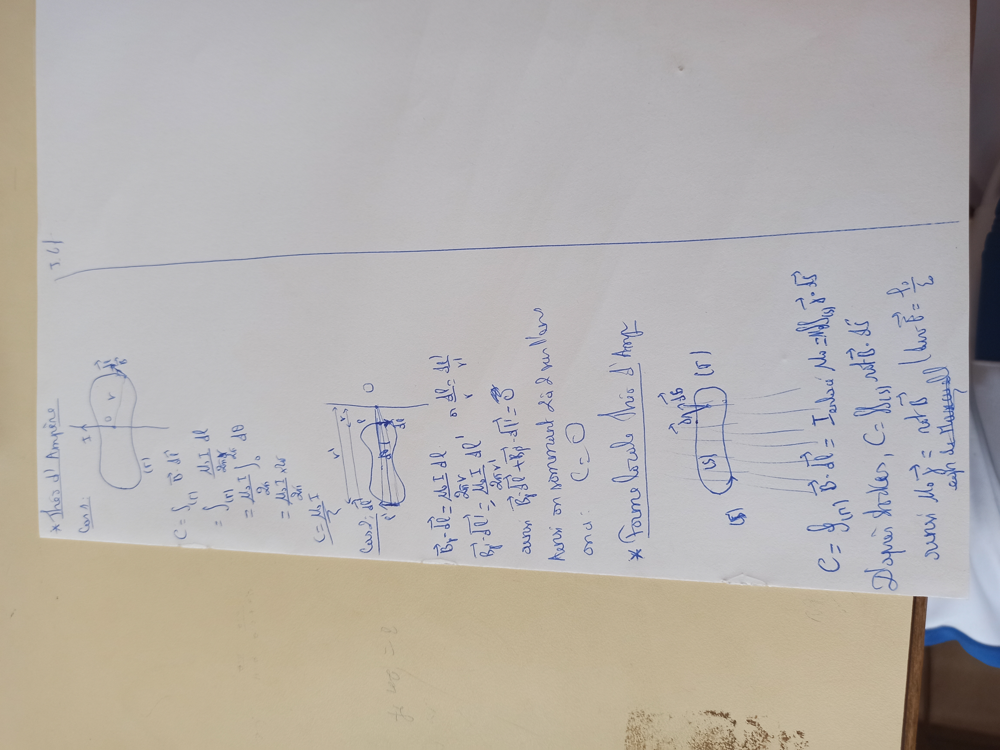
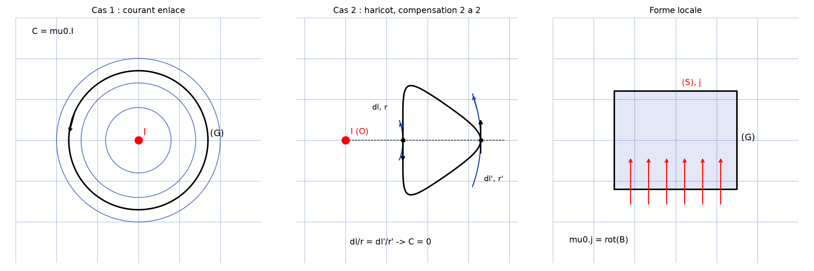

# Théorème d'Ampère — transcription fidèle

> Source : `theoreme-ampere.jpg` (1 page, photo pivotée 90° — redressée pour lecture).
> Encre bleue sur feuille blanche. Lisibilité ~80 %.

## Page 1 — transcription fidèle

\* Théo [\*sic\* — « Théo » pour « Thm »] d'Ampère

Cas 1 : [schéma : contour fermé $(\Gamma)$ entourant un fil rectiligne parcouru par $I$, point $O$, rayon $r$, vecteur $\vec{B}$ tangent]

$C = \oint_{(\Gamma)} \vec{B} \cdot \overrightarrow{dl}$

$= \int_{(\Gamma)} \dfrac{\mu_0 I \, dl}{2\pi r}$

$= \dfrac{\mu_0 I}{2\pi} \int_0^{2\pi} d\theta$

$= \dfrac{\mu_0 I}{2\pi} \times 2\pi$

$C = \mu_0 I$ [souligné]

Cas 2 : [schéma : contour en « haricot » coupé par un plan $O$, éléments $\overrightarrow{dl}$, $\overrightarrow{dl}'$ aux rayons $r$, $r'$]

$\vec{B}_1 \cdot \overrightarrow{dl} = \dfrac{\mu_0 I}{2\pi r} \, dl$ [lecture incertaine sur l'indice]

$\vec{B}_1 \cdot \overrightarrow{dl}' = \dfrac{\mu_0 I}{2\pi r'} \, dl'$ [lecture incertaine sur l'indice] , or $\dfrac{dl}{r} = \dfrac{dl'}{r'}$ [lecture incertaine]

ainsi $\vec{B}_1 \cdot \overrightarrow{dl} + \vec{B}_1 \cdot \overrightarrow{dl}' = 0$ [lecture incertaine — « $= \vec{0}$ » probable]

Ainsi en sommant 2 à 2 sur [1 mot illisible — « l'ans… »] on a : $C = 0$ [« $C = 0$ » entouré]

\* Forme locale Théo [\*sic\* — « Théo »] d'Amp [\*sic\* — « d'Ampère »]

[schéma : surface $(S)$ de contour $(\Gamma)$, densité $\vec{\jmath}$ la traversant, élément $\overrightarrow{dS}$]

$C = \oint_{(\Gamma)} \vec{B} \cdot \overrightarrow{dl} = I_{\text{enlacé}} \, \mu_0 = \iint_{(S)} \vec{\jmath} \cdot \overrightarrow{dS}$ [lecture incertaine sur « enlacé »]

D'après Stokes, $C = \iint_{(S)} \overrightarrow{\mathrm{rot}}\, \vec{B} \cdot \overrightarrow{dS}$

ainsi $\mu_0 \vec{\jmath} = \overrightarrow{\mathrm{rot}}\, \vec{B}$ [suivi de :] (div $\vec{B} = \frac{I_0}{\dots}$ [lecture incertaine — fragment]) éqn de Maxwell [\*sic\* — « équation »]

## Figures

Trois schémas : contour enlacé (Cas 1, $C = \mu_0 I$), contour en haricot non enlacé par compensation 2 à 2 (Cas 2, $dl/r = dl'/r'$, $C = 0$), surface $(S)$ et son contour $(\Gamma)$ (forme locale, $\mu_0 \vec{\jmath} = \overrightarrow{\mathrm{rot}}\, \vec{B}$). Reproduction des trois panneaux :

*Script : `~/KpihX-Labs/Explore/lab/scripts/reproduce_theoreme-ampere_2.py` (uv run) — fil $I$ en $O$, cercles de $\vec{B}$ orthoradial, contour $(\Gamma)$ enlacé (Cas 1), haricot traversé en $dl$/$dl'$ avec $dl/r = dl'/r'$ (Cas 2), surface $(S)$ traversée par $\vec{\jmath}$. Remplace `reproduce_theoreme-ampere_1.py` (2 panneaux, sans le Cas 2).*

## Vocabulaire / notions

- Théorème d'Ampère (circulation $C$), perméabilité $\mu_0$, courant enlacé.
- Contour $(\Gamma)$, surface $(S)$, élément $\overrightarrow{dl}$, densité $\vec{\jmath}$.
- Théorème de Stokes, forme locale $\mu_0 \vec{\jmath} = \overrightarrow{\mathrm{rot}}\, \vec{B}$, équation de Maxwell.
