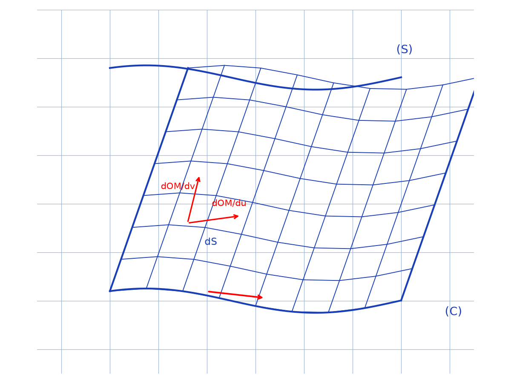
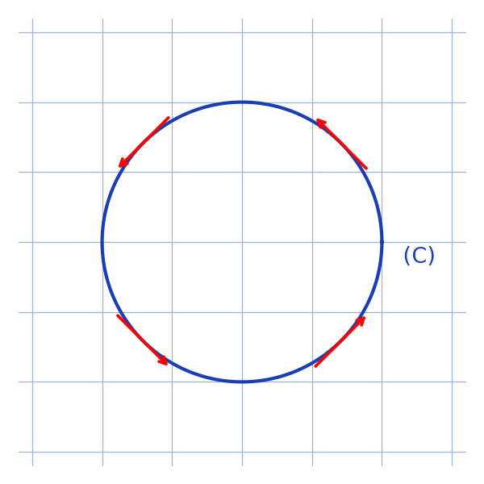

# Démonstration du théorème de Stokes — transcription fidèle

> 🧾 **Manuscrit original :** `theoreme-stokes.pdf` (scan, 2 pages) · ✍️ KpihX
> 🔍 **Statut :** démonstration par découpage en surfaces élémentaires $(u, v)$ (circulation élémentaire, rotationnel, sommation) ; notations compactes en `[lecture incertaine — …]`. Transcrit mot à mot.
> 📄 **Source scannée :** [theoreme-stokes.pdf](theoreme-stokes.pdf) (restaurée Datas1, vérifiée pdfinfo, 2026-09-07)

---

## Page 1

Démonstration du théorème de Stokes.

Soit un parcours orienté $\mathcal{C}$ dans un repère orthonormé direct $(O, \vec{e_x}, \vec{e_y}, \vec{e_z})$ dans lequel on définit un champ de vecteurs $\vec{F}(M) = \vec{F}(x, y, z) = F_x(x, y, z)\,\vec{e_x} + F_y(x, y, z)\,\vec{e_y} + F_z(x, y, z)\,\vec{e_z}$.

On s'intéresse au calcul de la circulation $C = \oint_{\mathcal{C}} \vec{F}(M) \cdot d\vec{OM}$ le long du parcours $\mathcal{C}$ de $\vec{F}$.

Soit $S$ une surface quelconque délimitée par $\mathcal{C}$.

La représentation paramétrique de $(S)$ est de la forme $(S) : \begin{cases} x = f_x(u, v) \\ y = f_y(u, v) \\ z = f_z(u, v) \end{cases} u, v \in U \times V \subset \mathbb{R}^2$.

*Figure p.1 : nappe $(S)$ quadrillée par le réseau des coordonnées $(u, v)$, bordée par le parcours fermé $(C)$ orienté ; en marge de l'original, le parallélogramme élémentaire engendré par $\frac{\partial\overrightarrow{OM}}{\partial u}$ et $\frac{\partial\overrightarrow{OM}}{\partial v}$.*

Ainsi $(S)$ peut entièrement être décrite par les variables $u, v$. On découpe alors $(S)$ en un nombre infinitésimal d'éléments de surface $dS$, chaque élément de surface encadrant $M$ étant obtenu en faisant varier $u$ et $v$ resp de $du$ et $dv$ [lecture incertaine — abréviations].

On s'intéresse à la circulation élémentaire $dC$ de $\vec{F}$ sur le pourtour de $dS$ : $dC_{(\vec{F})} = dC_{(\vec{F_x})} + dC_{(\vec{F_y})} + dC_{(\vec{F_z})}$.

Pour simplifier on calculera $dC_{(\vec{F_x})}$ et on déduira $dC_{(\vec{F})}$.

On a : $dC_{(\vec{F_x})} = \vec{F_x} \cdot \frac{\partial\vec{OM}}{\partial u} du + \left(\vec{F_x} + \frac{\partial\vec{F_x}}{\partial v} dv\right) \cdot \frac{\partial\vec{OM}}{\partial v} dv + \left[\vec{F_x} + \frac{\partial\vec{F_x}}{\partial v} dv + \frac{\partial\vec{F_x}}{\partial r} dr\right] \cdot \left(-\frac{\partial\vec{OM}}{\partial u} du\right) + \left(\vec{F_x} + \frac{\partial\vec{F_x}}{\partial r} dr\right) \cdot \left(-\frac{\partial\vec{OM}}{\partial r} dr\right)$ [lecture incertaine — $r$ pour $u$] (le long des 4 côtés de $dS$)
$$
= \frac{\partial F_x}{\partial v} \cdot \frac{\partial m}{\partial r} du\,dr - \frac{\partial F_x}{\partial r} \cdot \frac{\partial m}{\partial v} du\,dv
$$
[lecture incertaine — notations $m$, $r$].

De même $\overrightarrow{\mathrm{rot}}\,\vec{F_x} \cdot d\vec{S} = \left(\frac{\partial F_x}{\partial y}\vec{e_y} - \frac{\partial F_x}{\partial z}\vec{e_z}\right) \cdot (du\,dv) \left(\frac{\partial\vec{OM}}{\partial v} \wedge \frac{\partial\vec{OM}}{\partial r}\right)$ [lecture incertaine — facteurs]
$$
= \left(\frac{\partial F_x}{\partial y}\frac{\partial z}{\partial v}\frac{\partial m}{\partial u} + \frac{\partial F_x}{\partial y}\frac{\partial y}{\partial v}\frac{\partial m}{\partial u} - \frac{\partial F_x}{\partial y}\frac{\partial m}{\partial v}\frac{\partial y}{\partial r} + \frac{\partial m}{\partial r}\frac{\partial y}{\partial v}\frac{\partial F_x}{\partial y}\right)
$$
[lecture incertaine — développement].

## Page 2

$\overrightarrow{\mathrm{rot}}\,\vec{F_x} \cdot d\vec{S} = \left[\frac{\partial m}{\partial r}\left(\frac{\partial F_x}{\partial y}\frac{\partial z}{\partial v} + \frac{\partial F_x}{\partial y}\frac{\partial y}{\partial v} + \frac{\partial F_x}{\partial m}\frac{\partial m}{\partial v}\right) - \frac{\partial m}{\partial v}\left(\frac{\partial F_x}{\partial z}\frac{\partial z}{\partial r} + \frac{\partial F_x}{\partial y}\frac{\partial y}{\partial r} + \frac{\partial F_x}{\partial m}\frac{\partial m}{\partial r}\right)\right] du\,dv$ [lecture incertaine — notations]
$$
= \left(\frac{\partial m}{\partial r} \times \frac{\partial F_x}{\partial v} - \frac{\partial m}{\partial v} \times \frac{\partial F_x}{\partial r}\right) du\,dv.
$$

Ainsi $dC_{(\vec{F_x})} = \overrightarrow{\mathrm{rot}}\,\vec{F_x} \cdot d\vec{S} = \left(\frac{\partial m}{\partial r}\frac{\partial F_x}{\partial v} - \frac{\partial m}{\partial v}\frac{\partial F_x}{\partial r}\right) du\,dv$.

On déduit de m̂ [même] pour $y$ et $z$ et au final $\boxed{dC_{(\vec{F})} = \overrightarrow{\mathrm{rot}}\,\vec{F} \cdot d\vec{S} = \left(\frac{\partial F_x}{\partial v}\frac{\partial m}{\partial r} + \frac{\partial F_y}{\partial v}\frac{\partial y}{\partial r} + \frac{\partial F_z}{\partial v}\frac{\partial z}{\partial r} - \frac{\partial F_x}{\partial r}\frac{\partial m}{\partial v} - \frac{\partial F_y}{\partial r}\frac{\partial y}{\partial v} - \frac{\partial F_z}{\partial r}\frac{\partial z}{\partial v}\right) du\,dv}$ [lecture incertaine — notations $m$, $r$].

Or en effectuant la somme interpersonnelle [sic — « intervient » ?] de ces circulations élémentaires, celles sur les côtés des surfaces élémentaires en commun s'annulent et au final il ne restera que la somme infinitésimale des circulations élémentaires sur les côtés extérieurs correspondant à $C$.

Donc $\int_{\mathcal{C}} dC = \int_S \overrightarrow{\mathrm{rot}}\,\vec{F} \cdot d\vec{S}$.

$$
\boxed{\text{Donc } C_{(\vec{F})} = \int_{\mathcal{C}} dC = \int_{\mathcal{C}} \vec{F}(M) \cdot d\vec{OM} = \int_S \overrightarrow{\mathrm{rot}}\,\vec{F} \cdot d\vec{S}}.
$$

[Petit schéma d'orientation du contour en bas à droite de la page (cercle orienté, sens direct) : voir reproduction ci-dessous.]

*Figure p.2 : petit contour fermé $(C)$ orienté en sens direct (4 flèches).*

---

## Figures

| # | Page source | PNG (`assets/`) | Script (`lab/scripts/`) |
|---|-------------|-----------------|-------------------------|
| 1 | p.1 (droite : nappe + marge pavelet) | `surface-contour-stokes.png` | `reproduce_theoreme_stokes_1.py` (vérifié `uv run` — nappe $(S)$ + contour $(C)$ + pavelet $dS$ intégré) |
| 2 | p.2 (bas droite : orientation) | `orientation-contour-stokes.png` | `reproduce_theoreme_stokes_2.py` (vérifié `uv run`) |

100 % code : les 2 figures visibles (nappe + pavelet p.1 ; orientation p.2) sont reproduites et embarquées ci-dessus.

## Vocabulaire

- **circulation** — $C = \oint_{\mathcal{C}} \vec{F}(M) \cdot d\vec{OM}$ le long du parcours orienté $\mathcal{C}$.
- **rotationnel** — $\overrightarrow{\mathrm{rot}}\,\vec{F}$, tel que $dC_{(\vec{F})} = \overrightarrow{\mathrm{rot}}\,\vec{F} \cdot d\vec{S}$.
- **nappe paramétrée** — $(S) : (x, y, z) = (f_x, f_y, f_z)(u, v)$, découpée en $dS$ élémentaires.
- **pavelet $dS$** — parallélogramme engendré par $\partial\overrightarrow{OM}/\partial u$ et $\partial\overrightarrow{OM}/\partial v$.
