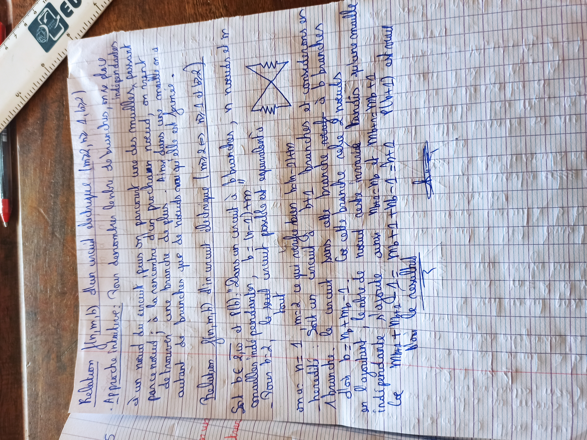
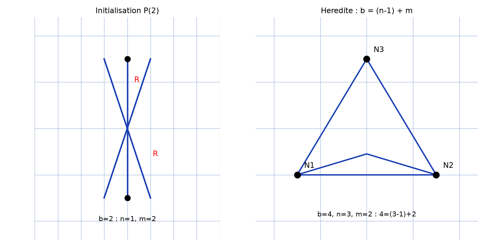

# Topologie des circuits — transcription fidèle

> Source : `topologie-circuits.jpg` (1 page, photo pivotée 90° — redressée pour lecture).
> Encre bleue sur papier quadrillé. Lisibilité ~80 %.

## Page 1 — transcription fidèle

Relation $f(n, m, b)$ d'un circuit électrique $(m \geqslant 2, n \geqslant 1, b \geqslant 2)$ [\*sic\* — l'hypothèse est corrigée plus bas en $m \geqslant 2 \Rightarrow n \geqslant 1$ et $b \geqslant 2$]

. Approche intuitive : Pour dénombrer le nbre de branches, on se place [à] un nœud du circuit, puis on parcourt une des mailles, passant par ce nœud ; à la rencontre d'un prochain nœud, on vient de trouver une branche de plus. Ainsi dans une maille on a autant de branches que de nœuds vu qu'elle est fermée.

Relation $f(n, m, b)$ d'un circuit électrique $(m \geqslant 2 \Rightarrow n \geqslant 1$ et $b \geqslant 2)$

Soit $b \in$ [ensemble illisible — « $\mathbb{N}$ » probable] et $P(b)$ : "Dans un circuit à $b$ branches, $n$ nœuds et $m$ mailles indépendantes, $b = (n-1) + m$"

— Pour $b = 2$, le seul circuit possible est équivalent à [schéma : deux nœuds reliés par deux branches en croix, chacune marquée d'une résistance] tout [lecture incertaine — articulation]

or $n = 1$, $m = 2$ ce qui vérifie bien $b = (n-1) + m$ [\*sic\* — tel que lu sur l'original]

— hérédité : Soit un circuit à $b+1$ branches et considérons en 1 branche. le circuit sans cette branche est à $b$ branches

d'où $b = n_b + m_b - 1$. Or cette branche relie 2 nœuds

en l'ajoutant, le nbre de nœud reste [1 mot illisible] tandis qu'une maille indépendante s'ajoute ainsi $n_{b+1} = n_b$ [lecture incertaine — lettre « $M$ » ambiguë sur l'original, « $n$ » reconstruit par cohérence] et $m_{b+1} = m_b + 1$

Ce [\*sic\* — « Or » probable] $n_{b+1} + m_{b+1} - 1$ [lecture incertaine — « $M_{b+1} + m_{b+1} - 1$ » tel que lu] $= n_b + 1$ [lecture incertaine] $+ m_b - 1 = b + 1$. $P(b+1)$ est vraie [« est vraie » souligné]

D'où le résultat [souligné, suivi d'un paraphe]

## Figures

Un schéma : le circuit à $b = 2$ (deux nœuds, deux branches à résistances en croix). Reproduction avec le graphe général $(n, m, b)$ :

*Script : `~/KpihX-Labs/Explore/lab/scripts/reproduce_topologie-circuits_1.py` — graphe $(n=2, b=3, m=2)$ vérifiant $b = (n-1) + m$, plus cas $b = 2$ du manuscrit.*

## Vocabulaire / notions

- Circuit électrique : nœuds $n$, branches $b$, mailles (indépendantes) $m$.
- Relation d'Euler des graphes $b = (n-1) + m$.
- Récurrence sur $b$ (initialisation $b = 2$, hérédité $b \to b+1$).
