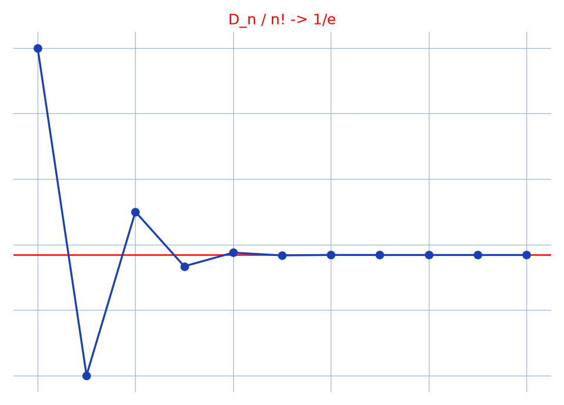

# Dérangements — transcription fidèle

🧾 Source : [derangements.jpg](derangements.jpg) — feuille manuscrite, encre bleue, photo pivotée à 90°.
🔍 Contenu : définition du nombre de dérangements $D_n$, formule $D_n = n!\sum_{k=0}^{n} \frac{(-1)^k}{k!}$ par crible, approximation $D_n \approx n!/e$.
📄 Transcription : mot-à-mot, image rendue en grand vers `/tmp/t-b/derangements.jpg` — rien d'inventé.

## Page 1 — transcription

|Dérangement| (titre souligné)

10/01/2021 [lecture incertaine — date en marge]

\* Déf : Nbre de permutations d'un ensemble [lecture incertaine — fin de ligne] d'un ... Il est noté $D_n$

\* Rem : Par convention [raturé] $X_n \in \mathbb{N}$ [lecture incertaine], $D_n = n! \sum_{k=0}^n$ [lecture incertaine — formule] $= \ldots x!$ [lecture incertaine]

preuve de ... $\rightarrow$ pour $n \in \mathbb{N}^*$ [lecture incertaine]

\*Dem : — Pour $n \in \mathbb{N}^*$ pose ... sous ... à ... Au géni... su [lecture incertaine — ligne d'introduction]

notons ... posons $E = \{1, \ldots, n\}$, $A_i$ ... en ... des ... permut... [lecture incertaine]

Soient ... des ... de $E$ ... Jaussant $i = \overline{1,n}$ [lecture incertaine]

\* ... : $A_i \cap A_j$ ... : $D_n = \left| \ldots \setminus \bigcup_{i=1}^n A_i \right|$ [lecture incertaine — égalité]

i-oj $D_n = n! - \left| \bigcup \ldots \right|$ [lecture incertaine]

$= n! - \sum_{k=1}^n \ldots dx \in E \ldots \left| \bigcup \ldots \right|$ [lecture incertaine]

$= n! - \sum \ldots rdx \ldots 6B \ldots (n-k)!$ [lecture incertaine — « $(n-k)!$ » lisible]

[raturé — « Cont $(\overline{A})$ ... » biffé en diagonale]

[raturé — « $\overline{A} | \ldots 32 - 12 = A$ » biffé en diagonale]

$= n! - \sum_{k=1}^n C_n^k \times (n-k)! \times$ [lecture incertaine — fin de ligne]

$= n! - \sum_{k=1}^n \frac{(-1)^{k+1} n!}{k!}$ [reconstruction — motif : crible usuel]

$= n! \sum_{k=0}^n \frac{(-1)^k}{k!} \frac{n!}{k!}$ [*sic* — « $\frac{n!}{k!}$ » surnuméraire [lecture incertaine]]

et environ on peut prendre $E\left(\frac{n!}{e} + 0{,}5\right)$ [lecture incertaine — fin de ligne]

✓ (coche de validation)

Source : wi... [lecture incertaine — marge verticale droite, coupée]

## Figures

Reproduction (script `reproduce_derangements_1.py`, exécuté avec `uv run`) : sommes partielles $S_n = \sum_{k=0}^{n} (-1)^k/k!$ (bleu) convergeant vers $1/e$ (droite rouge), $n = 0..10$, quadrillage bleu `#9db3d8`. PNG relu et conforme à la formule du manuscrit.

## Vocabulaire / notions

- **Dérangement** : permutation sans point fixe ; nombre noté $D_n$.
- **Crible / inclusion-exclusion** : $A_i$ = permutations fixant $i$, $D_n = n! - |\bigcup A_i|$.
- **Formule** : $D_n = n!\sum_{k=0}^{n} (-1)^k/k!$, limite $D_n/n! \to 1/e$.
- **Approximation entière** : $D_n$ est l'entier le plus proche de $n!/e$ (« $E(n!/e + 0{,}5)$ »).
