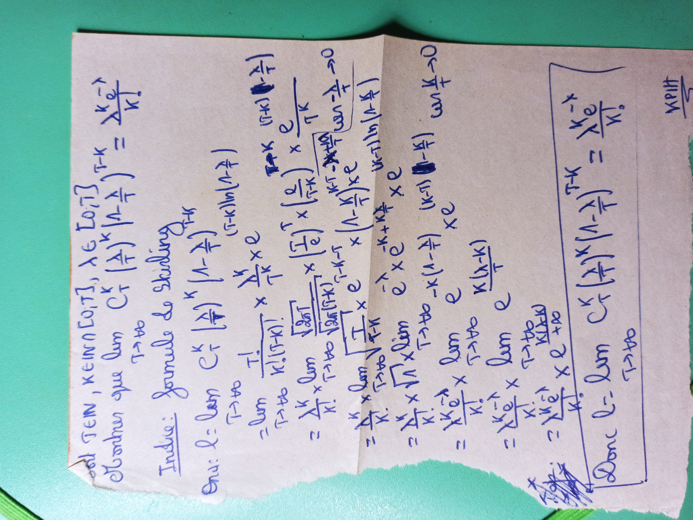
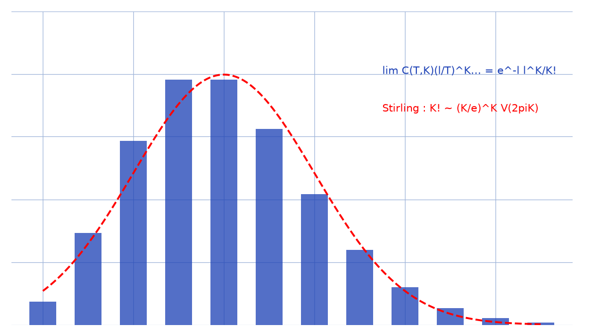

# Poisson Stirling — transcription fidèle

> Source : `poisson-stirling.jpg` (1 page, stylo bleu, feuillet plié, page pivotée).
> Lisibilité ~75 % ; en-tête : limite binomiale → loi de Poisson, « Indice : formule de Stirling ».

## Page 1 — transcription fidèle

[En-tête, lecture incertaine :] soit $T \in \mathbb{N}$, $K \in \mathbb{N} \cap [0, T]$, $\lambda \in [0, T]$ [lecture incertaine]

Montrer que $\lim_{T \to +\infty} C_T^K (\lambda/T)^K (1 - \lambda/T)^{T-K} = \frac{\lambda^K e^{-\lambda}}{K!}$.

Indice : formule de Stirling

Or si : $l = \lim_{T \to +\infty} C_T^K (\lambda/T)^K (1 - \lambda/T)^{T-K}$ [reconstruction — motif : énoncé reconstitué depuis le calcul qui suit]

$= \lim_{T \to +\infty} \frac{T!}{K!(T-K)!} \times \frac{\lambda^K}{T^K} \times e^{(T-K)\ln(1-\lambda/T)}$

$= \lim_{T \to +\infty} \frac{T!}{T!} \times$ [raturé : « $T+K$ »] $\frac{(1-K)(1-K+1)}{(1-K)!}$ [lecture incertaine] $\times (\frac{T}{e})^T \times (\frac{e}{T-K})^{T-K}$ [lecture incertaine] $\times \frac{e}{T^K} \times \frac{(1-K)(1-X)}{1-\frac{K}{T}}$ [lecture incertaine]

$= \lim_{T \to +\infty} \frac{T}{T!} \times e \times e^{-(T-K)-5}$ [lecture incertaine] $\times (\Lambda - K/T)^{-K} \times e^{K+T}$ [lecture incertaine] $\frac{K+T}{m-1/T} \to 0$ [lecture incertaine]

$= \lim_{T \to +\infty} \frac{T^K}{K!} \times \sqrt{1} \times$ [raturé : « $(K-1)$ »] $(K-1)$ [lecture incertaine] $\times e$ [lecture incertaine] $w_n \frac{K}{T} \to 0$ [lecture incertaine]

$= \frac{T^K}{K!} \times \lim_{T \to +\infty} e^{-T} \times e \times e^{-K+\frac{K}{T}} \times e$ [lecture incertaine] $(K-1)$ [raturé] $(K-1)$ $w_n \frac{K}{T} \to 0$ [lecture incertaine]

$= \frac{T^K}{K!} \times \lim_{T \to +\infty} e$ [lecture incertaine] $\frac{K(T-K)}{T}$ [lecture incertaine]

$= \lim_{T \to +\infty} \frac{T^K}{K!} \times e$ [lecture incertaine] $\frac{K(T-K)}{T}$ [lecture incertaine]

$= \frac{\lambda^{K-1}}{\lambda^K}$ [lecture incertaine] $\times \lim_{T \to +\infty} e$ [lecture incertaine] $\frac{K(T-K)}{K!TK}$ [lecture incertaine]

[Encadré final :] Pour $l$ : $\lim_{T \to +\infty} C_T^K (\lambda/T)^K (1-\lambda/T)^{T-K} = \frac{\lambda^K e^{-\lambda}}{K!}$.

[En marge :] $l < T$ [lecture incertaine], $KPIH$ [signature]

## Figures

Pas de schéma sur le manuscrit. Limite binomiale → Poisson ($\lambda = 4$) et cloche de Stirling :

*Script : `~/KpihX-Labs/Explore/lab/scripts/reproduce_poisson-stirling_1.py` — description précise : barres bleues $e^{-\lambda}\lambda^K/K!$ pour $K = 0..11$, courbe rouge pointillée gaussienne (Stirling), légende « $\lim C(T,K)(\lambda/T)^K\ldots = e^{-\lambda}\lambda^K/K!$ ».*

## Vocabulaire / notions

- Coefficients binomiaux $C_T^K$, limite $T \to +\infty$, loi de Poisson $e^{-\lambda}\lambda^K/K!$.
- Formule de Stirling ($K! \sim (K/e)^K \sqrt{2\pi K}$), équivalents, $e^{(T-K)\ln(1-\lambda/T)}$.
